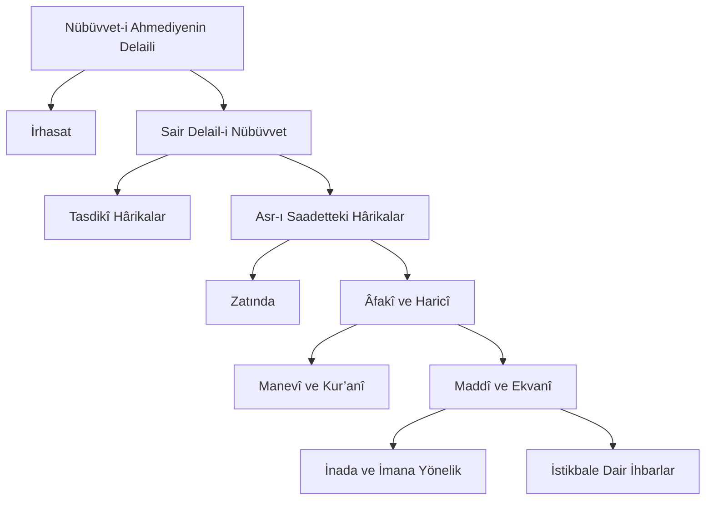

# On Dokuzuncu Mektup

Bu risale, üç yüzden fazla mu’cizatı beyan eder. Risalet-i Ahmediyenin (asm) mu’cizesini beyan ettiği gibi kendisi de o mu’cizenin bir kerametidir. Üç dört nevi ile hârika olmuştur:

## Birincisi

Nakil ve rivayet olmakla beraber, yüz sahifeden fazla olduğu halde, kitaplara müracaat edilmeden, ezber olarak dağ, bağ köşelerinde, üç dört gün zarfında her günde iki üç saat çalışmak şartıyla mecmuu on iki saatte telif edilmesi, hârika bir vakıadır.

## İkincisi

Bu risale, uzunluğu ile beraber ne yazması usanç verir ve ne de okuması halâvetini kaybeder. Tembel ehl-i kalemi öyle bir şevk ve gayrete getirdi ki bu sıkıntılı ve usançlı bir zamanda, bu civarda bir sene zarfında yetmiş adede yakın nüshalar yazıldığı, o mu’cize-i risaletin bir kerameti olduğunu, muttali olanlara kanaat verdi.

## Üçüncüsü

Acemi ve tevafuktan haberi yok ve bize de daha tevafuk tezahür etmeden evvel onun ve başka sekiz müstensihin birbirini görmeden yazdıkları nüshalarda; lafz-ı **Resul-i Ekrem aleyhissalâtü vesselâm** kelimesi bütün risalede ve lafz-ı **Kur’an** beşinci parçasında öyle bir tarzda tevafuk etmeleri göründü ki zerre miktar insafı olan, tesadüfe vermez. Kim görmüşse kat’î hükmediyor ki bu bir sırr-ı gaybîdir, mu’cize-i Ahmediyenin (asm) bir kerametidir.

Şu risalenin başındaki esaslar çok mühimdirler. Hem şu risaledeki ehadîs, hemen umumen eimme-i hadîsçe makbul ve sahih olmakla beraber, en kat’î hâdisat-ı risaleti beyan ediyorlar. O risalenin mezayasını söylemek lâzım gelse o risale kadar bir eser yazmak lâzım geldiğinden, müştak olanları onu bir kere okumasına havale ediyoruz.

Said Nursî

## **İhtar:**

Şu risalede çok ehadîs-i şerife nakletmişim. Yanımda kütüb-ü hadîsiye bulunmuyor. Yazdığım hadîslerin lafzında yanlışım varsa ya tashih edilsin veyahut “hadîs-i bi’l-mana”dır, denilsin. Çünkü kavl-i racih odur ki: “Nakl-i hadîs-i bi’l-mana caizdir.” Yani hadîsin yalnız manasını alıp lafzını kendi zikreder. Madem öyledir, lafzında yanlışım varsa hadîs-i bi’l-mana nazarıyla bakılsın.

***

# Mu’cizat-ı Ahmediye (asm)

بِاسْمِهٖ سُبْحَانَهُ  وَ اِنْ مِنْ شَىْءٍ اِلَّا يُسَبِّحُ بِحَمْدِهٖ بِسْمِ اللّٰهِ الرَّحْمٰنِ الرَّحٖيمِ هُوَ الَّذٖٓى اَرْسَلَ رَسُولَهُ بِالْهُدٰى وَدٖينِ الْحَقِّ لِيُظْهِرَهُ عَلَى الدّٖينِ كُلِّهٖ وَ كَفٰى بِاللّٰهِ شَهٖيدًا ۞ مُحَمَّدٌ رَسُولُ اللّٰهِ … اِلٰى اٰخِرِ

Risalet-i Ahmediyeye (asm) dair On Dokuzuncu Söz’le Otuz Birinci Söz, nübüvvet-i Muhammediyeyi (asm) delail-i kat’iye ile ispat ettiklerinden, ispat cihetini onlara havale edip yalnız onlara bir tetimme olarak **on dokuz nükteli işaret**lerle, o büyük hakikatin bazı lem’alarını göstereceğiz.

## Birinci Nükteli İşaret

Şu kâinatın sahip ve mutasarrıfı elbette bilerek yapıyor ve hikmetle tasarruf ediyor ve her tarafı görerek tedvir ediyor ve her şeyi bilerek, görerek terbiye ediyor ve her şeyde görünen hikmetleri, gayeleri, faydaları irade ederek tedvir ediyor.

Madem yapan bilir, elbette bilen konuşur. Madem konuşacak, elbette zîşuur ve zîfikir ve konuşmasını bilenlerle konuşacak. Madem zîfikirle konuşacak, elbette zîşuurun içinde en cem’iyetli ve şuuru küllî olan insan nev’i ile konuşacaktır. Madem insan nev’i ile konuşacak, elbette insanlar içinde kabil-i hitap ve mükemmel insan olanlarla konuşacak.

Madem en mükemmel ve istidadı en yüksek ve ahlâkı ulvi ve nev-i beşere mukteda olacak olanlarla konuşacaktır; elbette dost ve düşmanın ittifakıyla, en yüksek istidatta ve en âlî ahlâkta ve nev-i beşerin humsu ona iktida etmiş ve nısf-ı arz onun hükm-ü manevîsi altına girmiş ve istikbal onun getirdiği nurun ziyasıyla bin üç yüz sene ışıklanmış ve beşerin nurani kısmı ve ehl-i imanı, mütemadiyen günde beş defa onunla tecdid-i biat edip ona dua-yı rahmet ve saadet edip ona medih ve muhabbet etmiş olan Muhammed aleyhissalâtü vesselâm ile konuşacak ve konuşmuş ve resul yapacak ve yapmış ve sair nev-i beşere rehber yapacak ve yapmıştır.

## İkinci Nükteli İşaret

Resul-i Ekrem aleyhissalâtü vesselâm iddia-yı nübüvvet etmiş, Kur’an-ı Azîmüşşan gibi bir fermanı göstermiş ve ehl-i tahkikin yanında bine kadar mu’cizat-ı bâhireyi göstermiştir. O mu’cizat, heyet-i mecmuasıyla dava-yı nübüvvetin vukuu kadar vücudları kat’îdir. Kur’an-ı Hakîm’in çok yerlerinde en muannid kâfirlerden naklettiği sihir isnad etmeleri gösteriyor ki o muannid kâfirler dahi mu’cizatın vücudlarını ve vukularını inkâr edemiyorlar. Yalnız, kendilerini aldatmak veya etbalarını kandırmak için –hâşâ– sihir demişler.

Evet, mu’cizat-ı Ahmediyenin (asm) yüz tevatür kuvvetinde bir kat’iyeti vardır. Mu’cize ise Hâlık-ı kâinat tarafından onun davasına bir tasdiktir صَدَقْتَ hükmüne geçer.

Nasıl ki sen bir padişahın meclisinde ve daire-i nazarında desen ki: “Padişah beni filan işe memur etmiş.” Senden o davaya bir delil istenilse padişah “Evet” dese nasıl seni tasdik eder. Öyle de âdetini ve vaziyetini senin iltimasınla değiştirirse “Evet” sözünden daha kat’î daha sağlam, senin davanı tasdik eder.

Öyle de Resul-i Ekrem aleyhissalâtü vesselâm dava etmiş ki: “Ben, şu kâinat Hâlık’ının mebusuyum. Delilim de şudur ki: Müstemir âdetini, benim dua ve iltimasımla değiştirecek. İşte parmaklarıma bakınız, beş musluklu bir çeşme gibi akıttırıyor. Kamere bakınız, bir parmağımın işaretiyle iki parça ediyor. Şu ağaca bakınız; beni tasdik için yanıma geliyor, şehadet ediyor. Şu bir parça taama bakınız; iki üç adama ancak kâfi geldiği halde, işte iki yüz üç yüz adamı tok ediyor.” Ve hâkeza yüzer mu’cizatı böyle göstermiştir.

Şimdi, şu zatın delail-i sıdkı ve berahin-i nübüvveti yalnız mu’cizatına münhasır değildir. Belki ehl-i dikkat için hemen umum harekâtı ve ef’ali, ahval ve akvali, ahlâk ve etvarı, sîret ve sureti, sıdkını ve ciddiyetini ispat eder. Hattâ meşhur ulema-i Benî-İsrailiyeden Abdullah İbn-i Selâm gibi pek çok zatlar, yalnız o Zat-ı Ekrem aleyhissalâtü vesselâmın simasını görmekle “Şu simada yalan yok, şu yüzde hile olamaz!” diyerek imana gelmişler.

Çendan muhakkikîn-i ulema, delail-i nübüvveti ve mu’cizatı bin kadar demişler fakat binler, belki yüz binler delail-i nübüvvet vardır. Ve yüz binler yol ile yüz binler muhtelif fikirli adamlar, o zatın nübüvvetini tasdik etmişler. Yalnız Kur’an-ı Hakîm’de kırk vech-i i’cazdan başka, nübüvvet-i Ahmediyenin (asm) bin bürhanını gösteriyor.

Hem madem nev-i beşerde nübüvvet vardır. Ve yüz binler zat, nübüvvet dava edip mu’cize gösterenler, gelip geçmişler. Elbette umumun fevkinde bir kat’iyet ile nübüvvet-i Ahmediye (asm) sabittir. Çünkü İsa aleyhisselâm ve Musa aleyhisselâm gibi umum resullere nebi dedirten ve risaletlerine medar olan delail ve evsaf ve vaziyetler ve ümmetlerine karşı muameleler; Resul-i Ekrem aleyhissalâtü vesselâmda daha ekmel daha câmi’ bir surette mevcuddur.

Madem hükm-ü nübüvvetin illeti ve sebebi, Zat-ı Ahmedî’de (asm) daha mükemmel mevcuddur. Elbette hükm-ü nübüvvet, umum enbiyadan daha vâzıh bir kat’iyet ile ona sabittir.

## Üçüncü Nükteli İşaret

Resul-i Ekrem aleyhissalâtü vesselâmın mu’cizatı çok mütenevvidir. Risaleti umumî olduğu için hemen ekser enva-ı kâinattan birer mu’cizeye mazhardır. Güya nasıl ki bir padişah-ı zîşanın bir yaver-i ekremi mütenevvi hediyelerle muhtelif akvamın mecmaı olan bir şehre geldiği vakit, her taife onun istikbaline bir mümessil gönderir; kendi taifesi lisanıyla ona hoşâmedî eder, onu alkışlar.

Öyle de Sultan-ı ezel ve ebed’in en büyük yaveri olan Resul-i Ekrem aleyhissalâtü vesselâm, âleme teşrif edip ve küre-i arzın ahalisi olan nev-i beşere mebus olarak geldiği ve umum kâinatın Hâlık’ı tarafından umum kâinatın hakaikine karşı alâkadar olan envar-ı hakikat ve hedâyâ-yı maneviyeyi getirdiği zaman; taştan, sudan, ağaçtan, hayvandan, insandan tut tâ aydan, güneşten, yıldızlara kadar her taife, kendi lisan-ı mahsusuyla ve ellerinde birer mu’cizesini taşımasıyla, onun nübüvvetini alkışlamış ve hoşâmedî demiş.

Şimdi o mu’cizatın umumunu bahsetmek için ciltlerle yazı yazmak lâzım gelir. Muhakkikîn-i asfiya, delail-i nübüvvetin tafsilatına dair çok ciltler yazmışlar. Biz yalnız icmalî işaretler nevinden, o mu’cizatın kat’î ve manevî mütevatir olan küllî envaına işaret ederiz.

İşte nübüvvet-i Ahmediyenin (asm) delaili, evvela iki kısımdır:

**Birisi:** “İrhasat” denilen nübüvvetten evvel ve veladeti vaktinde zuhur eden hârikulâde hallerdir.

**İkinci kısım:** Sair delail-i nübüvvettir.

İkinci kısım da iki kısımdır. **Biri:** Nübüvvetinden sonra fakat nübüvvetini tasdiken zuhura gelen hârikalardır. **İkincisi:** Asr-ı saadetinde mazhar olduğu hârikalardır.

Şu ikinci kısım dahi iki kısımdır. **Biri:** Zatında, sîretinde, suretinde, ahlâkında, kemalinde zahir olan delail-i nübüvvettir. **İkincisi:** Âfakî, haricî şeylerde mazhar olduğu mu’cizattır.

Şu ikinci kısım dahi iki kısımdır. **Biri:** Manevî ve Kur’anî’dir. **Diğeri:** Maddî ve ekvanîdir.

Şu ikinci kısım dahi iki kısımdır. **Biri:** Dava-yı nübüvvet vaktinde, ehl-i küfrün inadını kırmak veyahut ehl-i imanın kuvvet-i imanını ziyadeleştirmek için zuhura gelen hârikulâde mu’cizattır. Şakk-ı kamer ve parmağından suyun akması ve az taamla çokları doyurması ve hayvan ve ağaç ve taşın konuşması gibi yirmi nevi ve her bir nev’i manevî tevatür derecesinde ve her bir nev’in de çok mükerrer efradı vardır. **İkinci kısım:** İstikbalde ihbar ettiği hâdiselerdir ki Cenab-ı Hakk’ın talimiyle o da haber vermiş, haber verdiği gibi doğru çıkmıştır.

İşte biz de şu âhirki kısımdan başlayıp icmalî bir fihriste göstereceğiz. [^hâşiye1]

## Dördüncü Nükteli İşaret

Resul-i Ekrem aleyhissalâtü vesselâmın Allâmü’l-guyub’un talimiyle haber verdiği umûr-u gaybiye, hadd ü hesaba gelmez. İ’caz-ı Kur’an’a dair olan Yirmi Beşinci Söz’de envaına işaret ve bir derece izah ve ispat ettiğimizden, geçmiş zamana dair ve enbiya-yı sâbıkaya dair ve hakaik-i İlahiyeye ve hakaik-i kevniyeye ve hakaik-i uhreviyeye dair ihbarat-ı gaybiyelerini Yirmi Beşinci Söz’e havale edip şimdilik bahsetmeyeceğiz.

Yalnız kendinden sonra sahabe ve Âl-i Beyt’in başına gelen ve ümmetin ileride mazhar olacağı hâdisata dair pek çok ihbarat-ı sadıka-i gaybiyesi kısmından cüz’î birkaç misaline işaret edeceğiz. Ve şu hakikat tamamıyla anlaşılmak için altı esas mukaddime olarak beyan edeceğiz:

### Birinci Esas

Resul-i Ekrem aleyhissalâtü vesselâmın çendan her hali ve her tavrı, sıdkına ve nübüvvetine şahit olabilir fakat her hali, her tavrı hârikulâde olmak lâzım değildir. Çünkü Cenab-ı Hak onu beşer suretinde göndermiş, tâ insanın ahval-i içtimaiyelerinde ve dünyevî, uhrevî saadetlerini kazandıracak a’mal ve harekâtlarında rehber olsun ve imam olsun ve her biri birer mu’cizat-ı kudret-i İlahiye olan âdiyat içindeki hârikulâde olan sanat-ı Rabbaniyeyi ve tasarruf-u kudret-i İlahiyeyi göstersin.

Eğer ef’alinde beşeriyetten çıkıp hârikulâde olsaydı bizzat imam olamazdı; ef’aliyle, ahvaliyle, etvarıyla ders veremezdi. Fakat yalnız nübüvvetini muannidlere karşı ispat etmek için hârikulâde işlere mazhar olur ve inde’l-hace ara sıra mu’cizatı gösterirdi. Fakat sırr-ı teklif olan imtihan ve tecrübe muktezasıyla, elbette bedahet derecesinde ve ister istemez tasdike mecbur kalacak derecede mu’cize olmazdı.

Çünkü sırr-ı imtihan ve hikmet-i teklif iktiza eder ki akla kapı açılsın ve aklın ihtiyarı elinden alınmasın. Eğer gayet bedihî bir surette olsa o vakit aklın ihtiyarı kalmaz. Ebucehil de Ebubekir gibi tasdik eder. İmtihan ve teklifin faydası kalmaz. Kömür ile elmas bir seviyede kalırdı.

Cây-ı hayrettir ki Resul-i Ekrem aleyhissalâtü vesselâmın mübalağasız binler vecihte binler çeşit insan, her biri bir tek mu’cizesiyle veya bir delil-i nübüvvet ile veya bir kelâmı ile veya yüzünü görmesiyle ve hâkeza birer alâmetiyle iman getirdikleri halde, bütün bu binler ayrı ayrı insanları ve müdakkik mütefekkirleri imana getiren bütün o binler delail-i nübüvveti, nakl-i sahih ile ve âsâr-ı kat’iye ile şimdiki bedbaht bir kısım insanlara kâfi gelmiyor gibi dalalete sapıyorlar.

### İkinci Esas

Resul-i Ekrem aleyhissalâtü vesselâm hem beşerdir, beşeriyet itibarıyla beşer gibi muamele eder. Hem resuldür, risalet itibarıyla Cenab-ı Hakk’ın tercümanıdır, elçisidir. Risaleti, vahye istinad eder. Vahiy iki kısımdır:

**Biri:** “**Vahy-i sarîhî**”dir ki Resul-i Ekrem aleyhissalâtü vesselâm onda sırf bir tercümandır, mübelliğdir, müdahalesi yoktur. Kur’an ve bazı ehadîs-i kudsiye gibi…

**İkinci Kısım:** “**Vahy-i zımnî**”dir. Şu kısmın mücmel ve hülâsası, vahye ve ilhama istinad eder fakat tafsilatı ve tasviratı, Resul-i Ekrem aleyhissalâtü vesselâma aittir. O vahiyden gelen mücmel hâdiseyi tafsil ve tasvirde, Zat-ı Ahmediye aleyhissalâtü vesselâm bazen yine ilhama, ya vahye istinad edip beyan eder veyahut kendi ferasetiyle beyan eder. Ve kendi içtihadıyla yaptığı tafsilat ve tasviratı, ya vazife-i risalet noktasında ulvi kuvve-i kudsiye ile beyan eder veyahut örf ve âdet ve efkâr-ı âmme seviyesine göre, beşeriyeti noktasında beyan eder.

İşte her hadîste bütün tafsilatına, vahy-i mahz noktasıyla bakılmaz. Beşeriyetin muktezası olan efkâr ve muamelatında, risaletin ulvi âsârı aranılmaz. Madem bazı hâdiseler mücmel olarak mutlak bir surette ona vahyen gelir, o da kendi ferasetiyle ve tearüf-ü umumî cihetiyle tasvir eder. Şu tasvirdeki müteşabihata ve müşkülata bazen tefsir lâzım geliyor, hattâ tabir lâzım geliyor. Çünkü bazı hakikatler var ki temsil ile fehme takrib edilir.

Nasıl ki bir vakit huzur-u Nebevîde derince bir gürültü işitildi. Ferman etti ki: “Şu gürültü, yetmiş senedir yuvarlanıp şimdi cehennemin dibine düşmüş bir taşın gürültüsüdür.” Bir saat sonra cevap geldi ki: “Yetmiş yaşına giren meşhur bir münafık ölüp cehenneme gitti.” Zat-ı Ahmediye aleyhissalâtü vesselâmın beliğ bir temsil ile beyan ettiği hâdisenin tevilini gösterdi.

### Üçüncü Esas

Naklolunan haberler eğer tevatür suretinde olsa kat’îdir. Tevatür iki kısımdır. [^hâşiye2] Biri “sarîh tevatür”, biri “manevî tevatür”dür.

Manevî tevatür de iki kısımdır. Biri sükûtîdir. Yani, sükût ile kabul gösterilmiş. Mesela, bir cemaat içinde bir adam, o cemaatin nazarı altında bir hâdiseyi haber verse cemaat onu tekzip etmezse sükût ile mukabele etse kabul etmiş gibi olur. Hususan haber verdiği hâdisede cemaat onunla alâkadar olsa hem tenkide müheyya ve hatayı kabul etmez ve yalanı çok çirkin görür bir cemaat olsa elbette onun sükûtu o hâdisenin vukuuna kuvvetli delâlet eder.

İkinci kısım tevatür-ü manevî şudur ki: Bir hâdisenin vukuuna, mesela “Bir kıyye taam, iki yüz adamı tok etmiş.” denilse fakat onu haber verenler, ayrı ayrı surette haber veriyor. Biri bir çeşit, biri başka bir surette, diğeri başka bir şekilde beyan eder fakat umumen, aynı hâdisenin vukuuna müttefiktirler. İşte mutlak hâdisenin vukuu; mütevatir-i bi’l-manadır, kat’îdir. İhtilaf-ı suret ise zarar vermez.

Hem bazen olur ki haber-i vâhid, bazı şerait dâhilinde tevatür gibi kat’iyeti ifade eder. Hem bazen olur ki haber-i vâhid haricî emarelerle kat’iyeti ifade eder.

İşte Resul-i Ekrem aleyhissalâtü vesselâmdan bize naklolunan mu’cizatı ve delail-i nübüvveti, kısm-ı a’zamı tevatür iledir; ya sarîhî ya manevî ya sükûtî. Ve bir kısmı çendan haber-i vâhid iledir. Fakat öyle şerait dâhilinde, nakkad-ı muhaddisîn nazarında kabule şâyan olduktan sonra, tevatür gibi kat’iyeti ifade etmek lâzım gelir.

Evet, muhaddisînin muhakkikîninden “El-Hâfız” tabir ettikleri zatlar, lâekall yüz bin hadîsi hıfzına almış binler muhakkik muhaddisler hem elli sene sabah namazını işâ abdestiyle kılan müttaki muhaddisler ve başta Buharî ve Müslim olarak Kütüb-ü Sitte-i Hadîsiye sahipleri olan ilm-i hadîs dâhîleri, allâmeleri tashih ve kabul ettikleri haber-i vâhid, tevatür kat’iyetinden geri kalmaz.

Evet fenn-i hadîsin muhakkikleri, nakkadları o derece hadîs ile hususiyet peyda etmişler ki Resul-i Ekrem aleyhissalâtü vesselâmın tarz-ı ifadesine ve üslub-u âlîsine ve suret-i ifadesine ünsiyet edip meleke kesbetmişler ki yüz hadîs içinde bir mevzuu görse “Mevzudur.” der. “Bu, hadîs olmaz ve Peygamber’in sözü değildir.” der, reddeder. Sarraf gibi hadîsin cevherini tanır, başka sözü ona iltibas edemez. Yalnız İbn-i Cevzî gibi bazı muhakkikler, tenkitte ifrat edip bazı ehadîs-i sahihaya da mevzu demişler. Fakat “Her mevzu şeyin manası yanlıştır.” demek değildir; belki “Bu söz hadîs değildir.” demektir.

***Sual:*** An’aneli senedin faydası nedir ki lüzumsuz yerde, malûm bir vakıada “an filan, an filan, an filan” derler?

***Elcevap:*** Faydaları çoktur. Ezcümle, bir faydası şudur: An’ane ile gösteriliyor ki an’anede dâhil olan mevsuk ve hüccetli ve sadık ehl-i hadîsin bir nevi icmaını irae eder ve o senette dâhil olan ehl-i tahkikin bir nevi ittifakını gösterir. Güya o senette, o an’anede dâhil olan her bir imam, her bir allâme; o hadîsin hükmünü imza ediyor, sıhhatine dair mührünü basıyor.

***Sual:*** Neden hâdisat-ı i’caziye sair zarurî ahkâm-ı şer’iye gibi tevatür suretinde, pek çok tarîklerle, çok ehemmiyetli nakledilmemiş?

***Elcevap:*** Çünkü ekser ahkâm-ı şer’iyeye, ekser nâs, ekser evkatta muhtaçtır. Farz-ı ayn gibi o ahkâmın her şahsa alâkası var. Amma mu’cizat ise herkesin her bir mu’cizeye ihtiyacı yok. Eğer ihtiyaç olsa da bir defa işitmek kâfi gelir. Âdeta farz-ı kifaye gibi bir kısım insanlar onları bilse yeter.

İşte bunun içindir ki bazı olur, bir mu’cizenin vücudu ve tahakkuku, bir hükmün vücudundan on derece daha kat’î olduğu halde, onun râvisi bir iki olur; hükmün râvisi on-yirmi olur.

### Dördüncü Esas

Resul-i Ekrem aleyhissalâtü vesselâmın istikbalden haber verdiği bazı hâdiseler, cüz’î birer hâdise değil; belki tekerrür eden birer hâdise-i külliyeyi, cüz’î bir surette haber verir. Halbuki o hâdisenin müteaddid vecihleri var. Her defa bir vechini beyan eder. Sonra râvi-i hadîs o vecihleri birleştirir, hilaf-ı vaki gibi görünür.

Mesela, Hazret-i Mehdi’ye dair muhtelif rivayetler var. Tafsilat ve tasvirat, başka başkadır. Halbuki Yirmi Dördüncü Söz’ün bir dalında ispat edildiği gibi Resul-i Ekrem aleyhissalâtü vesselâm, vahye istinaden, her bir asırda kuvve-i maneviye-i ehl-i imanı muhafaza etmek için hem dehşetli hâdiselerde yeise düşmemek için hem âlem-i İslâmiyet’in bir silsile-i nuraniyesi olan Âl-i Beyt’ine ehl-i imanı manevî rabtetmek için Mehdi’yi haber vermiş. Âhir zamanda gelen Mehdi gibi her bir asır Âl-i Beyt’ten bir nevi mehdi, belki mehdiler bulmuş. Hattâ Âl-i Beyt’ten ma’dud olan Abbasiye hulefasından Büyük Mehdi’nin çok evsafına câmi’ bir mehdi bulmuş.

İşte Büyük Mehdi’den evvel gelen emsalleri, numuneleri olan hulefa-yı mehdiyyîn ve aktab-ı mehdiyyîn evsafları, asıl Mehdi’nin evsafına karışmış ve ondan rivayetler ihtilafa düşmüş.

### Beşinci Esas

Resul-i Ekrem aleyhissalâtü vesselâm لَا يَعْلَمُ الْغَيْبَ اِلَّا اللّٰهُ sırrınca kendi kendine gaybı bilmezdi; belki Cenab-ı Hak ona bildirirdi, o da bildirirdi. Cenab-ı Hak hem Hakîm’dir hem Rahîm’dir. Hikmet ve rahmeti ise umûr-u gaybiyeden çoğunun setrini iktiza ediyor, mübhem kalmasını istiyor. Çünkü şu dünyada insanın hoşuna gitmeyen şeyler daha çoktur. Vukuundan evvel onları bilmek elîmdir. İşte bu sır içindir ki ölüm ve ecel, mübhem bırakılmış ve insanın başına gelecek musibetler dahi perde-i gaybda kalmış.

İşte hikmet-i Rabbaniye ve rahmet-i İlahiye böyle iktiza ettiği için Resul-i Ekrem aleyhissalâtü vesselâmın ümmetine karşı ziyade hassas merhametini ziyade rencide etmemek ve âl ü ashabına karşı şedit şefkatini fazla incitmemek için vefat-ı Nebevî’den sonra, âl ü ashabının ve ümmetinin başlarına gelen müthiş hâdisatı, umumiyetle ve tafsilatıyla göstermemek [^hâşiye3] mukteza-yı hikmet ve rahmettir. Fakat yine bazı hikmetler için mühim hâdisatı –fakat dehşetli bir surette değil– ona talim etmiş. O da ihbar etmiş.

Hem güzel hâdiseleri kısmen mücmel, kısmen tafsil ile bildirmiş. O da haber vermiş. Onun haberlerini de en yüksek bir derece-i takvada ve adilde ve sıdkta çalışan ve وَمَنْ كَذَبَ عَلَىَّ مُتَعَمِّدًا فَلْيَتَبَوَّاْ مَقْعَدَهُ مِنَ النَّارِ hadîsindeki tehditten şiddetle korkan ve فَمَنْ اَظْلَمُ مِمَّنْ كَذَبَ عَلَى اللّٰهِ âyetindeki şiddetli tehditten şiddetle kaçan muhaddisîn-i kâmilîn, bize sahih bir surette o haberleri nakletmişler.

### Altıncı Esas

Resul-i Ekrem aleyhissalâtü vesselâmın ahval ve evsafı, siyer ve tarih suretiyle beyan edilmiş. Fakat o evsaf ve ahval-i galibi, beşeriyetine bakar. Halbuki o Zat-ı Mübarek’in şahs-ı manevîsi ve mahiyet-i kudsiyesi o derece yüksek ve nuranidir ki siyer ve tarihte beyan olunan evsaf, o bâlâ kamete uygun gelmiyor, o yüksek kıymete muvafık düşmüyor.

Çünkü اَلسَّبَبُ كَالْفَاعِلِ sırrınca her gün, hattâ şimdi de bütün ümmetinin ibadetleri kadar bir azîm ibadet sahife-i kemalâtına ilâve oluyor. Nihayetsiz rahmet-i İlahiyeye, nihayetsiz bir surette, nihayetsiz bir istidat ile mazhar olduğu gibi her gün hadsiz ümmetinin hadsiz duasına mazhar oluyor. Ve şu kâinatın neticesi ve en mükemmel meyvesi ve Hâlık-ı kâinat’ın tercümanı ve sevgilisi olan o Zat-ı Mübarek’in tamam-ı mahiyeti ve hakikat-i kemalâtı, siyer ve tarihe geçen beşerî ahval ve etvara sığışmaz.

Mesela Hazret-i Cebrail ve Mikâil, iki muhafız yaver hükmünde Gazve-i Bedir’de yanında bulunan bir Zat-ı Mübarek; çarşı içinde, bedevî bir Arapla at mübayaasında münazaa etmek, bir tek şahit olan Huzeyme’yi şahit göstermekle görünen etvarı içinde sığışmaz.

İşte yanlış gitmemek için, her vakit mahiyet-i beşeriyeti itibarıyla işitilen evsaf-ı âdiye içinde başını kaldırıp hakiki mahiyetine ve mertebe-i risalette durmuş nurani şahsiyet-i maneviyesine bakmak lâzımdır. Yoksa ya hürmetsizlik eder veya şüpheye düşer. Şu sırrı izah için şu temsili dinle:

Mesela, bir hurma çekirdeği var. O hurma çekirdeği toprak altına konup açılarak koca meyvedar bir ağaç oldu. Hem gittikçe tevessü eder, büyür. Veya tavus kuşunun bir yumurtası vardı. O yumurtaya hararet verildi, bir tavus civcivi çıktı. Sonra tam mükemmel, her tarafı kudretten yazılı ve yaldızlı bir tavus kuşu oldu. Hem gittikçe daha büyür ve güzelleşir. Şimdi o çekirdek ve o yumurtaya ait sıfatlar, haller var. İçinde incecik maddeler var. Hem ondan hasıl olan ağaç ve kuşun da o çekirdek ve yumurtanın âdi küçük keyfiyet ve vaziyetlerine nisbeten, büyük ve âlî sıfatları ve keyfiyetleri var.

Şimdi o çekirdek ve o yumurtanın evsafını, ağaç ve kuşun evsafıyla rabtedip bahsetmekte lâzım gelir ki her vakit akl-ı beşer, başını çekirdekten ağaca kaldırıp baksın ve yumurtadan kuşa gözünü tevcih edip dikkat etsin. Tâ işittiği evsafı onun aklı kabul edebilsin. Yoksa “Bir dirhem çekirdekten bin batman hurma aldım.” ve “Şu yumurta, cevv-i âsumanda kuşların sultanıdır.” dese tekzip ve inkâra sapacak.

İşte bunun gibi Resul-i Ekrem aleyhissalâtü vesselâmın beşeriyeti; o çekirdeğe, o yumurtaya benzer. Ve vazife-i risaletle parlayan mahiyeti ise Şecere-i Tûba gibi ve cennetin tayr-ı hümayunu gibidir. Hem daima tekemmüldedir.

Onun için çarşı içinde bir bedevî ile nizâ eden o zatı düşündüğü vakit, Refref’e binip Cebrail’i arkada bırakıp Kab-ı Kavseyn’e koşup giden Zat-ı Nuranisine, hayal gözünü kaldırıp bakmak lâzım gelir. Yoksa ya hürmetsizlik edecek veya nefs-i emmaresi inanmayacak.

## Beşinci Nükteli İşaret

Umûr-u gaybiyeye dair hadîslerin birkaç misalini zikrederiz:

Resul-i Ekrem aleyhissalâtü vesselâm, nakl-i sahih ile ve mütevatir bir derecede bize vâsıl olmuş ki minber üstünde, cemaat-i sahabe içinde ferman etmiş ki:

اِبْنٖى حَسَنٌ هٰذَا سَيِّدٌ سَيُصْلِحُ اللّٰهُ بِهٖ بَيْنَ فِئَتَيْنِ عَظٖيمَتَيْنِ

İşte kırk sene sonra İslâm’ın en büyük iki ordusu karşı karşıya geldiği vakit Hazret-i Hasan (ra), Hazret-i Muaviye (ra) ile musalaha edip cedd-i emcedinin mu’cize-i gaybiyesini tasdik etmiştir.

İkincisi, nakl-i sahih ile Hazret-i Ali’ye demiş:

سَتُقَاتِلُ النَّاكِثٖينَ وَالْقَاسِطٖينَ وَالْمَارِقٖينَ

Hem Vak’a-i Cemel hem Vak’a-i Sıffîn hem Vak’a-i Havariç hâdiselerini haber vermiş.

Hem Hazret-i Ali (ra) Hazret-i Zübeyr ile seviştiği bir zaman dedi: “Bu sana karşı muharebe edecek fakat haksızdır.”

Hem Ezvac-ı Tahirat’ına demiş: “İçinizde birisi, mühim bir fitnenin başına geçecek ve etrafında çoklar katledilecek.” وَتَنْبَحُ عَلَيْهَا كِلَابُ الْحَوْئَبِ

İşte şu sahih, kat’î hadîsler; otuz sene sonra Hazret-i Ali’nin Hazret-i Âişe ve Zübeyr ve Talha’ya karşı Vak’a-i Cemel’de ve Muaviye’ye karşı Sıffîn’de ve Havaric’e karşı Harevra’da ve Nehrüvan’da muharebesi, o ihbar-ı gaybiyenin bir tasdik-i fiilîsidir.

Hem Hazret-i Ali’ye: “Senin sakalını senin başının kanıyla ıslattıracak bir adamı” ihbar etmiş. Hazret-i Ali o adamı tanırmış, o da Abdurrahman İbn-i Mülcemü’l-Haricî’dir.

Hem Haricîlerin içinde Züssedye denilen bir adamı, garib bir nişanla alâmet olarak haber vermiştir ki Havariçlerin maktûlleri içinde o adam bulunmuş; Hazret-i Ali, onu hakkaniyetine hüccet göstermiş. Hem mu’cize-i Nebeviyeyi ilan etmiş.

Hem Resul-i Ekrem aleyhissalâtü vesselâm, Ümm-ü Seleme’nin daha diğerlerin rivayet-i sahihi ile haber vermiş ki: “Hazret-i Hüseyin, Taff yani Kerbelâ’da katledilecektir.” Elli sene sonra, aynı vak’a-i ciğersûz vukua gelip o ihbar-ı gaybîyi tasdik etmiş.

Hem mükerreren ihbar etmiş ki: “Benim Âl-i Beyt’im, benden sonra يَلْقَوْنَ قَتْلًا وَ تَشْرٖيدًا yani katle ve belaya ve nefye maruz kalacaklar.” Ve bir derece izah etmiş, aynen öyle çıkmıştır.

***Şu makamda bir mühim sual vardır ki*** denilir ki: “Hazret-i Ali, o derece hilafete liyakati olduğu ve Resul-i Ekrem aleyhissalâtü vesselâma karabeti ve hârikulâde cesaret ve ilmi ile beraber, neden hilafette takaddüm ettirilmedi ve neden onun hilafeti zamanında İslâm çok keşmekeşe mazhar oldu?”

***Elcevap:*** Âl-i Beyt’ten bir kutb-u a’zam demiş ki: “Resul-i Ekrem aleyhissalâtü vesselâm, Hazret-i Ali’nin (ra) hilafetini arzu etmiş fakat gaibden ona bildirilmiş ki murad-ı İlahî başkadır. O da arzusunu bırakıp murad-ı İlahîye tabi olmuş.” Murad-ı İlahînin hikmetlerinden birisi şu olmak gerektir ki:

Vefat-ı Nebevîden sonra, en ziyade ittifak ve ittihada gelmeye muhtaç olan sahabeler; eğer Hazret-i Ali başa geçseydi Hazret-i Ali’nin hilafeti zamanında zuhura gelen hâdisatın şehadetiyle ve Hazret-i Ali’nin mümaşatsız, pervasız, zâhidane, kahramanane, müstağniyane tavrı ve şöhretgir-i âlem şecaati itibarıyla, çok zatlarda ve kabilelerde rekabet damarını harekete getirip tefrikaya sebep olmak kaviyyen muhtemeldi.

Hem Hazret-i Ali’nin hilafetinin teehhür etmesinin bir sırrı da şudur ki: Gayet muhtelif akvamın birbirine karışmasıyla, Peygamber aleyhissalâtü vesselâmın haber verdiği gibi sonra inkişaf eden yetmiş üç fırka efkârının esaslarını taşıyan o akvam içinde, fitne-engiz hâdisatın zuhuru zamanında, Hazret-i Ali gibi hârikulâde bir cesaret ve feraset sahibi, Hâşimî ve Âl-i Beyt gibi kuvvetli, hürmetli bir kuvvet lâzım idi ki dayanabilsin. Evet, dayandı… Resul-i Ekrem aleyhissalâtü vesselâmın haber verdiği gibi: “Ben Kur’an’ın tenzili için harp ettim, sen de tevili için harp edeceksin!”

Hem eğer Hazret-i Ali olmasaydı dünya saltanatı, mülûk-ü Emeviyeyi bütün bütün yoldan çıkarmak muhtemeldi. Halbuki karşılarında Hazret-i Ali ve Âl-i Beyt’i gördükleri için onlara karşı muvazeneye gelmek ve ehl-i İslâm nazarında mevkilerini muhafaza etmek için ister istemez Emeviye Devleti reislerinin umumu, kendileri olmasa da herhalde teşvik ve tasvipleriyle etbaları ve taraftarları, bütün kuvvetleriyle hakaik-i İslâmiyeyi ve hakaik-i imaniyeyi ve ahkâm-ı Kur’aniyeyi muhafazaya ve neşre çalıştılar. Yüz binlerle müçtehidîn-i muhakkikîn ve muhaddisîn-i kâmilîn ve evliyalar ve asfiyalar yetiştirdiler. Eğer karşılarında Âl-i Beyt’in gayet kuvvetli velayet ve diyanet ve kemalâtı olmasaydı, Abbasîlerin ve Emevîlerin âhirlerindeki gibi bütün bütün çığırdan çıkmak kaviyyen muhtemeldi.

***Eğer denilse:*** Neden hilafet-i İslâmiye Âl-i Beyt-i Nebevî’de takarrur etmedi? Halbuki en ziyade lâyık ve müstahak onlardı?”

***Elcevap:*** Saltanat-ı dünyeviye aldatıcıdır. Âl-i Beyt ise hakaik-i İslâmiyeyi ve ahkâm-ı Kur’aniyeyi muhafazaya memur idiler. Hilafet ve saltanata geçen, ya nebi gibi masum olmalı veyahut Hulefa-yı Raşidîn ve Ömer İbn-i Abdülaziz-i Emevî ve Mehdi-i Abbasî gibi hârikulâde bir zühd-ü kalbi olmalı ki aldanmasın. Halbuki Mısır’da Âl-i Beyt namına teşekkül eden Devlet-i Fatımiye Hilafeti ve Afrika’da Muvahhidîn Hükûmeti ve İran’da Safevîler Devleti gösteriyor ki saltanat-ı dünyeviye Âl-i Beyt’e yaramaz, vazife-i asliyesi olan hıfz-ı dini ve hizmet-i İslâmiyet’i onlara unutturur. Halbuki saltanatı terk ettikleri zaman, parlak ve yüksek bir surette İslâmiyet’e ve Kur’an’a hizmet etmişler.

İşte bak! Hazret-i Hasan’ın neslinden gelen aktablar, hususan Aktab-ı Erbaa ve bilhassa Gavs-ı A’zam olan Şeyh Abdülkadir-i Geylanî ve Hazret-i Hüseyin’in neslinden gelen imamlar, hususan Zeynelâbidîn ve Cafer-i Sadık ki her biri birer manevî mehdi hükmüne geçmiş, manevî zulmü ve zulümatı dağıtıp envar-ı Kur’aniyeyi ve hakaik-i imaniyeyi neşretmişler. Cedd-i emcedlerinin birer vârisi olduklarını göstermişler.

***Eğer denilse:*** Mübarek İslâmiyet ve nurani asr-ı saadetin başına gelen o dehşetli kanlı fitnenin hikmeti ve vech-i rahmeti nedir? Çünkü onlar, kahra lâyık değil idiler?

***Elcevap:*** Nasıl ki baharda dehşetli yağmurlu bir fırtına, her taife-i nebatatın, tohumların, ağaçların istidatlarını tahrik eder, inkişaf ettirir; her biri kendine mahsus çiçek açar; fıtrî birer vazife başına geçer.

Öyle de sahabe ve tabiînin başına gelen fitne dahi çekirdekler hükmündeki muhtelif ayrı ayrı istidatları tahrik edip kamçıladı; “İslâmiyet tehlikededir, yangın var!” diye her taifeyi korkuttu, İslâmiyet’in hıfzına koşturdu. Her biri, kendi istidadına göre câmia-i İslâmiyet’in kesretli ve muhtelif vazifelerinden bir vazifeyi omuzuna aldı, kemal-i ciddiyetle çalıştı. Bir kısmı hadîslerin muhafazasına, bir kısmı şeriatın muhafazasına, bir kısmı hakaik-i imaniyenin muhafazasına, bir kısmı Kur’an’ın muhafazasına çalıştı ve hâkeza… Her bir taife bir hizmete girdi. Vezaif-i İslâmiyet’te hummalı bir surette sa’y ettiler. Muhtelif renklerde çok çiçekler açıldı. Pek geniş olan âlem-i İslâmiyet’in aktarına, o fırtına ile tohumlar atıldı; yarı yeri gülistana çevirdi. Fakat maatteessüf o güller ve gülistan içinde ehl-i bid’a fırkalarının dikenleri dahi çıktı.

Güya dest-i kudret, celal ile o asrı çalkaladı, şiddetle tahrik edip çevirdi, ehl-i himmeti gayrete getirip elektriklendirdi. O hareketten gelen bir kuvve-i ani’l-merkeziye ile pek çok münevver müçtehidleri ve nurani muhaddisleri, kudsî hâfızları, asfiyaları, aktabları âlem-i İslâm’ın aktarına uçurdu, hicret ettirdi. Şarktan garba kadar ehl-i İslâm’ı heyecana getirip Kur’an’ın hazinelerinden istifade için gözlerini açtırdı. Şimdi sadede geliyoruz.

Resul-i Ekrem aleyhissalâtü vesselâmın umûr-u gaybiyeden haber verdiği gibi doğru vukua gelen işler binlerdir, pek çoktur. Biz yalnız cüz’î birkaç misaline işaret edeceğiz:

İşte başta Buharî ve Müslim, sıhhatle meşhur Kütüb-ü Sitte-i Hadîsiye sahipleri, beyan edeceğimiz haberlerin çoğunda müttefik ve o haberlerin çoğu manen mütevatir ve bir kısmı dahi ehl-i tahkik onların sıhhatine ittifak etmesiyle, mütevatir gibi kat’î denilebilir.

İşte –nakl-i sahih-i kat’î ile– ashabına haber vermiş ki: “Siz umum düşmanlarınıza galebe edeceksiniz. Hem Feth-i Mekke hem Feth-i Hayber hem Feth-i Şam hem Feth-i Irak hem Feth-i İran hem Feth-i Beytü’l-Makdis’e muvaffak olacaksınız. Hem o zamanın en büyük devletleri olan İran ve Rum padişahlarının hazinelerini beyninizde taksim edeceksiniz.” Haber vermiş hem “Tahminim böyle.” veya “Zannederim.” dememiş. Belki görür gibi kat’î ihbar etmiş, haber verdiği gibi çıkmış. Halbuki haber verdiği vakit, hicrete mecbur olmuş. Sahabeleri az, Medine etrafı ve bütün dünya düşmandı.

Hem –nakl-i sahih-i kat’î ile– çok defa ferman etmiş:

عَلَيْكُمْ بِسٖيرَةِ الَّذَيْنِ مِنْ بَعْدٖى اَبٖى بَكْرٍ وَ عُمَرَ

deyip Ebubekir ve Ömer kendinden sonraya kalacaklar hem halife olacaklar hem mükemmel bir surette ve rıza-i İlahî ve marzî-i Nebevî dairesinde hareket edecekler. Hem Ebubekir az kalacak, Ömer çok kalacak ve pek çok fütuhat yapacak.

Hem ferman etmiş ki:

زُوِيَتْ لِىَ الْاَرْضُ فَاُرٖيتُ مَشَارِقَهَا وَمَغَارِبَهَا وَسَيَبْلُغُ مُلْكُ اُمَّتٖى مَا زُوِىَ لٖى مِنْهَا

deyip “Şarktan garba kadar benim ümmetimin eline geçecektir. Hiçbir ümmet, o kadar mülk zapt etmemiş.” Haber verdiği gibi çıkmış.

Hem –nakl-i sahih-i kat’î ile– Gazâ-i Bedir’den evvel ferman etmiş:

هٰذَا مَصْرَعُ اَبٖى جَهْلٍ، هٰذَا مَصْرَعُ عُتْبَةَ، هٰذَا مَصْرَعُ اُمَيَّةَ، هٰذَا مَصْرَعُ فُلَانٍ وَ فُلَانٍ

deyip müşrik Kureyş reislerinin her biri nerede katledileceğini göstermiş ve demiş: “Ben kendi elimle Übeyy İbn-i Halef’i öldüreceğim.” Haber verdiği gibi çıkmış.

Hem –nakl-i sahih-i kat’î ile– bir ay uzak mesafede Şam etrafında, Mûte nam mevkideki gazve-i meşhurede muharebe eden sahabelerini görür gibi ferman etmiş:

اَخَذَ الرَّايَةَ زَيْدٌ فَاُصٖيبَ، ثُمَّ اَخَذَهَا اِبْنُ رَوَاحَةَ فَاُصٖيبَ، ثُمَّ اَخَذَهَا جَعْفَرُ فَاُصٖيبَ، ثُمَّ اَخَذَهَا سَيْفٌ مِنْ سُيُوفِ اللّٰهِ

deyip birer birer hâdisatı ashabına haber vermiş. İki üç hafta sonra Ya’lâ İbn-i Münebbih meydan-ı harpten geldi, daha söylemeden Muhbir-i Sadık (asm) harbin tafsilatını beyan etti. Ya’lâ kasem etti: “Dediğin gibi aynen öyle oldu.”

Hem –nakl-i sahih-i kat’î ile– ferman etmiş:

اِنَّ الْخِلَافَةَ بَعْدٖى ثَلَاثُونَ سَنَةً ثُمَّ تَكُونُ مُلْكًا عَضُوضًا وَاِنَّ هٰذَا الْاَمْرَ بَدَاَ نُبُوَّةً وَرَحْمَةً ثُمَّ يَكُونُ رَحْمَةً وَخِلَافَةً ثُمَّ يَكُونُ مُلْكًا عَضُوضًا ثُمَّ يَكُونُ عُتُوًّا وَ جَبَرُوتًا

deyip Hazret-i Hasan’ın altı ay hilafetiyle; Cihar-ı Yâr-ı Güzin’in (Hulefa-yı Raşidîn’in) zaman-ı hilafetlerini ve onlardan sonra saltanat şekline girmesini, sonra o saltanattan ceberut ve fesad-ı ümmet olacağını haber vermiş. Haber verdiği gibi çıkmış.

Hem –nakl-i sahih-i kat’î ile– ferman etmiş:

يُقْتَلُ عُثْمَانُ وَهُوَ يَقْرَاُ الْمُصْحَفَ وَاِنَّ اللّٰهَ عَسٰى اَنْ يُلْبِسَهُ قَمٖيصًا وَاِنَّهُمْ يُرٖيدُونَ خَلْعَهُ

deyip Hazret-i Osman halife olacağını ve hal’i istenileceğini ve mazlum olarak Kur’an okurken katledileceğini haber vermiş. Haber verdiği gibi çıkmış.

Hem –nakl-i sahih-i kat’î ile– hacamat edip mübarek kanını Abdullah İbn-i Zübeyr teberrüken şerbet gibi içtiği zaman ferman etmiş:

وَيْلٌ لِلنَّاسِ مِنْكَ وَ وَيْلٌ لَكَ مِنَ النَّاسِ

deyip hârika bir şecaatle ümmetin başına geçeceğini ve müthiş hücumlara maruz kalacaklarını ve insanlar onun yüzünden dehşetli hâdiselere giriftar olacaklarını haber vermiş. Haber verdiği gibi çıkmış. Abdullah İbn-i Zübeyr, Emevîler zamanında hilafeti Mekke’de ilan ederek kahramanane çok müsademe etmiş; nihayet Haccac-ı Zalim, büyük bir ordu ile üzerine hücum ederek şiddetli müsademeden sonra o kahraman-ı âlişan şehit edilmiş.

Hem –nakl-i sahih-i kat’î ile– Emeviye Devleti’nin zuhurunu ve onların padişahlarının çoğu zalim olacağını ve içlerinde Yezid ve Velid bulunacağını ve Hazret-i Muaviye ümmetin başına geçeceğini وَاِذَا مَلَكْتَ فَاَسْجِحْ fermanıyla, rıfk ve adaleti tavsiye etmiş. Ve Emeviye’den sonra

يَخْرُجُ وَلَدُ الْعَبَّاسِ بِالرَّايَاتِ السُّودِ وَ يَمْلِكُونَ اَضْعَافَ مَا مَلَكُوا

deyip Devlet-i Abbasiye’nin zuhurunu ve uzun müddet devam edeceğini haber vermiş. Haber verdiği gibi çıkmış.

Hem –nakl-i sahih-i kat’î ile– ferman etmiş:

وَيْلٌ لِلْعَرَبِ مِنْ شَرٍّ قَدِ اقْتَرَبَ

deyip Cengiz ve Hülâgu’nun dehşetli fitnelerini ve Arap Devlet-i Abbasiye’sini mahvedeceklerini haber vermiş. Haber verdiği gibi çıkmış.

Hem –nakl-i sahih-i kat’î ile– Sa’d İbn-i Ebî Vakkas gayet ağır hasta iken ona ferman etmiş:

لَعَلَّكَ تُخَلَّفُ حَتّٰى يَنْتَفِعَ بِكَ اَقْوَامٌ وَيَسْتَضِرَّ بِكَ اٰخَرُونَ

deyip ileride büyük bir kumandan olacağını, çok fütuhat yapacağını, çok milletler ve kavimler ondan menfaat görüp yani İslâm olup ve çoklar zarar görecek, yani devletleri onun eliyle harap olacağını haber vermiş. Haber verdiği gibi çıkmış. Hazret-i Sa’d ordu-yu İslâm başına geçti, Devlet-i İraniye’yi zîr ü zeber etti, çok kavimlerin daire-i İslâm’a ve hidayete girmelerine sebep oldu.

Hem –nakl-i sahih-i kat’î ile– imana gelen Habeş meliki olan Necaşî, hicretin yedinci senesinde vefat ettiği gün ashabına haber vermiş, hattâ cenaze namazını kılmış. Bir hafta sonra cevap geldi ki aynı günde vefat etmiş.

Hem –nakl-i sahih-i kat’î ile– Cihar-ı Yâr-ı Güzin ile beraber Uhud veya Hira Dağı’nın başında iken dağ titredi, zelzelelendi. Dağa ferman etti ki:

اُثْبُتْ فَاِنَّمَا عَلَيْكَ نَبِىٌّ وَ صِدّٖيقٌ وَ شَهٖيدٌ

deyip Hazret-i Ömer ve Osman ve Ali’nin şehit olacaklarını haber vermiş. Haber verdiği gibi çıkmış.

Şimdi ey bedbaht, kalpsiz, bîçare adam! Muhammed-i Arabî akıllı bir adam idi diye o Şems-i Hakikat’e karşı gözünü yuman bîçare insan! On beş enva-ı külliye-i mu’cizatından bir tek nev’i olan umûr-u gaybiyeden on beş ve belki yüz kısmından bir kısmını işittin. Manevî tevatür derecesinde kat’î bir kısmını duydun. Şu ihbar-ı gayb kısmının yüzden birisini akıl gözüyle gören bir zata “dâhî-i a’zam” denilir ki ferasetiyle istikbali keşfediyor. Binaenaleyh senin gibi haydi deha desek yüz dâhî-i a’zam derecesinde bir deha-yı kudsiyeyi taşıyan bir adam yanlış görür mü? Yanlış haber vermeye tenezzül eder mi? Böyle yüz derece bir deha-yı a’zam sahibinin saadet-i dâreyne dair sözlerini dinlememek, elbette yüz derece divaneliğin alâmetidir.

## Altıncı Nükteli İşaret

Nakl-i sahih-i kat’î ile, Hazret-i Fatıma’ya (r.anha) ferman etmiş ki: اَنْتِ اَوَّلُ اَهْلِ بَيْتٖى لُحُوقًا بٖى deyip “Âl-i Beyt’imden herkesten evvel vefat edip bana iltihak edeceksin.” diye söylemiş. Altı ay sonra, haber verdiği gibi aynen zuhur etmiş.

Hem Ebâ Zer’e ferman etmiş: سَتُخْرَجُ مِنْ هُنَا وَتَعٖيشُ وَحْدَكَ وَتَمُوتُ وَحْدَكَ deyip Medine’den nefyedilip yalnız hayat geçirip yalnız bir sahrada vefat edeceğini haber vermiş. Yirmi sene sonra haber verdiği gibi çıkmış.

Hem Enes İbn-i Mâlik’in halası olan Ümm-ü Haram’ın hanesinde uykudan kalkmış, tebessüm edip ferman etmiş: رَاَيْتُ اُمَّتٖى يَغْزُونَ فِى الْبَحْرِ كَالْمُلُوكِ عَلَى الْاَسِرَّةِ Ümm-ü Haram niyaz etmiş: “Dua ediniz, ben de onlarla beraber olayım.” Ferman etmiş: “Beraber olacaksın.” Kırk sene sonra, zevci olan Ubade İbn-i Sâmit refakatiyle Kıbrıs’ın fethine gitmiş; Kıbrıs’ta vefat edip mezarı ziyaretgâh olmuş. Haber verdiği gibi aynen zuhur etmiş.

Hem –nakl-i sahih-i kat’î ile– ferman etmiş ki: يَخْرُجُ مِنْ ثَقٖيفَ كَذَّابٌ وَ مُبٖيرٌ yani “Sakif kabilesinden biri, dava-yı nübüvvet edecek ve biri, hunhar zalim zuhur edecek.” deyip nübüvvet dava eden meşhur Muhtar’ı ve yüz bin adam öldüren Haccac-ı Zalim’i haber vermiş.

Hem –nakl-i sahih-i kat’î ile– سَتُفْتَحُ الْقُسْطَنْطٖينِيَّةُ فَنِعْمَ الْاَمٖيرُ اَمٖيرُهَا وَنِعْمَ الْجَيْشُ جَيْشُهَا deyip İstanbul’un İslâm eliyle fetholacağını ve Hazret-i Sultan Mehmed Fatih’in yüksek bir mertebe sahibi olduğunu haber vermiş. Haber verdiği gibi zuhur etmiş.

Hem –nakl-i sahih-i kat’î ile– ferman etmiş ki: اِنَّ الدّٖينَ لَوْ كَانَ مَنُوطًا بِالثُّرَيَّا لَنَالَهُ رِجَالٌ مِنْ اَبْنَاءِ فَارِسَ deyip başta Ebu Hanife olarak İran’ın emsalsiz bir surette yetiştirdiği ulema ve evliyaya işaret ediyor, haber veriyor.

Hem ferman etmiş ki: عَالِمُ قُرَيْشٍ يَمْلَءُ طِبَاقَ الْاَرْضِ عِلْمًا deyip İmam-ı Şafiî’ye işaret edip haber veriyor.

Hem –nakl-i sahih-i kat’î ile– ferman etmiş ki:

سَتَفْتَرِقُ اُمَّتٖى ثَلَاثًا وَسَبْعٖينَ فِرْقَةً اَلنَّاجِيَةُ وَاحِدَةٌ مِنْهَا.

قٖيلَ : مَنْهُمْ؟ قَالَ : مَا اَنَا عَلَيْهِ وَ اَصْحَابٖى

deyip ümmeti yetmiş üç fırkaya inkısam edeceğini ve içinde fırka-i naciye-i kâmile, Ehl-i Sünnet ve Cemaat olduğunu haber veriyor.

Hem ferman etmiş ki: اَلْقَدَرِيَّةُ مَجُوسُ هٰذِهِ الْاُمَّةِ deyip çok şubelere inkısam eden ve kaderi inkâr eden Kaderiye taifesini haber vermiş. Hem çok şubelere inkısam eden Râfızîleri haber vermiş.

Hem –nakl-i sahih-i kat’î ile– İmam-ı Ali’ye (ra) demiş: Sende Hazret-i İsa (as) gibi iki kısım insan helâkete gider. Birisi ifrat-ı muhabbet, diğeri ifrat-ı adâvetle. Hazret-i İsa’ya Nasrani muhabbetinden hadd-i meşrudan tecavüz ile hâşâ “İbnullah” dediler. Yahudi, adâvetinden çok tecavüz ettiler, nübüvvetini ve kemalini inkâr ettiler. Senin hakkında da bir kısım, hadd-i meşrudan tecavüz edecek, muhabbetinden helâkete gidecektir. لَهُمْ نَبْزٌ يُقَالُ لَهُمُ الرَّافِضِيَّةُ demiş. Bir kısmı, senin adâvetinden çok ileri gidecekler, onlar da Havariç’tir ve Emevîlerin müfrit bir kısım taraftarlarıdır ki onlara Nâsibe denilir.

***Eğer denilse:*** Âl-i Beyt’e muhabbeti, Kur’an emrediyor. Hazret-i Peygamber aleyhissalâtü vesselâm çok teşvik etmiş. O muhabbet, Şîalar için belki bir özür teşkil eder. Çünkü ehl-i muhabbet, bir derece ehl-i sekirdir. Ne için Şîalar hususan Râfızîler, o muhabbetten istifade etmiyorlar belki işaret-i Nebeviye ile o fart-ı muhabbette mahkûmdurlar?

***Elcevap:*** Muhabbet iki kısımdır.

**Biri:** Mana-yı harfiyle, yani Resul-i Ekrem aleyhissalâtü vesselâm hesabına, Cenab-ı Hak namına, Hazret-i Ali ile Hasan ve Hüseyin ve Âl-i Beyt’i sevmektir. Şu muhabbet Resul-i Ekrem aleyhissalâtü vesselâmın muhabbetini ziyadeleştirir. Cenab-ı Hakk’ın muhabbetine vesile olur. Şu muhabbet meşrudur, ifratı zarar vermez, tecavüz etmez, başkalarının zemmini ve adâvetini iktiza etmez.

**İkincisi:** Mana-yı ismiyle muhabbettir. Yani bizzat onları sever. Hazret-i Peygamber aleyhissalâtü vesselâmı düşünmeden Hazret-i Ali’nin kahramanlıklarını ve kemalini ve Hazret-i Hasan ve Hüseyin’in yüksek faziletlerini düşünüp sever. Hattâ Allah’ı bilmese de Peygamber’i tanımasa da yine onları sever. Bu sevmek, Resul-i Ekrem aleyhissalâtü vesselâmın muhabbetine ve Cenab-ı Hakk’ın muhabbetine sebebiyet vermez hem ifrat olsa başkaların zemmini ve adâvetini iktiza eder.

İşte işaret-i Nebeviye ile Hazret-i Ali hakkında ziyade muhabbetlerinden, Hazret-i Ebubekiri’s-Sıddık ile Hazret-i Ömer’den teberri ettiklerinden hasarete düşmüşler. Ve o menfî muhabbet, sebeb-i hasarettir.

Hem –nakl-i sahih-i kat’î ile– ferman etmiş ki:

اِذَا مَشَوُا الْمُطَيْطَاءَ وَخَدَمَتْهُمْ بَنَاتُ فَارِسَ وَالرُّومِ، رَدَّ اللّٰهُ بَاْسَهُمْ بَيْنَهُمْ وَ سَلَّطَ شِرَارَهُمْ عَلٰى خِيَارِهِمْ

deyip “Ne vakit size Fars ve Rum kızları hizmet etti; o vakit belanız, fitneniz içinize girecek, harbiniz dâhilî olacak; şerirleriniz başa geçip hayırlılar ve iyilerinize musallat olacaklar.” haber vermiş. Otuz sene sonra haber verdiği gibi çıkmış.

Hem –nakl-i sahih-i kat’î ile– ferman etmiş ki: وَتُفْتَحُ خَيْبَرُ عَلٰى يَدَىْ عَلِىٍّ deyip “Hayber Kalesi’nin fethi, Ali’nin eliyle olacak.” Me’mulün pek fevkinde ikinci gün bir mu’cize-i Nebeviye olarak Hayber Kalesi’nin kapısını Hazret-i Ali çekip kalkan gibi istimal ederek, fethe muvaffak olduktan sonra kapıyı yere atmış; sekiz kuvvetli adam, o kapıyı yerden kaldıramamış; bir rivayette kırk adam kaldıramamış.

Hem ferman etmiş ki: لَا تَقُومُ السَّاعَةُ حَتّٰى تَقْتَتِلَ فِئَتَانِ دَعْوَاهُمَا وَاحِدَةٌ diye Sıffîn’de Hazret-i Ali ile Muaviye’nin harbini haber vermiş.

Hem ferman etmiş ki: اِنَّ عَمَّارًا تَقْتُلُهُ الْفِئَةُ الْبَاغِيَةُ diye “Bâğî bir taife, Ammar’ı katledecek.” Sonra, Sıffîn Harbi’nde katledildi. Hazret-i Ali, onu Muaviye’nin taraftarları bâğî olduklarına hüccet gösterdi. Fakat Muaviye tevil etti. Amr İbnü’l-Âs dedi: “Bâğî yalnız onun kātilleridir, umumumuz değiliz.”

Hem ferman etmiş ki: اِنَّ الْفِتَنَ لَا تَظْهَرُ مَا دَامَ عُمَرُ حَيًّا diye “Hazret-i Ömer sağ kaldıkça içinizde fitneler zuhur etmez.” haber vermiş, öyle de olmuş.

Hem Süheyl İbn-i Amr daha imana gelmeden esir olmuş. Hazret-i Ömer, Resul-i Ekrem aleyhissalâtü vesselâma demiş ki: “İzin ver, ben bunun dişlerini çekeceğim. Çünkü o fesahatiyle küffar-ı Kureyş’i harbimize teşvik ediyordu.” Resul-i Ekrem aleyhissalâtü vesselâm ferman etmiş ki: وَعَسٰى اَنْ يَقُومَ مَقَامًا يَسُرُّكَ يَا عُمَرُ diye Resul-i Ekrem aleyhissalâtü vesselâmın vefatı hengâmında olan dehşet-engiz ve sabırsûz hâdisede, Hazret-i Ebubekiri’s-Sıddık nasıl ki Medine-i Münevvere’de kemal-i metanetle herkese teselli verip mühim bir hutbe ile sahabeleri teskin etmiş. Aynen onun gibi şu Süheyl o hengâmda, Mekke-i Mükerreme’de aynı Ebubekiri’s-Sıddık gibi sahabeye teskin ve teselli verip malûm fesahatiyle Ebubekiri’s-Sıddık’ın aynı hutbesinin mealinde bir nutuk söylemiş. Hattâ iki hutbenin kelimeleri birbirine benzer.

Hem Süraka’ya ferman etmiş ki: كَيْفَ بِكَ اِذَا اُلْبِسْتَ سُوَارَىْ كِسْرٰى diye “Kisra’nın iki bileziğini giyeceksin.” Hazret-i Ömer zamanında Kisra mahvedildi, ziynetleri ve şahane bilezikleri geldi; Hazret-i Ömer Süraka’ya giydirdi. Dedi: اَلْحَمْدُ لِلّٰهِ الَّذٖى سَلَبَهُمَا كِسْرٰى وَاَلْبَسَهُمَا سُرَاقَةَ İhbar-ı Nebevîyi tasdik ettirdi.

Hem ferman etmiş ki: اِذَا ذَهَبَ كِسْرٰى فَلَا كِسْرٰى بَعْدَهُ diye “Kisra-yı Fars gittikten sonra daha kisra çıkmayacak.” Haber vermiş hem öyle olmuş.

Hem Kisra elçisine demiş: “Şimdi Kisra’nın oğlu Şirveyh Perviz, Kisra’yı öldürdü.” O elçi tahkik etmiş, aynı vakitte öyle olmuş; o da İslâm olmuş. Bazı ehadîste, o elçinin adı Firuz’dur.

Hem –nakl-i sahih-i kat’î ile– Hâtıb İbn-i Beltea’nın gizli Kureyş’e gönderdiği mektubu haber vermiş. Hazret-i Ali ile Mikdad’ı göndermiş. “Filan mevkide bir şahısta şöyle bir mektup var. Alınız, getiriniz!” Gittiler, aynı yerden aynı mektubu getirdiler. Hâtıb’ı celbetti. “Neden yaptın?” demiş; o da özür beyan etmiş, özrünü kabul etmiş.

Hem –nakl-i sahih ile– Utbe İbn-i Ebî Leheb hakkında ferman etmiş ki: يَاْكُلُهُ كَلْبُ اللّٰهِ diye Utbe’nin âkıbet-i feciasını haber vermiş. Sonra Yemen tarafına giderken bir arslan gelip onu yemiş. Peygamber aleyhissalâtü vesselâmın hem bedduasını hem haberini tasdik etmiş.

Hem –nakl-i sahih ile– Feth-i Mekke vaktinde, Hazret-i Bilâl-i Habeşî, Kâbe damına çıkıp ezan okumuş. Rüesa-yı Kureyş’ten Ebî Süfyan, Attab İbn-i Esid ve Hâris İbn-i Hişam oturup konuştular. Attab dedi: “Pederim Esid bahtiyar idi ki bugünü görmedi.” Hâris dedi ki: “Muhammed, bu siyah kargadan başka adam bulmadı mı ki müezzin yapsın?” Hazret-i Bilâl-i Habeşî’yi tezyif etti. Ebî Süfyan dedi: “Ben korkarım, bir şey demeyeceğim; kimse olmasa da şu Batha’nın taşları, ona haber verecek, o bilecek.” Hakikaten bir parça sonra Resul-i Ekrem aleyhissalâtü vesselâm onlara rast geldi, harfiyen konuştuklarını söyledi. O vakit Attab ile Hâris şehadet getirdiler, Müslüman oldular.

İşte ey bîçare mülhid! Peygamber aleyhissalâtü vesselâmı tanımayan kalpsiz adam! Bak, Kureyş’in iki muannid büyükleri, bir tek ihbar-ı gaybî ile imana geldiler. Ne kadar kalbin bozulmuş ki manevî tevatürle, bu ihbar-ı gaybî gibi binler mu’cizatı işitiyorsun, yine kanaat-i tammen gelmiyor! Her ne ise sadede dönüyoruz.

Hem –nakl-i sahih ile– Gazve-i Bedir’de, Hazret-i Abbas sahabelerin eline esir düştüğü vakitte, fidye-i necat istenilmiş. O da demiş: “Param yok.” Hazret-i Resul-i Ekrem aleyhissalâtü vesselâm ferman etmiş ki: “Zevcen Ümm-ü Fadl yanında bu kadar parayı filan yere bırakmışsın.” Hazret-i Abbas tasdik edip “İkimizden başka kimsenin bilmediği bir sır idi.” O vakit kemal-i imanı kazanıp İslâm olmuş.

Hem –nakl-i sahih-i kat’î ile– muzır bir sahir olan Lebid-i Yahudi; Resul-i Ekrem aleyhissalâtü vesselâmı rencide etmek için acib ve müessir bir sihir yapmış. Bir tarağa saçları sarmış, üstünde sihir yapmış, bir kuyuya atmış. Resul-i Ekrem aleyhissalâtü vesselâm, Hazret-i Ali’ye ve sahabelere ferman etmiş: “Gidiniz, filan kuyuda bu çeşit sihir âletlerini bulup getiriniz.” Gitmişler, aynen öyle bulup getirmişler. Her bir ipi açıldıkça Resul-i Ekrem aleyhissalâtü vesselâm dahi rahatsızlığından hiffet buluyordu.

Hem –nakl-i sahih ile– Ebu Hüreyre ve Huzeyfe gibi mühim zatlar bulunduğu bir heyette, Resul-i Ekrem aleyhissalâtü vesselâm ferman etmiş ki: ضِرْسُ اَحَدِكُمْ فِى النَّارِ اَعْظَمُ مِنْ اُحُدٍ diye birinin irtidadıyla müthiş âkıbetini haber vermiş. Ebu Hüreyre dedi: “O heyetten, ben bir adamla ikimiz kaldık; ben korktum. Sonra öteki adam, Yemame Harbi’nde Müseylime tarafında bulunup mürted olarak katledildi.” İhbar-ı Nebevînin hakikati çıktı.

Hem –nakl-i sahih ile– Umeyr ve Safvan Müslüman olmadan evvel, mühim bir mala mukabil, Peygamber’in (asm) katline karar verip Umeyr ise Peygamber’in (asm) katlini niyet ederek Medine’ye gelmiş. Resul-i Ekrem aleyhissalâtü vesselâm Umeyr’i gördü, yanına çağırdı. Dedi: “Safvan ile maceranız budur.” Elini Umeyr’in göğsüne koydu; Umeyr “Evet” dedi, Müslüman oldu.

Daha bunlar gibi pek çok sahih ihbarat-ı gaybiye vuku bulmuş. Meşhur Kütüb-ü Sitte-i Sahiha-i Hadîsiyede zikredilmiştir ve senetleriyle beyan edilmiştir. Bu risalede beyan edilen vakıatın ekseri, tevatür-ü manevî hükmünde kat’îdir, yakînîdirler. Başta Buharî ve Müslim ki Kur’an’dan sonra en sahih kitap olduklarını, ehl-i tahkik kabul etmiş. Ve sair Sahih-i Tirmizî, Nesaî ve Ebu Davud ve Müsned-i Hâkim ve Müsned-i Ahmed İbn-i Hanbel ve Delail-i Beyhakî gibi kitaplarda an’anesiyle beyan edilmiştir.

Şimdi ey mülhid-i bîhuş! “Muhammed-i Arabî (asm) akıllı bir adam idi.” deyip geçme. Çünkü şu umûr-u gaybiyeye dair ihbarat-ı sadıka-i Ahmediye (asm) iki şıktan hâlî değil.

Ya diyeceksin ki: O Zat-ı Kudsî’de öyle keskin bir nazar ve geniş bir deha var ki mazi ve müstakbeli ve umum dünyayı görür, bilir ve etraf-ı âlemi ve şark ve garbı temaşa eder bir gözü ve geçmiş ve gelecek bütün zamanları keşfeder bir dehası vardır. Bu hal ise beşerde olamaz; eğer olsa Hâlık-ı âlem tarafından verilmiş bir hârika, bir mevhibe olur. Bu ise tek başıyla bir mu’cize-i a’zamdır.

Veyahut inanacaksın ki: O Zat-ı Mübarek, öyle bir Zat’ın memuru ve şakirdidir ki her şey onun nazarında ve tasarrufundadır ve bütün enva-ı kâinat ve bütün zamanlar, onun taht-ı emrindedir. Defter-i Kebirinde her şey yazılıdır, istediği zaman talebesine bildirir ve gösterir.

Demek Muhammed-i Arabî aleyhissalâtü vesselâm, Üstad-ı Ezelî’sinden ders alır, öyle ders verir.

Hem –nakl-i sahih ile– Hazret-i Hâlid’i, harp için Dûmetü’l-Cendel reisi olan Ükeydir’e gönderdiği vakit ferman etmiş ki: اِنَّكَ تَجِدُهُ يَصٖيدُ الْبَقَرَ diye bakar-ı vahşi avında bulacağını, kavgasız esir edileceğini ihbar etmiş. Hazret-i Hâlid gitmiş, aynen öyle bulmuş, esir etmiş, getirmiş.

Hem –nakl-i sahih ile– Kureyş, Benî-Hâşimî aleyhinde yazdıkları ve Kâbe’nin sakfına astıkları sahife hakkında ferman etmiş ki: “Kurtlar yazılarınızı yemiş, yalnız sahifedeki esma-i İlahiyeye ilişmemişler.” Haber vermiş. Sonra sahifeye bakmışlar, aynen öyle olmuş.

Hem –nakl-i sahih ile– “Beytü’l-Makdis’in fethinde büyük bir taun çıkacak.” ferman etmişti. Hazret-i Ömer zamanında Beytü’l-Makdis fetholundu. Ve öyle bir taun çıktı ki üç günde yetmiş bin vefiyat oldu.

Hem –nakl-i sahih ile– o zamanda vücudu olmayan Basra ve Bağdat’ın vücuda geleceklerini ve Bağdat’a dünya hazinelerinin gireceğini ve Türkler ve Bahr-i Hazar etrafındaki milletler ile Araplar muharebe edeceklerini ve sonra onlar çoklukla İslâmiyet’e girecek; Araplara, Araplar içinde hâkim olacaklarını haber vermiş. Demiş ki:

يُوشِكُ اَنْ يَكْثُرَ فٖيكُمُ الْعَجَمُ يَاْكُلُونَ فَيْئَكُمْ وَيَضْرِبُونَ رِقَابَكُمْ

Hem ferman etmiş ki: هَلَاكُ اُمَّتٖى عَلٰى يَدِ اُغَيْلِمَةٍ مِنْ قُرَيْشٍ diye Emeviye’nin Yezid ve Velid gibi şerir reislerinin fesadını haber vermiş.

Hem Yemame gibi bir kısım yerlerde, irtidad vuku bulacağını haber vermiş.

Hem Gazve-i Meşhure-i Hendek’te ferman etmiş ki: اِنَّ قُرَيْشًا وَالْاَحْزَابَ لَا يَغْزُونٖى اَبَدًا وَاَنَا اَغْزُوهُمْ diye “Bundan sonra onlar bana değil belki ben onlara hücum edeceğim.” Haber vermiş, haber verdiği gibi çıkmış.

Hem –nakl-i sahih ile– vefatından bir iki ay evvel ferman etmiş ki: اِنَّ عَبْدًا خُيِّرَ فَاخْتَارَ مَا عِنْدَ اللّٰهِ diye vefatını haber vermiş.

Hem Zeyd İbn-i Suvahan hakkında ferman etmiş ki: يَسْبِقُ عُضْوٌ مِنْهُ اِلَى الْجَنَّةِ Zeyd’den evvel, bir uzvu şehit edileceğini haber vermiş. Bir zaman sonra Nihavend Harbi’nde bir eli kesilmiş. Demek, en evvel o el şehit olup manen cennete gitmiş.

İşte bütün bahsettiğimiz umûr-u gaybiye, on kısım enva-ı mu’cizatından bir tek nevidir. O nev’in on kısmından bir kısmını söylemedik. Şimdi bu kısımla beraber i’caz-ı Kur’an’a dair Yirmi Beşinci Söz’de, gayet geniş ihbar-ı gayb nevinin dört nevini icmalen beyan etmişiz. İşte buradaki nevi ile beraber, Kur’an’ın lisanıyla gaybdan haber verilen o dört büyük nev’i beraber düşün.

Gör ki ne kadar kat’î, şüphesiz, parlak, kuvvetli, kavî bir bürhan-ı risalettir ki bütün bütün kalbi, aklı bozulmayan elbette iman edecek ki: Zat-ı Ahmediye aleyhissalâtü vesselâm, Hâlık-ı külli şey ve Allâmü’l-guyub olan bir Zat-ı Zülcelal’in resulüdür ve ondan haber alıyor.

## Yedinci Nükteli İşaret

Mu’cizat-ı Nebeviyenin bereket-i taam hususunda olan kısmından birkaç kat’î ve manen mütevatir misaline işaret edeceğiz. Bahisten evvel bir mukaddime zikri münasiptir.

### Mukaddime

Şu gelecek bereketli mu’cizat misalleri, her biri müteaddid tarîkle, hattâ bazıları on altı tarîkle sahih bir surette nakledilmiş. Ekserisi, bir cemaat-i kesîre huzurunda vuku bulmuş; o cemaat içinde muteber ve sadık insanlar onlardan bahsedip nakletmişler. Mesela “Sa’ denilen dört avuç taamdan yetmiş adam yemişler, tok olmuşlar.” naklediyor. O yetmiş adam, onun sözünü işitiyor, tekzip etmiyor. Demek, sükût ile tasdik ediyorlar.

Halbuki o asr-ı sıdk ve hakikatte ve o hakperest ve ciddi ve doğru adam olan sahabeler, zerre miktar yalanı görse red ve tekzip ederler. Halbuki bahsedeceğimiz vakıaları çoklar rivayet etmiş ve ötekiler de sükût ile tasdik etmişler. Demek, her bir hâdise manen mütevatir gibi kat’îdir.

Hem sahabeler, Kur’an’ın ve âyetlerin hıfzından sonra en ziyade, Resul-i Ekrem aleyhissalâtü vesselâmın ef’al ve akvalinin muhafazasına, bâhusus ahkâma ve mu’cizata dair ahvaline bütün kuvvetleriyle çalıştıklarını ve sıhhatlerine pek çok dikkat ettiklerini, tarih ve siyer şehadet ediyor. Resul-i Ekrem aleyhissalâtü vesselâma ait en küçük bir hareketi, bir sîreti, bir hali ihmal etmemişler. Ve etmediklerini ve kaydettiklerini, kütüb-ü ehadîsiye şehadet ediyor.

Hem asr-ı saadette, mu’cizatı ve medar-ı ahkâm ehadîsi, kitabetle çoklar kaydedip yazdılar. Hususan Abâdile-i Seb’a, kitabetle kaydettiler. Hususan Tercümanü’l-Kur’an olan Abdullah İbn-i Abbas ve Abdullah İbn-i Amr İbni’l-Âs, bâhusus otuz kırk sene sonra, tabiînin binler muhakkikleri, ehadîsi ve mu’cizatı yazı ile kaydettiler.

Daha ondan sonra, başta dört imam-ı müçtehid ve binler muhakkik muhaddisler naklettiler; yazı ile muhafaza ettiler.

Daha hicretten iki yüz sene sonra başta Buharî, Müslim, Kütüb-ü Sitte-i Makbule vazife-i hıfzı omuzlarına aldılar. İbn-i Cevzî gibi şiddetli binler münekkidler çıkıp bazı mülhidlerin veya fikirsiz veya hıfızsız veya nâdanların karıştırdıkları mevzu ehadîsi tefrik ettiler, gösterdiler.

Sonra ehl-i keşfin tasdikiyle; yetmiş defa Resul-i Ekrem aleyhissalâtü vesselâm temessül edip yakaza halinde onun sohbetiyle müşerref olan Celaleddin-i Süyûtî gibi allâmeler ve muhakkikler, ehadîs-i sahihanın elmaslarını, sair sözlerden ve mevzuattan tefrik ettiler.

İşte bahsedeceğimiz hâdiseler, mu’cizeler böyle elden ele –kuvvetli, emin, müteaddid ve çok belki hadsiz ellerden– sağlam olarak bize gelmiş. اَلْحَمْدُ لِلّٰهِ هٰذَا مِنْ فَضْلِ رَبّٖى

İşte buna binaen “Bu zamana kadar uzun mesafeden gelen şu zamandan tâ o zamana kadar bu hâdiseleri nasıl bileceğiz ki karışmamış ve safidir?” hatıra gelmemelidir.

### Berekete dair mu’cizat-ı kat’iyenin birinci misali

Başta Buharî ve Müslim, Kütüb-ü Sitte-i Sahiha müttefikan haber veriyorlar ki Resul-i Ekrem aleyhissalâtü vesselâmın Hazret-i Zeyneb ile tezevvücü velîmesinde, Hazret-i Enes’in validesi Ümm-ü Süleym, bir iki avuç hurmayı yağ ile kavurarak bir kaba koyup Hazret-i Enes’le Peygamber aleyhissalâtü vesselâma gönderdi. Enes’e ferman etti ki: “Filan, filanı çağır. Hem kime tesadüf etsen davet et.” Enes de kime rast geldiyse çağırdı. Üç yüz kadar sahabe gelip Suffa ve Hücre-i Saadeti doldurdular. Ferman etti: تَحَلَّقُوا عَشَرَةً عَشَرَةً Yani “Onar onar halka olunuz!” Sonra mübarek elini o az taam üzerine koydu, dua etti “Buyurun!” dedi. Bütün o üç yüz adam yediler, tok olup kalktılar. Enes’e ferman etmiş: “Kaldır!” Enes demiş ki: “Bilmedim, taam kabını koyduğum vakit mi taam çoktu, yoksa kaldırdığım vakit mi çoktu, fark edemedim.”

### İkinci Misal

Mihmandar-ı Nebevî Ebu Eyyübi’l-Ensarî hanesine teşrif-i Nebevî hengâmında Ebu Eyyüb der ki: Resul-i Ekrem aleyhissalâtü vesselâm ve Ebubekir-i Sıddık’a kâfi gelecek iki kişilik yemek yaptım. Ona ferman etti: اُدْعُ ثَلَاثٖينَ مِنْ اَشْرَافِ الْاَنْصَارِ Otuz adam geldiler, yediler. Sonra ferman etti: اُدْعُ سِتّٖينَ Altmış daha davet ettim; geldiler, yediler. Sonra ferman etti: اُدْعُ سَبْعٖينَ Yetmiş daha davet ettim; geldiler, yediler. Kaplarda yemek daha kaldı. Bütün gelenler o mu’cize karşısında İslâmiyet’e girip biat ettiler. O iki kişilik taamdan yüz seksen adam yediler.

### Üçüncü Misal

Hazret-i Ömer İbni’l-Hattab ve Ebu Hüreyre ve Seleme İbni’l-Ekva ve Ebu Amrate’l-Ensarî gibi müteaddid tarîklerle diyorlar ki: Bir gazvede ordu aç kaldı. Resul-i Ekrem aleyhissalâtü vesselâma müracaat ettiler. Ferman etti ki: “Heybelerinizde kalan bakiyye-i erzakı toplayınız!” Herkes azar birer parça hurma getirdi. En çok getiren dört avuç getirebildi. Bir kilime koydular. Seleme der ki: “Mecmuunu ben tahmin ettim, oturmuş bir keçi kadar ancak vardı.” Sonra Resul-i Ekrem aleyhissalâtü vesselâm bereketle dua edip ferman etti: “Herkes kabını getirsin!” Koşuştular, geldiler. O ordu içinde hiçbir kap kalmadı, hepsini doldurdular. Hem fazla kaldı. Sahabeden bir râvi demiş: “O bereketin gidişatından anladım, eğer ehl-i arz gelseydi onlara dahi kâfi gelecekti.”

### Dördüncü Misal

Başta Buharî ve Müslim, kütüb-ü sahiha beyan ediyorlar ki Abdurrahman İbn-i Ebî Bekir-i Sıddık der: Biz yüz otuz sahabe, bir seferde Resul-i Ekrem aleyhissalâtü vesselâm ile beraberdik. Dört avuç miktarı olan bir sa’, ekmek için hamur yapıldı. Bir keçi dahi kesildi, pişirildi; yalnız ciğer ve böbrekleri kebap yapıldı. Kasem ederim, o kebaptan yüz otuz sahabeden her birisine bir parça kesti, verdi. Sonra Resul-i Ekrem aleyhissalâtü vesselâm, pişmiş eti iki kâseye koydu. Biz umumumuz tok oluncaya kadar yedik, fazla kaldı. Ben fazlasını deveye yükledim.

### Beşinci Misal

Kütüb-ü sahiha kat’iyetle beyan ediyorlar ki Gazve-i Garra-i Ahzab’da, meşhur Yevmü’l-Hendek’te, Hazret-i Câbirü’l-Ensarî kasem ile ilan ediyor: O günde, dört avuç olan bir sa’ arpa ekmeğinden, bir senelik bir keçi oğlağından bin adam yediler ve öylece kaldı. Hazret-i Câbir der ki: O gün yemek, hanemde pişirildi; bütün bin adam o sa’dan, o oğlaktan yediler, gittiler. Daha tenceremiz dolu kaynıyor, daha hamurumuz ekmek yapılıyor. O hamura, o tencereye mübarek ağzının suyunu koyup bereketle dua etmişti.

İşte şu mu’cize-i bereketi, bin zatın huzurunda, onları ona alâkadar göstererek Hazret-i Câbir kasemle ilan ediyor. Demek şu hâdise, bin adam rivayet etmiş gibi kat’î denilebilir.

### Altıncı Misal

–Nakl-i sahih-i kat’î ile– hâdim-i Nebevî Hazret-i Enes’in amcası meşhur Ebu Talha der ki: Resul-i Ekrem aleyhissalâtü vesselâm; yetmiş seksen adamı, Enes’in koltuğu altında getirdiği az arpa ekmeğinden tok oluncaya kadar yedirdi. “O az ekmekleri parça parça ediniz!” emretti ve bereketle dua etti. Menzil dar olduğundan onar onar gelip yediler, tok olarak gittiler.

### Yedinci Misal

–Nakl-i sahih-i kat’î ile– Şifa-i Şerif ve Müslim gibi kütüb-ü sahiha beyan ederler ki Hazret-i Câbirü’l-Ensarî diyor: Bir zat, Resul-i Ekrem aleyhissalâtü vesselâmdan iyali için taam istedi. Resul-i Ekrem aleyhissalâtü vesselâm, yarım yük arpa verdi. Çok zaman o adam iyali ile ve misafirleriyle o arpadan yediler. Bakıyorlar, bitmiyor. Noksaniyetini anlamak için ölçtüler. Sonra bereket dahi kalktı, noksan olmaya başladı. Resul-i Ekrem aleyhissalâtü vesselâma geldi, vak’ayı beyan etti. Ona cevaben ferman etti: لَوْ لَمْ تَكِلْهُ لَاَكَلْتُمْ مِنْهُ وَ لَقَامَ بِكُمْ Yani “Eğer kile ile tecrübe etmeseydiniz hayatınızca size yeterdi.”

### Sekizinci Misal

Tirmizî ve Nesaî ve Beyhakî ve Şifa-i Şerif gibi kütüb-ü sahiha beyan ediyorlar ki Hazret-i Semuretebn-i Cündüb der: Resul-i Ekrem aleyhissalâtü vesselâma bir kâse et geldi. Sabahtan akşama kadar fevc fevc adamlar geldiler, yediler.

İşte mukaddimede beyan ettiğimiz sırra binaen; şu vakıa-i bereket, yalnız Semure’nin rivayeti değil belki Semure, o yemeği yiyen cemaatlerin mümessili gibi onların namına ve tasdiklerine binaen ilan ediyor.

### Dokuzuncu Misal

Şifa-i Şerif sahibi ve meşhur İbn-i Ebî Şeybe ve Taberanî gibi mevsuk ve sahih muhakkikler rivayetiyle, Hazret-i Ebu Hüreyre der: Resul-i Ekrem aleyhissalâtü vesselâm bana emretti: “Mescid-i Şerif’in suffasını mesken ittihaz eden yüzden ziyade fukara-yı muhacirîni davet et!” Ben dahi onları aradım, topladım. Umumumuza bir tabla taam konuldu. Biz, istediğimiz kadar yedik, kalktık. O kâse konulduğu vakit nasıl idi, yine öyle dolu kaldı; yalnız parmakların izi taamda görünüyordu.

İşte Hazret-i Ebu Hüreyre, umum kâmilîn-i Ehl-i Suffa tasdikine istinaden onlar namına haber verir. Demek, manen umum Ehl-i Suffa rivayet etmiş gibi kat’îdir. Hem hiç mümkün müdür ki o haber hak ve doğru olmasa o sadık ve kâmil zatlar sükût edip tekzip etmesinler.

### Onuncu Misal

Nakl-i sahih-i kat’î ile Hazret-i İmam-ı Ali der: Resul-i Ekrem aleyhissalâtü vesselâm, Benî-Abdülmuttalib’i cem’etti. Onlar kırk adam idiler. Onlardan bazıları bir deve yavrusunu yerdi ve dört kıyye süt içerdi. Halbuki umum onlara, bir avuç kadar bir yemek yaptı; umum yeyip tok oldular. Yemek eskisi gibi kaldı. Sonra üç dört adama ancak kâfi gelir ağaçtan bir kap içinde süt getirdi. Umumen içtiler, doydular. İçilmemiş gibi bâki kaldı.

İşte Hazret-i Ali’nin şecaati ve sadakati kat’iyetinde bir mu’cize-i bereket…

### On Birinci Misal

Nakl-i sahih ile Hazret-i Ali ve Fatımatü’z-Zehra velîmesinde, Resul-i Ekrem aleyhissalâtü vesselâm, Bilâl-i Habeşî’ye emretti: “Dört beş avuç un ekmek yapılsın ve bir deve yavrusu kesilsin.” Hazret-i Bilâl der: Ben taamı getirdim, mübarek elini üstüne vurdu; sonra taife taife sahabeler geldiler, yediler, gittiler. O yemekten bâki kalan miktara yine bereketle dua etti, bütün Ezvac-ı Tahirat’a her birine birer kâse gönderildi. Emretti ki: “Hem yesinler hem yanlarına gelenlere yedirsinler.”

Evet, böyle mübarek bir izdivaçta, elbette böyle bir bereket lâzımdır ve vukuu kat’îdir.

### On İkinci Misal

Hazret-i İmam-ı Cafer-i Sadık, pederleri İmam-ı Muhammedü’l-Bâkır’dan, o da pederi İmam-ı Zeynelâbidîn’den, o dahi İmam-ı Ali’den nakleder ki: Fatımatü’z-Zehra, yalnız ikisine kâfi gelecek bir yemek pişirdi. Sonra Ali’yi gönderdi; tâ Resul-i Ekrem aleyhissalâtü vesselâm gelsin, beraber yesinler. Teşrif etti ve emretti ki o yemekten her bir ezvacına birer kâse gönderildi. Sonra kendine hem Ali’ye hem Fatıma ve evlatlarına birer kâse ayrıldıktan sonra, Hazret-i Fatıma der: “Tenceremizi kaldırdık, daha dolu olup taşıyordu. Meşiet-i İlahiye ile hayli zaman o yemekten yedik.”

Acaba niçin bu nurani, yüksek silsile-i rivayetten gelen şu mu’cize-i berekete, gözün ile görmüş gibi inanmıyorsun? Evet, buna karşı şeytan dahi bahane bulamaz.

### On Üçüncü Misal

Ebu Davud ve Ahmed İbn-i Hanbel ve İmam-ı Beyhakî gibi sadûk imamlar, Dükeynü’l-Ahmesî İbn-i Saidi’l-Müzeynî’den hem altı kardeş ile beraber sohbete müşerref ve sahabelerden olan Nu’man İbn-i Mukarrini’l-Ahmesiyyi’l-Müzeynî’den hem Cerir’den naklederek, müteaddid tarîklerle Hazret-i Ömer İbni’l-Hattab’dan naklediyorlar ki:

Resul-i Ekrem aleyhissalâtü vesselâm, Hazret-i Ömer’e emretti: “Ahmesî kabilesinden gelen dört yüz atlıya yolculuk için zâd u zahîre ver!” Hazret-i Ömer dedi: “Yâ Resulallah! Mevcud zahîre, birkaç sa’dır. Kümesi, oturmuş bir deve yavrusu kadardır.” Ferman etti: “Git ver!” O da gitti, yarım yük hurmadan, dört yüz süvariye kifayet derecesinde zâd u zahîre verdi. Ve dedi: Hiç noksan olmamış gibi eski halinde kaldı.

İşte şu mu’cize-i bereket, dört yüz adamla ve bâhusus Hazret-i Ömer ile münasebettar bir surette vukua gelmiştir. Rivayetlerin arkasında bunlar var. Bunların sükûtu, tasdiktir. İki üç haber-i vâhid deyip geçme! Böyle hâdiseler haber-i vâhid dahi olsa tevatür-ü manevî hükmünde kanaat verir.

### On Dördüncü Misal

Başta Buharî ve Müslim, kütüb-ü sahiha haber veriyorlar ki: Hazret-i Câbir’in pederi vefat eder; borcu çok, ziyade medyun. Borç sahipleri de Yahudiler. Câbir, pederinin asıl malını guremaya verdi, kabul etmediler. Halbuki bağındaki meyveleri, kaç senede deynine kâfi gelmeyecek. Resul-i Ekrem aleyhissalâtü vesselâm ferman etti: “Bağın meyvelerini koparınız, harman ediniz!” Öyle yaptılar. Resul-i Ekrem aleyhissalâtü vesselâm harman içinde gezdi, dua etti.

Sonra Câbir harmandan pederinin bütün guremasının borçlarını verdikten sonra, yine bir senede bağdan gelen mahsulat kadar harmanda kaldı. Bir rivayette, bütün guremaya verdiği kadar kaldı. O hâdiseden borç sahipleri olan Yahudiler, çok taaccüb edip hayrette kaldılar.

İşte şu mu’cize-i bâhire-i bereket, yalnız Hazret-i Câbir gibi birkaç râvilerin haberi değil belki manevî tevatür hükmünde, o hâdise ile münasebettar, hadd-i tevatür derecesinde çok adamları temsil ederek rivayet etmişler.

### On Beşinci Misal

Başta Tirmizî ve İmam-ı Beyhakî gibi muhakkikler, Hazret-i Ebu Hüreyre’den nakl-i sahih ile beraber haber veriyorlar ki Ebu Hüreyre demiş ki: Bir gazvede –başka bir rivayette Gazve-i Tebük’te– ordu aç kaldı. Resul-i Ekrem aleyhissalâtü vesselâm ferman etti: هَلْ مِنْ شَىْءٍ؟ “Bir şey var mı?” diye emretti. Ben dedim: “Heybede bir parça hurma var.” (Bir rivayette, on beş tane imiş.) Dedi: “Getir!” Getirdim. Mübarek elini soktu, bir kabza çıkardı, bir kaba bıraktı; bereketle dua buyurdular. Sonra onar onar askeri çağırdı, umumen yediler. Sonra ferman etti: خُذْ مَا جِئْتَ بِهٖ وَاقْبِضْ عَلَيْهِ وَلَا تَكُبَّهُ Ben aldım, elimi o heybeye soktum. Evvel getirdiğim kadar elime geçti.

Sonra Resul-i Ekrem aleyhissalâtü vesselâm hayatında, Ebubekir ve Ömer ve Osman hayatında, o hurmalardan yedim. Başka bir tarîkte rivayet edilmiş ki: O hurmalardan kaç yük, fîsebilillah sarf ettim. Sonra Hazret-i Osman’ın katlinde, o hurma kabı ile nehb ve garet edildi, gitti.

İşte Hoca-i kâinat olan Fahr-i Âlem aleyhissalâtü vesselâmın kudsî medresesi ve tekyesi olan Suffa’nın demirbaş bir mühim talebesi ve müridi ve kuvve-i hâfızanın ziyadesi için dua-yı Nebeviyeye mazhar olan Hazret-i Ebu Hüreyre, Gazve-i Tebük gibi bir mecma-ı nâsta vukuunu haber verdiği şu mu’cize-i bereket; manen bir ordu sözü kadar kat’î ve kuvvetli olmak gerektir.

### On Altıncı Misal

Başta Buharî, kütüb-ü sahiha –nakl-i kat’î ile– beyan ediyorlar ki: Hazret-i Ebu Hüreyre aç olmuş, Resul-i Ekrem aleyhissalâtü vesselâmın arkasından gidip menzil-i saadete gitmişler. Bakarlar ki bir kadeh süt, oraya hediye getirilmiş. Resul-i Ekrem aleyhissalâtü vesselâm emretti ki: “Ehl-i Suffa’yı çağır!” Ben kalbimden dedim ki: “Bu sütün bütününü ben içebilirim. Ben daha ziyade muhtacım.” Fakat emr-i Nebevî için onları topladım, getirdim. Yüzü mütecaviz idiler. Ferman etti: “Onlara içir!” Ben de o kadehteki sütü birer birer verdim. Her birisi doyuncaya kadar içer, diğerine veririm. Böyle birer birer içirerek bütün Ehl-i Suffa, o safi sütten içtiler.

Sonra ferman etti ki: بَقِىَ اَنَا وَاَنْتَ فَاشْرَبْ Ben içtim. İçtikçe “İç!” ferman eder, tâ ben dedim: “Seni hak ile irsal eden Zat-ı Zülcelal’e kasem ederim, yer kalmadı ki içeyim.” Sonra kendisi aldı. Bismillah deyip hamdederek bakiyyesini içti. Yüz bin âfiyet olsun.

İşte şu safi, hâlis, süt gibi latîf, şüphesiz mu’cize-i bâhire-i bereket, beş yüz bin hadîsi hıfzına alan Hazret-i Buharî başta olarak, Kütüb-ü Sitte-i Sahiha ile nakilleri, gözle görmek kadar kat’î olmakla beraber, Medrese-i Kudsiye-i Ahmediye (asm) olan Suffa’nın namdar, sadık, hâfız bir şakirdi olan Ebu Hüreyre’nin, umum Ehl-i Suffa’yı manen işhad ederek, âdeta umumunu temsil edip şu ihbarı, tevatür derecesinde kat’î telakki etmeyenin ya kalbi bozuk veya aklı yok.

Acaba Hazret-i Ebu Hüreyre gibi sadık ve bütün hayatını hadîse ve dine vakfeden وَمَنْ كَذَبَ عَلَىَّ مُتَعَمِّدًا فَلْيَتَبَوَّاْ مَقْعَدَهُ مِنَ النَّارِ hadîsini işiten ve nakleden; hiç mümkün müdür ki hıfzındaki ehadîs-i Nebeviyenin kıymetini ve sıhhatini şüpheye düşürüp Ehl-i Suffa’nın tekzibine hedef edecek muhalif bir söz ve asılsız bir vak’a söylesin? Hâşâ…

Yâ Rab! Şu Resul-i Ekrem aleyhissalâtü vesselâmın bereketi hürmetine, bize ihsan ettiğin maddî ve manevî rızkımıza bereket ihsan et!

### Bir Nükte-i Mühimme

Malûmdur ki zayıf şeyler içtima ettikçe kuvvetleşir. İncecik ipler topak yapılsa kuvvetli halat olur. Kuvvetli halatlar topak yapılsa kimse koparamaz. İşte on beş enva-ı mu’cizattan yalnız bereket kısmındaki mu’cizatı ve o kısmın on beş kısmından ancak bir kısmını, on beş misal ile gösterdik. Her bir misal, tek başıyla, nübüvveti ispat eder bir derecede kuvvetli idi. Farz-ı muhal olarak bunların bir kısmını kuvvetsiz saysak da yine kuvvetsiz diyemeyiz. Çünkü kavî ile ittifak eden kavîleşir.

Hem şu on beş misalin içtimaı; kat’î, şüphesiz bir tevatür-ü manevî ile kuvvetli bir mu’cize-i kübrayı gösterir. Şimdi şu mecmudaki mu’cize-i kübra, bereket mu’cizelerinden zikredilmemiş olan on dört kısm-ı âhere mezcedilse; kuvvetli halatları topak yapmak gibi koparılması mümkün olmayan bir mu’cize-i ekber, içinde görünür.

Sonra şu mu’cize-i ekberi, sair on dört nevi mu’cizatın mecmuuna ilâve et, gör ki ne derece kuvvetli, sarsılmaz, kat’î bir bürhan-ı nübüvvet-i Ahmediyeyi (asm) gösterir. İşte nübüvvet-i Ahmediyenin (asm) direği, şu mecmudan teşekkül eden dağ gibi kuvvetli bir direktir. Şimdi cüz’iyatta ve misallerde, sû-i fehimden gelen şüphelerle, o metin sakf-ı muallâyı sebatsız ve kabil-i sukut görmek ne derece akılsızlık olduğunu anladın.

Evet, berekete dair o mu’cizeler gösteriyorlar ki: Muhammed-i Arabî aleyhissalâtü vesselâm umuma rızık veren ve rızıkları halk eden bir Zat-ı Rahîm ve Kerîm’in sevgili memurudur, pek hürmetli bir abdidir ki rızkın envaında, hilaf-ı âdet olarak ona hiçten ve sırf gaybdan ziyafetler gönderiyor.

Malûmdur ki Ceziretü’l-Arap, suyu ve ziraatı az bir yerdir. Onun için ahalisi, hususan bidayet-i İslâm’daki sahabeler, dıyk-ı maişete maruzdular. Hem susuzluğa çok defa giriftar oluyorlardı. İşte bu hikmete binaen, mu’cizat-ı bâhire-i Ahmediye aleyhissalâtü vesselâmın mühimleri, taam ve su hususunda tezahür etmiş. Bu hârikalar dava-yı nübüvvete delil ve mu’cize olmaktan ziyade, ihtiyaca binaen Resul-i Ekrem aleyhissalâtü vesselâma bir ikram-ı İlahî, bir ihsan-ı Rabbanî, bir ziyafet-i Rahmaniye hükmündedir. Çünkü o mu’cizatı görenler, nübüvveti tasdik etmişler. Fakat mu’cize zuhur ettikçe iman ziyadeleşir “nurun alâ nur” olur.

## Sekizinci İşaret

Su hususunda tezahür eden bir kısım mu’cizatı beyan eder.

### Mukaddime

Malûmdur ki cemaatler içinde vuku bulan hâdiseler, âhâdî bir surette nakledilse tekzip edilmediği vakit, doğruluğunu gösterir. Çünkü insanın fıtratında yalana yalandır demeye cibillî bir meyil vardır. Hususan her kavimden ziyade yalana karşı sükût etmez sahabeler olsa hususan hâdiseler, Resul-i Ekrem aleyhissalâtü vesselâma taalluk etse ve bilhassa nakleden, meşahir-i sahabeden olsa; elbette o haber-i vâhid sahibi, o hâdiseyi gören cemaati temsil eder hükmünde rivayet eder.

Halbuki şimdi bahsedeceğimiz mu’cizat-ı mâiyeyi, her bir misali çok tarîklerle, çok sahabelerin ellerinden, binler tabiînin muhakkikleri el atıp almışlar; sağlam olarak ikinci asır müçtehidlerinin ellerine vermişler. Onlar da kemal-i ciddiyetle ve hürmetle el atıp kabul edip arkalarındaki asrın muhakkiklerinin ellerine vermişler. Her tabaka, binler kuvvetli ellerden geçip gele gele tâ asrımıza gelmiş.

Hem asr-ı saadette yazılan kütüb-ü ehadîsiye sağlam olarak devredilip tâ Buharî ve Müslim gibi ilm-i hadîsin dâhî imamlarının eline geçmiş. Onlar da kemal-i tahkik ile meratibini tefrik ederek, sıhhati şüphesiz olanları cem’ederek bize ders vermişler, takdim etmişler. جَزَاهُمُ اللّٰهُ خَيْرًا كَثٖيرًا

İşte Resul-i Ekrem aleyhissalâtü vesselâmın mübarek parmaklarından suyun akması ve pek çok adama içirmesi mütevatirdir. Öyle bir cemaat nakletmiş ki yalana ittifakları muhaldir. Şu mu’cize gayet kat’îdir. Hem üç defa, üç mecma-ı azîmde tekerrür etmiş.

Başta Buharî, Müslim, İmam-ı Mâlik, İmam-ı Şuayb, İmam-ı Katade gibi pek çok ehl-i sahih bir cemaat, sahabelerden, başta hâdim-i Nebevî Hazret-i Enes, Hazret-i Câbir, Hazret-i İbn-i Mesud gibi meşahir-i sahabenin bir cemaatinden, parmaklarından suyun kesretle akması ve orduya içirmesi nakl-i sahih-i kat’î ile beyan edilmiştir. Bu nevi mu’cize-i mâiyeden, pek çok misallerinden dokuz misali beyan edeceğiz.

### Birinci Misal

Başta Buharî, Müslim, kütüb-ü sahiha Hazret-i Enes’ten nakl-i sahih ile haber veriyorlar ki Hazret-i Enes diyor: Zevra nam mahalde, üç yüz kişi kadar, Resul-i Ekrem aleyhissalâtü vesselâm ile beraberdik. İkindi namazı için abdest almayı emretti. Su bulunmadı. Yalnız bir parça su emretti, getirdik. Mübarek ellerini içine batırdı. Gördüm ki parmaklarından çeşme gibi su akıyor. Sonra bütün maiyetindeki üç yüz adam geldiler, umumu abdest alıp içtiler.

İşte şu misali Hazret-i Enes, üç yüz kişiyi temsil ederek haber veriyor. Mümkün müdür ki o üç yüz kişi, şu habere manen iştirak etmesinler hem iştirak etmedikleri halde, tekzip etmesinler.

### İkinci Misal

Başta Buharî, Müslim, kütüb-ü sahiha haber veriyorlar ki Hazret-i Câbir İbn-i Abdullahi’l-Ensarî beyan ediyor: Biz bin beş yüz kişi, Gazve-i Hudeybiye’de susadık. Resul-i Ekrem aleyhissalâtü vesselâm kırba denilen deriden bir kap sudan abdest aldı, sonra elini içine soktu. Gördüm ki parmaklarından çeşme gibi su akıyor. Bin beş yüz kişi içip kaplarını o kırbadan doldurdular. Salim İbn-i Ebi’l-Ca’d, Câbir’den sormuş: “Kaç kişi idiniz?” Câbir demiş ki: “Yüz bin kişi de olsaydı yine kâfi gelirdi. Fakat biz, on beş yüz (yani bin beş yüz) idik.”

İşte şu mu’cize-i bâhirenin râvileri, manen bin beş yüz kadardırlar. Çünkü fıtrat-ı beşeriyede, yalana yalan demek bir meyl-i arzusu vardır. Sahabeler ise sıdk ve doğruluk için can ve mal ve peder ve validelerini ve kavim ve kabilelerini feda edip sıdk ve hak için fedai oldukları halde hem “Benden bilerek yalan bir şey haber veren, cehennem ateşinden yerini hazırlasın!” mealindeki hadîs-i şerifin tehdidine karşı, yalana mukabil sükût etmeleri mümkün değildir. Madem sükût ettiler; o haberi kabul ettiler, manen iştirak edip tasdik ediyorlar, demektir.

### Üçüncü Misal

Gazve-i Buvat’ta, yine Buharî, Müslim başta, kütüb-ü sahiha beyan ediyorlar ki Hazret-i Câbir dedi ki: Resul-i Ekrem aleyhissalâtü vesselâm ferman etti: نَادِ بِالْوُضُوءِ “Abdest almak için nida et!” dediler. “Su yok.” denildi. Resul-i Ekrem aleyhissalâtü vesselâm dedi: “Bir parça su bulunuz.” Gayet az su getirdik. Sonra o az su üstüne elini kapadı, bir şeyler okudu; bilmedim ne idi. Sonra ferman etti: رِدْنَا بِجَفْنَةِ الرَّكْبِ Yani kafilenin büyük teştini (tekne) getir. Bana getirildi, ben de Resul-i Ekrem aleyhissalâtü vesselâmın önüne koydum. O da elini içine koydu, parmaklarını açtı. Ben de o az suyu, mübarek eli üzerine döküyordum. Gördüm ki mübarek parmaklarından kesretle su aktı, sonra teşt doldu. Suya muhtaç olanları çağırdım; bütün geldiler, o sudan abdest alıp içtiler. Ben dedim: “Daha kimse kalmadı.” Elini kaldırdı, o cefne (yani tekne) lebâleb dolu kaldı.

İşte şu mu’cize-i bâhire-i Ahmediye (asm) manen mütevatirdir. Çünkü Hazret-i Câbir o işte başta olduğu için birinci söz onun hakkıdır. O, umumun namına ilan ediyor. Çünkü o vakit hizmet eden o zat idi; ilan, başta onun hakkıdır.

İbn-i Mesud da aynen rivayetinde diyor ki: Ben gördüm ki Resul-i Ekrem aleyhissalâtü vesselâmın parmaklarından çeşme gibi su akıyor. Acaba meşahir-i sıddıkîn-i sahabeden olan Enes, Câbir, İbn-i Mesud gibi bir cemaat dese: “Ben gördüm.” Görmemesi mümkün müdür?

Şimdi şu üç misali birleştir, ne kadar kuvvetli bir mu’cize-i bâhire olduğunu gör ve şu üç tarîk birleşse hakiki tevatür hükmünde parmaklarından su akmasını kat’î ispat eder.

Hazret-i Musa aleyhisselâmın taştan on iki yerde çeşme gibi su akıtması, Resul-i Ekrem aleyhissalâtü vesselâmın on parmağından on musluk suyun akmasının derecesine çıkamaz. Çünkü taştan su akması mümkündür, âdiyat içinde naziri bulunur. Fakat et ve kemikten âb-ı kevser gibi suyun kesretle akmasının naziri, âdiyat içinde yoktur.

### Dördüncü Misal

Başta İmam-ı Mâlik, Muvatta kitab-ı muteberinde, Muaz İbn-i Cebel gibi meşahir-i sahabeden haber veriyor ki Hazret-i Muaz İbn-i Cebel dedi ki: Gazve-i Tebük’te bir çeşmeye rast geldik, sicim kalınlığında güç ile akıyordu. Resul-i Ekrem aleyhissalâtü vesselâm emretti ki: “Bir parça o suyu toplayınız.” Avuçlarında bir parça topladılar. Resul-i Ekrem aleyhissalâtü vesselâm, onunla elini yüzünü yıkadı; suyu çeşmeye koyduk. Birden çeşmenin menfezi açılıp kesretle aktı, bütün orduya kâfi geldi. Hattâ bir râvi olan İmam İbn-i İshak der ki: Gök gürültüsü gibi toprak altında o çeşmenin suyu gürültü yaparak öyle aktı. Resul-i Ekrem aleyhissalâtü vesselâm, Hazret-i Muaz’a ferman etti ki: يُوشِكُ يَا مُعَاذُ اِنْ طَالَتْ بِكَ حَيَاةٌ اَنْ تَرٰى مَا هٰهُنَا قَدْ مُلِئَ جِنَانًا Yani bu eser-i mu’cize olan mübarek su devam edip buraları bağa çevirecek, ömrün varsa göreceksin. Ve öyle olmuştur.

### Beşinci Misal

Başta Buharî, Hazret-i Bera’dan ve Müslim, Hazret-i Selemetebn-i Ekva’dan ve sair kütüb-ü sahiha başka râvilerden müttefikan haber veriyorlar ki: Gazve-i Hudeybiye’de bir kuyuya rast geldik. Biz bin dört yüz kişi idik. O kuyunun suyu, elli kişiyi ancak idare ederdi. Biz suyu çektik, içinde bir şey bırakmadık. Resul-i Ekrem aleyhissalâtü vesselâm geldi, kuyunun başına oturdu, bir kova su istedi; getirdik. Kovanın içine mübarek ağzının suyunu bıraktı ve dua etti, sonra o kovayı kuyuya döktü. Birden kuyu coştu ve kaynadı, ağzına kadar doldu. Bütün ordu, kendileri ve hayvanatı doyuncaya kadar içtiler, kaplarını da doldurdular.

### Altıncı Misal

Yine Müslim ve İbn-i Cerir-i Taberî gibi hadîsin dâhî imamları başta olarak, kütüb-ü sahiha nakl-i sahih ile meşhur Ebî Katade’den haber veriyorlar ki Ebî Katade diyor: Mûte gazve-i meşhuresinde, reislerin şehadetleri üzerine imdada gidiyorduk. Bende bir kırba vardı. Resul-i Ekrem aleyhissalâtü vesselâm bana ferman etti: اِحْفَظْ عَلَىَّ مٖيضَئَتَكَ فَسَيَكُونُ لَهَا نَبَاٌ عَظٖيمٌ Yani “Kırbanı sakla, onun büyük işi var.” Sonra susuzluk başladı. Yetmiş iki kişi idik –Taberî’nin nakline göre, üç yüz idik– susuz kaldık. Resul-i Ekrem aleyhissalâtü vesselâm dedi: “Kırbanı getir.” Ben getirdim. O da aldı, ağzını ağzına getirdi, içine nefes etti etmedi, bilmem; sonra yetmiş iki kişi geldiler, içtiler, kaplarını doldurdular. Sonra ben aldım, verdiğim gibi kalmıştı.

İşte şu mu’cize-i bâhire-i Ahmediyeyi (asm) gör اَللّٰهُمَّ صَلِّ وَ سَلِّمْ عَلَيْهِ وَ عَلٰى اٰلِهٖ بِعَدَدِ قَطَرَاتِ الْمَاءِ de.

### Yedinci Misal

Başta Buharî ve Müslim olarak kütüb-ü sahiha, Hazret-i İmran İbn-i Husayn’dan haber veriyorlar ki İmran der: Bir seferde, Resul-i Ekrem aleyhissalâtü vesselâm ile beraber susuz kaldık. Bana ve Ali’ye ferman etti ki: “Filan mevkide bir kadın, iki kırba suyu hayvana yükletmiş, gidiyor; alıp buraya getiriniz.” Ben ve Ali beraber gittik, aynı yerde kadını, su yükü ile bulduk, getirdik. Sonra emretti: “Bir kaba bir parça su boşaltınız.” Boşalttık. Bereketle dua etti. Sonra yine suyu, o hayvandaki kırbaya koyduk. Ferman etti ki: “Herkes gelsin, kabını doldursun.” Bütün kafile geldi, kaplarını doldurdular, içtiler. Sonra ferman etti: “Kadına bir şeyler toplayınız.” Kadının eteğini doldurdular. İmran diyor ki: Ben tahayyül ediyordum ki gittikçe iki kırba doluyor, daha ziyadeleşiyor. Resul-i Ekrem aleyhissalâtü vesselâm o kadına ferman etti ki: اِذْهَبٖى فَاِنَّا لَمْ نَاْخُذْ مِنْ مَائِكِ شَيْئًا وَلٰكِنَّ اللّٰهَ سَقٰينَا Yani senin suyundan almadık, belki Cenab-ı Hak bize hazinesinden su içirdi.

### Sekizinci Misal

Başta meşhur İbn-i Huzeyme Sahih’inde, râviler Hazret-i Ömer’den naklediyorlar ki: Gazve-i Tebük’te susuz kaldık. Hattâ bazılar devesini keser, susuzluktan içini sıkar, içerdi. Ebubekiri’s-Sıddık, Resul-i Ekrem aleyhissalâtü vesselâma dua etmek için rica etti. Resul-i Ekrem aleyhissalâtü vesselâm elini kaldırdı, daha elini indirmeden bulut toplandı, yağmur öyle geldi ki kaplarımızı doldurduk. Sonra su çekildi, ordumuza mahsus olarak hududumuzu tecavüz etmedi. Demek, tesadüf içine karışmamış, sırf bir mu’cize-i Ahmediyedir (asm).

### Dokuzuncu Misal

Meşhur Abdullah İbn-i Amr İbni’l-Âs’ın hafidi ve dört imamın ona itimat edip ve ondan tahric-i hadîs ettikleri Amr İbn-i Şuayb’dan nakl-i sahih ile haber veriyorlar ki demiş: Nübüvvetten evvel, Resul-i Ekrem aleyhissalâtü vesselâm amcası Ebu Talib ile deveye binip Arafa civarında Zilmecaz nam mevkiye geldikleri vakit Ebu Talib demiş: “Ben susadım.” Resul-i Ekrem aleyhissalâtü vesselâm inmiş, yere ayağını vurmuş, su çıkmış; Ebu Talib içmiştir.

Muhakkikînden birisi demiş ki: Şu hâdise nübüvvetten evvel olduğundan irhasat kabîlinden olmakla beraber, bin sene sonra aynı yerde Arafat çeşmesi çıkması, o hâdiseye binaen bir keramet-i Ahmediye (asm) sayılabilir.

İşte şu dokuz misaller gibi doksan misal olmasa da belki doksan surette rivayetler, mu’cizat-ı mâiyeyi haber vermişler. Baştaki yedi misal, manevî tevatür gibi kat’î ve kuvvetlidirler. Âhirdeki iki misal, çendan o derece tarîkleri kuvvetli ve müteaddid değil, râvileri çok değiller. Fakat sekizinci misalde, Hazret-i Ömer’den rivayet olunan mu’cize-i sehabiyeyi teyid ve takviye eden ikinci bir mu’cize-i sehabiye:

Başta İmam-ı Beyhakî ve Hâkim olarak kütüb-ü sahiha, Hazret-i Ömer’den haber veriyorlar ki: Hazret-i Ömer, Resul-i Ekrem aleyhissalâtü vesselâmdan yağmur duasını niyaz etti. Çünkü ordu suya muhtaçtı. Resul-i Ekrem aleyhissalâtü vesselâm elini kaldırdı, birden bulut toplandı, yağmur geldi. Ordunun ihtiyacı kadar su verdi, gitti. Âdeta yalnız orduya su vermek için memur idi. Geldi, ihtiyaca göre verdi, gitti.

Şu hâdise nasıl ki sekizinci misali teyid ve kat’î ispat eder; öyle de şu hâdisede, meşhur allâmelerden ve tashihte çok müşkül-pesend, hattâ çok sahihlere mevzu deyip kabul etmeyen İbn-i Cevzî gibi bir muhakkik der ki: Şu hâdise Gazve-i Meşhure-i Bedir’de vuku bulmuş. وَيُنَزِّلُ عَلَيْكُمْ مِنَ السَّمَٓاءِ مَٓاءً لِيُطَهِّرَكُمْ بِهٖ âyet-i kerîmesi, o hâdiseyi beyan edip ifade eder. Madem âyet o hâdiseyi gösterir, kat’iyetinde şüphe kalmaz.

Hem dua-i Nebevî ile birden ve süratle ve daha elini indirmeden yağmurun gelmesi, çok tekerrür etmiş, tek başıyla bir mu’cize-i mütevatiredir. Bazı defa camide, minber üstünde elini kaldırmış, daha indirmeden yağmış; tevatür ile nakledilmiş.

## Dokuzuncu İşaret

Resul-i Ekrem aleyhissalâtü vesselâmın enva-ı mu’cizatından birisi de ağaçların insanlar gibi emrini dinlemeleri ve yerinden kalkıp yanına geldikleridir ki şu mu’cize-i şeceriye, mübarek parmaklarından suyun akması gibi manen mütevatirdir. Müteaddid suretleri var ve çok tarîklerle gelmiştir.

Evet, Resul-i Ekrem aleyhissalâtü vesselâmın emri için ağaç, yerinden çıkıp yanına gelmesi, sarîhan mütevatir denilebilir. Çünkü meşahir-i sıddıkîn-i sahabeden Hazret-i Ali, Hazret-i İbn-i Abbas, Hazret-i İbn-i Mesud, Hazret-i İbn-i Ömer, Hazret-i Ya’lâ İbn-i Murre, Hazret-i Câbir, Hazret-i Enes İbn-i Mâlik, Hazret-i Büreyde, Hazret-i Üsame Bin Zeyd ve Hazret-i Gaylan İbn-i Seleme gibi sahabeler; her biri kat’iyet ile aynı mu’cize-i şeceriyeyi haber vermiş. Tabiînin yüzer imamları, mezkûr sahabelerden her bir sahabeden ayrı bir tarîk ile o mu’cize-i şeceriyeyi nakletmişler. Âdeta muzaaf tevatür suretinde bize nakletmişler. İşte şu mu’cize-i şeceriye, hiçbir şüphe kabul etmez bir tevatür-ü manevî-i kat’î hükmündedir.

Şimdi o mu’cize-i kübranın, tekerrür ettiği halde, birkaç sahih suretlerini, birkaç misal ile beyan edeceğiz:

### Birinci Misal

Başta İmam-ı Mâce ve Darimî ve İmam-ı Beyhakî nakl-i sahihle Hazret-i Enes İbn-i Mâlik’ten ve Hazret-i Ali’den ve Bezzar ve İmam-ı Beyhakî Hazret-i Ömer’den haber veriyorlar ki üç sahabe demişler: Resul-i Ekrem aleyhissalâtü vesselâm, küffarın tekzibinden müteessir olarak mahzun idi. Dedi: يَا رَبِّ اَرِنٖى اٰيَةً لَا اُبَالٖى مَنْ كَذَّبَنٖى بَعْدَهَا

Enes’in rivayetinde, Hazret-i Cebrail hazır idi. Vâdi kenarında bir ağaç vardı. Hazret-i Cebrail’in i’lamıyla, Resul-i Ekrem aleyhissalâtü vesselâm o ağacı çağırdı; tâ yanına geldi. Sonra “Git!” dedi. Tekrar gitti, yerine yerleşti.

### İkinci Misal

Allâme-i Mağrib Kadı İyaz Şifa-i Şerif’te ulvi bir senetle, doğru ve sağlam bir an’ane ile Hazret-i Abdullah İbn-i Ömer’den haber veriyor ki: Bir seferde Resul-i Ekrem aleyhissalâtü vesselâmın yanına bir bedevî geldi.

Ferman etti: اَيْنَ تُرٖيدُ؟ “Nereye gidiyorsun?”

Bedevî dedi: “Ehlime.”

Ferman etti:هَلْ لَكَ اِلٰى خَيْرٍ مِنْ ذٰلِكَ؟ “Ondan daha iyi bir hayır istemiyor musun?”

Bedevî dedi: “Nedir?”

Ferman etti: اَنْ تَشْهَدَ اَنْ لَا اِلٰهَ اِلَّا اللّٰهُ وَحْدَهُ لَا شَرٖيكَ لَهُ وَاَنَّ مُحَمَّدًا عَبْدُهُ وَرَسُولُهُ

Bedevî dedi: “Bu şehadete şahit nedir?”

Ferman etti: هٰذِهِ الشَّجَرَةُ السَّمُرَةُ “Vâdi kenarındaki ağaç şahit olacak.”

İbn-i Ömer der ki: O ağaç yerinden sallanarak çıktı, yeri şakketti, geldi; tâ Resul-i Ekrem aleyhissalâtü vesselâmın yanına. Üç defa, Resul-i Ekrem aleyhissalâtü vesselâm, o ağacı istişhad etti. Ağaç da sıdkına şehadet etti. Emretti yine yerine gidip yerleşti.

Hazret-i Büreyde İbn-i Hasibi’l-Eslemî tarîkinde, nakl-i sahih ile Büreyde dedi ki: Biz, Resul-i Ekrem aleyhissalâtü vesselâmın yanında iken, bir seferde bir a’rabî geldi. Bir âyet, yani bir mu’cize istedi. Resul-i Ekrem aleyhissalâtü vesselâm ferman etti: قُلْ لِتِلْكَ الشَّجَرَةِ رَسُولُ اللّٰهِ يَدْعُوكِ Bir ağaca işaret etti. Ağaç sağa ve sola meylederek köklerini yerden çıkarıp huzur-u Nebevîye geldi. اَلسَّلَامُ عَلَيْكَ يَا رَسُولَ اللّٰهِ dedi. Sonra a’rabî dedi: “Yine yerine gitsin.” Emretti, yerine gitti. A’rabî dedi: “İzin ver, sana secde edeyim.” Dedi: “İzin yok kimseye.” Dedi: “Öyle ise senin elini ayağını öpeceğim.” İzin verdi.

### Üçüncü Misal

Başta Sahih-i Müslim, kütüb-ü sahiha haber veriyorlar ki Câbir diyor: Biz bir seferde, Resul-i Ekrem aleyhissalâtü vesselâm ile beraberdik. Kaza-yı hâcet için bir yer aradı. Settareli bir yer yoktu. Sonra gitti, iki ağaç yanına. Bir ağacın dalını tuttu, çekti. Ağaç itaat ederek beraber gitti, öteki ağacın yanına getirdi. Mutî devenin yularını tutup çekildikte geldiği gibi o iki ağacı o suretle yan yana getirdi. Sonra dedi: اِلْتَئِمَا عَلَىَّ بِاِذْنِ اللّٰهِ Yani “Üstüme birleşiniz.” dedi. İkisi birleşerek settare oldular. Arkalarında kaza-yı hâcet ettikten sonra onlara emretti, yerlerine gittiler.

İkinci bir rivayette, yine Hazret-i Câbir der ki bana emretti ki:

يَا جَابِرُ قُلْ لِهٰذِهِ الشَّجَرَةِ يَقُولُ لَكِ رَسُولُ اللّٰهِ: اِلْحَقٖى بِصَاحِبَتِكِ حَتّٰى اَجْلِسَ خَلْفَكُمَا

Yani “O ağaçlara de: Resulullah’ın hâceti için birleşiniz.” Ben öyle dedim, onlar da birleştiler. Sonra ben beklerken Resul-i Ekrem aleyhissalâtü vesselâm çıkageldi. Başıyla sağa sola işaret etti, o iki ağaç yerlerine gittiler.

### Dördüncü Misal

Nakl-i sahih ile Resul-i Ekrem aleyhissalâtü vesselâmın cesur kumandanlarından ve hizmetkârlarından olan Üsame Bin Zeyd der ki: Bir seferde, Resul-i Ekrem aleyhissalâtü vesselâm ile beraberdik. Kaza-yı hâcet için hâlî, settareli bir yer bulunmuyordu. Ferman etti ki: هَلْ تَرٰى مِنْ نَخْلٍ اَوْ حِجَارَةٍ Dedim: Evet var. Emretti ve dedi:

اِنْطَلِقْ وَقُلْ لَهُنَّ اِنَّ رَسُولَ اللّٰهِ يَاْمُرُكُنَّ اَنْ تَاْتٖينَ لِمَخْرَجِ رَسُولِ اللّٰهِ وَقُلْ لِلْحِجَارَةِ مِثْلَ ذٰلِكَ

Yani ağaçlara de ki: “Resulullah’ın hâceti için birleşiniz.” ve taşlara da de: “Duvar gibi toplanınız.” Ben gittim, söyledim. Kasem ediyorum ki ağaçlar birleştiler ve taşlar duvar oldular. Resul-i Ekrem aleyhissalâtü vesselâm, hâcetinden sonra yine emretti: قُلْ لَهُنَّ يَفْتَرِقْنَ Benim nefsim kabza-i kudretinde olan Zat-ı Zülcelal’e kasem ederim, ağaçlar ve taşlar ayrılıp yerlerine gittiler.

Şu Hazret-i Câbir ve Üsame’nin beyan ettiği iki hâdiseyi, aynen Ya’lâ İbn-i Murre ve Gaylan İbn-i Selemeti’s-Sakafî ve Hazret-i İbn-i Mesud, Gazve-i Huneyn’de aynen haber veriyorlar.

### Beşinci Misal

İmam-ı İbn-i Fûrek ki kemal-i içtihad ve fazlından kinaye olarak Şafiiyy-i Sânî unvanını alan allâme-i asr, kat’î haber veriyor ki: Gazve-i Taif’te, Resul-i Ekrem aleyhissalâtü vesselâm gece at üstünde giderken uykusu geliyordu. O halde iken bir sidre ağacına rast geldi. Ağaç ona yol verip atını incitmemek için iki şakkoldu. Resul-i Ekrem aleyhissalâtü vesselâm, hayvan ile içinden geçti. Tâ zamanımıza kadar o ağaç, iki ayak üstünde, muhterem bir vaziyette kaldı.

### Altıncı Misal

Hazret-i Ya’lâ tarîkında –nakl-i sahih ile– haber veriyor ki: Bir seferde, talha veya semure denilen bir ağaç geldi, Resul-i Ekrem aleyhissalâtü vesselâmın etrafında tavaf eder gibi döndü. Sonra yine yerine gitti. Resul-i Ekrem aleyhissalâtü vesselâm ferman etti ki: اِنَّهَا اِسْتَاْذَنَتْ اَنْ تُسَلِّمَ عَلَىَّ Yani o ağaç, Cenab-ı Hak’tan istedi ki bana selâm etsin.

### Yedinci Misal

Muhaddisler nakl-i sahih ile İbn-i Mesud’dan beyan ediyorlar ki İbn-i Mesud dedi: Batn-ı Nahl denilen nam mevkide, Nusaybin ecinnileri ihtida için Resul-i Ekrem aleyhissalâtü vesselâma geldikleri vakit, bir ağaç o ecinnilerin geldiklerini haber verdi.

Hem İmam-ı Mücahid, o hadîste İbn-i Mesud’dan nakleder ki: O cinniler bir delil istediler. Resul-i Ekrem aleyhissalâtü vesselâm bir ağaca emretti; yerinden çıkıp geldi, sonra yine yerine gitti. İşte cin taifesine bir tek mu’cize kâfi geldi.

Acaba bu mu’cize gibi bin mu’cizat işiten bir insan imana gelmezse cinnîlerin يَقُولُ سَفٖيهُنَا عَلَى اللّٰهِ شَطَطًا tabir ettikleri şeytanlardan daha şeytan olmaz mı?

### Sekizinci Misal

Sahih-i Tirmizî nakl-i sahih ile Hazret-i İbn-i Abbas’tan haber veriyorlar ki İbn-i Abbas dedi ki: Resul-i Ekrem aleyhissalâtü vesselâm bir a’rabîye ferman etti: اَرَاَيْتَ اِنْ دَعَوْتُ هٰذَا الْعِذْقَ مِنْ هٰذِهِ النَّخْلَةِ اَتَشْهَدُ اَنّٖى رَسُولُ اللّٰهِ؟ “Ben, bu ağacın şu dalını çağırsam, yanıma gelse iman edecek misin?” “Evet” dedi. Resul-i Ekrem aleyhissalâtü vesselâm çağırdı. O urcun, ağacının başından kopup Resul-i Ekrem aleyhissalâtü vesselâmın yanına atladı, geldi. Sonra emretti, yine yerine gitti.

İşte bu sekiz misal gibi çok misaller var, çok tarîklerle nakledilmişler. Malûmdur ki yedi sekiz urgan toplansa kuvvetli bir halat olur. Binaenaleyh şu en meşhur sıddıkîn-ı sahabeden, böyle müteaddid tarîklerle ihbar edilen şu mu’cize-i şeceriye, elbette tevatür-ü manevî kuvvetindedir; belki tevatür-ü hakikidir. Zaten sahabeden sonra tabiînin eline geçtiği vakit, tevatür suretini alır. Hususan Buharî, Müslim, İbn-i Hibban, Tirmizî gibi kütüb-ü sahiha; tâ zaman-ı sahabeye kadar, o yolu o kadar sağlam yapmışlar ve tutmuşlar ki mesela Buharî’de görmek, aynı sahabeden işitmek gibidir.

Acaba o Resul-i Ekrem aleyhissalâtü vesselâma ağaçlar –misallerde göründüğü gibi– onu tanıyıp risaletini tasdik edip ona selâm ederek ziyaret edip emirlerini dinleyerek itaat ettiği halde, kendilerine insan diyen bir kısım camid, akılsız mahluklar; onu tanımazsa, iman etmezse kuru ağaçtan çok edna, odun parçası gibi ehemmiyetsiz, kıymetsiz olarak ateşe lâyık olmaz mı?

## Onuncu İşaret

Şu mu’cize-i şeceriyeyi daha ziyade takviye eden, mütevatir bir surette nakledilen hanînü’l-ciz’ mu’cizesidir. Evet, Mescid-i Şerif-i Nebevîde kuru direğin büyük bir cemaat içinde, muvakkaten firak-ı Ahmedîden (asm) ağlaması; beyan ettiğimiz mu’cize-i şeceriyenin misallerini hem teyid eder hem kuvvet verir. Çünkü o da ağaçtır, cinsi birdir. Fakat şunun şahsı mütevatirdir, öteki kısımlar her birinin nev’i mütevatirdir. Cüz’iyatları, misalleri çoğu sarîh tevatür derecesine çıkmıyor.

Evet, Mescid-i Şerifte hurma ağacından olan kuru direk, Resul-i Ekrem aleyhissalâtü vesselâm hutbe okurken ona dayanıyordu. Sonra minber-i şerif yapıldığı vakit, Resul-i Ekrem aleyhissalâtü vesselâm minbere çıkıp hutbeye başladı. Okurken direk deve gibi enîn edip ağladı, bütün cemaat işitti. Tâ Resul-i Ekrem aleyhissalâtü vesselâm yanına geldi, elini üstüne koydu. Onunla konuştu, teselli verdi; sonra durdu. Şu mu’cize-i Ahmediye aleyhissalâtü vesselâm pek çok tarîklerle, tevatür derecesinde nakledilmiştir.

Evet, hanînü’l-ciz’ mu’cizesi çok münteşir ve meşhur ve hakiki mütevatirdir. Sahabelerin bir cemaat-i âlîsinden, on beş tarîk ile gelip tabiînin yüzer imamları o mu’cizeyi, o tarîklerle arkadaki asırlara haber vermişler. Sahabenin o cemaatinden ulema-i sahabe namdarları ve rivayet-i hadîsin reislerinden Hazret-i Enes İbn-i Mâlik (hâdim-i Nebevî), Hazret-i Câbir Bin Abdullahi’l-Ensarî (hâdim-i Nebevî), Hazret-i Abdullah İbn-i Ömer, Hazret-i Abdullah Bin Abbas, Hazret-i Sehl Bin Sa’d, Hazret-i Ebu Saidi’l-Hudrî, Hazret-i Übeyy İbni’l-Kâ’b, Hazret-i Büreyde, Hazret-i Ümmü’l-Mü’minîn Ümm-ü Seleme gibi meşahir-i ulema-i sahabe ve rivayet-i hadîsin rüesaları gibi her biri bir tarîkın başında, aynı mu’cizeyi ümmete haber vermişler. Başta Buharî, Müslim, kütüb-ü sahiha; arkalarındaki asırlara, o mütevatir mu’cize-i kübrayı tarîkleriyle haber vermişler.

İşte Hazret-i Câbir tarîkında der ki: Resul-i Ekrem aleyhissalâtü vesselâm hutbe okurken, Mescid-i Şerifte جِذْعُ النَّخْلِ denilen kuru direğe dayanıp okurdu. Minber-i şerif yapıldıktan sonra, minbere geçtiği vakit; direk tahammül edemeyerek, hamile deve gibi ses verip inleyerek ağladı.

Hazret-i Enes tarîkında der ki: Camus gibi ağladı, mescidi lerzeye getirdi.

Sehl İbn-i Sa’d tarîkında der: Hem onun ağlaması üzerine, halklarda ağlamak çoğaldı.

Hazret-i Übeyy İbni’l-Kâ’b tarîkında diyor: Hem öyle ağladı ki inşikak etti.

Diğer bir tarîkte, Resul-i Ekrem aleyhissalâtü vesselâm ferman etti: اِنَّ هٰذَا بَكٰى لِمَا فَقَدَ مِنَ الذِّكْرِ Yani “Onun mevkiinde okunan zikir ve hutbedeki zikr-i İlahînin iftirakındandır ağlaması.”

Diğer bir tarîkte ferman etmiş: لَوْ لَمْ اَلْتَزِمْهُ لَمْ يَزَلْ هٰكَذَا اِلٰى يَوْمِ الْقِيَامَةِ تَحَزُّنًا عَلٰى رَسُولِ اللّٰهِ Yani “Ben onu kucaklayıp teselli vermeseydim, Resulullah’ın iftirakından kıyamete kadar böyle ağlaması devam edecekti.”

Hazret-i Büreyde tarîkında der ki: Ciz’ ağladıktan sonra Resul-i Ekrem aleyhissalâtü vesselâm, elini üstüne koyup ferman etti:

اِنْ شِئْتَ اَرُدُّكَ اِلَى الْحَائِطِ الَّذٖى كُنْتَ فٖيهِ تَنْبُتُ لَكَ عُرُوقُكَ وَيَكْمُلُ خَلْقُكَ وَيُجَدَّدُ خُوصُكَ وَثَمَرُكَ وَاِنْ شِئْتَ اَغْرِسُكَ فِى الْجَنَّةِ يَاْكُلُ اَوْلِيَاءُ اللّٰهِ مِنْ ثَمَرِكَ

Sonra o ciz’i dinledi ne söylüyor; ciz’ söyledi, arkadaki adamlar da işitti: اِغْرِسْنٖى فِى الْجَنَّةِ يَاْكُلُ مِنّٖى اَوْلِيَاءُ اللّٰهِ فٖى مَكَانٍ لَا يَبْلٰى Yani “Cennette beni dik ki benim meyvelerimden Cenab-ı Hakk’ın sevgili kulları yesin. Hem bir mekân ki orada beka bulup çürümek yoktur.” Resul-i Ekrem aleyhissalâtü vesselâm ferman etti: قَدْ فَعَلْتُ Sonra ferman etti: اِخْتَارَ دَارَ الْبَقَاءِ عَلٰى دَارِ الْفَنَاءِ

İlm-i kelâmın büyük imamlarından meşhur Ebu İshak-ı İsferanî naklediyor ki: Resul-i Ekrem aleyhissalâtü vesselâm direğin yanına gitmedi; belki direk onun emriyle, onun yanına geldi. Sonra emretti, yerine döndü.

Hazret-i Übeyy İbn-i Kâ’b der ki: Şu hâdise-i hârikadan sonra Resul-i Ekrem aleyhissalâtü vesselâm emretti ki: “Direk, minberin altına konulsun.” Minberin altına konuldu, tâ mescid-i şerifin tamiri için hedmedilinceye kadar. O vakit Hazret-i Übeyy İbn-i Kâ’b yanına aldı, çürüyünceye kadar muhafaza edildi.

Meşhur Hasan-ı Basrî, şu hâdise-i mu’cizeyi şakirdlerine ders verdiği vakit, ağlardı ve derdi ki: “Ağaç, Resul-i Ekrem aleyhissalâtü vesselâma meyil ve iştiyak gösteriyor. Sizler daha ziyade iştiyaka, meyle müstahaksınız.”

Biz de deriz ki: Evet, hem ona iştiyak ve meyil ve muhabbet, onun sünnet-i seniyesine ve şeriat-ı garrasına ittiba iledir.

### Bir Nükte-i Mühimme

***Eğer denilse:*** Neden Gazve-i Hendek’te dört avuç taamla bin adamı doyurmak olan mu’cize-i taamiye ve mübarek parmaklarından akan su ile bin beş yüz kişiye suyu doyuruncaya kadar içiren mu’cize-i mâiye, neden şu hanîn-i ciz’ mu’cizesi gibi şaşaa ile çok kesretli tarîklerle nakledilmemiş? Halbuki o ikisi, bundan daha ziyade bir cemaatte vuku bulmuş…

***Elcevap:*** Zuhur eden mu’cizeler, iki kısımdır. Bir kısmı, nübüvveti tasdik ettirmek için Hazret-i Peygamber aleyhissalâtü vesselâm elinde izhar ediliyor. Hanîn-i ciz’ şu nevidendir ki sırf nübüvvetin tasdiki için bir hüccet olarak zuhura gelmiş ki mü’minlerin imanını ziyadeleştirmek ve münafıkları ihlasa ve imana sevk etmek ve küffarı imana getirmek için zahir olmuş. Onun için avam ve havas herkes onu gördü, onun neşrine fazla ihtimam edildi.

Fakat şu mu’cize-i taamiye ve mu’cize-i mâiye ise mu’cizeden ziyade bir keramettir, belki kerametten ziyade bir ikramdır, belki ikramdan ziyade ihtiyaca binaen bir ziyafet-i Rahmaniyedir. Onun için çendan dava-yı nübüvvete delildir ve mu’cizedir fakat asıl maksat: Ordu aç kalmış; bir çekirdekten bin batman hurmayı halk ettiği gibi Cenab-ı Hak hazine-i gaybdan bir sa’ taamdan, bin adama ziyafet veriyor. Hem susuz kalmış mücahid bir orduya, kumandan-ı a’zamın parmaklarından, âb-ı kevser gibi su akıttırıp içiriyor.

İşte şu sır içindir ki mu’cize-i taamiye ve mu’cize-i mâiyenin her bir misali, hanîn-i ciz’ derecesine çıkmıyor. Fakat o iki mu’cizenin cinsleri ve nevileri külliyet itibarıyla, hanîn-i ciz’ gibi mütevatir ve kesretlidir. Hem taamın bereketini ve parmaklarından suyun akmasını herkes göremiyor, yalnız eserlerini görüyor. Direğin ağlamasını ise herkes işitiyor. Onun için fazla intişar etti.

***Eğer denilse:*** Resul-i Ekrem aleyhissalâtü vesselâmın her hal ve hareketini kemal-i ihtimam ile sahabeler muhafaza ederek nakletmişler. Böyle mu’cizat-ı azîme, neden on-yirmi tarîk ile geliyor? Yüz tarîk ile gelmeli idi.

Hem neden Hazret-i Enes, Câbir, Ebu Hüreyre’den çok geliyor; Hazret-i Ebubekir ve Ömer az rivayet ediyor?

***Elcevap:*** Birinci şıkkın cevabı Dördüncü İşaret’in Üçüncü Esas’ında geçmiş. İkinci şıkkın cevabı ise nasıl ki insan, bir ilaca muhtaç olsa bir tabibe gider; hendese için mühendise gider, mühendisten nakleder; mesele-i şer’iye, müftüden haber alınır ve hâkeza…

Öyle de sahabe içinde ehadîs-i Nebeviyeyi gelecek asırlara ders vermek için ulema-i sahabeden bir kısım, ona manen muvazzaf idiler. Bütün kuvvetleriyle ona çalışıyorlardı. Evet, Hazret-i Ebu Hüreyre bütün hayatını, hadîsin hıfzına vermiş; Hazret-i Ömer, siyaset âlemiyle ve hilafet-i kübra ile meşgul imiş. Onun için ehadîsi ümmete ders vermek için Ebu Hüreyre ve Enes ve Câbir gibi zatlara itimat edip ondan, rivayeti az ederdi.

Hem madem sıddık, sadûk, sadık ve musaddak bir sahabenin meşhur bir namdarı, bir tarîk ile bir hâdiseyi haber verse yeter denilir, başkasının nakline ihtiyaç da kalmaz. Onun için bazı mühim hâdiseler, iki üç tarîk ile geliyor.

## On Birinci İşaret

Onuncu İşaret, nasıl ki şecer taifesindeki mu’cize-i Nebeviyeyi gösterdi. On Birinci İşaret dahi cemadatta taş ve dağ taifesinin mu’cize-i Nebeviyeyi gösterdiklerine işaret edecek. İşte biz de o çok kesretli misallerinden yedi sekiz misali zikredeceğiz:

### Birinci Misal

Allâme-i Mağrib Hazret-i Kadı-yı İyaz, Şifa-i Şerif’inde ulvi bir senetle ve Buharî sahibi gibi mühim imamlardan nakl-i sahih ile haber veriyorlar ki Hâdim-i Nebevî Hazret-i İbn-i Mesud der ki: “Biz, Resul-i Ekrem aleyhissalâtü vesselâmın yanında taam yerken, taamın tesbihlerini işitiyorduk.”

### İkinci Misal

Nakl-i sahih ile Enes ve Ebu Zer’den kütüb-ü sahiha haber veriyorlar ki Hazret-i Enes (hâdim-i Nebevî) demiş ki: Resul-i Ekrem aleyhissalâtü vesselâmın yanında idik. Avucuna küçük taşları aldı, mübarek elinde tesbih etmeye başladılar. Sonra Ebubekiri’s-Sıddık’ın eline koydu, yine tesbih ettiler. Ebu Zerr-i Gıffarî tarîkında der ki: Sonra Hazret-i Ömer’in eline koydu, yine tesbih ettiler. Sonra aldı yere koydu, sustular. Sonra yine aldı, Hazret-i Osman’ın eline koydu, yine tesbihe başladılar. Sonra Hazret-i Enes ve Ebu Zer diyorlar ki: “Ellerimize koydu, sustular.”

### Üçüncü Misal

Hazret-i Ali ve Hazret-i Câbir ve Hazret-i Âişe-i Sıddıka’dan nakl-i sahih ile sabittir ki: Dağ, taş, Resul-i Ekrem aleyhissalâtü vesselâma “Esselâmü aleyke ya Resulallah” diyorlardı.

Hazret-i Ali’nin tarîkında diyor ki: Bidayet-i nübüvvette, nevahi-i Mekke’de, Resul-i Ekrem aleyhissalâtü vesselâm ile beraber gezdiğimizde, ağaç ve taşa rast geldiğimiz vakit “Esselâmü aleyke yâ Resulallah” diyorlardı.

Hazret-i Câbir, tarîkında der ki: Resul-i Ekrem aleyhissalâtü vesselâm taş ve ağaca rast geldiği vakit, ona secde ediyordular; yani inkıyad edip “Esselâmü aleyke yâ Resulallah” diyordular. Câbir’in bir rivayetinde, Resul-i Ekrem aleyhissalâtü vesselâm ferman etmiş: اِنّٖى لَاَعْرِفُ حَجَرًا كَانَ يُسَلِّمُ عَلَىَّ Bazıları demişler ki: O, Hacerü’l-Esved’e işarettir.

Hazret-i Âişe’nin tarîkında demiş: Resul-i Ekrem aleyhissalâtü vesselâm ferman etmiş:

لَمَّا اسْتَقْبَلَنٖى جَبْرَائٖيلُ بِالرِّسَالَةِ جَعَلْتُ لَا اَمُرُّ بِحَجَرٍ وَلَا شَجَرٍ اِلَّا قَالَ اَلسَّلَامُ عَلَيْكَ يَا رَسُولَ اللّٰهِ

### Dördüncü Misal

Nakl-i sahih ile Hazret-i Abbas’tan haber veriyorlar ki: Resul-i Ekrem aleyhissalâtü vesselâm, Abbas’ı ve dört oğlunu (Abdullah, Ubeydullah, Fazl, Kusem) beraber, mülâet denilen bir perde altına alarak üzerlerine örttü. Dedi:

يَا رَبِّ هٰذَا عَمّٖى وَصِنْوُ اَبٖى وَ هٰؤُلَاءِ بَنُوهُ فَاسْتُرْهُمْ مِنَ النَّارِ كَسَتْرٖى اِيَّاهُمْ بِمُلَائَتٖى

deyip dua etti. Birden evin damı ve kapısı ve duvarları “Âmin, âmin!” diyerek duaya iştirak ettiler.

### Beşinci Misal

Başta Buharî, İbn-i Hibban, Davud, Tirmizî gibi kütüb-ü sahiha müttefikan Hazret-i Enes’ten, Ebu Hüreyre’den, Osman-ı Zinnureyn’den, Aşere-i Mübeşşere’den Said İbn-i Zeyd’den haber veriyorlar ki: Resul-i Ekrem aleyhissalâtü vesselâm, Ebubekiri’s-Sıddık, Ömerü’l-Faruk ve Osman-ı Zinnureyn ile Uhud Dağı’nın başına çıktılar. Cebel-i Uhud ya onların mehabetlerinden veya kendi sürur ve sevincinden lerzeye geldi, kımıldandı. Resul-i Ekrem aleyhissalâtü vesselâm ferman etti ki: اُثْبُتْ يَا اُحُدُ فَاِنَّمَا عَلَيْكَ نَبِىٌّ وَ صِدّٖيقٌ وَ شَهٖيدَانِ

Şu hadîs, Hazret-i Ömer ve Osman şehit olacaklarına bir ihbar-ı gaybîdir. Şu misalin tetimmesi olarak nakledilmiş ki: Resul-i Ekrem aleyhissalâtü vesselâm Mekke’den hicret ettiği ve küffarlar takibe çıktıkları vakit, Sebir namındaki dağa çıktılar. Sebir dedi: “Yâ Resulallah, benden ininiz! Korkarım, benim üstümde sizi vururlarsa Allah beni tazip eder. Onun için korkarım.” Cebel-i Hira çağırdı: يَا رَسُولَ اللّٰهِ اِلَىَّ “Bana gel.” Bu sır içindir ki ehl-i kalp, Sebir’de havf ve Hira’da da emniyeti hissederler.

Bu misalden anlaşılır ki o koca dağlar, birer müstakil abddir, müsebbihtir ve vazifedardırlar. Peygamber aleyhissalâtü vesselâmı tanır ve severler, başıboş değillerdir.

### Altıncı Misal

Nakl-i sahih ile Hazret-i Abdullah İbn-i Ömer’den haber veriyorlar ki demiş: Resul-i Ekrem aleyhissalâtü vesselâm minberde hutbe okurken

وَمَا قَدَرُوا اللّٰهَ حَقَّ قَدْرِهٖ وَالْاَرْضُ جَمٖيعًا قَبْضَتُهُ يَوْمَ الْقِيَامَةِ وَالسَّمٰوَاتُ مَطْوِيَّاتٌ بِيَمٖينِهٖ

âyetini okudu. Ve dedi:

اِنَّ الْجَبَّارَ يُعَظِّمُ نَفْسَهُ وَيَقُولُ اَنَا الْجَبَّارُ اَنَا الْجَبَّارُ اَنَا الْكَبٖيرُ الْمُتَعَالُ

dediği vakit, minber öyle sarsıldı ve öyle lerzeye geldi ve titredi, korktuk ki Resul-i Ekrem aleyhissalâtü vesselâmı düşürecek bir derecede sallandı.

### Yedinci Misal

Nakl-i sahih ile Habrü’l-Ümme ve Tercümanü’l-Kur’an olan Hazret-i İbn-i Abbas ve hâdim-i Nebevî ve ulema-i azîme-i sahabeden olan İbn-i Mesud’dan haber veriyorlar ki demişler: Feth-i Mekke gününde, Kâbe ve etrafında, taşta rasasla mıhlanmış üç yüz altmış sanem vardı. Resul-i Ekrem aleyhissalâtü vesselâm elinde kavse benzer bir değnekle, o sanemlere birer birer işaret ederek جَاءَ الْحَقُّ وَزَهَقَ الْبَاطِلُ اِنَّ الْبَاطِلَ كَانَ زَهُوقًا deyip hangisine işaret etti, yere düştü. Sanemin yüzüne işaret ettiyse arkasına düşer, arkasına işaret ettiyse yüzüstüne düşer ve hâkeza sanemler yere yuvarlandılar.

### Sekizinci Misal

Meşhur Buheyra-yı Rahip’in meşhur kıssasıdır ki: Nübüvvetten evvel, Resul-i Ekrem aleyhissalâtü vesselâm, amcası Ebu Talib ve bir kısım Kureyşî ile beraber Şam tarafına ticarete gidiyorlar. Buheyra-yı Rahip’in kilisesi civarına geldikleri vakit oturdular. İnsanlar ile ihtilat etmeyen münzevi Buheyra-yı Rahip birden çıkageldi. Kafile içinde Muhammedü’l-Emin’i (asm) gördü. Kafileye dedi: “Şu Seyyidü’l-âlemîn’dir ve peygamber olacaktır.” Kureyşîler dediler: “Neden biliyorsun?” Mübarek rahip dedi ki: “Siz gelirken baktım ki havada üstünüzde bir parça bulut vardı. Siz otururken şu Muhammedü’l-Emin (asm) tarafına bulut meyletti, gölge yaptı. Hem görüyordum ki taş, ağaç ona secde eder gibi bir vaziyet gördüm. Bu ise nebilere yapılır.”

İşte bu sekiz misal gibi belki seksen misal var. Bu sekiz misal birleştirilse öyle kopmaz bir zincir olur ki hiçbir şüphe onu koparamaz ve sarsamaz. Şu cins mu’cize umumiyeti itibarıyla yani cemadatın dava-yı nübüvvete delil olarak konuşmaları, manevî tevatür hükmünde yakîni ve kat’iyeti ifade eder. Her bir misal, mecmuun kuvvetinden, kendi kuvvetinden fazla bir kuvvet daha alır. Evet zayıf bir direk, kuvvetli direklerle omuz omuza geldiği vakit, muhkemleşir. Zayıf, kuvvetsiz bir adam, asker olup orduya girse öyle kuvvetleşir ki bin adama meydan okur.

## On İkinci İşaret

On Birinci İşaret’le alâkadar olan üç misal fakat gayet mühim misallerdir.

### Birinci Misal

وَمَا رَمَيْتَ اِذْ رَمَيْتَ وَلٰكِنَّ اللّٰهَ رَمٰى nass-ı kat’îsiyle ve ehl-i tahkik umum müfessirlerin tahkikiyle ve umum ehl-i hadîsin ihbarıyla, Gazve-i Bedir’de, şu âyet haber veriyor ki Resul-i Ekrem aleyhissalâtü vesselâm bir avuç toprak ile küçük taşları aldı, küffar ordusunun yüzüne attı شَاهَتِ الْوُجُوهُ dedi. شَاهَتِ الْوُجُوهُ kelimesi bir kelâm iken onların her birinin kulağına gitmesi gibi; o bir avuç toprak dahi her bir kâfirin gözüne gitti. Her biri kendi gözü ile meşgul olup hücumda iken birden kaçtılar.

Hem Gazve-i Huneyn’de, başta İmam-ı Müslim olarak ehl-i hadîs haber veriyorlar ki: Gazve-i Huneyn’de –Bedir gibi– küffar, şiddetle hücum ederken yine bir avuç toprak atıp شَاهَتِ الْوُجُوهُ diyerek, her birinin kulağına bir شَاهَتِ الْوُجُوهُ kelimesi girdiği gibi; biiznillah her birinin yüzüne bir avuç toprak gitti. Gözleriyle meşgul olup kaçtılar.

İşte Bedir’de ve Huneyn’deki hârika olan şu hâdise esbab-ı âdi ve kudret-i beşer dâhilinde olmadığından Kur’an-ı Mu’cizü’l-Beyan وَمَا رَمَيْتَ اِذْ رَمَيْتَ وَلٰكِنَّ اللّٰهَ رَمٰى ferman eder. Yani “O hâdise kudret-i beşer haricindedir. Kuvve-i beşeriye ile değil belki fevkalâde bir surette, kudret-i İlahiye ile olmuştur.”

### İkinci Misal

Başta Buharî, Müslim, kütüb-ü sahiha haber veriyorlar ki: Gazve-i Hayber’de bir Yahudi kadını, bir keçiyi biryan yapıp pişirmiş, gayet müessir bir zehir ile zehirlemiş. Resul-i Ekrem aleyhissalâtü vesselâma göndermiş. Sahabeler yemeye başladılar. Birden ferman etti: اِرْفَعُوا اَيْدِيَكُمْ اِنَّهَا اَخْبَرَتْنٖى اَنَّهَا مَسْمُومَةٌ Yani pişirilen keçi bana der ki: “Ben zehirliyim!” diye haber veriyor. Herkes elini çekti. Fakat o şiddetli zehirin tesirinden Bişr İbni’l-Berra, aldığı bir tek lokmadan vefat etti. Resul-i Ekrem aleyhissalâtü vesselâm, o Zeyneb ismindeki kadını çağırdı. Ferman etti: “Neden böyle yaptın?” O menhuse dedi: “Eğer peygamber isen sana zarar vermeyecek, eğer padişah isen insanları senden kurtarmak için yaptım.”

Bazı rivayette onu öldürtmemiş, bazı tarîkte öldürtmüş. Ehl-i tahkik demiş ki: Kendi öldürtmemiş fakat Bişr’in veresesine verilmiş, onlar öldürmüşler. Şu vak’a-i acibedeki vech-i i’cazı gösterecek iki üç noktayı dinle:

**Birincisi:** Bir rivayette var ki o keçinin kolu haber verdiği vakit, bazı sahabeler de işittiler.

**İkincisi:** Hem bir rivayette vardır ki Resul-i Ekrem aleyhissalâtü vesselâm haber verdikten sonra dedi: “Bismillah deyiniz, ondan sonra yiyiniz. Zehir daha tesir etmeyecektir.” Şu rivayeti çendan İbn-i Hacer-i Askalanî kabul etmemiş fakat başkaları kabul etmişler.

**Üçüncüsü:** Hem dessas Yahudiler, Resul-i Ekrem aleyhissalâtü vesselâma ve mukarrebîn-i sahabeye birden darbe vurmak istedikleri halde, birden gaibden haber verilmiş gibi hâdisenin inkişafı ve desiselerinin akîm kalması ve o ihbarın ifade ettiği vakıa doğru çıkması ve hiçbir vakit sahabeleri nazarında mütehalif bir haberi görülmeyen Zat-ı Ahmediye’nin “Şu keçinin kolu bana söylüyor.” demesi; herkesin kulağıyla o keçiden, o sözü işitmesi kadar kanaat-i kat’iyeleri olmuş.

### Üçüncü Misal

Hazret-i Musa aleyhisselâmın “yed-i beyza” ve “asâ” mu’cizesine nazire olarak üç hâdisede bir mu’cize-i Ahmediye:

**Birincisi:** Hazret-i İmam-ı Ahmed İbn-i Hanbel, Ebî Saidi’l-Hudrî’den tahric ve tashih eder ki Resul-i Ekrem aleyhissalâtü vesselâm Katade İbn-i Nu’man’a karanlıklı, yağmurlu bir gecede bir değnek verir ve ferman eder ki: “Sana lamba gibi onar arşın her tarafta ışık verecek. Evine gittiğin zaman, bir siyah şahıs gölge göreceksin. O, şeytandır. Onu hanenden çıkar, tard et.” Katade değneği alır, gider. Yed-i beyza gibi ışık verir. Evine gider; o siyah şahsı görür, tard eder.

**İkincisi:** Bir menba-ı garaib olan Gazve-i Kübra-yı Bedir’de, Ukkaşe İbni’l-Mihsani’l-Esedî’nin müşriklerle dövüşürken kılıncı kırıldı. Resul-i Ekrem aleyhissalâtü vesselâm ona kılınca mukabil kalınca bir değnek verdi. Dedi: “Bununla harp et.” Birden değnek, biiznillah uzun, beyaz bir kılınç oldu. Onunla harp etti. Hayatı miktarınca tâ Yemame Harbi’nde şehit oluncaya kadar boynunda taşıdı. Şu hâdise kat’îdir. Çünkü Ukkaşe bütün hayatında onunla iftihar etmiş ve o kılınç “El-Avn” namıyla meşhur olmuş. İşte Hazret-i Ukkaşe’nin iftiharı ve kılıncın Avn namıyla, kılınçların fevkinde iştiharı, şu hâdisenin iki hüccetidir.

**Üçüncüsü:** İbn-i Abdi’l-Berr gibi bir allâme-i asır ve ehl-i tahkikin büyüklerinden nakil ve tashih ediyorlar ki: Gazve-i Uhud’da Resul-i Ekrem aleyhissalâtü vesselâmın halazadesi olan Abdullah İbn-i Cahş harp ederken kılıncı kırıldı. Resul-i Ekrem aleyhissalâtü vesselâm ona bir değnek verdi. O değnek, onun elinde bir kılınç oldu. Onun ile harp etti. O eser-i mu’cize olan kılınç, bâki kaldı. Meşhur İbn-i Seyyidi’n-nâs siyerinde haber veriyor ki: Bir zaman sonra, Abdullah o kılıncı Bugay-ı Türkî namında bir adama, iki yüz liraya sattı.

İşte bu iki kılınç asâ-yı Musa gibi birer mu’cizedir. Fakat asâ-yı Musa vefat-ı Musa’dan sonra vech-i i’cazı kalmadı. Fakat şunlar bâki kaldılar.

## On Üçüncü İşaret

Mu’cizat-ı Ahmediye aleyhissalâtü vesselâmın hem mütevatir hem misalleri pek çok bir nev’i dahi hastalar ve yaralılar nefes-i mübareğiyle şifa bulmalarıdır. Şu nevi mu’cize-i Ahmediye aleyhissalâtü vesselâm, nev’i itibarıyla manevî mütevatirdir. Cüz’iyatları, bir kısmı dahi manevî mütevatir hükmündedir. Diğer kısmı âhâdî ise de ilm-i hadîsin müdakkik imamları tashih ve tahric ettikleri için kanaat-i ilmiye verir. Biz de pek çok misallerinden birkaç misalini zikredeceğiz:

### Birinci Misal

Allâme-i Mağrib Kadı-yı İyaz, Şifa-i Şerif’inde, ulvi bir an’ane ile ve müteaddid tarîklerle, Resul-i Ekrem aleyhissalâtü vesselâmın hâdimi ve bir kumandanı ve Hazret-i Ömer’in zamanında ordu-yu İslâm’ın baş kumandanı ve İran’ın fatihi ve Aşere-i Mübeşşere’den olan Hazret-i Sa’d İbn-i Ebî Vakkas diyor:

Gazve-i Uhud’da ben Resul-i Ekrem aleyhissalâtü vesselâmın yanında idim. Resul-i Ekrem aleyhissalâtü vesselâm, o gün kavsi kırılıncaya kadar küffara oklar attı. Sonra bana okları veriyordu “At!” diyordu. Nasl’sız, yani okun uçmasına yardım eden kanatları olmayan okları verirdi. Ve bana emrederdi: “At!” ben de atardım. Kanatlı oklar gibi uçardı, küffarın cesedine yerleşirdi. O halde iken, Katade İbn-i Nu’man’ın gözüne bir ok isabet etmiş, gözünü çıkarıp gözünün hadekası yüzünün üstüne indi. Resul-i Ekrem aleyhissalâtü vesselâm mübarek, şifalı eliyle onun gözünü alıp eski yuvasına yerleştirip iki gözünden en güzeli olarak hiçbir şey olmamış gibi şifa buldu.

Şu vakıa çok iştihar etmiş. Hattâ Katade’nin bir hafidi, Ömer İbn-i Abdilaziz’in yanına geldiği vakit, kendini şöyle tarif etmiş: “Ben öyle bir zatın hafidiyim ki Resul-i Ekrem aleyhissalâtü vesselâm onun çıkmış gözünü yerine koyup birden şifa buldu. En güzel göz o olmuş.” diye nazım suretinde [^hâşiye4] Hazret-i Ömer’e söylemiş; onun ile kendini tanıttırmış.

Hem nakl-i sahih ile haber verilmiş ki: Meşhur Ebî Katade’nin, Yevm-i Zîkarad denilen gazvede, bir ok mübarek yüzüne isabet etmiş. Resul-i Ekrem aleyhissalâtü vesselâm, mübarek eliyle meshetmiş. Ebî Katade der ki: Kat’iyen ve aslâ ne acısını ve ne de cerahatini görmedim.

### İkinci Misal

Başta Buharî ve Müslim, kütüb-ü sahiha haber veriyorlar ki: Gazve-i Hayber’de, Resul-i Ekrem aleyhissalâtü vesselâm Aliyy-i Haydarî’yi bayraktar tayin ettiği halde, Ali’nin gözleri hastalıktan çok ağrıyordu. Resul-i Ekrem aleyhissalâtü vesselâm tiryak gibi tükürüğünü gözüne sürdüğü dakikada, şifa bularak hiçbir şey kalmadı. Sabahleyin Hayber Kalesi’nin pek ağır demir kapısını çekip elinde kalkan gibi tutup Kale-i Hayber’i fethetti.

Hem o vakıada, Seleme İbn-i Ekva’ın bacağına kılınç vurulmuş, yarılmış. Resul-i Ekrem aleyhissalâtü vesselâm ona nefes edip birden ayağı şifa bulmuş.

### Üçüncü Misal

Başta Nesaî olarak erbab-ı siyer, Osman İbn-i Huneyf’ten haber veriyorlar ki Osman diyor ki: Resul-i Ekrem aleyhissalâtü vesselâmın yanına bir âmâ geldi, dedi: “Benim gözlerimin açılması için dua et.” Resul-i Ekrem aleyhissalâtü vesselâm ona ferman etti:

فَانْطَلِقْ وَتَوَضَّاْ ثُمَّ صَلِّ رَكْعَتَيْنِ وَقُلِ اللّٰهُمَّ اِنّٖى اَسْئَلُكَ وَاَتَوَجَّهُ اِلَيْكَ بِنَبِىِّ مُحَمَّدٍ نَبِىِّ الرَّحْمَةِ يَا مُحَمَّدُ اِنّٖى اَتَوَجَّهُ بِكَ اِلٰى رَبِّكَ اَنْ يَكْشِفَ عَنْ بَصَرٖى اَللّٰهُمَّ شَفِّعْهُ فِىَّ

O gitti, öyle yaptı, geldi. Gözü açılmış, güzel görüyormuş, gördük.

### Dördüncü Misal

Büyük bir imam olan İbn-i Vehb haber veriyor ki: Gazve-i Bedr’in on dört şehidinden birisi olan Muavviz İbn-i Afra’, Ebucehil ile dövüşürken Ebucehil-i Laîn, o kahramanın bir elini kesmiş. O da öteki eliyle elini tutup Resul-i Ekrem aleyhissalâtü vesselâmın yanına gelmiş. Resul-i Ekrem aleyhissalâtü vesselâm onun elini yine yerine yapıştırdı, tükürüğünü ona sürdü; birden şifa buldu. Yine harbe gitti, şehit oluncaya kadar harp etti.

Hem yine İmam-ı Celil İbn-i Vehb haber veriyor ki: O gazvede Hubeyb İbn-i Yesaf’ın omuz başına bir kılınç vurulmuş ki bir şakkı ayrılmış gibi dehşetli bir yara açılmış. Resul-i Ekrem aleyhissalâtü vesselâm onun kolunu omuzuna eliyle yapıştırmış, nefes etmiş; şifa bulmuş.

İşte şu iki vakıa, çendan âhâdîdir ve haber-i vâhiddir fakat İbn-i Vehb gibi bir imam tashih etse Gazve-i Bedir gibi bir menba-ı mu’cizat olan bir gazvede olsa hem bu iki vakıayı andıracak çok misaller bulunsa elbette şu iki vakıa, kat’î ve vakidir denilebilir.

İşte ehadîs-i sahiha ile sübut bulan belki bin misal var ki Resul-i Ekrem aleyhissalâtü vesselâmın mübarek eli ona şifa olmuş.

***

### Bu parça altın ve elmas ile yazılsa liyakati var

Evet sâbıkan bahsi geçmiş: Avucunda küçük taşların zikir ve tesbih etmesi وَمَا رَمَيْتَ اِذْ رَمَيْتَ sırrıyla aynı avucunda, küçücük taş ve toprak, düşmana top ve gülle hükmünde onları inhizama sevk etmesi وَ انْشَقَّ الْقَمَرُ nassı ile aynı avucunun parmağıyla kameri iki parça etmesi ve aynı el, çeşme gibi on parmağından suyun akması ve bir orduya içirmesi ve aynı el, hastalara ve yaralılara şifa olması, elbette o mübarek el, ne kadar hârika bir mu’cize-i kudret-i İlahiye olduğunu gösterir.

Güya ahbap içinde o elin avucu küçük bir zikirhane-i Sübhanîdir ki küçücük taşlar dahi içine girse zikir ve tesbih ederler.

Ve a’daya karşı küçücük bir cephane-i Rabbanîdir ki içine taş ve toprak girse gülle ve bomba olur.

Ve yaralılar ve hastalara karşı küçücük bir eczahane-i Rahmanîdir ki hangi derde temas etse derman olur.

Ve celal ile kalktığı vakit, kameri parçalayıp kab-ı kavseyn şeklini verir.

Ve cemal ile döndüğü vakit, âb-ı kevser akıtan on musluklu bir çeşme-i rahmet hükmüne girer.

Acaba böyle bir zatın bir tek eli, böyle acib mu’cizata mazhar ve medar olsa o zatın Hâlık-ı kâinat yanında ne kadar makbul olduğu ve davasında ne kadar sadık bulunduğu ve o el ile biat edenler, ne kadar bahtiyar olacakları, bedahet derecesinde anlaşılmaz mı?

***

***Bir Sual:*** Deniliyor ki: Sen çok şeylere mütevatir dersin, halbuki biz onların çoğunu yeni işitiyoruz. Mütevatir bir şey böyle gizli kalmaz?

***Elcevap:*** Ulema-i şeriat yanında çok mütevatir ve bedihî şeyler var ki onlardan olmayana göre meçhuldür. Ehl-i hadîs yanında da çok mütevatir var, sairlerin yanında âhâdî de olmuyor ve hâkeza… Her fennin ehl-i ihtisası, o fenne göre bedihiyatı, nazariyatı beyan edilir. Umum halk ise o fennin ehl-i ihtisasına itimat eder, teslim olur veya içine girer, görür.

Şimdi haber verdiğimiz hakiki mütevatir veya manevî mütevatir veya tevatür hükmünde kat’iyeti ifade eden vakıalar hem ehl-i hadîs hem ehl-i şeriat hem ehl-i usûlü’d-din hem ekser tabakat-ı ulemada hükmünü öyle göstermiş. Gaflette bulunan avam veya gözünü kapayan nâdanlar bilmezlerse kabahat onlara aittir.

### Beşinci Misal

İmam-ı Bağavî tahrici ve tashihi ile haber veriyor ki: Ali ibni’l-Hakem’in Gazve-i Hendek’te küffarın darbesiyle ayağı kırıldı. Resul-i Ekrem aleyhissalâtü vesselâm meshetti. Dakikasında öyle şifa buldu ki atından inmedi.

### Altıncı Misal

Başta İmam-ı Beyhakî, ehl-i hadîs haber veriyorlar ki: İmam-ı Ali gayet hasta idi. Izdırabından kendi kendine dua edip inliyordu. Resul-i Ekrem aleyhissalâtü vesselâm geldi, dedi: اَللّٰهُمَّ اشْفِهٖ Ve ayağıyla Hazret-i Ali’ye dokundu “Kalk!” dedi. Birden şifa buldu. İmam-ı Ali der ki: “Ondan sonra o hastalığı hiç görmedim.”

### Yedinci Misal

Şürehbile’l-Cuhfî’nin meşhur kıssasıdır ki: Avucunda etten bir ur vardı ki kılıncı ve atın dizginini tutamıyordu. Resul-i Ekrem aleyhissalâtü vesselâm eliyle avucundaki uru meshetti ve mübarek eliyle ovdu. O urdan hiçbir eser kalmadı.

### Sekizinci Misal

Altı çocuğun her biri ayrı ayrı birer mu’cize-i Ahmediyeye mazhar oldu.

**Birincisi:** İbn-i Ebî Şeybe –muhakkik-i kâmil ve muhaddis-i meşhur– haber veriyor ki: Bir kadın bir çocuğu, Resul-i Ekrem aleyhissalâtü vesselâmın yanına getirdi. O çocukta bir bela vardı, konuşmuyordu, aptal idi. Resul-i Ekrem aleyhissalâtü vesselâm bir su ile mazmaza etti, elini yıkadı. O suyu kadına verdi, çocuğa içirsin ferman etti. Çocuk o suyu içtikten sonra, hastalığından ve belasından bir şey kalmadı. Öyle bir akıl ve kemal sahibi oldu ki ukalâ-yı nâsın fevkine çıktı.

**İkincisi:** Nakl-i sahih ile Hazret-i İbn-i Abbas demiş ki: Resul-i Ekrem aleyhissalâtü vesselâma mecnun bir çocuk getirildi. Mübarek elini onun göğsüne koydu, birden çocuk istifra etti. İçinden küçük hıyar kadar siyah bir şey çıktı, çocuk şifa bulup gitti.

**Üçüncüsü:** İmam-ı Beyhakî ve Nesaî nakl-i sahih ile haber veriyorlar ki: Muhammed İbn-i Hâtib isminde bir çocuğun koluna kaynayan tencere dökülmüş, bütün kolunu yakmış. Resul-i Ekrem aleyhissalâtü vesselâm meshedip tükürüğünü sürdü, dakikasında şifa buldu.

**Dördüncüsü:** Büyümüş fakat lisanı yok, büyükçe bir çocuk Resul-i Ekrem aleyhissalâtü vesselâmın yanına geldi. Çocuğa ferman etmiş: “Ben kimim?” Hiç konuşmayan dilsiz çocuk اَنْتَ رَسُولُ اللّٰهِ deyip tekellüme başlamış.

**Beşinci çocuk:** Âlem-i yakazada Resul-i Ekrem aleyhissalâtü vesselâmla mükerrer surette müşerref olan Celaleddin-i Süyûtî ve asrın imamı, tahric ve tashih ile Mübarekü’l-Yemame ismiyle meşhur bir zatı, daha yeni dünyaya geldiği vakit, Resul-i Ekrem aleyhissalâtü vesselâmın yanına getirmişler. Resul-i Ekrem aleyhissalâtü vesselâm ona müteveccih olmuş. Çocuk tekellüme başlamış اَشْهَدُ اَنَّكَ رَسُولُ اللّٰهِ demiş. Resul-i Ekrem aleyhissalâtü vesselâm “Bârekellah” demiş. Çocuk ondan sonra büyüyünceye kadar daha konuşmamış. O çocuk, bu mu’cize-i Ahmediyeye ve “Bârekellah” dua-yı Nebevîsine mazhar olduğundan “Mübarekü’l-Yemame” ismiyle şöhret bulmuş.

**Altıncı çocuk:** Resul-i Ekrem aleyhissalâtü vesselâm namaz kılarken hırçın bir çocuk, namazını katedip geçtiğinden Resul-i Ekrem aleyhissalâtü vesselâm اَللّٰهُمَّ اقْطَعْ اَثَرَهُ demiş. Ondan sonra çocuk daha yürümemiş öyle kalmış, hırçınlığının cezasını bulmuş.

**Yedinci çocuk:** Çocuk tabiatında hayâsız bir kadın, Resul-i Ekrem aleyhissalâtü vesselâm yemek yerken lokma istemiş, vermiş. Demiş: “Yok, senin ağzındakini istiyorum.” Onu da vermiş. O gayet hayâsız kadın, o lokmayı yedikten sonra, en hayâlı kadın ve Medine kadınlarının fevkinde bir hayâ sahibi oldu.

İşte bu sekiz misal gibi seksen değil belki sekiz yüz misalleri var. Çoğu kütüb-ü siyer ve ehadîste beyan edilmiştir. Evet, Resul-i Ekrem aleyhissalâtü vesselâmın mübarek eli Hakîm-i Lokman’ın bir eczahanesi gibi ve tükürüğü Hazret-i Hızır’ın âb-ı hayat çeşmesi gibi ve nefesi Hazret-i İsa aleyhisselâmın nefesi gibi mededres ve şifa-resan olsa ve nev-i beşer çok musibet ve belalara giriftar olsa elbette Resul-i Ekrem aleyhissalâtü vesselâma hadsiz müracaatlar olmuş. Hastalar, çocuklar, mecnunlar pek kesretli gelmişler; cümlesi şifa bulup gitmişler.

Hattâ kırk defa hacceden ve kırk sene sabah namazını yatsı abdestiyle kılan, tabiînin azîm imamlarından ve çok sahabelerle görüşen, Tavus denilen Ebu Abdurrahmani’l-Yemanî, kat’iyen haber verir ve hükmeder ve demiş ki: Resul-i Ekrem aleyhissalâtü vesselâma ne kadar mecnun gelmişse Resul-i Ekrem aleyhissalâtü vesselâm sinesine elini koymuş ise kat’iyen şifa bulmuştur, şifa bulmayan kalmamış.

İşte asr-ı saadete yetişmiş böyle bir imam, böyle kat’î ve küllî hükmetmişse elbette ona gelen hiçbir hasta kalmamış ki illâ şifa bulmuş. Madem şifa bulmuş elbette müracaatlar binler olacaktır.

## On Dördüncü İşaret

Resul-i Ekrem aleyhissalâtü vesselâmın enva-ı mu’cizatından bir nev-i azîmi, duasıyla zahir olan hârikalardır. Evet, şu nevi kat’î ve hakiki mütevatirdir. Cüz’iyat ve misalleri o kadar çoktur ki hesap edilmez. Misallerin çokları var ki onlar da mütevatir derecesine çıkmışlar. Belki tevatüre yakın meşhur olmuşlar. Bir kısmını öyle imamlar nakletmiş ki meşhur mütevatir gibi kat’iyeti ifade eder. Biz şu pek çok misallerinden tevatüre yakın ve meşhur derecesinde münteşir bazı misalleri, numune olarak ve her misalinde birkaç cüz’iyatını zikredeceğiz:

### Birinci Misal

Resul-i Ekrem aleyhissalâtü vesselâmın yağmur duası, tevatür derecesinde ve çok defa tekrar ile daima süratle kabul olması, başta İmam-ı Buharî ve İmam-ı Müslim, eimme-i hadîs nakletmişler. Hattâ bazı defa minber-i şerif üstünde, yağmur duası için elini kaldırıp indirmeden yağmış. Sâbıkan zikrettiğimiz gibi bir iki defa ordu susuz kaldığı vakit bulut geliyordu, yağmur veriyordu.

Hattâ nübüvvetten evvel, cedd-i Nebi Abdülmuttalib, Resul-i Ekrem aleyhissalâtü vesselâmın küçüklük zamanında mübarek yüzüyle yağmur duasına giderdi. Onun yüzü hürmetine gelirdi ki o hâdise Abdülmuttalib’in bir şiiri ile iştihar bulmuş.

Hem vefat-ı Nebevîden sonra Hazret-i Ömer, Hazret-i Abbas’ı vesile yapıp demiş: “Yâ Rab! Bu senin habibinin amcasıdır. Onun yüzü hürmetine yağmur ver.” Yağmur gelmiş.

Hem İmam-ı Buharî ve Müslim haber veriyorlar ki: Yağmur için dua talep edildi. Resul-i Ekrem aleyhissalâtü vesselâm dua etti. Yağmur öyle geldi ki mecbur oldular: “Aman dua et, kesilsin.” Dua etti, birden kesildi.

### İkinci Misal

Tevatüre yakın meşhurdur ki Resul-i Ekrem aleyhissalâtü vesselâm, sahabe ve imana gelenler daha kırka vâsıl olmadan ve gizli ibadet etmekte iken dua etti: اَللّٰهُمَّ اَعِزَّ الْاِسْلَامَ بِعُمَرِ ابْنِ الْخَطَّابِ اَوْ بِعَمْرِ ابْنِ الْهِشَامِ Bir iki gün sonra, Hazret-i Ömer İbni’l-Hattab imana geldi ve İslâmiyet’i ilan ve i’zaz etmeye vesile oldu. “Faruk” unvan-ı âlîsini aldı.

### Üçüncü Misal

Bazı sahabe-i güzine, ayrı ayrı maksatlar için dua etmiş. Duası öyle parlak bir surette kabul olmuş ki o keramet-i duaiye, mu’cize derecesine çıkmış.

Ezcümle, başta Buharî ve Müslim haber veriyorlar ki İbn-i Abbas’a şöyle dua etmiş: اَللّٰهُمَّ فَقِّهْهُ فِى الدّٖينِ وَعَلِّمْهُ التَّاْوٖيلَ Duası öyle makbul olmuş ki İbn-i Abbas, Tercümanü’l-Kur’an unvan-ı zîşanını ve Habrü’l-Ümme, yani allâme-i ümmet rütbe-i âlîsini kazanmış. Hattâ çok genç iken, Hazret-i Ömer, onu ulema ve kudema-yı sahabe meclisine alıyordu.

Hem başta İmam-ı Buharî, ehl-i kütüb-ü sahiha haber veriyorlar ki Enes’in validesi, Resul-i Ekrem aleyhissalâtü vesselâma niyaz etmiş ki: “Senin hâdimin olan Enes’in evlat ve malı hakkında bereket ile dua et.” O da dua etmiş: اَللّٰهُمَّ اَكْثِرْ مَالَهُ وَوَلَدَهُ وَبَارِكْ لَهُ فٖيمَا اَعْطَيْتَهُ demiş. Hazret-i Enes âhir ömründe kasem ile ilan ediyor ki: “Ben kendi elimle yüz evladımı defnetmişim. Benim malım ve servetim itibarıyla da hiçbirisi benim gibi mesud yaşamamış. Benim malımı görüyorsunuz ki pek çoktur. Bunlar, bütün dua-yı Nebeviyenin bereketindendir.”

Hem başta İmam-ı Beyhakî, ehl-i hadîs haber veriyorlar ki: Aşere-i Mübeşşere’den Abdurrahman Bin Avf’a, Resul-i Ekrem aleyhissalâtü vesselâm kesret-i mal ve bereketle dua etmiş. O duanın bereketiyle o kadar servet kazanmış ki bir defa yedi yüz deveyi yükleriyle beraber “fîsebilillah” tasadduk etmiş. İşte dua-yı Nebeviyenin bereketine bakınız “Bârekellah” deyiniz.

Hem İmam-ı Buharî başta olarak râviler naklediyorlar ki: Resul-i Ekrem aleyhissalâtü vesselâm, Urve İbn-i Ebî Ca’de’ye ticarette kâr ve kazanç için bereketle dua etmiş. Urve diyor ki: “Ben bazı Kûfe çarşısında duruyordum, bir günde kırk bin kazanıyordum, sonra evime dönüyordum.” İmam-ı Buharî der ki: “Toprağı da eline alsa onda bir kazanç bulurdu.”

Hem Abdullah İbn-i Cafer’e, kesret-i mal ve bereket için dua etmiş. Hazret-i Abdullah İbn-i Cafer, o derece servet kazanmış ki o asırda şöhretgir olmuş. O bereket-i dua-yı Nebevî ile hasıl olan serveti kadar, sehavetle de iştihar etmiş. Bu neviden çok misaller var. Numune için bu dört misalle iktifa ediyoruz.

Hem başta İmam-ı Tirmizî, haber veriyor ki Sa’d İbn-i Ebî Vakkas için Resul-i Ekrem aleyhissalâtü vesselâm dua etmiş: اَللّٰهُمَّ اَجِبْ دَعْوَتَهُ demiş. Sa’d’ın duasının kabulü için dua etmiş. O asırda, Sa’d’ın bedduasından herkes korkuyordu. Duasının kabulü de şöhret buldu.

Hem meşhur Ebu Katade’ye ferman etmiş: اَفْلَحَ اللّٰهُ وَجْهَكَ اَللّٰهُمَّ بَارِكْ لَهُ فٖى شَعْرِهٖ وَ بَشَرِهٖ diye genç kalmasına dua etmiş. Ebu Katade yetmiş yaşında vefat ettiği vakit on beş yaşında bir genç gibi olduğu, nakl-i sahih ile şöhret bulmuş.

Hem meşhur şair Nâbiga’nın kıssa-i meşhuresidir ki Resul-i Ekrem aleyhissalâtü vesselâmın yanında bir şiirini okumuş. Şu fıkra:

بَلَغْنَا السَّمَاءَ مَجْدُنَا وَسَنَائُنَا § وَ اِنَّا نُرٖيدُ فَوْقَ ذٰلِكَ مَظْهَرًا

Yani “Şerefimiz göğe çıktı, biz daha üstüne çıkmak istiyoruz!” Resul-i Ekrem aleyhissalâtü vesselâm, mülâtafe suretinde ferman etti: اِلٰى اَيْنَ يَا اَبَا لَيْلَا؟ Dedi: اِلَى الْجَنَّةِ يَا رَسُولَ اللّٰهِ

Yani Resul-i Ekrem aleyhissalâtü vesselâm latîfe olarak dedi: “Gökten öbür tarafa nereyi istiyorsun ki şiirinde orayı niyet ediyorsun?” Nâbiga dedi: “Göklerin fevkinde cennete gitmek istiyoruz.” Sonra bir manidar şiirini daha okudu. Resul-i Ekrem aleyhissalâtü vesselâm dua etti: لَا يَفْضُضِ اللّٰهُ فَاكَ Yani “Senin ağzın bozulmasın.” İşte o dua-yı Nebevînin bereketiyle, o Nâbiga yüz yirmi yaşında bir dişi noksan olmadı. Hattâ bazı bir dişi düştüğü vakit, yerine bir daha geliyordu.

Hem nakl-i sahih ile İmam-ı Ali için dua etmiş ki: اَللّٰهُمَّ اكْفِهِ الْحَرَّ وَالْقَرَّ Yani “Yâ Rab! Soğuk ve sıcağın zahmetini ona gösterme.” İşte şu dua bereketiyle, İmam-ı Ali kışta yaz libasını giyerdi, yazda kış libasını giyerdi. Der idi ki: “O duanın bereketiyle hiçbir soğuk ve sıcağın zahmetini çekmiyorum.”

Hem Hazret-i Fatıma için dua etmiş: اَللّٰهُمَّ لَا تُجِعْهَا Yani “Açlık elemini ona verme.” Hazret-i Fatıma der ki: “O duadan sonra açlık elemini görmedim.”

Hem Tufeyl İbn-i Amr, Resul-i Ekrem aleyhissalâtü vesselâmdan bir mu’cize istedi ki götürüp kavmine göstersin. Resul-i Ekrem aleyhissalâtü vesselâm اَللّٰهُمَّ نَوِّرْ لَهُ demiş. İki gözü ortasında bir nur zuhur etmiş. Sonra değneği ucuna naklolmuş. Bunun ile “Zinnur” diye iştihar bulmuş. İşte bu vakıalar, ehadîs-i meşhuredendir ki kat’iyet peyda etmişler.

Hem Ebu Hüreyre, Resul-i Ekrem aleyhissalâtü vesselâma şekva etmiş ki “Nisyan bana ârız oluyor.” Resul-i Ekrem aleyhissalâtü vesselâm ferman etmiş, bir mendil şeklinde bir şey açmış. Sonra mübarek avucu ile gaibden bir şey alır gibi öyle avucunu oraya boşaltmış. İki üç defa öyle yaparak Ebu Hüreyre’ye demiş: “Şimdi mendili topla.” Toplamış. Bu sırr-ı manevî-i dua-yı Nebevî ile Ebu Hüreyre kasem eder ki: “Ondan sonra hiçbir şey unutmadım.” İşte bu vakıalar, ehadîs-i meşhuredendirler.

### Dördüncü Misal

Resul-i Ekrem aleyhissalâtü vesselâmın bedduasına mazhar olmuş birkaç vakıayı beyan ederiz:

**Birincisi:** Perviz denilen Fars padişahı, name-i Nebeviyeyi yırtmış. Resul-i Ekrem aleyhissalâtü vesselâma haber geldi. Şöyle beddua etti: اَللّٰهُمَّ مَزِّقْهُ “Yâ Rab! Nasıl mektubumu paraladı, sen de onu ve onun mülkünü parça parça et.” İşte şu bedduanın tesiriyledir ki o Kisra Perviz’in oğlu Şirveyh, hançer ile onu paraladı. Sa’d İbn-i Ebî Vakkas da saltanatını parça parça etti. Sasaniye Devleti’nin hiçbir yerde şevketi kalmadı. Fakat Kayser ve sair melikler, name-i Nebeviyeye hürmet ettikleri için mahvolmadılar.

**İkincisi:** Tevatüre yakın meşhurdur ve âyât-ı Kur’aniye işaret ediyor ki: Bidayet-i İslâm’da Resul-i Ekrem aleyhissalâtü vesselâm Mescidü’l-Haram’da namaz kılarken rüesa-yı Kureyş toplandılar, ona karşı gayet bed bir muamele ettiler. O da o vakit onlara beddua etti. İbn-i Mesud der ki: Kasem ederim, o bed muameleyi yapan ve onun bedduasına mazhar olanların Gazve-i Bedir’de birer birer laşelerini gördüm.

**Üçüncüsü:** Mudariye denilen Arab’ın büyük bir kabilesi, Peygamber aleyhissalâtü vesselâmı tekzip ettikleri için onlara kaht ile beddua etti. Yağmur kesildi, kaht u galâ baş gösterdi. Sonra Mudariye kavminden olan kabile-i Kureyş, Resul-i Ekrem aleyhissalâtü vesselâma iltimas ettiler. Dua etti; yağmur geldi, kahtlık kalktı. Bu vakıa tevatür derecesinde meşhurdur.

### Beşinci Misal

Hususi adamlara bedduasının dehşetli kabulüdür. Bunun çok misalleri var. Kat’î üç misali numune olarak beyan ederiz:

**Birincisi:** Utbe İbn-i Ebî Leheb hakkında şöyle beddua etti: اَللّٰهُمَّ سَلِّطْ عَلَيْهِ كَلْبًا مِنْ كِلَابِكَ Yani “Yâ Rab! Ona bir itini musallat et.” Sonra Utbe sefere giderken, bir arslan gelip kafile içinde onu arayıp bulmuş, parçalamış. Şu vakıa meşhurdur. Eimme-i hadîs, nakil ve tashih etmişler.

**İkincisi:** Muhallim İbn-i Cessame’dir ki Âmir İbn-i Azbat’ı gadir ile katletmişti. Halbuki Âmir’i Resul-i Ekrem aleyhissalâtü vesselâm onu cihad ve harp için kumandan edip bir bölük ile göndermişti. Muhallim de beraberdi. Bu gadrin haberi, Resul-i Ekrem aleyhissalâtü vesselâma yetiştiği vakit hiddet etmiş. اَللّٰهُمَّ لَا تَغْفِرْ لِمُحَلِّمِ diye beddua buyurmuş. Yedi gün sonra o Muhallim öldü. Kabre koydular, kabir dışarıya attı. Kaç defa koydularsa yer kabul etmedi. Sonra mecbur oldular; iki taş ortasında muhkemce bir duvar yapılmış, o surette yer altında setredilmiş.

**Üçüncüsü:** Resul-i Ekrem aleyhissalâtü vesselâm görüyordu, bir adam sol eliyle yemek yer. Ferman etmiş: كُلْ بِيَمٖينِكَ “Sağ elinle ye.” demiş. O adam demiş: لَا اَسْتَطٖيعُ “Sağ elimle yapamıyorum.” Resul-i Ekrem aleyhissalâtü vesselâm demiş: لَا اسْتَطَعْتَ diye beddua etmiş. “Kaldıramayacaksın!” İşte ondan sonra o adam sağ elini hiç kaldıramamış.

### Altıncı Misal

Resul-i Ekrem aleyhissalâtü vesselâmın hem duası hem temasından zuhur eden pek çok hârikalarından, kat’iyet kesbetmiş birkaç hâdiseyi zikredeceğiz:

**Birincisi:** Hazret-i Hâlid İbn-i Velid’e (Seyfullah’a) birkaç saçını verip nusretine dua etmiş. Hazret-i Hâlid, o saçları külahında hıfzetmiş. İşte o saç ve duanın bereketi hürmetine, hiçbir harbe girmemiş illâ muzaffer çıkmış.

**İkincisi:** Selman-ı Farisî, evvelce Yahudilerin abdi imiş. Onun seyyidleri, onu âzad etmek için çok şeyler istediler. “Üç yüz hurma fidanını dikip meyve verdikten sonra, kırk okıyye altın vermekle âzad edilirsin.” dediler. Resul-i Ekrem aleyhissalâtü vesselâma geldi, beyan-ı hal etti. Resul-i Ekrem aleyhissalâtü vesselâm kendi eliyle, Medine civarında üç yüz fidanı dikti. Yalnız bir tanesini başkası dikti. O sene zarfında, Resul-i Ekrem aleyhissalâtü vesselâmın diktiği bütün fidanlar meyve verdi. Yalnız bir tek başkası dikmişti, o tek meyve vermedi. Resul-i Ekrem aleyhissalâtü vesselâm onu çıkardı, yeniden dikti. O da meyve verdi.

Hem tavuk yumurtası kadar bir altını, ağzının tükürüğünü ona sürdü, dua etti, Selman’a verdi. Dedi: “Git Yahudilere ver.” Selman-ı Farisî gidip o altından kırk okıyyeyi onlara verdi; o tavuk yumurtası kadar olan altın, eskisi gibi bâki kaldı. İşte şu vakıa, Hazret-i Selman-ı Pâk’in sergüzeşte-i hayatının en mühim bir hâdise-i mu’cizekâranesidir. Muteber ve mevsuk imamlar haber vermişler.

**Üçüncüsü:** Ümm-ü Mâlik isminde bir sahabiye “ukke” denilen küçük bir yağ tulumundan, Resul-i Ekrem aleyhissalâtü vesselâma yağ hediye ederdi. Bir defa Resul-i Ekrem aleyhissalâtü vesselâm ona dua edip ukkeyi vermiş, ferman etmiş ki: “Onu boşaltıp sıkmayınız.” Ümm-ü Mâlik ukkeyi almış. Ne vakit evlatları yağ isterlerse bereket-i dua-yı Nebevî ile ukkede yağ bulurlardı. Hayli zaman devam etti. Sonra sıktılar, bereket kesildi.

### Yedinci Misal

Resul-i Ekrem aleyhissalâtü vesselâmın duasıyla ve temasıyla, suların tatlılaşması ve güzel koku vermesinin çok hâdiseleri var. İki üç taneyi, numune olarak beyan ederiz:

**Birincisi:** İmam-ı Beyhakî başta, ehl-i hadîs haber veriyorlar ki: Bi’r-i Kubâ denilen kuyunun suyu bazı kesiliyordu, yani bitiyordu. Resul-i Ekrem aleyhissalâtü vesselâm abdest suyunu içine koyup dua ettikten sonra kesretle devam etti, daha hiç kesilmedi.

**İkincisi:** Başta Ebu Nuaym Delail-i Nübüvvet’te, ehl-i hadîs haber veriyorlar ki: Enes’in evindeki kuyuya, Resul-i Ekrem aleyhissalâtü vesselâm tükürüğünü içine atıp dua etmiş, Medine-i Münevvere’de en tatlı su o olmuş.

**Üçüncüsü:** İbn-i Mâce haber veriyor ki: Mâ-i Zemzem’den bir kova su, Resul-i Ekrem aleyhissalâtü vesselâma getirdiler. Bir parça ağzına aldı, kovaya boşalttı. Kova misk gibi rayiha verdi.

**Dördüncüsü:** İmam-ı Ahmed İbn-i Hanbel haber veriyor ki: Bir kuyudan bir kova su çıkardılar. Resul-i Ekrem aleyhissalâtü vesselâm içine ağzının suyunu akıtıp kuyuya boşalttıktan sonra, misk gibi rayiha vermeye başladı.

**Beşincisi:** Ricalullahtan ve İmam-ı Müslim ve ulema-i Mağrib’in mutemedi ve makbulü olan Hammad İbn-i Seleme haber veriyor ki: Resul-i Ekrem aleyhissalâtü vesselâm deriden bir tuluğa su doldurup ağzına üflemiş, dua etmiş. Bağladı, bir kısım sahabeye verdi. “Ağzını açmayınız! Yalnız abdest aldığınız vakit açınız.” demiş. Gitmişler, abdest almak vaktinde ağzını açmışlar. Görüyorlar ki hâlis bir süt, ağzında da kaymak yağ.

İşte bu beş cüzü; bazıları meşhur, bazı da mühim imamlar naklediyorlar. Bunlar ve burada nakledilmeyenlerle mecmuu, manevî tevatür gibi bir mu’cize-i mutlakanın tahakkukunu gösteriyorlar.

### Sekizinci Misal

Resul-i Ekrem aleyhissalâtü vesselâmın mesh ve duasıyla, sütsüz ve kısır keçilerin mübarek elinin temasıyla ve duasıyla sütlü hem çok sütlü olmaları misalleri ve cüz’iyatları çoktur. Biz yalnız meşhur ve kat’î iki üç misali, numune olarak zikrediyoruz:

**Birincisi:** Ehl-i siyerin bütün muteber kitapları haber veriyorlar ki: Resul-i Ekrem aleyhissalâtü vesselâm, Ebubekiri’s-Sıddık ile beraber hicret ederken Âtiket Binti’l-Huzaiye denilen Ümm-ü Mabed hanesine gelmişler. Gayet zayıf, sütsüz, kısır bir keçi orada vardı. Resul-i Ekrem aleyhissalâtü vesselâm, Ümm-ü Mabed’e ferman etti: “Bunda süt yok mudur?” Ümm-ü Mabed demiş ki: “Bunun vücudunda kan yoktur, nereden süt verecek?”

Resul-i Ekrem aleyhissalâtü vesselâm gidip o keçinin beline elini sürmüş, memesini de meshetmiş, dua etmiş. Sonra demiş: “Kap getiriniz, sağınız!” Sağdılar. Resul-i Ekrem aleyhissalâtü vesselâm, Ebubekiri’s-Sıddık ile içtikten sonra, o hane halkı da doyuncaya kadar içmişler. O keçi kuvvetlenmiş, öyle de mübarek kalmış.

**İkincisi:** Şât-ı İbn-i Mesud’un meşhur kıssasıdır ki: İbn-i Mesud İslâm olmadan evvel, bazıların çobanı idi. Resul-i Ekrem aleyhissalâtü vesselâm Ebubekiri’s-Sıddık ile beraber İbn-i Mesud’un keçileriyle bulunduğu yere gitmişler. Resul-i Ekrem aleyhissalâtü vesselâm, İbn-i Mesud’dan süt istemiş. O da demiş: “Keçiler benim değil, başkasının malıdırlar.” Resul-i Ekrem aleyhissalâtü vesselâm demiş: “Kısır, sütsüz bir keçi bana getir.” O da iki senedir teke görmemiş bir keçi getirdi. Resul-i Ekrem aleyhissalâtü vesselâm eliyle onun memesine meshedip dua etmiş. Sonra sağmışlar, hâlis bir süt almışlar, içmişler. İbn-i Mesud bu mu’cizeyi gördükten sonra iman etmiş.

**Üçüncüsü:** Resul-i Ekrem aleyhissalâtü vesselâmın murdiası yani süt annesi olan Halîme-i Sa’diye’nin keçilerinin kıssa-i meşhuresidir ki o kabilede bir derece kahtlık vardı. Hayvanat zayıf ve sütsüz oluyordular ve tok oluncaya kadar yemiyorlardı. Resul-i Ekrem aleyhissalâtü vesselâm oraya, süt annesinin yanına gönderildiği zaman, onun bereketiyle, Halîme-i Sa’diye’nin keçileri, akşam vakti başkalarının hilafına olarak hem tok ve memeleri dolu olarak geliyorlardı.

İşte bunun gibi siyer kitaplarında daha başka cüz’iyatları var fakat bu numuneler, asıl maksada kâfidir.

### Dokuzuncu Misal

Resul-i Ekrem aleyhissalâtü vesselâm, bazı zatların başını ve yüzünü mübarek eliyle meshedip dua ettikten sonra, zahir olan hârikaların çok cüz’iyatından iştihar bulmuş birkaçını numune olarak beyan ediyoruz:

**Birincisi:** Umeyr İbn-i Sa’d’ın başına elini sürmüş, dua etmiş. Seksen yaşında o adam, o duanın bereketiyle, öldüğü vakit başında beyaz yoktu.

**İkincisi:** Kays İbn-i Zeyd’in başına elini koyup meshedip dua etmiş. O duanın bereketiyle yüz yaşına girdiği vakit, meshin tesiriyle, bütün başı beyaz, yalnız Resul-i Ekrem aleyhissalâtü vesselâmın elini koyduğu yer simsiyah olarak kalmış.

**Üçüncüsü:** Abdurrahman İbn-i Zeyd İbni’l-Hattab hem küçük hem çirkin idi. Resul-i Ekrem aleyhissalâtü vesselâm eli ile başını meshedip dua etmiş. O duanın bereketiyle, kametçe en bâlâ kamet ve suretçe en güzel bir surete girmiş.

**Dördüncüsü:** Âiz İbn-i Amr’ın Gazve-i Huneyn’de yüzü yaralanmış. Resul-i Ekrem aleyhissalâtü vesselâm, eliyle yüzündeki kanı silmiş. Resul-i Ekrem aleyhissalâtü vesselâmın elinin temas ettiği yer, parlak bir nuraniyet vermiş ki muhaddisler كَغُرَّةِ الْفَرَسِ tabir etmişler. Yani doru atın alnındaki beyaz gibi temas yeri öyle parlıyordu.

**Beşincisi:** Katade İbn-i Milhan’ın yüzüne elini sürmüş, dua etmiş. Katade’nin yüzü âyine gibi parlamaya başlamış.

**Altıncısı:** Ümmü’l-Mü’minîn Ümm-ü Seleme’nin kızı ve Resul-i Ekrem aleyhissalâtü vesselâmın üvey kızı Zeyneb’e, küçükken Resul-i Ekrem aleyhissalâtü vesselâm onun yüzüne abdest suyu atıp taltif etmiş. O suyun temasından sonra, Zeyneb’in hüsün ve cemali acib suret almış, bedîü’l-cemal olmuş.

İşte şu cüz’iyatlar gibi daha çok misaller var. Onların çoğunu eimme-i hadîs nakletmişler. Bu cüz’iyatın her birini, haber-i vâhid ve zayıf farz etsek dahi yine mecmuu manevî bir tevatür hükmünde, mutlak bir mu’cize-i Ahmediye aleyhissalâtü vesselâmı gösterir. Çünkü bir hâdise ayrı ayrı ve çok suretlerle nakledilse asıl hâdisenin vukuu kat’î olur. Suretlerin her biri zayıf dahi olsa yine asıl hâdiseyi ispat ediyor.

Mesela: Bir gürültü işitildi. Bazılar dediler ki filan ev harap oldu, diğeri başka ev harap oldu dedi, daha başkası başka bir evi söyledi ve hâkeza… Her bir rivayet, haber-i vâhid de zayıf da hilaf-ı vaki de olabilir. Fakat asıl vakıa ki: Bir ev harap olmuş, o kat’îdir; onda bütün müttefiktirler.

Halbuki bahsettiğimiz şu altı cüz’iyat hem sahihtirler hem bazıları şöhret derecesine çıkmışlar. Faraza bunların her birini zayıf addetsek temsilde mutlak bir hane harap olması gibi yine cüz’iyatın mecmuunda, mutlak bir mu’cize-i Ahmediye aleyhissalâtü vesselâmın vücudunu kat’iyen gösterir.

İşte Resul-i Ekrem aleyhissalâtü vesselâmın mu’cizat-ı bâhiresi, her bir nevide kat’î olarak mevcuddur. Cüz’iyatı dahi o küllî ve mutlak mu’cizenin suretleri veyahut numuneleridir. Resul-i Ekrem aleyhissalâtü vesselâmın nasıl ki eli, parmakları, tükürüğü, nefesi, sözü yani duası çok mu’cizatın mebdei oluyor.

Aynen öyle de Resul-i Ekrem aleyhissalâtü vesselâmın sair letaifi ve duyguları ve cihazatı, çok hârikalara medardır. Kütüb-ü siyer ve tarih, o hârikaları beyan etmişler; sîret ve suret ve duygularında, çok delail-i nübüvvet bulunduğunu göstermişler.

## On Beşinci İşaret

Nasıl ki taşlar, ağaçlar, kamer, güneş onu tanıyorlar; birer mu’cizesini göstermekle nübüvvetini tasdik ediyorlar. Öyle de hayvanat taifesi, ölüler taifesi, cinler taifesi, melaikeler taifesi o Zat-ı Mübarek’i tanıyorlar ve nübüvvetini tasdik ediyorlar ki onlar, onu tanıdıklarını, her bir taifesi, bazı mu’cizatını göstermekle gösteriyorlar ve nübüvvetinin tasdikini ilan ediyorlar. Şu On Beşinci İşaret’in **üç şube**si var:

### BİRİNCİ ŞUBESİ

Hayvanat cinsi, Resul-i Ekrem aleyhissalâtü vesselâmı tanıyorlar ve mu’cizatını da izhar ediyorlar. Şu şubenin çok misalleri var. Biz yalnız burada, meşhur ve manevî tevatür derecesinde kat’î olmuş veya muhakkikîn-i eimmenin makbulü olmuş veya ümmet telakki-i bi’l-kabul etmiş olan bir kısım hâdiseleri, numune olarak zikredeceğiz:

**Birinci Hâdise:** Manevî tevatür derecesinde bir şöhretle, Resul-i Ekrem aleyhissalâtü vesselâm Ebubekiri’s-Sıddık ile küffarın takibinden kurtulmak için tahassun ettikleri Gār-ı Hira’nın kapısında, iki nöbetçi gibi iki güvercin gelip beklemeleri ve örümcek dahi perdedar gibi hârika bir tarzda, kalın bir ağ ile mağara kapısını örtmesidir.

Hattâ rüesa-yı Kureyş’ten, Resul-i Ekrem aleyhissalâtü vesselâmın eli ile Gazve-i Bedir’de öldürülen Übeyy İbn-i Halef mağaraya bakmış. Arkadaşları demişler: “Mağaraya girelim.” O demiş: “Nasıl girelim? Burada bir ağ görüyorum ki Hazret-i Muhammed tevellüd etmeden bu ağ yapılmış gibidir. Bu iki güvercin işte orada duruyor, adam olsa orada dururlar mı?”

İşte bunun gibi mübarek güvercin taifesi, Feth-i Mekke’de dahi Resul-i Ekrem aleyhissalâtü vesselâmın başı üzerinde gölge yaptıklarını, İmam-ı Celil İbn-i Vehb naklediyor.

Hem –nakl-i sahih ile– Hazret-i Âişe-i Sıddıka haber veriyor ki: Güvercin gibi “dâcin” denilen bir kuş hanemizde vardı. Resul-i Ekrem aleyhissalâtü vesselâm hazır olsa idi hiç debelenmezdi, sükûtla dururdu. Ne vakit Resul-i Ekrem aleyhissalâtü vesselâm çıksa idi o kuş başlardı harekete; giderdi, gelirdi, hiç durmuyordu. Demek o kuş, Resul-i Ekrem aleyhissalâtü vesselâmı dinliyordu, huzurunda temkin ile sükût ederdi.

**İkinci Hâdise:** Beş altı tarîkle manevî bir tevatür hükmünü almış kurt hâdisesidir ki bu kıssa-i acibe çok tarîklerle meşhur sahabelerden nakledilmiş. Ezcümle, Ebu Saidi’l-Hudrî ve Seleme İbni’l-Ekva ve İbn-i Ebî Vehb ve Ebu Hüreyre ve bir vak’a sahibi çoban Uhban gibi müteaddid tarîklerle haber veriyorlar ki: Bir kurt, keçilerden birisini tutmuş; çoban, kurdun elinden kurtarmış. Zi’b demiş: “Allah’tan korkmadın, benim rızkımı elimden aldın.” Çoban demiş: “Acayip! Zi’b konuşur mu?” Zi’b ona demiş: “Acib senin halindedir ki bu yerin arka tarafında bir zat var ki sizi cennete davet ediyor, peygamberdir, onu tanımıyorsunuz!”

Bütün tarîkler kurdun konuşmasında müttefik olmakla beraber, kuvvetli bir tarîk olan Ebu Hüreyre ihbarında diyor ki: Çoban kurda demiş: “Ben gideceğim fakat kim benim keçilerime bakacak?” Zi’b demiş: “Ben bakacağım.” Çoban ise çobanlığı kurda devredip gelmiş. Resul-i Ekrem aleyhissalâtü vesselâmı görmüş, iman etmiş, dönüp gitmiş. Zi’bi çoban bulmuş. Zayiat yok. Bir keçi ona kesmiş, çünkü ona üstadlık etmiş.

Bir tarîkte: Rüesa-yı Kureyş’ten Ebu Süfyan ile Safvan bir kurdu gördüler, bir ceylanı takip edip Harem-i Şerif’e girdi. Kurt dönmüş, sonra taaccüb etmişler. Kurt konuşmuş, risalet-i Ahmediyeyi haber vermiş. Ebu Süfyan, Safvan’a demiş ki: “Bu kıssayı kimseye söylemeyelim, korkarım Mekke boşalıp onlara iltihak edecekler.”

Elhasıl, kurt kıssası kat’î ve manevî mütevatir gibi kanaat verir.

**Üçüncü Hâdise:** Beş altı tarîkle mühim sahabelerden nakledilen cemel hâdisesidir ki: Ezcümle, Ebu Hüreyre ve Sa’lebe İbn-i Mâlik ve Câbir İbn-i Abdullah ve Abdullah İbn-i Cafer ve Abdullah İbn-i Ebî Evfa gibi müteaddid tarîkler ve o tarîklerin başındaki sahabeler müttefikan haber veriyorlar ki: Deve gelmiş, Resul-i Ekrem aleyhissalâtü vesselâma tahiyye-i ikram nevinden secde edip konuşmuş.

Ve birkaç tarîkte haber veriliyor ki: O deve bir bağda kızmış, vahşi olmuş; yanına kimseyi sokmuyor, hücum ediyordu. Resul-i Ekrem aleyhissalâtü vesselâm girdi; deve geldi, ikramen secde etti, yanında ıhdı. Resul-i Ekrem aleyhissalâtü vesselâm yular taktı. Deve, Resul-i Ekrem aleyhissalâtü vesselâma dedi: “Beni çok meşakkatli şeylerde çalıştırdılar, şimdi de beni kesmek istiyorlar. Onun için kızdım.” Deve sahibine söyledi: “Böyle midir?” “Evet” dediler.

Hem Resul-i Ekrem aleyhissalâtü vesselâmın Adbâ ismindeki devesi, vefat-ı Nebevîden sonra kederinden ne yedi ne içti, tâ öldü.

Hem o deve, Resul-i Ekrem aleyhissalâtü vesselâm ile mühim bir kıssayı konuştuğunu, Ebu İshak-ı İsferanî gibi bazı mühim imamlar haber vermişler.

Hem –nakl-i sahih ile– Câbir İbn-i Abdullah’ın bir seferde devesi çok yorulmuştu, daha yürüyemiyordu. Resul-i Ekrem aleyhissalâtü vesselâm o deveye ufak bir dürtmek ile dürttü. O deve, o iltifat-ı Ahmedîden o kadar bir çeviklik, bir sevinçlik peyda etti ki daha süratinden dizgini zapt edilmiyor, yolda yetişilmiyordu. Hazret-i Câbir haber veriyor.

**Dördüncü Hâdise:** Başta İmam-ı Buharî, eimme-i hadîs haber veriyorlar ki: Bir defa gecede, Medine-i Münevvere’nin haricinde, düşman hücum ediyor gibi mühim bir hâdise işaa edildi. Sonra cesur atlılar çıktılar, gittiler. Yolda görüyorlar, bir zat geliyor. Baktılar, Resul-i Ekrem aleyhissalâtü vesselâmdır. Ferman etmiş: “Bir şey yoktur.” Meşhur Ebu Talha’nın atına binip şecaat-i kudsiyesi muktezasınca, herkesten evvel gitmiş, tahkik etmiş ve dönmüştü. Ebu Talha’ya ferman etmiş: وَجَدْتُ فَرَسَكَ بَحْرًا Yani “Senin atın sarsmadan, gayet çabuktur.” Halbuki Ebu Talha’nın atı, katuf tabir edilen yürüyüşsüz kısmından idi. O geceden sonra, hiçbir at ona karşı yürüyüşte mukabele edemiyordu.

Hem –nakl-i sahih ile– bir defa, Resul-i Ekrem aleyhissalâtü vesselâm seferde namaz kılacak vaktinde atına dedi: “Dur!” O da durdu. Namaz bitinceye kadar hiçbir azasını kımıldatmadı.

**Beşinci Hâdise:** Resul-i Ekrem aleyhissalâtü vesselâmın hizmetkârı Sefine, Yemen Valisi Muaz İbn-i Cebel’in yanına gitmek için Resul-i Ekrem aleyhissalâtü vesselâmdan emir alıp gitmiş. Yolda bir arslan rast gelmiş. O Sefine, ona demiş: “Ben, Resul-i Ekrem aleyhissalâtü vesselâmın hizmetkârıyım.” Arslan ses verip ayrılmış. İlişmemiş.

Diğer bir tarîkte haber veriyorlar ki: Sefine döndüğü vakit yolu kaybetmiş, bir arslana rast gelmiş; arslan ona ilişmemekle beraber, yolu da göstermiş.

Hem Hazret-i Ömer’den haber veriyorlar ki demiş: Resul-i Ekrem aleyhissalâtü vesselâmın yanına bir bedevî geldi. Arapça “dabb” denilen bir susmar, yani keler elinde idi. Dedi: “Eğer bu hayvan sana şehadet etse ben sana iman getiririm, yoksa iman getirmem.” Resul-i Ekrem aleyhissalâtü vesselâm, o hayvandan sordu; o susmar fasih bir dille risaletine şehadet etti.

Hem Ümmü’l-Mü’minîn Ümm-ü Seleme haber veriyor ki: Bir ceylan, Resul-i Ekrem aleyhissalâtü vesselâm ile konuşmuş ve risaletine şehadet etmiş.

İşte bunun gibi çok misaller var. Hem de kat’î şöhret bulmuş birkaç numuneyi gösterdik. Ve Resul-i Ekrem aleyhissalâtü vesselâmı tanımayana ve itaat etmeyene deriz:

Ey insan! İbret alınız… Kurt, arslan; Resul-i Ekrem aleyhissalâtü vesselâmı tanıyor, itaat ediyorlar. Sizlerin hayvandan, kurttan aşağı düşmemeye çalışmanız iktiza eder.

### İKİNCİ ŞUBE

Cenazelerin ve cinlerin ve melaikelerin, Resul-i Ekrem aleyhissalâtü vesselâmı tanımalarıdır. Bunun da çok hâdiseleri var. Numune için şöhret bulmuş ve mevsuk imamlar haber vermiş birkaç numuneyi, evvela cenazelerden göstereceğiz. Amma cin ve melaike ise o mütevatirdir; onların misalleri bir değil, bindir. İşte ölülerin konuşması misallerinden:

#### Birincisi şudur ki

Ulema-i zahir ve bâtının, tabiîn zamanında en büyük reisi ve İmam-ı Ali’nin mühim ve sadık bir şakirdi olan Hasan-ı Basrî haber veriyor ki: Bir adam, Resul-i Ekrem aleyhissalâtü vesselâmın yanına gelerek ağlayıp sızladı. Dedi: “Benim küçük bir kızım vardı, şu yakın derede öldü, oraya attım.” Resul-i Ekrem aleyhissalâtü vesselâm ona acıdı. Ona dedi: “Gel oraya gideceğiz.” Gittiler. Resul-i Ekrem aleyhissalâtü vesselâm o ölmüş kızı çağırdı: “Yâ filane!” dedi. Birden o ölmüş kız لَبَّيْكَ وَ سَعْدَيْكَ dedi. Resul-i Ekrem aleyhissalâtü vesselâm ferman etti: “Tekrar peder ve validenin yanına gelmeyi arzu eder misin?” O dedi: “Yok, ben onlardan daha hayırlısını buldum.”

#### İkincisi

İmam-ı Beyhakî ve İmam-ı İbn-i Adiyy gibi bazı mühim imamlar, Hazret-i Enes İbn-i Mâlik’ten haber veriyorlar ki Enes demiş: Bir ihtiyare kadının bir tek oğlu vardı, birden vefat etti. O saliha kadın çok müteessir oldu, dedi: “Yâ Rab! Senin rızan için Resul-i Ekrem aleyhissalâtü vesselâmın biatı ve hizmeti için hicret edip buraya geldim. Benim hayatımda istirahatimi temin edecek tek evlatçığımı, o Resul’ün hürmetine bağışla.” Enes der: “O ölmüş adam kalktı, bizimle yemek yedi.”

İşte şu hâdise-i acibeye işaret ve ifade eden, İmam-ı Busayrî’nin Kaside-i Bürde’de şu fıkrasıdır:

لَوْ نَاسَبَتْ قَدْرَهُ اٰيَاتُهُ عِظَمًا § اَحْيَى اسْمُهُ حٖينَ يُدْعٰى دَارِسَ الرِّمَمِ

Yani “Eğer alâmetleri, onun kadrine muvafık derecesinde azametini ve makbuliyetini gösterse idiler; değil yeni ölmüşler, belki onun ismiyle çürümüş kemikler de ihya edilebilirdi.”

#### Üçüncü Hâdise

Başta İmam-ı Beyhakî gibi râviler, Abdullah İbn-i Ubeydullahi’l-Ensarî’den haber veriyorlar ki Abdullah demiş: Sabit İbn-i Kays İbn-i Şemmas’ın Yemame Harbi’nde şehit düştüğü ve kabre koyduğumuz vakit, ben hazırdım. Kabre konurken birden ondan bir ses geldi: مُحَمَّدٌ رَسُولُ اللّٰهِ وَاَبُو بَكْرٍ الصِّدّٖيقُ وَعُمَرُ الشَّهٖيدُ وَعُثْمَانُ الْبَرُّ الرَّحٖيمُ dedi. Sonra açtık, baktık; ölü, cansız. İşte o vakit, daha Hazret-i Ömer hilafete geçmeden şehadetini haber veriyor.

#### Dördüncü Hâdise

İmam-ı Taberanî ve Ebu Nuaym Delail-i Nübüvvet’te Nu’man İbn-i Beşir’den haber veriyorlar ki: Zeyd İbn-i Harice, çarşı içinde birden düşüp vefat etti. Eve getirdik. Akşam ve yatsı arasında etrafında kadınlar ağlarken birden اَنْصِتُوا اَنْصِتُوا “Susunuz!” dedi. Sonra fasih bir lisanla: مُحَمَّدٌ رَسُولُ اللّٰهِ اَلسَّلَامُ عَلَيْكَ يَا رَسُولَ اللّٰهِ diyerek bir miktar konuştu. Sonra baktık ki cansız vefat etmiş.

İşte cansız cenazeler onun risaletini tasdik etse, canlı olanlar tasdik etmese elbette o cani canlılar, cansızlardan daha cansız ve ölülerden daha ölüdürler.

Amma melaikelerin Resul-i Ekrem aleyhissalâtü vesselâma hizmeti ve görünmesi ve cinnîlerin ona iman ve itaati, mütevatirdir. Nass-ı Kur’an ve çok âyâtla musarrahtır. Gazve-i Bedir’de beş bin melaike –nass-ı Kur’an ile– önde, sahabeler gibi ona hizmet edip asker olmuşlar. Hattâ o melekler, melaikeler içinde, Ashab-ı Bedir gibi şeref kazanmışlar. Şu meselede iki cihet var:

**Birisi:** Cin ve melaikenin taifeleri, hayvan ve insanın taifeleri gibi vücudları kat’î ve bizimle münasebettar olduğu, Yirmi Dokuzuncu Söz’de iki kere iki dört eder derecesinde bir kat’iyetle ispat etmişiz. Onların ispatını, o Söz’e havale ederiz.

**İkinci cihet:** Resul-i Ekrem aleyhissalâtü vesselâmın şerefiyle, eser-i mu’cizesi olarak, efrad-ı ümmeti onları görmek ve konuşmaktır.

İşte başta Buharî ve İmam-ı Müslim, eimme-i hadîs müttefikan haber veriyorlar ki: Bir defa melek yani Hazret-i Cebrail, beyaz libaslı bir insan suretinde gelmiş. Resul-i Ekrem aleyhissalâtü vesselâm sahabeleri içinde otururken yanına gitmiş, demiş: مَا الْاِسْلَامُ وَمَا الْاٖيمَانُ وَمَا الْاِحْسَانُ Yani “İman, İslâm, ihsan nedir? Tarif et.” Resul-i Ekrem aleyhissalâtü vesselâm tarif etmiş. Oradaki cemaat-i sahabe hem ders almış hem de o zatı iyi görmüşler. O zat misafir gibi görünürken üstünde alâmet-i sefer eseri hiç yoktu. Kalktı, birden kayboldu. O vakit Resul-i Ekrem aleyhissalâtü vesselâm ferman etmiş ki: “Size ders vermek için Cebrail böyle yaptı.”

Hem haber-i sahih ile ve haber-i kat’î ile ve manevî tevatür derecesinde, eimme-i hadîs haber veriyorlar ki: “Hazret-i Cebrail’i çok defa, hüsün ve cemal sahibi olan Dıhye suretinde, Resul-i Ekrem aleyhissalâtü vesselâmın yanında sahabeler görüyorlardı.

Ezcümle, Hazret-i Ömer ve İbn-i Abbas ve Üsame İbn-i Zeyd ve Hâris ve Âişe-i Sıddıka ve Ümm-ü Seleme, kat’iyen sabittir ki bunlar kat’iyen haber veriyorlar ki: Biz Hazret-i Cebrail’i Dıhye suretinde, Resul-i Ekrem aleyhissalâtü vesselâmın yanında çok görüyoruz.

Acaba hiç mümkün müdür ki bu zatlar, görmeden görüyoruz desinler?

Hem –nakl-i sahih-i kat’î ile– Aşere-i Mübeşşere’den, İran fatihi Sa’d İbn-i Ebî Vakkas haber veriyor ki: “Gazve-i Uhud’da, Resul-i Ekrem aleyhissalâtü vesselâmın iki tarafında, iki beyaz libaslı, ona nöbettar gibi muhafız suretinde gördük. İkisi de anlaşıldı ki meleklerdir. Ve Hazret-i Cebrail ile Mikâil olduğunu anladık.” Acaba böyle bir kahraman-ı İslâm gördük dese görmemek mümkün müdür?

Hem Ebu Süfyan İbn-i Hâris İbn-i Abdülmuttalib (ammizâde-i Nebevî) nakl-i sahih ile haber veriyor ki: “Gazve-i Bedir’de, gök ile yer arasında, beyaz libaslı atlı zatları gördük.”

Hem Hazret-i Hamza, Resul-i Ekrem aleyhissalâtü vesselâmdan niyaz etti ki: “Ben Cebrail’i görmek istiyorum.” Kâbe’de ona gösterdi. Dayanamadı, bîhuş oldu, yere düştü.

Bu çeşit melaikeleri görmek vukuatı çoktur. Bütün bu vukuat, bir nevi mu’cize-i Ahmediye aleyhissalâtü vesselâmı gösteriyor ve delâlet ediyor ki onun misbah-ı nübüvvetine melaikeler dahi pervanelerdir.

Cinnîler ise onlar ile görüşmek ve görmek, değil sahabeler, belki avam-ı ümmet dahi çokları ile görüşmeleri çok vuku buluyor. Fakat en kat’î en sahih haber ile eimme-i hadîs bize diyorlar ki: İbn-i Mesud “Batn-ı Nahl’de ecinnilerin ihtidası gecesinde, ecinnileri gördüm ve Sudan kabilesinden Zut denilen uzun boylu taifeye benzettim, onlara benziyordular.”

Hem meşhurdur ve hadîs imamları tahric ve kabul ettikleri Hazret-i Hâlid İbn-i Velid vak’asıdır ki: Uzza denilen sanemi tahrip ettikleri vakit, siyah bir kadın şeklinde, o sanem içinden bir cinniye çıktı. Hazret-i Hâlid, bir kılınç ile o cinniyeyi iki parça etti. Resul-i Ekrem aleyhissalâtü vesselâm, o hâdise için ferman etmiş ki: “Uzza sanemi içinde ona ibadet ediliyordu, daha ona ibadet edilmez.”

Hem Hazret-i Ömer’den meşhur bir haberdir ki demiş: “Biz Resul-i Ekrem aleyhissalâtü vesselâmın yanında iken ihtiyar şeklinde, elinde bir asâ “Hâme” isminde bir cinnî geldi, iman etti. Resul-i Ekrem aleyhissalâtü vesselâm ona kısa surelerden birkaç sureyi ders verdi. Dersini aldı, gitti. Şu âhirki hâdiseye, çendan bazı hadîs imamları ilişmişler fakat mühim imamlar, sıhhatine hükmetmişler. Her ne ise bu nevide uzun söylemeye lüzum yok, misalleri çoktur.

Hem deriz ki:

Resul-i Ekrem aleyhissalâtü vesselâmın nuruyla, terbiyesiyle ve onun arkasında gitmesiyle binler Şeyh-i Geylanî gibi aktablar, asfiyalar; melaikeler ve cinler ile görüşmüşler ve konuşuyorlar ve bu hâdise yüz tevatür derecesinde ve çok kesrettedir. Evet, ümmet-i Muhammed’in (asm) melaike ve cinlerle temasları ve tekellümleri ise Resul-i Ekrem aleyhissalâtü vesselâmın terbiye ve irşad-ı i’cazkâranesinin bir eseridir.

### ÜÇÜNCÜ ŞUBE

Resul-i Ekrem aleyhissalâtü vesselâmın hıfzı ve ismeti, bir mu’cize-i bâhiredir. وَاللّٰهُ يَعْصِمُكَ مِنَ النَّاسِ âyet-i kerîmesinin hakikat-i bâhiresi, çok mu’cizatı gösterir. Evet, Resul-i Ekrem aleyhissalâtü vesselâm çıktığı vakit, değil yalnız bir taifeye bir kavme bir kısım ehl-i siyasete veya bir dine; belki umum padişahlara ve umum ehl-i dine tek başıyla meydan okudu. Halbuki onun amcası en büyük düşman ve kavim ve kabilesi düşman iken yirmi üç sene nöbettarsız, tekellüfsüz, muhafazasız ve pek çok defa sû-i kasda maruz kaldığı halde, kemal-i saadetle, rahat döşeğinde vefat edip Mele-i A’lâ’ya çıkmasına kadar hıfz ve ismeti وَاللّٰهُ يَعْصِمُكَ مِنَ النَّاسِ ne kadar kuvvetli bir hakikati ifade ettiğini ve ne kadar metin bir nokta-i istinad olduğunu, güneş gibi gösterir. Biz yalnız numune için kat’iyet kesbetmiş birkaç hâdiseyi zikredeceğiz:

#### Birinci Hâdise

Ehl-i siyer ve hadîs, müttefikan haber veriyorlar ki: Kureyş kabilesi, Resul-i Ekrem aleyhissalâtü vesselâmı öldürtmek için kat’î ittifak ettiler. Hattâ insan suretine girmiş bir şeytanın tedbiriyle, Kureyş içine fitne düşmemek için her kabileden lâekall bir adam içinde bulunup iki yüze yakın, Ebucehil ve Ebu Leheb’in taht-ı hükmünde olarak Resul-i Ekrem aleyhissalâtü vesselâmın hane-i saadetini bastılar. Resul-i Ekrem aleyhissalâtü vesselâmın yanında Hazret-i Ali vardı. Ona dedi: “Sen bu gece benim yatağımda yat.” Resul-i Ekrem aleyhissalâtü vesselâm beklemiş, tâ Kureyş gelmiş, bütün hanenin etrafını tutmuşlar. O vakit çıktı, bir parça toprak başlarına attı. Hiçbirisi onu görmedi, içlerinden çıktı, gitti. Gār-ı Hira’da iki güvercin ve bir örümcek, bütün Kureyş’e karşı ona nöbettar olup muhafaza ettiler.

#### İkinci Hâdise

Vakıat-ı kat’iyedendir ki mağaradan çıkıp Medine tarafına gittikleri vakit, Kureyş rüesası mühim bir mal mukabilinde, Süraka isminde gayet cesur bir adamı gönderdiler; tâ takip edip onları öldürmeye çalışsın. Resul-i Ekrem aleyhissalâtü vesselâm, Ebubekir-i Sıddık ile beraber Gār’dan çıkıp giderken gördüler ki Süraka geliyor. Ebubekir-i Sıddık telaş etti. Resul-i Ekrem aleyhissalâtü vesselâm mağarada dediği gibi لَا تَحْزَنْ اِنَّ اللّٰهَ مَعَنَا dedi. Süraka’ya bir baktı, Süraka’nın atının ayakları yere saplandı, kaldı. Tekrar kurtuldu, yine takip etti. Tekrar atının ayaklarının saplandığı yerden duman gibi bir şey çıkıyordu. O vakit anladı ki ne onun elinden ve ne de kimsenin elinden gelmez ki ona ilişsin. “El-Aman!” dedi. Resul-i Ekrem aleyhissalâtü vesselâm aman verdi. Fakat dedi: “Git öyle yap ki başkası gelmesin!”

Şu hâdise münasebetiyle bunu da beyan ederiz ki sahih bir surette haber veriyorlar: Bir çoban, onları gördükten sonra Kureyş’e haber vermek için Mekke’ye gitmiş. Mekke’ye dâhil olduğu vakit, ne için geldiğini unutmuş. Ne kadar çalışmış ise hatırına getirememiş. Mecbur olmuş, dönmüş. Sonra anlamış ki ona unutturulmuş.

#### Üçüncü Hâdise

Gazve-i Gatafan ve Enmar’da müteaddid tarîklerle eimme-i hadîs haber veriyorlar ki: Gavres isminde cesur bir kabile reisi, kimse görmeden tam Resul-i Ekrem aleyhissalâtü vesselâmın başı üzerine gelerek, yalın kılınç elinde olduğu halde, Resul-i Ekrem aleyhissalâtü vesselâma dedi: “Kim seni benden kurtaracak?” Demiş: “Allah!” Sonra böyle dua etti: اَللّٰهُمَّ اكْفِنٖيهِ بِمَا شِئْتَ Birden o Gavres, iki omuzu ortasına gaibden bir darbe yer; o kılınç elinden düşer, yere yuvarlanır. Resul-i Ekrem aleyhissalâtü vesselâm kılıncı eline alır “Şimdi seni kim kurtaracak?” der, sonra affeder. O adam gider taifesine. O pek cüretkâr, cesur adama herkes hayrette kalır. “Ne oldu sana, ne için bir şey yapamadın?” dediler. O dedi: “Hâdise böyle oldu. Ben şimdi, insanların en iyisinin yanından geliyorum.”

Hem şu hâdise gibi Gazve-i Bedir’de bir münafık, Resul-i Ekrem aleyhissalâtü vesselâmı bir gaflet vaktinde kimse görmeden, tam arkasından kılınç kaldırıp vururken birden Resul-i Ekrem aleyhissalâtü vesselâm bakmış. O titreyip kılınç elinden yere düşmüş.

#### Dördüncü Hâdise

Manevî tevatüre yakın bir şöhretle ve ekser ehl-i tefsirin

اِنَّا جَعَلْنَا فٖٓى اَعْنَاقِهِمْ اَغْلَالًا فَهِىَ اِلَى الْاَذْقَانِ فَهُمْ مُقْمَحُونَ ۞ وَجَعَلْنَا مِنْ بَيْنِ اَيْدٖيهِمْ سَدًّا وَمِنْ خَلْفِهِمْ سَدًّا فَاَغْشَيْنَاهُمْ فَهُمْ لَا يُبْصِرُونَ

âyetinin sebeb-i nüzulü ve ehl-i tefsir allâmeleri ve ehl-i hadîs imamları haber veriyorlar ki Ebucehil yemin etmiş ki: “Ben secdede Muhammed’i görsem bu taşla onu vuracağım.” Büyük bir taş alıp gitmiş. Secdede gördüğü vakit kaldırıp vurmakta iken elleri yukarıda kalmış. Resul-i Ekrem aleyhissalâtü vesselâm namazı bitirdikten sonra kalkmış, Ebucehil’in eli çözülmüş. O ise ya Resul-i Ekrem aleyhissalâtü vesselâmın müsaadesiyle veyahut ihtiyaç kalmadığından çözülmüş.

Hem yine Ebucehil kabilesinden –bir tarîkte– Velid İbn-i Mugire, yine Resul-i Ekrem aleyhissalâtü vesselâmı vurmak için büyük bir taşı alıp secdede iken vurmaya gitmiş; gözü kapanmış. Resul-i Ekrem aleyhissalâtü vesselâmı Mescid-i Haram’da görmedi, geldi. Onu gönderenleri de görmüyordu, yalnız seslerini işitiyordu. Tâ Resul-i Ekrem aleyhissalâtü vesselâm namazdan çıktı, ihtiyaç kalmadığından onun gözü de açıldı.

Hem –nakl-i sahih ile– Ebubekir-i Sıddık’tan haber veriyorlar ki: Sure-i تَبَّتْ يَدَٓا اَبٖى لَهَبٍ nâzil olduktan sonra, Ebu Leheb’in karısı Ümm-ü Cemil denilen “Hammalete’l-Hatab” bir taş alıp Mescid-i Haram’a gelmiş. Ebubekir ile Resul-i Ekrem aleyhissalâtü vesselâm orada oturuyorlarmış. Gözü Ebubekir-i Sıddık’ı görüyor, soruyor: “Yâ Ebâ Bekir! Senin arkadaşın nerede? Ben işitmişim ki beni hicvetmiş. Ben görsem bu taşı ağzına vuracağım.” Yanında iken Hazret-i Peygamber aleyhissalâtü vesselâmı görmemiş. Elbette hıfz-ı İlahîde olan bir Sultan-ı Levlâk’i, böyle bir cehennem oduncusu, onun huzuruna girip göremez. Ağzına mı düşmüş!

#### Beşinci Hâdise

Haber-i sahih ile haber veriliyor ki: Âmir İbn-i Tufeyl ve Erbed İbn-i Kays ikisi ittifak ederek Resul-i Ekrem aleyhissalâtü vesselâmın yanına gitmişler. Âmir demiş: “Ben onu meşgul edeceğim, sen onu vuracaksın!” Sonra bakıyor ki bir şey yapmıyor. Gittikten sonra arkadaşına dedi: “Neden vurmadın?” Dedi: “Nasıl vuracağım, ne kadar niyet ettim, bakıyorum ki ikimizin ortasına sen geçiyorsun. Seni nasıl vuracağım?”

#### Altıncı Hâdise

Nakl-i sahih ile haber veriliyor ki: Gazve-i Uhud’da veya Huneyn’de Şeybe İbn-i Osmane’l-Hacebî –ki Hazret-i Hamza, onun hem amcasını hem pederini öldürmüştü– intikamını almak için gizli geldi. Tâ Resul-i Ekrem aleyhissalâtü vesselâmın arkasından yalın kılınç kaldırdı. Birden kılınç elinden düştü. Resul-i Ekrem aleyhissalâtü vesselâm ona baktı, elini göğsüne koydu. Şeybe der ki: “O dakikada dünyada ondan daha sevgili adam bana olmazdı.” İmana geldi. Resul-i Ekrem aleyhissalâtü vesselâm ferman etti: “Haydi git, harp et!” Şeybe dedi: “Ben gittim, Resul-i Ekrem aleyhissalâtü vesselâm önünde harp ettim. Eğer o vakit pederim de rast gelseydi vuracaktım.”

Hem Feth-i Mekke gününde Fedale namında birisi, Resul-i Ekrem aleyhissalâtü vesselâmın yanına vurmak niyetiyle geldi. Resul-i Ekrem aleyhissalâtü vesselâm ona bakıp tebessüm etti “Nefsinle ne konuştun?” dedi ve Fedale için taleb-i mağfiret etti. Fedale imana geldi ve dedi ki: “O vakit ondan daha ziyade dünyada sevgilim olmazdı.”

#### Yedinci Hâdise

Nakl-i sahih ile Yahudiler sû-i kasd niyetiyle Resul-i Ekrem aleyhissalâtü vesselâmın oturduğu yere üstünden büyük bir taş atmak anında, Resul-i Ekrem aleyhissalâtü vesselâm o dakikada hıfz-ı İlahî ile kalkmış; o sû-i kasd de akîm kalmış.

Bu yedi misal gibi çok hâdiseler vardır. Başta İmam-ı Buharî ve İmam-ı Müslim ve eimme-i hadîs, Hazret-i Âişe’den naklediyorlar ki: وَاللّٰهُ يَعْصِمُكَ مِنَ النَّاسِ âyeti nâzil olduktan sonra, ara sıra Resul-i Ekrem aleyhissalâtü vesselâmı muhafaza eden zatlara ferman etti: يَا اَيُّهَا النَّاسُ انْصَرِفُوا فَقَدْ عَصَمَنٖى رَبّٖى عَزَّ وَجَلَّ Yani “Nöbettarlığa lüzum yok, benim Rabb’im beni hıfzediyor.”

İşte şu risale de baştan buraya kadar gösteriyor ki: Şu kâinatın her nev’i her âlemi; Resul-i Ekrem aleyhissalâtü vesselâmı tanır, alâkadardır. Her bir nev-i kâinatta, onun mu’cizatı görünüyor. Demek, o Zat-ı Ahmediye (asm) Cenab-ı Hakk’ın –fakat kâinatın Hâlık’ı itibarıyla ve bütün mahlukatın Rabb’i unvanıyla– memurudur ve resulüdür.

Evet, nasıl ki bir padişahın büyük ve müfettiş bir memurunu her bir daire bilir ve tanır; hangi daireye girse onunla münasebettar olur. Çünkü umumun padişahı namına bir memuriyeti var. Eğer mesela, yalnız adliye müfettişi olsa o vakit adliye dairesiyle münasebettar olur. Başka daireler onu pek tanımaz. Ve askeriye müfettişi olsa mülkiye dairesi onu bilmez.

Öyle de anlaşılıyor ki bütün devair-i saltanat-ı İlahiyede, melekten tut tâ sineğe ve örümceğe kadar her bir taife onu tanır ve bilir veya bildirilir. Demek, Hâtemü’l-enbiya ve Resul-ü Rabbi’l-âlemîn’dir. Ve umum enbiyanın fevkinde risaletinin şümulü var.

## On Altıncı İşaret

İrhasat denilen, bi’set-i nübüvvetten evvel fakat nübüvvetle alâkadar olarak vücuda gelen hârikalar dahi delail-i nübüvvettir. Şu da **üç kısım**dır:

### BİRİNCİ KISIM

Nass-ı Kur’an’la; Tevrat, İncil, Zebur ve suhuf-u enbiyanın, nübüvvet-i Ahmediye aleyhissalâtü vesselâma dair verdikleri haberdir.

Evet, madem o kitaplar semavîdirler ve madem o kitap sahipleri enbiyadırlar; elbette ve herhalde onların dinlerini nesheden ve kâinatın şeklini değiştiren ve yerin yarısını getirdiği bir nur ile ışıklandıran bir zattan bahsetmeleri, zarurî ve kat’îdir.

Evet, küçük hâdiseleri haber veren o kitaplar, nev-i beşerin en büyük hâdisesi olan hâdise-i Muhammediye aleyhissalâtü vesselâmı haber vermemek kabil midir?

İşte madem bilbedahe haber verecekler, herhalde ya tekzip edecekler tâ ki dinlerini tahripten ve kitaplarını neshten kurtarsınlar veya tasdik edecekler tâ ki o hakikatli zat ile dinleri hurafattan ve tahrifattan kurtulsun. Halbuki dost ve düşmanın ittifakıyla, tekzip emaresi hiçbir kitapta yoktur. Öyle ise tasdik vardır.

Madem mutlak bir surette tasdik vardır ve madem şu tasdikin vücudunu iktiza eden kat’î bir illet ve esaslı bir sebep vardır, biz dahi o tasdikin vücuduna delâlet eden üç hüccet-i kātıa ile ispat edeceğiz:

#### Birinci Hüccet

Resul-i Ekrem aleyhissalâtü vesselâm Kur’an’ın lisanıyla onlara der ki: “Kitaplarınızda, benim tasdikim ve evsafım vardır. Benim beyan ettiğim şeylerde, kitaplarınız beni tasdik ediyor.”

قُلْ فَاْتُوا بِالتَّوْرٰيةِ فَاتْلُوهَٓا اِنْ كُنْتُمْ صَادِقٖينَ ۞ قُلْ تَعَالَوْا نَدْعُ اَبْنَٓاءَنَا وَاَبْنَٓاءَكُمْ وَنِسَٓاءَنَا وَنِسَٓاءَكُمْ وَاَنْفُسَنَا وَاَنْفُسَكُمْ ثُمَّ نَبْتَهِلْ فَنَجْعَلْ لَعْنَةَ اللّٰهِ عَلَى الْكَاذِبٖينَ

gibi âyetlerle, onlara meydan okuyor. “Tevratınızı getiriniz, okuyunuz ve geliniz; biz çoluk ve çocuğumuzu alıp Cenab-ı Hakk’ın dergâhına el açıp yalancılar aleyhinde lanetle dua edeceğiz!” diye mütemadiyen onların başına vurduğu halde, hiç Yahudi bir âlim veya Nasrani bir kıssîs, onun bir yanlışını gösteremedi. Eğer gösterseydi, pek çok kesrette bulunan ve pek çok inatlı ve hasedli olan kâfirler ve münafık Yahudiler ve bütün âlem-i küfür, her tarafta ilan edeceklerdi.

Hem demiş: “Ya yanlışımı bulunuz veyahut sizinle mahvoluncaya kadar cihad edeceğim!” Halbuki bunlar, harbi ve perişaniyeti ve hicreti ihtiyar ettiler. Demek yanlışını bulamadılar. Bir yanlış bulunsaydı onlar kurtulurlardı.

#### İkinci Hüccet

Tevrat, İncil ve Zebur’un ibareleri; Kur’an gibi i’cazları olmadığından hem mütemadiyen tercüme tercüme üstüne olduğundan, pek çok yabani kelimeler içlerine karıştı. Hem müfessirlerin sözleri ve yanlış tevilleri, onların âyetleriyle iltibas edildi. Hem bazı nâdanların ve bazı ehl-i garazın tahrifatı da ilâve edildi. Şu surette o kitaplarda tahrifat, tağyirat çoğaldı. Hattâ Şeyh Rahmetullah-i Hindî (allâme-i meşhur) kütüb-ü sâbıkanın binler yerde tahrifatını, keşişlerine ve Yahudi ve Nasâra ulemasına ispat ederek iskât etmiş.

İşte bu kadar tahrifatla beraber, şu zamanda dahi meşhur Hüseyin-i Cisrî rahmetullahi aleyh o kitaplardan yüz on dört delil nübüvvet-i Ahmediyeye dair çıkarmıştır. “Risale-i Hamîdiye”de yazmış. O risaleyi de Manastırlı merhum İsmail Hakkı tercüme etmiş. Kim arzu ederse ona müracaat eder, görür.

Hem pek çok Yahudi uleması ve Nasâra uleması, ikrar ve itiraf etmişler ki: “Kitaplarımızda Muhammed-i Arabî aleyhissalâtü vesselâmın evsafı yazılıdır.” Evet, gayr-ı müslim olarak başta meşhur Rum meliklerinden Hirakl itiraf etmiş, demiş ki: “Evet İsa aleyhisselâm, Muhammed aleyhissalâtü vesselâmdan haber veriyor.”

Hem Rum meliki Mukavkis namında Mısır hâkimi ve ulema-i Yehud’un en meşhurlarından İbn-i Suriya ve İbn-i Ahtab ve onun kardeşi Kâ’b Bin Esed ve Zübeyr Bin Bâtıya gibi meşhur ulema ve reisler, gayr-ı müslim kaldıkları halde ikrar etmişler ki: “Evet, kitaplarımızda onun evsafı vardır, ondan bahsediyorlar.”

Hem Yehud’un meşhur ulemasından ve Nasâra’nın meşhur kıssîslerinden, kütüb-ü sâbıkada evsaf-ı Muhammediyeyi (asm) gördükten sonra inadı terk edip imana gelenler, evsafını Tevrat ve İncil’de göstermişler ve sair Yahudi ve Nasrani ulemasını onunla ilzam etmişler.

Ezcümle, meşhur Abdullah İbn-i Selâm ve Vehb İbn-i Münebbih ve Ebî Yâsir ve Şâmul (ki bu zat, Melik-i Yemen Tübba’ zamanında idi. Tübba’ nasıl gıyaben ve bi’setten evvel iman getirmiş, Şâmul de öyle.) ve Sa’ye’nin iki oğlu olan Esid ve Sa’lebe ki İbn-i Heyban denilen bir ârif-i billah bi’setten evvel Benî-Nadîr kabilesine misafir olmuş. قَرٖيبٌ ظُهُورُ نَبِىٍّ هٰذَا دَارُ هِجْرَتِهٖ demiş, orada vefat etmiş. Sonra o kabile Resul-i Ekrem aleyhissalâtü vesselâm ile harp ettikleri zaman Esid ve Sa’lebe meydana çıktılar, o kabileye bağırdılar: وَاللّٰهِ هُوَ الَّذٖى عَهَدَ اِلَيْكُمْ فٖيهِ ابْنُ هَيْبَانْ Yani “İbn-i Heyban’ın haber verdiği zat budur, onunla harp etmeyiniz!” Fakat onlar onları dinlemediler, belalarını buldular.

Hem ulema-i Yehud’dan İbn-i Bünyamin ve Muhayrık ve Kâ’bü’l-Ahbar gibi çok ulema-i Yehud, evsaf-ı Nebeviyeyi kitaplarında gördüklerinden imana gelmişler; sair imana gelmeyenleri de ilzam etmişler.

Hem ulema-i Nasâra’dan, bahsi geçen meşhur Buheyra-i Rahip ki Resul-i Ekrem aleyhissalâtü vesselâm Şam tarafına amcasıyla gittiği vakit on iki yaşında idi. Buheyra-i Rahip onun hatırı için Kureyşîleri davet etmiş. Baktı ki kafileye gölge eden bir parça bulut, daha kafile yerinde gölge ediyor. “Demek, aradığım adam orada kalmış!” Sonra adam göndermiş, onu da getirtmiş. Ebu Talib’e demiş: “Sen dön, Mekke’ye git! Yahudiler hasûddurlar, bunun evsafı Tevrat’ta mezkûrdur, hıyanet ederler.”

Hem Nasturu’l-Habeşe ve Habeş reisi olan Necaşî, evsaf-ı Muhammediyeyi (asm) kitaplarında gördükleri için beraber iman etmişler.

Hem Dağatır isminde meşhur bir Nasrani âlimi; evsafını görmüş, iman etmiş; Rumlar içinde ilan etmiş, şehit edilmiş.

Hem Nasrani rüesasından Hâris İbn-i Ebî Şümeri’l-Gasanî ve Şam’ın büyük dinî reisleri ve melikleri, yani Sahib-i İlya ve Hirakl ve İbn-i Natur ve Cârud gibi meşhur zatlar, kitaplarında evsafını görmüşler ve iman etmişler. Yalnız Hirakl, dünya saltanatı için imanını izhar etmemiş.

Hem bunlar gibi Selmanü’l-Farisî, o da evvel Nasrani idi. Resul-i Ekrem aleyhissalâtü vesselâmın evsafını gördükten sonra, onu arıyordu.

Hem Temim namında mühim bir âlim hem meşhur Habeş reisi Necaşî hem Habeş Nasâra’sı hem Necran papazları, bütün müttefikan haber veriyorlar ki: “Biz, evsaf-ı Nebeviyeyi kitaplarımızda gördük, onun için imana geldik.”

#### Üçüncü Hüccet

İşte bir numune olarak Tevrat, İncil, Zebur’un Peygamberimiz aleyhissalâtü vesselâma ait âyetlerinin birkaç numunesini göstereceğiz:

**Birincisi, Zebur’da şöyle bir âyet var:**

اَللّٰهُمَّ ابْعَثْ لَنَا مُقٖيمَ السُّنَّةِ بَعْدَ الْفَتْرَةِ

“Mukîmü’s-Sünne” ise ism-i Ahmedîdir.

**İncil’in âyeti:**

قَالَ الْمَسٖيحُ اِنّٖى ذَاهِبٌ اِلٰى اَبٖى وَ اَبٖيكُمْ لِيَبْعَثَ لَكُمُ الْفَارَقْلٖيطَا

Yani “Ben gidiyorum tâ size Faraklit gelsin!” Yani, Ahmed gelsin.

**İncil’in ikinci bir âyeti:**

اِنّٖى اَطْلُبُ مِنْ رَبّٖى فَارَقْلٖيطًا يَكُونُ مَعَكُمْ اِلَى الْاَبَدِ

Yani “Ben Rabb’imden, hakkı bâtıldan fark eden bir peygamberi istiyorum ki ebede kadar beraberinizde bulunsun.” Faraklit اَلْفَارِقُ بَيْنَ الْحَقِّ وَ الْبَاطِلِ manasında Peygamber’in o kitaplarda ismidir.

**Tevrat’ın âyeti:**

اِنَّ اللّٰهَ قَالَ لِاِبْرَاهٖيمَ اِنَّ هَاجَرَ تَلِدُ وَيَكُونُ مِنْ وَلَدِهَا مَنْ يَدُهُ فَوْقَ الْجَمٖيعِ وَيَدُ الْجَمٖيعِ مَبْسُوطَةٌ اِلَيْهِ بِالْخُشُوعِ

Yani “Hazret-i İsmail’in validesi olan Hacer, evlat sahibesi olacak ve onun evladından öyle birisi çıkacak ki o veledin eli, umumun fevkinde olacak ve umumun eli huşû ve itaatle ona açılacak.”

**Tevrat’ın ikinci bir âyeti:**

وَقَالَ يَا مُوسٰى اِنّٖى مُقٖيمٌ لَهُمْ نَبِيًّا مِنْ بَنٖى اِخْوَتِهِمْ مِثْلَكَ وَاُجْرٖى قَوْلٖى فٖى فَمِهٖ وَالرَّجُلُ الَّذٖى لَايَقْبَلُ قَوْلَ النَّبِىِّ الَّذٖى يَتَكَلَّمُ بِاِسْمٖى فَاَنَا اَنْتَقِمُ مِنْهُ

Yani “Benî-İsrail’in kardeşleri olan Benî-İsmail’den senin gibi birini göndereceğim. Ben sözümü onun ağzına koyacağım, benim vahyimle konuşacak. Onu kabul etmeyene azap vereceğim.”

**Tevrat’ın üçüncü bir âyeti:**

قَالَ مُوسٰى رَبِّ اِنّٖى اَجِدُ فِى التَّوْرٰيةِ اُمَّةً هُمْ خَيْرُ اُمَّةٍ اُخْرِجَتْ لِلنَّاسِ يَاْمُرُونَ بِالْمَعْرُوفِ وَيَنْهَوْنَ عَنِ الْمُنْكَرِ وَيُؤْمِنُونَ بِاللّٰهِ فَاجْعَلْهُمْ اُمَّتٖى قَالَ تِلْكَ اُمَّةُ مُحَمَّدٍ

***İhtar:*** Muhammed ismi, o kitaplarda “Müşeffah” ve “El-Münhamenna” ve “Hımyata” gibi Süryanî isimler suretinde “Muhammed” manasındaki İbranî isimleriyle gelmiş. Yoksa sarîh Muhammed ismi az vardı. Sarîh miktarını dahi hasûd Yahudiler tahrif etmişler.

**Zebur’un âyeti:**

يَا دَاوُدُ يَاْتٖى بَعْدَكَ نَبِىٌّ يُسَمّٰى اَحْمَدَ وَمُحَمَّدًا صَادِقًا سَيِّدًا اُمَّتُهُ مَرْحُومَةٌ

Hem Abâdile-i Seb’adan ve kütüb-ü sâbıkada çok tetkikat yapan Abdullah İbn-i Amr İbni’l-Âs ve meşhur ulema-i Yehud’dan en evvel İslâm’a gelen Abdullah İbn-i Selâm ve meşhur Kâ’bü’l-Ahbar denilen Benî-İsrail’in allâmelerinden, o zamanda daha çok tahrifata uğramayan Tevrat’ta aynen şu gelecek âyeti ilan ederek göstermişler. Âyetin bir parçası şudur ki: Hz. Musa ile hitaptan sonra, gelecek peygambere hitaben şöyle diyor:

يَا اَيُّهَا النَّبِىُّ اِنَّا اَرْسَلْنَاكَ شَاهِدًا وَمُبَشِّرًا وَنَذٖيرًا وَحِرْزًا لِلْاُمِّيّٖينَ اَنْتَ عَبْدٖى سَمَّيْتُكَ الْمُتَوَكِّلَ لَيْسَ بِفَظٍّ وَلَا غَلٖيظٍ وَلَا صَخَّابٍ فِى الْاَسْوَاقِ وَلَا يَدْفَعُ بِالسَّيِّئَةِ السَّيِّئَةَ بَلْ يَعْفُو وَيَغْفِرُ وَلَنْ يَقْبِضَهُ اللّٰهُ حَتّٰى يُقٖيمَ بِهِ الْمِلَّةَ الْعَوْجَاءَ بِاَنْ يَقُولُوا لَا اِلٰهَ اِلَّا اللّٰهُ

**Tevrat’ın bir âyeti daha:**

مُحَمَّدٌ رَسُولُ اللّٰهِ مَوْلِدُهُ بِمَكَّةَ وَهِجْرَتُهُ بِطَيْبَةَ وَمُلْكُهُ بِالشَّامِ وَاُمَّتُهُ الْحَمَّادُونَ

İşte şu âyette “Muhammed” lafzı, Muhammed manasında Süryanî bir isimde gelmiştir.

Tevrat’ın diğer bir âyeti daha:

اَنْتَ عَبْدٖى وَرَسُولٖى سَمَّيْتُكَ الْمُتَوَكِّلَ

İşte şu âyette, Benî-İshak’ın kardeşleri olan Benî-İsmail’den ve Hazret-i Musa’dan sonra gelen peygambere hitap ediyor.

**Tevrat’ın diğer bir âyeti daha:**

عَبْدِىَ الْمُخْتَارُ لَيْسَ بِفَظٍّ وَلَا غَلٖيظٍ

İşte “Muhtar”ın manası, “Mustafa”dır hem ism-i Nebevîdir.

İncil’de, İsa’dan sonra gelen ve İncil’in birkaç âyetinde “Âlem Reisi” unvanıyla müjde verdiği Nebi’nin tarifine dair: مَعَهُ قَضٖيبٌ مِنْ حَدٖيدٍ يُقَاتِلُ بِهٖ وَاُمَّتُهُ كَذٰلِكَ İşte şu âyet gösteriyor ki: “Sahibü’s-seyf ve cihada memur bir peygamber gelecektir.” Kadîb-i hadîd, kılınç demektir.

Hem ümmeti de onun gibi sahibü’s-seyf, yani cihada memur olacağını, Sure-i Feth’in âhirinde وَ مَثَلُهُمْ فِى الْاِنْجٖيلِ كَزَرْعٍ اَخْرَجَ شَطْاَهُ فَاٰزَرَهُ فَاسْتَغْلَظَ فَاسْتَوٰى عَلٰى سُوقِهٖ يُعْجِبُ الزُّرَّاعَ لِيَغٖيظَ بِهِمُ الْكُفَّارَ âyeti, İncil’in şu âyeti gibi başka âyetlerine işaret edip Muhammed aleyhissalâtü vesselâm sahibü’s-seyf ve cihada memur olduğunu İncil ile beraber ilan ediyor.

Tevrat’ın Beşinci Kitabının Otuz Üçüncü Babında şu âyet var: “Hak Teâlâ, Tûr-i Sina’dan ikbal edip bize Sâîr’den tulû etti ve Fâran Dağlarında zahir oldu.”

İşte şu âyet nasıl ki “Tûr-i Sina’da ikbal-i Hak” fıkrasıyla nübüvvet-i Museviyeyi ve Şam Dağlarından ibaret olan “Sâîr’den tulû-u Hak” fıkrasıyla, nübüvvet-i İseviyeyi ihbar eder. Öyle de bi’l-ittifak Hicaz Dağlarından ibaret olan “Fâran Dağlarından zuhur-u Hak” fıkrasıyla, bizzarure risalet-i Ahmediyeyi (asm) haber veriyor.

Hem Sure-i Feth’in âhirinde ذٰلِكَ مَثَلُهُمْ فِى التَّوْرٰيةِ hükmünü tasdiken, Tevrat’ta Fâran Dağlarından zuhur eden peygamberin sahabeleri hakkında şu âyet var: “Kudsîlerin bayrakları beraberindedir ve onun sağındadır.” “Kudsîler” namıyla tavsif eder. Yani “Onun sahabeleri kudsî, salih evliyalardır.”

Eş’iya Peygamber’in kitabında, Kırk İkinci Babında şu âyet vardır: “Hak Sübhanehu âhir zamanda, kendinin ıstıfa-gerde ve bergüzidesi kulunu ba’s edecek ve ona Ruhu’l-Emin Hazret-i Cibril’i yollayıp din-i İlahîsini ona talim ettirecek. Ve o dahi Ruhu’l-Emin’in talimi vechile nâsa talim eyleyecek ve beyne’n-nâs hak ile hükmedecektir. O bir nurdur, halkı zulümattan çıkaracaktır. Rabb’in bana kable’l-vuku bildirdiği şeyi, ben de size bildiriyorum.”

İşte şu âyet gayet sarîh bir surette, Âhir Zaman Peygamberi olan Muhammed aleyhissalâtü vesselâmın evsafını beyan ediyor.

Mişail namıyla müsemma Mihail Peygamber’in kitabının Dördüncü Babında şu âyet var: “Âhir zamanda bir ümmet-i merhume kaim olup orada Hakk’a ibadet etmek üzere, mübarek dağı ihtiyar ederler. Ve her iklimden orada birçok halk toplanıp Rabb-i Vâhid’e ibadet ederler. Ona şirk etmezler.”

İşte şu âyet, zahir bir surette dünyanın en mübarek dağı olan Cebel-i Arafat ve orada her iklimden gelen hacıların tekbir ve ibadetlerini ve ümmet-i merhume namıyla şöhret-şiar olan ümmet-i Muhammediyeyi tarif ediyor.

Zebur’da Yetmiş İkinci Babında şu âyet var: “Bahirden bahre mâlik ve nehirlerden, arzın makta’ ve müntehasına kadar mâlik ola.. ve kendisine Yemen ve Cezayir mülûkü hediyeler götüreler… Ve padişahlar ona secde ve inkıyad edeler… Ve her vakit ona salât ve her gün kendisine bereketle dua oluna… Ve envarı Medine’den mütenevvir ola… Ve zikri ebedü’l-âbâd devam ede… Onun ismi, şemsin vücudundan evvel mevcuddur. Onun adı, güneş durdukça münteşir ola…”

İşte şu âyet, pek aşikâr bir tarzda Fahr-i Âlem aleyhissalâtü vesselâmı tavsif eder. Acaba Hazret-i Davud aleyhisselâmdan sonra Muhammed-i Arabî aleyhissalâtü vesselâmdan başka hangi nebi gelmiş ki şarktan garba kadar dinini neşretmiş ve mülûkü cizyeye bağlamış ve padişahları kendine secde eder gibi bir inkıyad altına almış ve her gün nev-i beşerin humsunun salavat ve dualarını kendine kazanmış ve envarı Medine’den parlamış kim var? Kim gösterilebilir?

Hem Türkçe Yuhanna İncili’nin On Dördüncü Bab ve otuzuncu âyeti şudur: “Artık sizinle çok söyleşmem, zira bu âlemin reisi geliyor. Ve bende, onun nesnesi aslâ yoktur!” İşte “Âlemin Reisi” tabiri “Fahr-i Âlem” demektir. Fahr-i Âlem unvanı ise Muhammed-i Arabî aleyhissalâtü vesselâmın en meşhur unvanıdır.

Yine İncil-i Yuhanna, On Altıncı Bab ve yedinci âyeti şudur: “Amma ben, size hakkı söylüyorum. Benim gittiğim, size faydalıdır. Zira ben gitmeyince tesellici size gelmez.” İşte bakınız! Reis-i âlem ve insanlara hakiki teselli veren, Muhammed-i Arabî aleyhissalâtü vesselâmdan başka kimdir? Evet, Fahr-i Âlem odur ve fâni insanları idam-ı ebedîden kurtarıp teselli veren odur.

Hem İncil-i Yuhanna, On Altıncı Bab, sekizinci âyeti: “O dahi geldikte; dünyayı günaha dair, salaha dair ve hükme dair ilzam edecektir.” İşte dünyanın fesadını salaha çeviren ve günahlardan ve şirkten kurtaran ve siyaset ve hâkimiyet-i dünyayı tebdil eden Muhammed-i Arabî aleyhissalâtü vesselâmdan başka kim gelmiş?

Hem İncil-i Yuhanna, On Altıncı Bab, on birinci âyet: “Zira bu âlemin reisinin gelmesinin hükmü gelmiştir.” İşte “Âlemin Reisi” [^hâşiye5] elbette Seyyidü’l-beşer olan Ahmed-i Muhammed aleyhissalâtü vesselâmdır.

Hem İncil-i Yuhanna, On Altıncı Bab ve on üçüncü âyet: “Amma o Hak ruhu geldiği zaman, sizi bi’l-cümle hakikate irşad edecektir. Zira kendisinden söylemiyor. Bi’l-cümle işittiğini söyleyerek gelecek nesnelerden size haber verecek.” İşte bu âyet sarîhtir. Acaba umum insanları birden hakikate davet eden ve her haberini vahiyden veren ve Cebrail’den işittiğini söyleyen ve kıyamet ve âhiretten tafsilen haber veren, Muhammed-i Arabî aleyhissalâtü vesselâmdan başka kimdir ve kim olabilir?

Hem kütüb-ü enbiyada, Resul-i Ekrem aleyhissalâtü vesselâmın Muhammed, Ahmed, Muhtar manasında Süryanî ve İbranî isimleri var.

İşte Hazret-i Şuayb’ın suhufunda ismi, Muhammed manasında “Müşeffah”tır. Hem Tevrat’ta yine Muhammed manasında “Münhamenna” hem Nebiyyü’l-Harem manasında “Hımyata” Zebur’da “El-Muhtar” ismiyle müsemmadır. Yine Tevrat’ta “El-Hâtemü’l-Hâtem” hem Tevrat’ta ve Zebur’da “Mukîmü’s-Sünne” hem Suhuf-u İbrahim ve Tevrat’ta “Mazmaz”dır. Hem Tevrat’ta “Ahyed”dir.

Resul-i Ekrem aleyhissalâtü vesselâm demiş: اِسْمٖى فِى الْقُرْاٰنِ مُحَمَّدٌ وَ فِى الْاِنْجٖيلِ اَحْمَدُ وَ فِى التَّوْرٰيةِ اَحْيَدُ buyurmuştur.

Hem İncil’de, esma-i Nebevîden صَاحِبُ الْقَضٖيبِ وَ الْهَرَاوَةِ yani seyf ve asâ sahibi. Evet, sahibü’s-seyf enbiyalar içinde en büyüğü; ümmetiyle cihada memur, Resul-i Ekrem aleyhissalâtü vesselâmdır.

Yine İncil’de “Sahibü’t-taç”tır. Evet “Sahibü’t-taç” unvanı, Resul-i Ekrem aleyhissalâtü vesselâma mahsustur. Taç, amâme yani sarık demektir. Eski zamanda milletler içinde, milletçe umumiyet itibarıyla sarık ve agel saran, kavm-i Arap’tır. İncil’de “Sahibü’t-taç” kat’î olarak “Resul-i Ekrem” aleyhissalâtü vesselâm demektir.

Hem İncil’de “El-Baraklit” veyahut “El-Faraklit” ki İncil tefsirlerinde “Hak ve bâtılı birbirinden tefrik eden hakperest” manası verilmiş ki sonra gelecek insanları, hakka sevk edecek zatın ismidir.

İncil’in bir yerinde, İsa aleyhisselâm demiş: “Ben gideceğim tâ dünyanın reisi gelsin.” Acaba Hazret-i İsa aleyhisselâmdan sonra dünyanın reisi olacak ve hak ve bâtılı fark ve temyiz edip Hazret-i İsa aleyhisselâmın yerinde insanları irşad edecek, Resul-i Ekrem aleyhissalâtü vesselâmdan başka kim gelmiştir? Demek, Hazret-i İsa aleyhisselâm ümmetine daima müjde ediyor ve haber veriyor ki: “Birisi gelecek, bana ihtiyaç kalmayacak. Ben, onun bir mukaddimesiyim ve müjdecisiyim.” Nasıl ki şu âyet-i kerîme:

وَاِذْ قَالَ عٖيسَى ابْنُ مَرْيَمَ يَا بَنٖٓى اِسْرَٓائٖيلَ اِنّٖى رَسُولُ اللّٰهِ اِلَيْكُمْ مُصَدِّقًا لِمَا بَيْنَ يَدَىَّ مِنَ التَّوْرٰيةِ وَمُبَشِّرًا بِرَسُولٍ يَاْتٖى مِنْ بَعْدِى اسْمُهُٓ اَحْمَدُ [^hâşiye6]

Evet, İncil’de Hazret-i İsa aleyhisselâm, çok defalar ümmetine müjde veriyor. İnsanların en mühim bir reisi geleceğini ve o zatı da bazı isimler ile yâd ediyor. O isimler elbette Süryanî ve İbranîdirler. Ehl-i tahkik görmüşler. O isimler “Ahmed, Muhammed, Farikun beyne’l-hakk-ı ve’l-bâtıl” manasındadırlar. Demek İsa aleyhisselâm, çok defa Ahmed aleyhissalâtü vesselâmdan beşaret veriyor.

***Sual:*** Eğer desen: “Neden Hazret-i İsa aleyhisselâm, her nebiden ziyade müjde veriyor; başkalar yalnız haber veriyorlar, müjde sureti azdır.”

***Elcevap:*** Çünkü Ahmed aleyhissalâtü vesselâm, İsa aleyhisselâmı Yahudilerin müthiş tekzibinden ve müthiş iftiralarından ve dinini müthiş tahrifattan kurtarmakla beraber; İsa aleyhisselâmı tanımayan Benî-İsrail’in suubetli şeriatına mukabil, suhuletli ve câmi’ ve ahkâmca şeriat-ı İseviyenin noksanını ikmal edecek bir şeriat-ı âliyeye sahiptir. İşte onun için çok defa “Âlemin Reisi geliyor!” diye müjde veriyor.

İşte Tevrat, İncil, Zebur’da ve sair suhuf-u enbiyada çok ehemmiyetle, âhirde gelecek bir peygamberden bahisler var, çok âyetler var. Nasıl bir kısım numunelerini gösterdik. Hem çok namlar ile o kitaplarda mezkûrdur.

Acaba bütün bu kütüb-ü enbiyada bu kadar ehemmiyetle, mükerrer âyetlerde bahsettikleri, Âhir Zaman Peygamberi Hazret-i Muhammed aleyhissalâtü vesselâmdan başka kim olabilir?

### İKİNCİ KISIM

İrhasattan ve delail-i nübüvvetten maksat şudur ki: Bi’set-i Ahmediyeden evvel, zaman-ı fetrette kâhinler hem **o zamanın bir derece evliya ve ârif-i billah olan bir kısım insanları; Resul-i Ekrem aleyhissalâtü vesselâmın geleceğini haber vermişler ve ihbarlarını da neşretmişler, şiirleriyle gelecek asırlara bırakmışlar.** Onlar çoktur; biz, ehl-i siyer ve tarihin nakil ve kabul ettikleri meşhur ve münteşir olan bir kısmını zikredeceğiz. Ezcümle:

Yemen padişahlarından Tübba’ isminde bir melik, Resul-i Ekrem aleyhissalâtü vesselâmın evsafını eski kitaplarda görmüş, iman etmiş. Şöyle bir şiirini ilan etmiş:

شَهِدْتُ عَلٰى اَحْمَدَ اَنَّهُ رَسُولٌ مِنَ اللّٰهِ بَارِى النَّسَمِ فَلَوْ مُدَّ عُمْرٖى اِلٰى عُمْرِهٖ لَكُنْتُ وَزٖيرًا لَهُ وَابْنَ عَمٍّ

Yani “Ben Ahmed’in (asm) risaletini tasdik ediyorum. Ben onun zamanına yetişseydim ona vezir ve ammizade olurdum.” Yani Ali gibi ona fedai bir hâdim olurdum.

#### İkincisi

Meşhur Kuss İbn-i Sâide ki kavm-i Arab’ın en meşhur ve mühim hatibi ve muvahhid bir zat-ı ruşen-zamirdir. İşte şu zat da bi’set-i Nebevîden evvel risalet-i Ahmediyeyi şu şiirle ilan ediyor:

اَرْسَلَ فٖينَا اَحْمَدَ خَيْرَ نَبِىٍّ قَدْ بُعِثَ § صَلّٰى عَلَيْهِ اللّٰهُ مَا عَجَّ لَهُ رَكْبٌ وَ حُثَّ

#### Üçüncüsü

Resul-i Ekrem aleyhissalâtü vesselâmın ecdadından olan Kâ’b İbn-i Lüeyy, nübüvvet-i Ahmediyeyi (asm) ilham eseri olarak şöyle ilan etmiş:

عَلٰى غَفْلَةٍ يَاْتِى النَّبِىُّ مُحَمَّدٌ فَيُخْبِرُ اَخْبَارًا صَدُوقًا خَبٖيرُهَا

Yani “Füc’eten, Muhammedü’n-Nebi gelecek, doğru haberleri verecek.”

#### Dördüncüsü

Yemen padişahlarından Seyf İbn-i Zîyezen, kütüb-ü sâbıkada Resul-i Ekrem aleyhissalâtü vesselâmın evsafını görmüş; iman etmiş, müştak olmuş idi. Resul-i Ekrem aleyhissalâtü vesselâmın ceddi Abdülmuttalib, Yemen’e kafile-i Kureyş ile gittiği zaman, Seyf İbn-i Zîyezen onları çağırmış. Onlara demiş ki:

اِذَا وُلِدَ بِتِهَامَةَ وَلَدٌ بَيْنَ كَتْفَيْهِ شَامَةٌ كَانَتْ لَهُ الْاِمَامَةُ وَاِنَّكَ يَا عَبْدَ الْمُطَّلِبِ لَجَدُّهُ

Yani “Hicaz’da bir çocuk dünyaya gelir. Onun iki omuzu arasında hâtem gibi bir nişan var. İşte o çocuk umum insanlara imam olacak!” Sonra gizli Abdülmuttalib’i çağırmış “O çocuğun ceddi de sensin.” diye kerametkârane, bi’setten evvel haber vermiş.

#### Beşincisi

Varaka İbn-i Nevfel (Hatice-i Kübra’nın ammizadelerinden) bidayet-i vahiyde Resul-i Ekrem aleyhissalâtü vesselâm telaş etmiş. Hatice-i Kübra o hâdiseyi, meşhur Varaka İbn-i Nevfel’e hikâye etmiş. Varaka demiş: “Onu bana gönder.” Resul-i Ekrem aleyhissalâtü vesselâm Varaka’nın yanına gitmiş, mebde-i vahiydeki vaziyeti hikâye etmiş. Varaka demiş: بَشِّرْ يَا مُحَمَّدُ اِنّٖى اَشْهَدُ اَنَّكَ اَنْتَ النَّبِىُّ الْمُنْتَظَرُ وَبَشَّرَ بِكَ عٖيسٰى

Yani “Telaş etme, o halet vahiydir. Sana müjde! İntizar edilen Nebi sensin! İsa seninle müjde vermiş.”

#### Altıncısı

Askelânu’l-Hımyerî nam ârif-i billah, bi’setten evvel Kureyşîleri gördüğü vakit “İçinizde dava-yı nübüvvet eden var mı?” “Yok.” derlerdi. Sonra bi’set vaktinde yine sormuş; “Evet” demişler “Biri dava-yı nübüvvet ediyor.” Demiş: “İşte âlem onu bekliyor.”

#### Yedincisi

Nasâra ulema-yı be-namından İbnü’l-Alâ, bi’setten ve Peygamber’i görmeden evvel haber vermiş. Sonra gelmiş. Hazret-i Peygamber aleyhissalâtü vesselâmı görmüş, demiş:

وَالَّذٖى بَعَثَكَ بِالْحَقِّ لَقَدْ وَجَدْتُ صِفَتَكَ فِى الْاِنْجٖيلِ وَبَشَّرَ بِكَ ابْنُ الْبَتُولِ

Yani “Ben senin sıfatını İncil’de gördüm, iman ettim. İbn-i Meryem, İncil’de senin geleceğini müjde etmiş.”

#### Sekizincisi

Bahsi geçen Habeş padişahı Necaşî demiş: لَيْتَ لٖى خِدْمَتَهُ بَدَلًا عَنْ هٰذِهِ السَّلْطَنَةِ Yani “Keşke şu saltanata bedel Muhammed-i Arabî aleyhissalâtü vesselâmın hizmetkârı olsaydım. O hizmetkârlık, saltanatın pek fevkindedir.”

Şimdi ilham-ı Rabbanî ile gaibden haber veren bu âriflerden sonra; **gaibden ruh ve cin vasıtasıyla haber veren kâhinler, pek sarîh bir surette Resul-i Ekrem aleyhissalâtü vesselâmın geleceğini ve nübüvvetini haber vermişler.** Onlar çoktur; biz, onlardan meşhurları ve manevî tevatür hükmüne geçmiş ve ekser tarih ve siyerde nakledilmiş birkaçını zikredeceğiz. Onların uzun kıssalarını ve sözlerini siyer kitaplarına havale edip yalnız icmalen bahsedeceğiz.

**Birincisi:** Şıkk isminde meşhur bir kâhindir ki bir gözü, bir eli, bir ayağı varmış. Âdeta yarım insan… İşte o kâhin, manevî tevatür derecesinde kat’î bir surette tarihlere geçmiş ki risalet-i Ahmediye aleyhissalâtü vesselâmı haber verip mükerreren söylemiştir.

**İkincisi:** Meşhur Şam kâhini Satih’tir ki kemiksiz, âdeta azasız bir vücud, yüzü göğsü içinde bir acube-i hilkat ve çok da yaşamış bir kâhindir. Gaibden verdiği doğru haberler, o zaman insanlarda şöhret bulmuş. Hattâ Kisra yani Fars padişahı gördüğü acib rüyayı ve veladet-i Ahmediye (asm) zamanında sarayın on dört şerefesinin düşmesinin sırrını Satih’ten sormak için Muyzan denilen âlim bir elçisini göndermiş. Satih demiş: “On dört zat sizlerde hâkimiyet edecek, sonra saltanatınız mahvolacak. Hem birisi gelecek, bir din izhar edecek. İşte o, sizin din ve devletinizi kaldıracak!” mealinde Kisra’ya haber göndermiş. İşte o Satih, sarîh bir surette, Âhir Zaman Peygamberinin gelmesini haber vermiş.

Hem kâhinlerden Sevad İbn-i Karibi’d-Devsî ve Hunafir ve Ef’asiye Necran ve Cizl İbn-i Cizli’l-Kindî ve İbn-i Halasate’d-Devsî ve Fatıma Bint-i Nu’man-ı Neccariye gibi meşhur kâhinler, siyer ve tarih kitaplarında tafsilen beyan ettikleri vecih üzere; Âhir Zaman Peygamberinin geleceğini, o peygamber de Muhammed aleyhissalâtü vesselâm olduğunu haber vermişler.

Hem Hazret-i Osman’ın akrabasından Sa’d İbn-i Bint-i Küreyz kâhinlik vasıtasıyla, Resul-i Ekrem aleyhissalâtü vesselâmın nübüvvetini gaibden haber almış. Bidayet-i İslâmiyet’te Hazret-i Osman-ı Zinnureyn’e demiş ki: “Sen git iman et.” Osman bidayette gelmiş, iman etmiş. İşte o Sa’d, o vakıayı böyle bir şiir ile söylüyor:

هَدَى اللّٰهُ عُثْمَانًا بِقَوْلٖى اِلَى الَّتٖى بِهَا رُشْدُهُ وَ اللّٰهُ يَهْدٖى اِلَى الْحَقِّ

Hem kâhinler gibi; **hâtif denilen, şahsı görünmeyen ve sesi işitilen cinnîler, Resul-i Ekrem aleyhissalâtü vesselâmın geleceğini mükerreren haber vermişler. **

Ezcümle, Zeyyab İbnü’l-Hâris’e hâtif-i cinnî böyle bağırmış, onun ve başkasının sebeb-i İslâm’ı olmuş:

يَا ذَيَابُ يَا ذَيَابُ اِسْمَعِ الْعَجَبَ الْعُجَابَ بُعِثَ مُحَمَّدٌ بِالْكِتَابِ يَدْعُو بِمَكَّةَ فَلَا يُجَابُ

Yine bir hâtif-i cinnî, Sâmia İbn-i Karreti’l-Gatafanî’ye böyle bağırmış, bazılarını imana getirmiştir: جَاءَ الْحَقُّ فَسَطَعَ وَ دُمِّرَ بَاطِلٌ فَانْقَمَعَ

Bu hâtiflerin beşaretleri ve haber vermeleri pek meşhurdur ve çoktur.

Hem nasıl kâhinler, hâtifler haber vermişler, öyle de **sanemler** dahi ve sanemlere kesilen kurbanlar dahi Resul-i Ekrem aleyhissalâtü vesselâmın risaletini haber vermişler.

Ezcümle, kıssa-i meşhuredendir ki Mâzen kabilesinin sanemi bağırıp demiş:

هٰذَا النَّبِىُّ الْمُرْسَلُ جَاءَ بِالْحَقِّ الْمُنْزَلِ diyerek risalet-i Ahmediyeyi (asm) haber vermiş.

Hem Abbas İbn-i Mirdas’ın sebeb-i İslâmiyet’i olan meşhur vakıa şudur ki: Dımar namında bir sanemi varmış; o sanem, bir gün böyle bir ses vermiş:

اَوْدٰى ضِمَارُ وَكَانَ يُعْبَدُ مُدَّةً قَبْلَ الْبَيَانِ مِنَ النَّبِىِّ مُحَمَّدٍ

Yani “Muhammed gelmeden evvel bana ibadet ediliyordu, şimdi Muhammed’in beyanı gelmiş; daha o dalalet olamaz.”

Hazret-i Ömer, İslâmiyet’ten evvel saneme kesilen bir kurbandan böyle işitmiş:

يَا اٰلَ الذَّبٖيحِ اَمْرٌ نَجٖيحٌ رَجُلٌ فَصٖيحٌ يَقُولُ لَا اِلٰهَ اِلَّا اللّٰهُ

İşte bu numuneler gibi çok vakıalar var, mevsuk kitaplar kabul edip nakletmişler.

Nasıl ki kâhinler, ârif-i billahlar, hâtifler, hattâ sanemler ve kurbanlar, risalet-i Ahmediyeyi (asm) haber vermişler; **her bir hâdise dahi bir kısım insanların imanına sebep olmuş.**

Öyle de bazı taşlar üstünde ve kabirlerde ve kabirlerin mezar taşlarında hatt-ı kadîm ile مُحَمَّدٌ مُصْلِحٌ اَمٖينٌ gibi ibareler bulunmuş, onunla bir kısım insanlar imana gelmişler.

Evet, hatt-ı kadîm ile bazı taşlarda bulunan مُحَمَّدٌ مُصْلِحٌ اَمٖينٌ Resul-i Ekrem aleyhissalâtü vesselâmdan ibarettir. Çünkü ondan evvel, zamanına pek yakın, yalnız yedi Muhammed ismi var, başka yoktur. O yedi adamın hiçbir cihetle “Muslih-i Emin” tabirine liyakatleri yoktur.

### ÜÇÜNCÜ KISIM

İrhasattan Resul-i Ekrem aleyhissalâtü vesselâmın **veladeti hengâmında** vücuda gelen hârikalardır ve hâdiselerdir. O hâdiseler, onun veladetiyle alâkadar bir surette vücuda gelmiş. Hem **bi’setten evvel** bazı hâdiseler var ki doğrudan doğruya birer mu’cizesidir. Bunlar çoktur. Numune olarak meşhur olmuş ve eimme-i hadîs kabul etmiş ve sıhhatleri tahakkuk etmiş birkaç numuneyi zikredeceğiz:

#### Birincisi

Veladet-i Nebevî gecesinde hem annesi hem annesinin yanında bulunan Osman İbni’l-Âs’ın annesi hem Abdurrahman İbn-i Avf’ın annesinin gördükleri azîm bir nurdur ki üçü de demişler: “Veladeti anında biz öyle bir nur gördük ki o nur, maşrık ve mağribi bize aydınlattırdı.”

#### İkincisi

O gece Kâbe’deki sanemlerin çoğu başı aşağı düşmüş.

#### Üçüncüsü

Meşhur Kisra’nın eyvanı yani saray-ı meşhuresi o gece sallanıp inşikak etmesi ve on dört şerefesinin düşmesidir.

#### Dördüncüsü

Sava’nın takdis edilen küçük denizinin o gecede yere batması ve İstahr-Âbad’da bin senedir daima iş’al edilen, yanan ve sönmeyen, Mecusilerin mabud ittihaz ettikleri ateşin veladet gecesinde sönmesi.

İşte şu üç dört hâdise işarettir ki o yeni dünyaya gelen zat; ateş-perestliği kaldıracak, Fars saltanatının sarayını parçalayacak, izn-i İlahî ile olmayan şeylerin takdisini men’edecektir.

#### Beşincisi

Çendan veladet gecesinde değil fakat veladete pek yakın olduğu cihetle, o hâdiseler de irhasat-ı Ahmediyedir ki (asm) Sure-i اَلَمْ تَرَ كَيْفَ de nass-ı kat’î ile beyan edilen “Vak’a-i Fil”dir ki Kâbe’yi tahrip etmek için Ebrehe namında Habeş meliki gelip Fil-i Mahmudî namında cesîm bir fili öne sürüp gelmiş. Mekke’ye yakın olduğu vakit fil yürümemiş. Çare bulamamış, dönmüşler. Ebabil kuşları onları mağlup etmiş ve perişan etmiş, kaçmışlar. Bu kıssa-i acibe, tarih kitaplarında tafsilen meşhurdur.

İşte şu hâdise Resul-i Ekrem aleyhissalâtü vesselâmın delail-i nübüvvetindendir. Çünkü veladete pek yakın bir zamanda, kıblesi ve mevlidi ve sevgili vatanı olan Kâbe-i Mükerreme, gaybî ve hârika bir surette Ebrehe’nin tahribinden kurtulmuştur.

#### Altıncısı

Resul-i Ekrem aleyhissalâtü vesselâm küçüklüğünde Halîme-i Sa’diye’nin yanında iken, Halîme ve Halîme’nin zevcinin şehadetleriyle; güneşten rahatsız olmamak için çok defa üstünde bir bulut parçasının ona gölge ettiğini görmüşler ve halka söylemişler ve o vakıa sıhhatle şöhret bulmuş.

Hem Şam tarafına on iki yaşında iken gittiği vakit, Buheyra-yı Rahip’in şehadetiyle, bir parça bulut, Resul-i Ekrem aleyhissalâtü vesselâmın başına gölge ettiğini görmüş ve göstermiş.

Hem yine bi’setten evvel Resul-i Ekrem aleyhissalâtü vesselâm, bir defa Hatice-i Kübra’nın Meysere ismindeki hizmetkârıyla ticaretten geldiği zaman, Hatice-i Kübra, Resul-i Ekrem aleyhissalâtü vesselâmın başında iki meleğin bulut tarzında gölge ettiklerini görmüş. Kendi hizmetkârı olan Meysere’ye demiş. Meysere dahi Hatice-i Kübra’ya demiş: “Bütün seferimizde ben öyle görüyordum.”

#### Yedincisi

Nakl-i sahih ile sabittir ki: Resul-i Ekrem aleyhissalâtü vesselâm, bi’setten evvel bir ağacın altında oturdu; o yer kuru idi, birden yeşillendi. Ağacın dalları, onun başı üzerine eğilip kıvrılarak gölge yapmıştır.

#### Sekizincisi

Resul-i Ekrem aleyhissalâtü vesselâm ufak iken, Ebu Talib’in evinde kalıyordu. Ebu Talib, çoluk ve çocuğu ile onunla beraber yerlerse karınları doyardı. Ne vakit o zat yemekte bulunmazsa tok olmuyorlardı. Şu hâdise hem meşhurdur hem kat’îdir.

Hem Resul-i Ekrem aleyhissalâtü vesselâmın küçüklüğünde ona bakan ve hizmet eden Ümm-ü Eymen demiş: “Hiçbir vakit Resul-i Ekrem aleyhissalâtü vesselâm açlık ve susuzluktan şikayet etmedi, ne küçüklüğünde ve ne de büyüklüğünde.”

#### Dokuzuncusu

Murdiası olan Halîme-i Sa’diye’nin malında ve keçilerinin sütünde, kabilesinin hilafına olarak çok bereketi ve ziyade olmasıdır. Bu vakıa hem meşhurdur hem kat’îdir.

Hem sinek onu taciz etmezdi, onun cesed-i mübareğine ve libasına konmazdı. Nasıl ki evladından olan Seyyid Abdülkadir-i Geylanî (ks) dahi ceddinden o hali irsiyet almıştı, sinek ona da konmazdı.

#### Onuncusu

Resul-i Ekrem aleyhissalâtü vesselâm dünyaya geldikten sonra, bâhusus veladet gecesinde, yıldızların düşmesinin çoğalmasıdır ki şu hâdise On Beşinci Söz’de kat’iyen bürhanlarıyla ispat ettiğimiz üzere; şu yıldızların sukutu, şeyatîn ve cinlerin gaybî haberlerden kesilmesine alâmet ve işarettir.

İşte madem Resul-i Ekrem aleyhissalâtü vesselâm vahiy ile dünyaya çıktı; elbette yarım yamalak ve yalanlar ile karışık, kâhinlerin ve gaibden haber verenlerin ve cinlerin ihbaratına set çekmek lâzımdır ki vahye bir şüphe îras etmesinler ve vahye benzemesin.

Evet, bi’setten evvel kâhinlik çoktu. Kur’an nâzil olduktan sonra onlara hâtime çekti. Hattâ çok kâhinler imana geldiler. Çünkü daha cinler taifesinden olan muhbirlerini bulamadılar. Demek Kur’an hâtime çekmişti.

İşte eski zaman kâhinleri gibi şimdi de medyumlar suretinde yine bir nevi kâhinlik Avrupa’da ispirtizmacıların içlerinde baş göstermiş. Her ne ise…

***Elhasıl:*** Resul-i Ekrem aleyhissalâtü vesselâmın nübüvvetinden evvel nübüvvetini tasdik ettiren ve tasdik eden pek çok vakıalar, pek çok zatlar zahir olmuşlar.

Evet, dünyaya manen reis olacak [^hâşiye7] ve dünyanın manevî şeklini değiştirecek ve dünyayı âhirete mezraa yapacak ve dünyanın mahlukatının kıymetlerini ilan edecek ve cin ve inse saadet-i ebediyeye yol gösterecek ve fâni cin ve insi idam-ı ebedîden kurtaracak ve dünyanın hikmet-i hilkatini ve tılsım-ı muğlakını ve muammasını açacak ve Hâlık-ı kâinat’ın makasıdını bilecek ve bildirecek ve o Hâlık’ı tanıyıp umuma tanıttıracak bir zat; elbette o daha gelmeden her şey her nevi her taife onun geleceğini sevecek ve bekleyecek ve hüsn-ü istikbal edecek ve alkışlayacak ve Hâlık’ı tarafından bildirilirse o da bildirecek. Nasıl ki sâbık işaretlerde ve misallerde gördük ki her bir nev-i mahlukat, onu hüsn-ü istikbal ediyor gibi mu’cizatını gösteriyorlar; mu’cize lisanıyla nübüvvetini tasdik ediyorlar.

## On Yedinci İşaret

Resul-i Ekrem aleyhissalâtü vesselâmın Kur’an’dan sonra en büyük mu’cizesi, **kendi zatıdır**. Yani onda içtima etmiş ahlâk-ı âliyedir ki her bir haslette en yüksek tabakada olduğuna, dost ve düşman ittifak ediyorlar. Hattâ şecaat kahramanı Hazret-i Ali, mükerreren diyordu: “Harbin dehşetlendiği vakit, biz Resul-i Ekrem aleyhissalâtü vesselâmın arkasına iltica edip tahassun ediyorduk.” Ve hâkeza… Bütün ahlâk-ı hamîdede en yüksek ve yetişilmeyecek bir dereceye mâlik idi. Şu mu’cize-i ekberi, Allâme-i Mağrib Kadı İyaz’ın Şifa-i Şerif’ine havale ediyoruz. Elhak o zat, o mu’cize-i ahlâk-ı hamîdeyi pek güzel beyan edip ispat etmiştir.

Hem pek büyük ve dost ve düşmanla musaddak bir mu’cize-i Ahmediye (asm) **şeriat-ı kübrasıdır** ki ne misli gelmiş ve ne de gelecek. Şu mu’cize-i a’zamın bir derece beyanını, bütün yazdığımız otuz üç Söz ve otuz üç Mektup’a ve otuz bir Lem’a’ya ve on üç Şuâ’ya havale ediyoruz.

Hem Resul-i Ekrem aleyhissalâtü vesselâmın mütevatir ve kat’î bir mu’cize-i kübrası, **şakk-ı kamerdir.** Evet şu inşikak-ı kamer; çok tarîklerle mütevatir bir surette, İbn-i Mesud, İbn-i Abbas, İbn-i Ömer, İmam-ı Ali, Enes, Huzeyfe gibi pek çok eâzım-ı sahabeden müteaddid tarîklerle haber verilmekle beraber, nass-ı Kur’an’la اِقْتَرَبَتِ السَّاعَةُ وَ انْشَقَّ الْقَمَرُ âyeti, o mu’cize-i kübrayı âleme ilan etmiştir. O zamanın inatçı Kureyş müşrikleri, şu âyetin verdiği habere karşı inkâr ile mukabele etmemişler; belki yalnız “Sihirdir.” demişler. Demek, kâfirlerce dahi kamerin inşikakı kat’îdir. Şu mu’cize-i kübrayı, şakk-ı kamere dair yazdığımız Otuz Birinci Söz’e zeyl olan Şakk-ı Kamer Risalesi’ne havale ederiz.

Hem Resul-i Ekrem aleyhissalâtü vesselâm, nasıl ki arz ahalisine inşikak-ı kamer mu’cizesini göstermiş; öyle de semavat ahalisine **mi’rac** mu’cize-i ekberini göstermiştir. İşte mi’rac denilen şu mu’cize-i a’zamı, Otuz Birinci Söz olan Mi’rac Risalesi’ne havale ederiz. Çünkü o risale, o mu’cize-i kübrayı, ne kadar nurani ve âlî ve doğru olduğunu kat’î bürhanlarla, hattâ mülhidlere karşı da ispat etmiştir.

Yalnız mu’cize-i mi’racın mukaddimesi olan Beytü’l-Makdis seyahati ve sabahleyin Kureyş kavmi, ondan Beytü’l-Makdis’in tarifatını istemesi üzerine hasıl olan bir mu’cizeyi bahsedeceğiz. Şöyle ki:

Mi’rac Gecesinin sabahında, mi’racını Kureyş’e haber verdi. Kureyş tekzip etti. Dediler: “Eğer Beytü’l-Makdis’e gitmiş isen Beytü’l-Makdis’in kapılarını ve duvarlarını ve ahvalini bize tarif et!” Resul-i Ekrem aleyhissalâtü vesselâm ferman ediyor ki:

فَكَرَبْتُ كَرْبًا لَمْ اَكْرُبْ مِثْلَهُ قَطُّ فَجَلَّى اللّٰهُ لٖى بَيْتَ الْمَقْدِسِ وَكَشَفَ الْحُجُبَ بَيْنٖى وَبَيْنَهُ حَتّٰى رَاَيْتُهُ فَنَعَتُّهُ وَ اَنَا اَنْظُرُ اِلَيْهِ

Yani “Onların tekziplerinden ve suallerinden pek çok sıkıldım. Hattâ öyle bir sıkıntı hiç çekmemiştim. Birden Cenab-ı Hak, Beytü’l-Makdis’i bana gösterdi; ben de Beytü’l-Makdis’e bakıyorum, birer birer her şeyi tarif ediyordum.” İşte o vakit Kureyş baktılar ki Beytü’l-Makdis’ten doğru ve tam haber veriyor.

Hem Resul-i Ekrem aleyhissalâtü vesselâm Kureyş’e demiş ki: “Yolda giderken sizin bir kafilenizi gördüm, kafileniz yarın filan vakitte gelecek.” Sonra o vakit, kafileye muntazır kaldılar. Kafile bir saat teehhür etmiş. Resul-i Ekrem aleyhissalâtü vesselâmın ihbarı doğru çıkmak için ehl-i tahkikin tasdikiyle, güneş bir saat tevakkuf etmiş. Yani arz, onun sözünü doğru çıkarmak için vazifesini, seyahatini bir saat tatil etmiştir ve o tatili, güneşin sükûnetiyle göstermiştir.

İşte Muhammed-i Arabî aleyhissalâtü vesselâmın bir tek sözünün tasdiki için koca arz vazifesini terk eder, koca güneş şahit olur. Böyle bir zatı tasdik etmeyen ve emrini tutmayanın ne derece bedbaht olduğunu ve onu tasdik edip emrine سَمِعْنَا وَ اَطَعْنَا diyenlerin ne kadar bahtiyar olduklarını anla اَلْحَمْدُ لِلّٰهِ عَلَى الْاٖيمَانِ وَ الْاِسْلَامِ de.

## On Sekizinci İşaret

Resul-i Ekrem aleyhissalâtü vesselâmın en büyük ve ebedî ve yüzer delail-i nübüvveti câmi’ ve kırk vecihle i’cazı ispat edilmiş bir mu’cizesi dahi **Kur’an-ı Hakîm’dir.**

İşte şu mu’cize-i ekberin beyanına dair Yirmi Beşinci Söz takriben yüz elli sahifede, kırk vech-i i’cazını icmalen beyan ve ispat etmiştir. Öyle ise şu mahzen-i mu’cizat olan mu’cize-i a’zamı o Söz’e havale ederek yalnız iki üç nükteyi beyan edeceğiz:

### BİRİNCİ NÜKTE

***Eğer denilse:*** İ’caz-ı Kur’an belâgattadır. Halbuki umum tabakatın hakları var ki i’cazında hisseleri bulunsun. Halbuki belâgattaki i’cazı, binde ancak bir muhakkik âlim anlayabilir?

***Elcevap:*** Kur’an-ı Hakîm’in her tabakaya karşı bir nevi i’cazı vardır. Ve bir tarzda, i’cazının vücudunu ihsas eder.

Mesela, ehl-i belâgat ve fesahat tabakasına karşı, hârikulâde belâgattaki i’cazını gösterir.

Ve ehl-i şiir ve hitabet tabakasına karşı; garib, güzel, yüksek üslub-u bedî’in i’cazını gösterir. O üslup herkesin hoşuna gittiği halde, kimse taklit edemiyor. Mürur-u zaman o üslubu ihtiyarlatmıyor, daima genç ve tazedir. Öyle muntazam bir nesir ve mensur bir nazımdır ki hem âlî hem tatlıdır.

Hem kâhinler ve gaibden haber verenler tabakasına karşı, hârikulâde ihbarat-ı gaybiyedeki i’cazını gösterir.

Ve ehl-i tarih ve hâdisat-ı âlem uleması tabakasına karşı, Kur’an’daki ihbarat ve hâdisat-ı ümem-i sâlife ve ahval ve vakıat-ı istikbaliye ve berzahiye ve uhreviyedeki i’cazını gösterir.

Ve içtimaiyat-ı beşeriye uleması ve ehl-i siyaset tabakasına karşı, Kur’an’ın desatir-i kudsiyesindeki i’cazını gösterir. Evet, o Kur’an’dan çıkan şeriat-ı kübra, o sırr-ı i’cazı gösterir.

Hem maarif-i İlahiye ve hakaik-i kevniyede tevaggul eden tabakaya karşı, Kur’an’daki hakaik-i kudsiye-i İlahiyedeki i’cazı gösterir veya i’cazın vücudunu ihsas eder.

Ve ehl-i tarîkat ve velayete karşı, Kur’an bir deniz gibi daima temevvücde olan âyâtının esrarındaki i’cazını gösterir ve hâkeza… Kırk tabakadan her tabakaya karşı bir pencere açar, i’cazını gösterir.

Hattâ yalnız kulağı bulunan ve bir derece mana fehmeden avam tabakasına karşı, Kur’an’ın okunmasıyla başka kitaplara benzemediğini, kulak sahibi tasdik eder. Ve o âmî der ki: “Ya bu Kur’an bütün dinlediğimiz kitapların aşağısındadır. Bu ise hiçbir düşman dahi diyemez ve hem yüz derece muhaldir. Öyle ise bütün işitilen kitapların fevkindedir. Öyle ise mu’cizedir.” İşte bu kulaklı âmînin fehmettiği i’cazı, ona yardım için bir derece izah edeceğiz. Şöyle ki:

Kur’an-ı Mu’cizü’l-Beyan meydana çıktığı vakit bütün âleme meydan okudu ve insanlarda iki şiddetli his uyandırdı:

- **Birisi:** Dostlarında hiss-i taklidi, yani sevgili Kur’an’ın üslubuna karşı benzemeklik arzusu ve onun gibi konuşmak hissi…
- **İkincisi:** Düşmanlarda bir hiss-i tenkit ve muaraza, yani Kur’an üslubuna mukabele etmekle dava-yı i’cazı kırmak hissi…

İşte bu iki hiss-i şedit ile milyonlar Arabî kitaplar yazılmışlar, meydandadır. Şimdi bütün bu kitapların en beliğleri, en fasihleri Kur’an’la beraber okunduğu vakit, her kim dinlese kat’iyen diyecek ki Kur’an bunların hiçbirisine benzemiyor. Demek Kur’an, umum bu kitapların derecesinde değildir. Öyle ise herhalde, ya Kur’an umumunun altında olacak; o ise yüz derece muhal olmakla beraber, hiç kimse hattâ şeytan bile olsa diyemez. [^hâşiye8] Öyle ise Kur’an-ı Mu’cizü’l-Beyan, yazılan umum kitapların fevkindedir.

Hattâ manayı da fehmetmeyen cahil, âmî tabakaya karşı da Kur’an-ı Hakîm, usandırmamak suretiyle i’cazını gösterir. Evet o âmî, cahil adam der ki: “En güzel, en meşhur bir beyti iki üç defa işitsem bana usanç veriyor. Şu Kur’an ise hiç usandırmıyor, gittikçe daha ziyade dinlemesi hoşuma gidiyor. Öyle ise bu, insan sözü değildir.”

Hem hıfza çalışan çocukların tabakasına karşı dahi Kur’an-ı Hakîm o nazik, zayıf, basit ve bir sahife kitabı hıfzında tutamayan o çocukların küçük kafalarında, o büyük Kur’an ve çok yerlerinde iltibas ve müşevveşiyete sebebiyet veren birbirine benzeyen âyetlerin ve cümlelerin teşabühüyle beraber; kemal-i suhuletle, kolaylıkla o çocukların hâfızalarında yerleşmesi suretinde, i’cazını onlara dahi gösterir.

Hattâ az sözden ve gürültüden müteessir olan hastalara ve sekeratta olanlara karşı Kur’an’ın zemzemesi ve sadâsı; zemzem suyu gibi onlara hoş ve tatlı geldiği cihetle, bir nevi i’cazını onlara da ihsas eder.

***Elhasıl:*** Kırk muhtelif tabakata ve ayrı ayrı insanlara, kırk vecihle Kur’an-ı Hakîm i’cazını gösterir veya i’cazının vücudunu ihsas eder. Kimseyi mahrum bırakmaz.

Hattâ yalnız gözü bulunan [^hâşiye9] kulaksız, kalpsiz, ilimsiz tabakasına karşı da Kur’an’ın bir nevi alâmet-i i’cazı vardır. Şöyle ki:

Hâfız Osman hattıyla ve basmasıyla olan Kur’an-ı Mu’cizü’l-Beyan’ın yazılan kelimeleri birbirine bakıyor.

Mesela, Sure-i Kehf’de وَثَامِنُهُمْ كَلْبُهُمْ kelimesi altında yapraklar delinse Sure-i Fâtır’daki قِطْمٖيرٍ kelimesi, az bir inhirafla görünecek ve o kelbin ismi de anlaşılacak.

Ve Sure-i Yâsin’de iki defa مُحْضَرُونَ birbiri üstüne, Ve’s-sâffat’taki مُحْضَرٖينَ ve مُحْضَرُونَ hem birbirine hem onlara bakıyor, biri delinse ötekiler az bir inhirafla görünecek.

Mesela, Sure-i Sebe’nin âhirinde, Sure-i Fâtır’ın evvelindeki iki مَثْنٰى birbirine bakar. Bütün Kur’an’da yalnız üç مَثْنٰى dan ikisi birbirine bakmaları tesadüfî olamaz.

Ve bunların emsali pek çoktur. Hattâ bir kelime, beş altı yerde yapraklar arkasında, az bir inhirafla birbirine bakıyorlar.

Ve Kur’an’ın birbirine bakan iki sahifesinde, birbirine bakan cümleleri kırmızı kalemle yazılan bir Kur’an’ı ben gördüm. “Şu vaziyet dahi bir nevi mu’cizenin emaresidir.” o vakit dedim. Daha sonra baktım ki Kur’an’ın müteaddid yapraklar arkasında birbirine bakar çok cümleleri var ki manidar bir surette birbirine bakar.

İşte tertib-i Kur’an irşad-ı Nebevî ile, münteşir ve matbu Kur’anlar da ilham-ı İlahî ile olduğundan Kur’an-ı Hakîm’in nakşında ve o hattında, bir nevi alâmet-i i’caz işareti var. Çünkü o vaziyet, ne tesadüfün işi ve ne de fikr-i beşerin düşünüşüdür. Fakat bazı inhiraf var ki o da tabın noksanıdır ki tam muntazam olsaydı kelimeler tam birbiri üzerine düşecekti.

Hem Kur’an’ın Medine’de nâzil olan mutavassıt ve uzun surelerinin her bir sahifesinde “lafzullah” pek bedî’ bir tarzda tekrar edilmiş. Ağleben ya beş ya altı ya yedi ya sekiz ya dokuz ya on bir adet tekrar ile beraber bir yaprağın iki yüzünde ve karşı karşıya gelen sahifede güzel ve manidar bir münasebet-i adediye gösterir. [^hâşiye10.1] [^hâşiye10.2] [^hâşiye10.3] [^hâşiye10.4]

### İKİNCİ NÜKTE

Hazret-i Musa aleyhisselâmın zamanında sihrin revacı olduğundan mühim mu’cizatı, ona benzer bir tarzda geldiği ve Hazret-i İsa aleyhisselâmın zamanında ilm-i tıp revaçta olduğundan mu’cizatının galibi, o cinsten geldiği gibi Resul-i Ekrem aleyhissalâtü vesselâmın dahi zamanında Ceziretü’l-Arap’ta en ziyade revaçta dört şey idi:

- **Birincisi:** Belâgat ve fesahat.
- **İkincisi:** Şiir ve hitabet.
- **Üçüncüsü:** Kâhinlik ve gaibden haber vermek.
- **Dördüncüsü:** Hâdisat-ı maziyeyi ve vakıat-ı kevniyeyi bilmek idi.

İşte Kur’an-ı Mu’cizü’l-Beyan geldiği zaman, bu dört nevi malûmat sahiplerine karşı meydan okudu:

Başta ehl-i belâgata birden diz çöktürdü. Hayretle Kur’an’ı dinlediler.

İkincisi, ehl-i şiir ve hitabet yani muntazam nutuk okuyan ve güzel şiir söyleyenlere karşı öyle bir hayret verdi ki parmaklarını ısırttı. Altın ile yazılan en güzel şiirlerini ve Kâbe duvarlarına medar-ı iftihar için asılan meşhur “Muallakat-ı Seb’a”larını indirtti, kıymetten düşürdü.

Hem gaibden haber veren kâhinleri ve sahirleri susturdu. Onların gaybî haberlerini onlara unutturdu. Cinnîlerini tard ettirdi. Kâhinliğe hâtime çektirdi.

Hem ümem-i sâlifenin vekayiine ve hâdisat-ı âlemin ahvaline vâkıf olanları hurafattan ve yalandan kurtarıp hakiki hâdisat-ı maziyeyi ve nurlu olan vekayi-i âlemi onlara ders verdi.

İşte bu dört tabaka, Kur’an’a karşı kemal-i hayret ve hürmetle onun önüne diz çökerek şakird oldular. Hiçbirisi, hiçbir vakit bir tek sureyle muarazaya kalkışamadılar.

***Eğer denilse:*** Nasıl biliyoruz ki kimse muaraza edemedi ve muaraza kabil değil?

***Elcevap:*** Eğer muaraza mümkün olsaydı herhalde teşebbüs edilecekti. Çünkü muarazaya ihtiyaç şedit idi. Zira dinleri, malları, canları, iyalleri tehlikeye düşüyor. Muaraza edilseydi kurtulurlardı. Eğer muaraza mümkün olsaydı herhalde muaraza edecektiler. Eğer muaraza edilseydi muaraza taraftarları kâfirler, münafıklar çok hem pek çok olduğundan herhalde muarazaya taraftar çıkıp iltizam ederek herkese neşredeceklerdi. (Nasıl ki İslâmiyet’in aleyhinde her şeyi neşretmişler.) Eğer neşretseydiler ve muaraza olsaydı her halde tarihlere, kitaplara şaşaalı bir surette geçecekti.

İşte meydanda bütün tarihler, kitaplar; hiçbirisinde Müseylime-i Kezzab’ın birkaç fıkrasından başka yoktur. Halbuki Kur’an-ı Hakîm, yirmi üç sene mütemadiyen damarlara dokunduracak ve inadı tahrik edecek bir tarzda meydan okudu. Ve der idi ki:

Şu Kur’an’ın Muhammedü’l-Emin gibi bir ümmiden nazirini yapınız ve gösteriniz.

Haydi bunu yapamıyorsunuz; o zat ümmi olmasın, gayet âlim ve kâtip olsun.

Haydi bunu da getiremiyorsunuz; bir tek zat olmasın, bütün âlimleriniz, beliğleriniz toplansın, birbirine yardım etsin hattâ güvendiğiniz âliheleriniz size yardım etsin.

Haydi bununla da yapamayacaksınız; eskiden yazılmış beliğ eserlerden de istifade edip hattâ gelecekleri de yardıma çağırıp Kur’an’ın nazirini gösteriniz, yapınız.

Haydi bunu da yapamıyorsunuz; Kur’an’ın mecmuuna olmasın da yalnız on suresinin nazirini getiriniz.

Haydi on suresine mukabil hakiki doğru olarak bir nazire getiremiyorsunuz; haydi hikâyelerden, asılsız kıssalardan terkip ediniz. Yalnız nazmına ve belâgatına nazire olsun getiriniz.

Haydi bunu da yapamıyorsunuz, bir tek suresinin nazirini getiriniz.

Haydi sure uzun olmasın, kısa bir sure olsun nazirini getiriniz. Yoksa din, can, mal, iyalleriniz; dünyada da âhirette de tehlikeye düşecektir!

İşte sekiz tabakada, ilzam suretinde, Kur’an-ı Hakîm yirmi üç senede değil belki bin üç yüz senede bütün ins ve cinne karşı bu meydanı okumuş ve okuyor. Halbuki evvelki zamanda o kâfirler can, mal ve iyalini tehlikeye atıp en dehşetli yol olan harp yolunu ihtiyar ederek en kolay ve en kısa olan muaraza yolunu terk ettiler. Demek, muaraza yolu mümkün değildi.

İşte hiçbir âkıl, hususan o zamanda Ceziretü’l-Arap’taki adamlar, hususan Kureyşîler gibi zeki adamlar; bir tek edibleri, Kur’an’ın bir tek suresine nazire yapıp Kur’an’ın hücumundan kurtulmasını temin ederek kısa ve kolay yolu terk edip can, mal, iyalini tehlikeye atıp en müşkülatlı yola sülûk eder mi?

*Elhasıl,* meşhur Cahız’ın dediği gibi: “Muaraza-i bi’l-huruf mümkün olmadı, muharebe-i bi’s-süyufa mecbur oldular.”

***Eğer denilse:*** Bazı muhakkik ulema demişler ki: “Kur’an’ın bir suresine değil, bir tek âyetine hattâ bir tek cümlesine hattâ bir tek kelimesine muaraza edilmez ve edilmemiş.” Bu sözler mübalağa görünüyor ve akıl kabul etmiyor. Çünkü beşerin sözlerinde Kur’an cümlelerine benzeyen çok cümleler var. Bu sözün sırr-ı hikmeti nedir?

***Elcevap:*** İ’caz-ı Kur’an’da iki mezhep var.

Mezheb-i ekser ve racih odur ki Kur’an’daki letaif-i belâgat ve mezaya-yı maânî, kudret-i beşerin fevkindedir.

İkinci mercuh mezhep odur ki Kur’an’ın bir suresine muaraza, kudret-i beşer dâhilindedir. Fakat Cenab-ı Hak, mu’cize-i Ahmediye (asm) olarak men’etmiş. Nasıl ki bir adam ayağa kalkabilir fakat eser-i mu’cize olarak bir nebi dese ki: “Sen kalkamayacaksın!” O da kalkamazsa mu’cize olur. Şu mezheb-i mercuha, Sarfe mezhebi denilir. Yani Cenab-ı Hak cin ve insi men’etmiş ki Kur’an’ın bir suresine mukabele edebilsinler. Eğer men’etmeseydi cin ve ins bir suresine mukabele ederdi.

İşte şu mezhebe göre “Bir kelimesine de muaraza edilmez.” diyen ulemanın sözleri hakikattir. Çünkü madem Cenab-ı Hak, i’caz için onları men’etmiş; muarazaya ağızlarını açamazlar. Ağızlarını açsalar da izn-i İlahî olmazsa kelimeyi çıkaramazlar.

Amma mezheb-i racih ve ekser olan mezheb-i evvele göre dahi o ulemanın beyan ettiği fikrin şöyle bir ince vechi vardır ki:

Kur’an-ı Hakîm’in cümleleri, kelimeleri birbirine bakar. Bazı olur bir kelime, on yere bakar; onda, on nükte-i belâgat, on münasebet bulunuyor. Nasıl ki İşaratü’l-İ’caz namındaki tefsirde, Fatiha’nın bazı cümleleri içinde ve الٓمٓ ۞ ذٰلِكَ الْكِتَابُ لَا رَيْبَ فٖيهِ cümleleri içinde, şu nüktelerden bazı numuneleri göstermişiz.

Mesela, nasıl ki münakkaş bir sarayda, müteaddid, muhtelif nakışların düğümü hükmünde bir taşı, bütün nakışlara bakacak bir yerde yerleştirmek; bütün o duvarı nukuşuyla bilmeye mütevakkıftır.

Hem nasıl ki insanın başındaki göz bebeğini yerinde yerleştirmek, bütün cesedin münasebatını ve vezaif-i acibesini ve gözün o vezaife karşı vaziyetini bilmekle oluyor.

Öyle de ehl-i hakikatin çok ileri giden bir kısmı, Kur’an’ın kelimatında pek çok münasebatı ve sair âyetlerdeki cümlelere bakan vücuhları, alâkaları göstermişler. Hususan ulema-i ilm-i huruf daha ileri gidip bir harf-i Kur’an’da, bir sahife kadar esrarı, ehline beyan ederek ispat etmişler. Hem madem Hâlık-ı külli şey’in kelâmıdır; her bir kelimesi, kalp ve çekirdek hükmüne geçebilir. Etrafında, esrardan müteşekkil bir cesed-i manevîye kalp ve bir şecere-i maneviyeye çekirdek hükmüne geçebilir.

İşte insanın sözlerinde, Kur’an’ın kelimeleri gibi kelimeler, belki cümleler, âyetler bulunabilir. Fakat Kur’an’da, çok münasebat gözetilerek bir tarz ile yerleştirildiği yerde; bir ilm-i muhit lâzım ki öyle yerli yerine yerleşsin.

### ÜÇÜNCÜ NÜKTE

Kur’an-ı Mu’cizü’l-Beyan’ın hülâsatü’l-hülâsa bir icmal-i mahiyeti için bir vakit Arabî ibare ile bir tefekkür-ü hakikiyi, Cenab-ı Hak benim kalbime ihsan etmişti. Şimdi aynen o tefekkürü, Arabî olarak yazacağız, sonra manasını beyan edeceğiz. İşte:

سُبْحَانَ مَنْ شَهِدَ عَلٰى وَحْدَانِيَّتِهٖ وَصَرَّحَ بِاَوْصَافِ جَمَالِهٖ وَجَلَالِهٖ وَكَمَالِهٖ اَلْقُرْاٰنُ الْحَكٖيمُ الْمُنَوَّرُ جِهَاتُهُ السِّتُّ اَلْحَاوٖى لِسِرِّ اِجْمَاعِ كُلِّ كُتُبِ الْاَنْبِيَاءِ وَالْاَوْلِيَاءِ وَالْمُوَحِّدٖينَ الْمُخْتَلِفٖينَ فِى الْاَعْصَارِ وَالْمَشَارِبِ وَالْمَسَالِكِ الْمُتَّفِقٖينَ بِقُلُوبِهِمْ وَعُقُولِهِمْ عَلٰى تَصْدٖيقِ اَسَاسَاتِ الْقُرْاٰنِ وَكُلِّيَّاتِ اَحْكَامِهٖ عَلٰى وَجْهِ الْاِجْمَالِ وَهُوَ مَحْضُ الْوَحْىِ بِاِجْمَاعِ الْمُنْزِلِ وَالْمُنْزَلِ وَالْمُنْزَلِ عَلَيْهِ وَعَيْنُ الْهِدَايَةِ بِالْبَدَاهَةِ وَمَعْدَنُ اَنْوَارِ الْاٖيمَانِ بِالضَّرُورَةِ وَمَجْمَعُ الْحَقَائِقِ بِالْيَقٖينِ وَمُوصِلٌ اِلَى السَّعَادَةِ بِالْعَيَانِ وَذُو الْاَثْمَارِ الْكَامِلٖينَ بِالْمُشَاهَدَةِ وَمَقْبُولُ الْمَلَكِ وَالْاِنْسِ وَالْجَانِّ بِالْحَدْسِ الصَّادِقِ مِنْ تَفَارٖيقِ الْاَمَارَاتِ وَالْمُؤَيَّدُ بِالدَّلَائِلِ الْعَقْلِيَّةِ بِاِتِّفَاقِ الْعُقَلَاءِ الْكَامِلٖينَ وَالْمُصَدَّقُ مِنْ جِهَةِ الْفِطْرَةِ السَّلٖيمَةِ بِشَهَادَةِ اِطْمِئْنَانِ الْوِجْدَانِ وَالْمُعْجِزَةُ الْاَبَدِيَّةُ الْبَاقٖى وَجْهُ اِعْجَازِهٖ عَلٰى مَرِّ الزَّمَانِ بِالْمُشَاهَدَةِ وَالْمُنْبَسِطُ دَائِرَةُ اِرْشَادِهٖ مِنَ الْمَلَاِ الْاَعْلٰى اِلٰى مَكْتَبِ الصِّبْيَانِ يَسْتَفٖيدُ مِنْ عَيْنِ دَرْسٍ اَلْمَلٰئِكَةُ مَعَ الصَّبِيّٖينَ وَ كَذَا هُوَ ذُو الْبَصَرِ الْمُطْلَقِ يَرَى الْاَشْيَاءَ بِكَمَالِ الْوُضُوحِ وَالظُّهُورِ وَيُحٖيطُ بِهَا وَيُقَلِّبُ الْعَالَمَ فٖى يَدِهٖ وَيُعَرِّفُهُ لَنَا كَمَا يُقَلِّبُ صَانِعُ السَّاعَةِ السَّاعَةَ فٖى كَفِّهٖ وَيُعَرِّفُهَا لِلنَّاسِ فَهٰذَا الْقُرْاٰنُ الْعَظٖيمُ الشَّانِ هُوَ الَّذٖى يَقُولُ مُكَرَّرًا
 اَللّٰهُ لَا اِلٰهَ اِلَّا هُوَ فَاعْلَمْ اَنَّهُ لَا اِلٰهَ اِلَّا اللّٰهُ

^[Sübhânemen Şehide Alâ Vahdâniyyetihi ve Sarraha Bi-Evsâfi Cemâlihi ve Celâlihi ve Kemâlihi  el-Kur'ânü'l-Hakîmü'l-Münevverü Cihetühü's-Sittü el-Hâvî Lisırri İcmâi Külli Kütübi'l-Enbiyâ ve'l-Evliyâ ve'l-Muvahhidînel Muhtelifîne fi'l-A'sâri ve'l-Meşâribi ve'l-Mesâliki el-Mütevfikîne Bi-Kulûbihim ve Ukûlihim Alâ Tasdîki Esâsâti'l-Kur'ân ve Külliyyâti Ahkâmihi Alâ Vec-hi'l-İcmâl ve Huve Mahzûru'l-Vahyi Bi-İcmâi'l-Münzili ve'l-Münzeli ve'l-Münzel Aleyhi ve Aynü'l-Hidâyeti Bi'l-Bedâhe ve Ma‘denü Envâri'l-Îmân Bi'd-Darûre ve Mecma‘u'l-Hakâiki Bi'l-Yakîn ve Muvsilun İle's-Saâdeti Bi'l-Ayân ve Zü'l-Esmâri'l-Kâmilîne Bi'l-Müşâhede ve Makbûlu'l-Melek ve'l-İns ve'l-Cân Bi'l-Hads-i Sâdık Min Tefârîki'l-Emârât ve'l-Müeyyedü Bi'd-Delâili'l-Akliyye Bi't-Tifâki'l-Ukalâi'l-Kâmilîne ve'l-Musaddaku Min Cihati'l-Fıtrati's-Selîme Bi-Şehâdeti İtmînâni'l-Vicdân ve'l-Mu'cizetü'l-Ebediyye el-Bâkî Vec-hü İ'câzihi Alâ Merri'z-Zamân Bi'l-Müşâhede ve'l-Münbesitü Dâiretü İrşâdihi Mine'l-Melâi'l-A'lâ İle Mektebi's-Sıbyân Yestefîdu Min Aynin Dersin el-Melâike Ma‘a's-Sıbiyyîn ve Kezâ Huve Zü'l-Basari'l-Mutlak Yera'l-Eşyâe Bi-Kemâli'l-Vuzûh ve'z-Zuhûr ve Yuhîtü Bihâ ve Yukallibu'l-Âlemi fi Yedihi ve Yu‘arrifuhu Lenâ Kemâ Yukallibu Sâni'u's-Sâati's-Sâate fi Keffihi ve Yu‘arrifuhâ li'n-Nâs Fehâzâ'l-Kur'ânü'l-Azîmu'ş-Şân Huve'llezî Yekûlu Mükererren: Allâhu Lâ İlâhe İllâ Hu Fea‘lem Ennehû Lâ İlâhe İllâllâh.]

**İşte şu tefekkür-ü Arabînin tercümesi ve meali şudur ki:**

Yani Kur’an-ı Mu’cizü’l-Beyan’ın altı ciheti parlaktır ve nurludur. Evham ve şübehat içine giremez. Çünkü arkası arşa dayanıyor, o cihette nur-u vahiy var. Önünde ve hedefinde saadet-i dâreyn var. Ebede, âhirete el atmış; cennet ve saadet nuru var. Üstünde sikke-i i’caz parlıyor. Altında bürhan ve delil direkleri var. İçi hâlis hidayet. Sağı اَفَلَا يَعْقِلُونَ ler ile ukûlü istintakla “Sadakte” dedirtiyor. Solunda; kalplere ezvak-ı ruhanî vermekle, vicdanları istişhad ederek “Bârekellah” dediren Kur’an-ı Mu’cizü’l-Beyan’a hangi köşeden, hangi cihetten evham ve şübehatın hırsızları girebilir?

Evet, Kur’an-ı Mu’cizü’l-Beyan asırları, meşrepleri, meslekleri muhtelif olan enbiyanın, evliyanın, muvahhidînin kitaplarının sırr-ı icmaını câmi’dir. Yani bütün o ehl-i kalp ve akıl, Kur’an-ı Hakîm’in mücmel ahkâmını ve esasatını tasdik eder bir surette, o esasatı kitaplarında zikredip kabul etmişler. Demek onlar, Kur’an şecere-i semavîsinin kökleri hükmündedirler.

Hem Kur’an-ı Hakîm, vahye istinad ediyor ve vahiydir. Çünkü Kur’an’ı nâzil eden Zat-ı Zülcelal, mu’cizat-ı Ahmediye (asm) ile Kur’an vahiy olduğunu gösterir, ispat eder. Ve nâzil olan Kur’an dahi üstündeki i’caz ile gösterir ki arştan geliyor. Ve münzel-i aleyh olan Resul-i Ekrem aleyhissalâtü vesselâmın bidayet-i vahiydeki telaşı ve nüzul-ü vahiy vaktindeki vaziyet-i bîhuşu ve herkesten ziyade Kur’an’a karşı ihlas ve hürmeti gösteriyor ki: Vahiy olup ezelden geliyor, ona misafir oluyor.

Hem o Kur’an bilbedahe mahz-ı hidayettir. Çünkü onun muhalifi, bilmüşahede küfrün dalaletidir. Hem bizzarure Kur’an envar-ı imaniyenin madenidir. Elbette envar-ı imaniyenin aksi zulümattır. Çok Sözlerde bunu kat’î olarak ispat etmişiz.

Hem Kur’an bi’l-yakîn hakaikin mecmaıdır. Hayalat ve hurafat, içine giremez. Teşkil ettiği hakikatli âlem-i İslâmiyet, izhar ettiği esaslı şeriat ve gösterdiği âlî kemalâtın şehadetiyle, âlem-i gayba ait olan bahislerinde dahi âlem-i şehadetteki bahisleri gibi ayn-ı hakaik olduğunu ve içinde hilaf bulunmadığını ispat eder.

Hem Kur’an bi’l-ayân ve şüphesiz, saadet-i dâreyne îsal eder, beşeri ona sevk eder. Kimin şüphesi varsa bir defa Kur’an’ı okusun ve dinlesin, ne diyor? Hem Kur’an’ın verdiği meyveler hem mükemmeldir hem hayattardır. Öyle ise Kur’an ağacının kökü hakikattedir, hayattardır. Çünkü meyvenin hayatı, ağacın hayatına delâlet eder. İşte bak, her asırda ne kadar asfiya ve evliya gibi mükemmel ve kâmil, zîhayat ve zînur meyveler vermiş.

Hem hadsiz müteferrik emarelerden neş’et eden bir hads ve kanaatle, Kur’an hem ins hem cin hem meleğin makbulü ve mergubudur ki okunduğu vakit onlar, iştiyakla pervane gibi etrafına toplanıyorlar.

Hem Kur’an vahiy olmakla beraber, delail-i akliye ile teyid ve tahkim edilmiş. Evet, kâmil ukalânın ittifakı buna şahittir. Başta ulema-i ilm-i kelâmın allâmeleri ve İbn-i Sina, İbn-i Rüşd gibi felsefenin dâhîleri müttefikan esasat-ı Kur’aniyeyi usûlleriyle, delilleriyle ispat etmişler.

Hem Kur’an, fıtrat-ı selime cihetiyle musaddaktır. Eğer bir arıza ve bir maraz olmazsa her bir fıtrat-ı selime onu tasdik eder. Çünkü itminan-ı vicdan ve istirahat-i kalp, onun envarıyla olur. Demek fıtrat-ı selime, vicdanın itminanı şehadetiyle, onu tasdik ediyor. Evet fıtrat, lisan-ı haliyle Kur’an’a der: “Fıtratımızın kemali sensiz olamaz!” Şu hakikati çok yerlerde ispat etmişiz.

Hem Kur’an bilmüşahede ve bilbedahe, ebedî ve daimî bir mu’cizedir. Her vakit i’cazını gösterir. Sair mu’cizat gibi sönmez, vakti bitmez, ebedîdir.

Hem Kur’an’ın mertebe-i irşadında öyle bir genişlik var ki bir tek dersinde, Hazret-i Cibril (as) bir tıfl-ı nevresîde ile omuz omuza o dersi dinler, hisselerini alırlar. Ve İbn-i Sina gibi en dâhî feylesof, en âmî bir ehl-i kıraatla diz dize aynı dersi okurlar, derslerini alırlar. Hattâ bazen olur ki o âmî adam, kuvvet ve safvet-i iman cihetiyle, İbn-i Sina’dan daha ziyade istifade eder.

Hem Kur’an’ın içinde öyle bir göz var ki bütün kâinatı görür, ihata eder ve bir kitabın sahifeleri gibi kâinatı göz önünde tutar, tabakatını ve âlemlerini beyan eder. Bir saatin sanatkârı nasıl saatini çevirir, açar, gösterir, tarif eder; Kur’an dahi elinde kâinatı tutmuş, öyle yapıyor. İşte şöyle bir Kur’an-ı Azîmüşşan’dır ki فَاعْلَمْ اَنَّهُ لَٓا اِلٰهَ اِلَّا اللّٰهُ der, vahdaniyeti ilan eder.

اَللّٰهُمَّ اجْعَلِ الْقُرْاٰنَ لَنَا فِى الدُّنْيَا قَرٖينًا وَ فِى الْقَبْرِ مُونِسًا وَ فِى الْقِيَامَةِ شَفٖيعًا وَ عَلَى الصِّرَاطِ نُورًا وَ مِنَ النَّارِ سِتْرًا وَ حِجَابًا وَ فِى الْجَنَّةِ رَفٖيقًا وَ اِلَى الْخَيْرَاتِ كُلِّهَا دَلٖيلًا وَ اِمَامًا اَللّٰهُمَّ نَوِّرْ قُلُوبَنَا وَ قُبُورَنَا بِنُورِ الْاٖيمَانِ وَ الْقُرْاٰنِ وَ نَوِّرْ بُرْهَانَ الْقُرْاٰنِ بِحَقِّ وَ بِحُرْمَةِ مَنْ اُنْزِلَ عَلَيْهِ الْقُرْاٰنُ عَلَيْهِ وَ عَلٰى اٰلِهِ الصَّلَاةُ وَ السَّلَامُ مِنَ الرَّحْمٰنِ الْحَنَّانِ اٰمٖينَ

## On Dokuzuncu Nükteli İşaret

Sâbık işaretlerde, Resul-i Ekrem aleyhissalâtü vesselâm Cenab-ı Hakk’ın resulü olduğu gayet kat’î ve şüphesiz bir surette ispat edildi. İşte risaleti binler delail-i kat’iye ile sabit olan Muhammed-i Arabî aleyhissalâtü vesselâm, vahdaniyet-i İlahiyenin ve saadet-i ebediyenin en parlak bir delili ve en kat’î bir bürhanıdır.

Biz şu işarette; o muşrık, parlak delile ve nâtık-ı sadık bürhana, hülâsatü’l-hülâsa bir icmal ile küçük bir tarif yapacağız. Çünkü madem o delildir ve neticesi marifet-i İlahiyedir elbette delili tanımak ve vech-i delâletini bilmek lâzımdır. Öyle ise biz de gayet muhtasar bir hülâsa ile vech-i delâletini ve sıhhatini beyan edeceğiz. Şöyle ki:

Resul-i Ekrem aleyhissalâtü vesselâm, şu kâinatın mevcudatı gibi Hâlık-ı kâinat’ın vücuduna ve vahdetine kendi zatı delâlet ettiği gibi o, kendi delâlet-i zatiyesini bütün mevcudatın delâletiyle beraber, lisanıyla ilan etmiştir. Madem delildir; biz o delilin hüccet ve istikametine ve sıdk ve hakkaniyetine, **on beş esas**ta işaret ederiz:

### Birinci Esas

Hem zatıyla hem lisanıyla hem delâlet-i haliyle hem kāliyle kâinatın Sâni’ine delâlet eden şu delil hem hakikat-i kâinatça musaddak hem sadıktır. Çünkü bütün mevcudatın vahdaniyete delâletleri, elbette vahdaniyeti söyleyen zatı tasdik hükmündedir. Demek, söylediği dava da umum kâinatça musaddaktır.

Hem beyan ettiği kemal-i mutlak olan vahdaniyet-i İlahiye ve hayr-ı mutlak olan saadet-i ebediye, bütün hakaik-i âlemin hüsün ve kemaline muvafık ve mutabık olduğundan o, davasında elbette sadıktır.

Demek Resul-i Ekrem aleyhissalâtü vesselâm, vahdaniyet-i İlahiyeye ve saadet-i ebediyeye bir bürhan-ı nâtık-ı sadık ve musaddaktır.

### İkinci Esas

Hem o delil-i sadık ve musaddak, madem umum enbiyanın fevkinde binler mu’cizat ve neshedilmeyen bir şeriat ve umum cin ve inse şâmil bir davet sahibi olduğundan elbette umum enbiyanın reisidir. Öyle ise umum enbiyanın mu’cizatlarının sırrını ve ittifaklarını câmi’dir. Demek, bütün enbiyanın kuvvet-i icmaı ve mu’cizatlarının şehadeti, onun sıdk ve hakkaniyetine bir nokta-i istinad teşkil eder.

Hem onun terbiyesi ve irşadı ve nur-u şeriatıyla kemal bulan bütün evliya ve asfiyanın sultanı ve üstadıdır. Öyle ise onların sırr-ı kerametlerini ve icmakârane tasdiklerini ve tahkiklerinin kuvvetini câmi’dir. Çünkü onlar üstadlarının açtığı ve kapıyı açık bıraktığı yolda gitmişler, hakikati bulmuşlar. Öyle ise onların bütün kerametleri ve tahkikatları ve icmaları, o mukaddes üstadlarının sıdk ve hakkaniyeti için bir nokta-i istinad temin eder.

Hem o bürhan-ı vahdaniyet, sâbık işaretlerde görüldüğü gibi o kadar kat’î, yakînî ve bâhir mu’cizeleri ve hârika irhasatları ve şüphesiz delail-i nübüvveti var ve o zatı öyle bir tasdik ediyor ki kâinat toplansa onların tasdikini iptal edemez!

### Üçüncü Esas

Hem o mu’cizat-ı bâhire sahibi olan vahdaniyet dellâlı ve saadet-i ebediye müjdecisi, kendi zat-ı mübareğinde öyle ahlâk-ı âliye ve vazife-i risaletinde öyle secaya-yı sâmiye ve tebliğ ettiği şeriat ve dininde öyle hasail-i gâliye vardır ki en şedit düşman dahi onu tasdik ediyor, inkâra mecal bulamıyor. Madem zatında ve vazifesinde ve dininde, en yüksek ve güzel ahlâkları ve en ulvi ve mükemmel seciyeleri ve en kıymettar ve makbul hasletleri bulunuyor; elbette o zat, mevcudattaki kemalâtın ve ahlâk-ı âliyenin misali ve mümessili ve timsali ve üstadıdır.

Öyle ise zatında ve vazifesinde ve dininde şu kemalât ise hakkaniyetine ve sıdkına o kadar kuvvetli bir nokta-i istinaddır ki hiçbir cihette sarsılmaz.

### Dördüncü Esas

Hem maden-i kemalât ve muallim-i ahlâk-ı âliye olan o dellâl-ı vahdaniyet ve saadet, kendi kendine söylemiyor belki söylettiriliyor. Evet, Hâlık-ı kâinat tarafından söylettiriliyor. Üstad-ı Ezelîsinden ders alır, sonra ders verir. Çünkü sâbık işaretlerde kısmen beyan edilen binler delail-i nübüvvetle Hâlık-ı kâinat, bütün o mu’cizatı onun elinde halk etmekle gösterdi ki o, onun hesabına konuşuyor, onun kelâmını tebliğ ediyor.

Hem ona gelen Kur’an ise içinde, dışında kırk vech-i i’caz ile gösterir ki o, Cenab-ı Hakk’ın tercümanıdır.

Hem o kendi zatında bütün ihlasıyla ve takvasıyla ve ciddiyetiyle ve emanetiyle ve sair bütün ahval ve etvarıyla gösterir ki o, kendi namına kendi fikriyle demiyor belki Hâlık’ı namına konuşuyor.

Hem onu dinleyen bütün ehl-i hakikat, keşif ve tahkik ile tasdik etmişler ve ilmelyakîn iman etmişler ki o, kendi kendine konuşmuyor, belki Hâlık-ı kâinat onu konuşturuyor, ders veriyor, onunla ders verdiriyor.

Öyle ise onun sıdk ve hakkaniyeti, bu dört gayet kuvvetli esasların icmaına istinad eder.

### Beşinci Esas

Hem o Tercüman-ı Kelâm-ı Ezelî ervahları görüyor, melaikelerle sohbet ediyor, cin ve insi de irşad ediyor. Değil ins ve cin âlemi, belki âlem-i ervah ve âlem-i melaike fevkinde ders alıyor. Ve maverasında münasebeti var ve ıttılaı vardır. Sâbık mu’cizatı ve tevatürle kat’î macera-yı hayatı şu hakikati ispat etmiştir.

Öyle ise kâhinler ve sair gaibden haber verenler gibi onun haberlerine değil cin, değil ervah, değil melaike, belki Cibril’den başka Melaike-i Mukarrebîn dahi karışamıyor. Hattâ ekser evkatta onun arkadaşı olan Hazret-i Cebrail’i dahi bazı geri bırakıyor.

### Altıncı Esas

Hem o melek, cin ve beşerin seyyidi olan zat, şu kâinat ağacının en münevver ve mükemmel meyvesi ve rahmet-i İlahiyenin timsali ve muhabbet-i Rabbaniyenin misali ve Hakk’ın en münevver bürhanı ve hakikatin en parlak siracı ve tılsım-ı kâinatın miftahı ve muamma-yı hilkatin keşşafı ve hikmet-i âlemin şârihi ve saltanat-ı İlahiyenin dellâlı ve mehasin-i sanat-ı Rabbaniyenin vassafı ve câmiiyet-i istidat cihetiyle o zat, mevcudattaki kemalâtın en mükemmel enmuzecidir.

Öyle ise o zatın şu evsafı ve şahsiyet-i maneviyesi işaret eder, belki gösterir ki o zat, kâinatın illet-i gayesidir. Yani o zata şu kâinatın Hâlık’ı bakmış, kâinatı halk etmiştir. Eğer onu icad etmeseydi kâinatı dahi icad etmezdi denilebilir. Evet, cin ve inse getirdiği hakaik-i Kur’aniye ve envar-ı imaniye ve zatında görünen ahlâk-ı âliye ve kemalât-ı sâmiye, şu hakikate şahid-i kātı’dır.

### Yedinci Esas

Hem o bürhan-ı Hak ve sirac-ı hakikat, öyle bir din ve şeriat göstermiştir ki iki cihanın saadetini temin edecek desatiri câmi’dir. Ve câmi’ olmakla beraber, kâinatın hakaikini ve vezaifini ve Hâlık-ı kâinat’ın esmasını ve sıfâtını, kemal-i hakkaniyetle beyan etmiştir.

İşte o İslâmiyet ve şeriat, öyle bir tarzda muhit ve mükemmeldir ve öyle bir surette kâinatı kendiyle beraber tarif eder ki onun mahiyetine dikkat eden elbette anlar ki o din, bu güzel kâinatı yapan zatın o kâinatı kendiyle beraber tarif edecek bir beyannamesidir ve bir tarifesidir.

Nasıl ki bir sarayın ustası, o saraya münasip bir tarife yapar. Kendini vasıflarıyla göstermek için bir tarife kaleme alır; öyle de din ve şeriat-ı Muhammediyede (asm) öyle bir ihata, bir ulviyet, bir hakkaniyet görünüyor ki kâinatı halk ve tedbir edenin kaleminden çıktığını gösterir. Ve o kâinatı güzelce tanzim eden kim ise şu dini güzelce tanzim eden yine odur. Evet, o nizam-ı ekmel, elbette bu nazm-ı ecmeli ister.

### Sekizinci Esas

İşte mezkûr sıfatlarla muttasıf ve her cihet ile sarsılmaz kuvvetli istinad noktalarına dayanan Muhammed-i Arabî aleyhissalâtü vesselâm, âlem-i şehadete müteveccih olarak âlem-i gayb namına, cin ve insin başları üzerine ilan ederek; istikbalde gelecek asırlar arkasında duran akvama ve milletlere hitap edip öyle bir nida eder ki umum cin ve inse, umum yerlere, umum asırlara işittiriyor. Evet işitiyoruz!

### Dokuzuncu Esas

Hem öyle yüksek, kuvvetli hitap ediyor ki bütün asırlar onu dinler. Evet, aks-i sadâsını her bir asır işitiyor.

### Onuncu Esas

Hem o zatın gidişatında görünüyor ki görüyor, öyle haber veriyor. Çünkü en tehlikeli vakitlerde, kemal-i metanetle tereddütsüz, telaşsız söylüyor. Bazı olur tek başıyla dünyaya meydan okuyor.

### On Birinci Esas

Hem bütün kuvvetiyle öyle kuvvetli davet edip çağırır ki yarı yeri ve nev-i beşerin beşte birini sesine karşı “Lebbeyk” dedirtti سَمِعْنَا وَ اَطَعْنَا söylettirdi.

### On İkinci Esas

Hem öyle bir ciddiyetle davet ve öyle esaslı bir surette terbiye eder ki düsturlarını asırların cephesinde ve aktarın taşlarında nakşediyor ve dehirlerin yüzlerinde pâyidar ediyor.

### On Üçüncü Esas

em tebliğ ettiği ahkâmın sağlamlığına öyle bir vüsuk ve güvenmekle söylüyor ve davet ediyor ki dünya toplansa onu bir hükmünden geri çevirip pişman edemez. Buna şahit, bütün tarih-i hayatı ve siyer-i seniyesidir.

### On Dördüncü Esas

Hem öyle bir itminan ile bir itimat ile davet eder, tebliğ eder ki kimseden minnet almaz, hiçbir müşkülata karşı telaş etmez, tereddütsüz, kemal-i samimiyetle ve safvetle ve herkesten evvel kendisi amel edip kabul ederek getirdiği ahkâmı ilan eder. Buna şahit ise herkesçe, dost ve düşmanca malûm olan meşhur zühdü ve istiğnası ve dünyanın fâni müzeyyenatına adem-i tenezzülüdür.

### On Beşinci Esas

Hem getirdiği dine herkesten ziyade itaati ve Hâlık’ına karşı herkesten ziyade ubudiyeti ve menhiyata karşı herkesten ziyade takvası, kat’iyen gösterir ki o, Sultan-ı ezel ve ebed’in mübelliğidir, elçisidir ve o Mabud-u Bi’l-hakk’ın en hâlis abdidir ve kelâm-ı ezelînin tercümanıdır.

Şu on beş adet esasların neticesi şudur ki: Mezkûr evsaf ile muttasıf şu zat; bütün kuvvetiyle, bütün hayatında mükerreren ve mütemadiyen فَاعْلَمْ اَنَّهُ لَٓا اِلٰهَ اِلَّا اللّٰهُ der, vahdaniyeti ilan eder.

اَللّٰهُمَّ صَلِّ وَ سَلِّمْ عَلَيْهِ وَ عَلٰى اٰلِهٖ عَدَدَ حَسَنَاتِ اُمَّتِهٖ سُبْحَانَكَ لَا عِلْمَ لَنَٓا اِلَّا مَا عَلَّمْتَنَٓا اِنَّكَ اَنْتَ الْعَلٖيمُ الْحَكٖيمُ

***

## Bir İkram-ı İlahî ve Bir Eser-i İnayet-i Rabbaniye

وَ اَمَّا بِنِعْمَةِ رَبِّكَ فَحَدِّثْ mazmununa mâsadak olmak emeliyle deriz: Şu risalenin telifinde, Cenab-ı Hakk’ın bir eser-i inayetini ve rahmetini zikredeceğim. Tâ şu risaleyi okuyanlar, ehemmiyetle baksınlar.

İşte şu risalenin telifi hiç kalbimde yoktu. Çünkü risalet-i Ahmediyeye (asm) dair Otuz Birinci ve On Dokuzuncu Sözler yazılmıştı. Birdenbire, şu risaleyi yazmak için mücbir bir hatıra kalbe geldi. Hem kuvve-i hâfızam, musibetler neticesi olarak sönmüştü. Hem meşrebimde, yazdığım eserlerde, nakil suretiyle –“Kāle-Kıyle” suretiyle– gitmemiştim. Hem yanımda kütüb-ü hadîsiye ve siyer kitapları yoktur. Bununla beraber “Tevekkeltü alallah” diyerek başladım.

Öyle bir muvaffakıyet oldu ki Eski Said’in kuvve-i hâfızasından ziyade hâfızam yardım etti. Her iki üç saatte, süratle otuz kırk sahife yazıldı. Bir tek saatte, on beş sahife yazılıyordu. Ekser Buharî, Müslim, Beyhakî, Tirmizî, Şifa-i Şerif, Ebu Nuaym, Taberî gibi kitaplardan naklediliyor. Halbuki bu nakilde hata olsa –hadîs olduğu için– günah olması lâzım geldiğinden kalbim titriyordu. Fakat anlaşıldı ki inayet var ve şu risaleye ihtiyaç var. İnşâallah sahih bir surette yazılmıştır. Şayet bazı elfaz-ı hadîsiyede veya râvilerin isminde bir yanlış bulunsa tashih edilerek müsamaha ile bakmalarını ihvanlarımdan rica ediyorum.

**Said Nursî**

Evet, biz müsveddeyi yazıyorduk, Üstadımız da söylüyordu. Yanında hiç kitap yoktu hiç müracaat da etmiyordu. Birdenbire gayet süratli söylüyordu, biz de yazıyorduk. İki üç saatte, otuz kırk, daha fazla sahife yazıyorduk. Bizim de kanaatimiz geldi ki bu muvaffakıyet, mu’cizat-ı Nebeviyenin bir kerametidir.

Daimî hizmetkârı: **Abdullah Çavuş**
Hizmetkârı ve müsvedde kâtibi: **Süleyman Sami**
Müsvedde kâtibi ve âhiret kardeşi: **Hâfız Hâlid**
Müsvedde ve tebyiz kâtibi: **Hâfız Tevfik**

***

# Mu’cizat-ı Ahmediye’nin Birinci Zeyli

**On Dokuzuncu Söz, risalet-i Ahmediyeye (asm) ve zeyli, şakk-ı kamer mu’cizesine dair olduğundan makam münasebetiyle buraya alınmıştır.**

بِسْمِ اللّٰهِ الرَّحْمٰنِ الرَّحٖيمِ

**On dört reşehat**ı tazammun eden On Dördüncü Lem’a’nın **Birinci Reşhası**

Rabb’imizi bize tarif eden üç büyük, küllî muarrif var.
- **Birisi:** Şu kitab-ı kâinattır ki bir nebze şehadetini on üç lem’a ile Nur risalesinden On Üçüncü Ders’ten işittik.
- **Birisi:** Şu kitab-ı kebirin âyet-i kübrası olan Hâtemü’l-enbiya aleyhissalâtü vesselâmdır.
- **Birisi de** Kur’an-ı Azîmüşşan’dır.

Şimdi şu ikinci bürhan-ı nâtıkî olan Hâtemü’l-enbiya aleyhissalâtü vesselâmı tanımalıyız, dinlemeliyiz.

Evet, o bürhanın şahs-ı manevîsine bak: Sath-ı arz bir mescid, Mekke bir mihrab, Medine bir minber… O bürhan-ı bâhir olan Peygamberimiz aleyhissalâtü vesselâm bütün ehl-i imana imam, bütün insanlara hatip, bütün enbiyaya reis, bütün evliyaya seyyid, bütün enbiya ve evliyadan mürekkeb bir halka-i zikrin serzâkiri… Bütün enbiya hayattar kökleri, bütün evliya taravettar semereleri bir şecere-i nuraniyedir ki her bir davasını, mu’cizatlarına istinad eden bütün enbiya ve kerametlerine itimat eden bütün evliya tasdik edip imza ediyorlar.

Zira o لَا اِلٰهَ اِلَّا اللّٰهُ der, dava eder. Bütün sağ ve sol, yani mazi ve müstakbel taraflarında saf tutan o nurani zâkirler aynı kelimeyi tekrar ederek, icma ederek manen ‌صَدَقْتَ وَ بِالْحَقِّ نَطَقْتَ‌ derler. Hangi vehmin haddi var ki böyle hesapsız imzalarla teyid edilen bir müddeaya parmak karıştırsın?

## İkinci Reşha

O nurani bürhan-ı tevhid, nasıl ki iki cenahın icma ve tevatürüyle teyid ediliyor. Öyle de Tevrat ve İncil gibi kütüb-ü semaviyenin [^hâşiye11] yüzler işaratı ve irhasatın binler rumuzatı ve hâtiflerin meşhur beşaratı ve kâhinlerin mütevatir şehadatı ve şakk-ı kamer gibi binler mu’cizatının delâlatı ve şeriatın hakkaniyeti ile teyid ve tasdik ettikleri gibi; zatında gayet kemaldeki ahlâk-ı hamîdesi ve vazifesinde nihayet hüsnündeki secaya-yı gâliyesi ve kemal-i emniyeti ve kuvvet-i imanını ve gayet itminanını ve nihayet vüsukunu gösteren fevkalâde takvası, fevkalâde ubudiyeti, fevkalâde ciddiyeti, fevkalâde metaneti; davasında nihayet derecede sadık olduğunu güneş gibi aşikâre gösteriyor.

## Üçüncü Reşha

Eğer istersen gel, asr-ı saadete, Ceziretü’l-Arab’a gideriz. Hayalen olsun onu vazife başında görüp ziyaret ederiz. İşte bak, hüsn-ü sîret ve cemal-i suret ile mümtaz bir zatı görüyoruz ki elinde mu’ciz-nüma bir kitap, lisanında hakaik-aşina bir hitap, bütün benî-Âdem’e, belki cin ve inse ve meleğe, belki bütün mevcudata karşı bir hutbe-i ezeliyeyi tebliğ ediyor. Sırr-ı hilkat-i âlem olan muamma-i acibanesini hall ve şerh edip ve sırr-ı kâinat olan tılsım-ı muğlakını fetih ve keşfederek bütün mevcudattan sorulan, bütün ukûlü hayret içinde meşgul eden üç müşkül ve müthiş sual-i azîm olan “Necisin? Nereden geliyorsun? Nereye gidiyorsun?” suallerine mukni, makbul cevap verir.

## Dördüncü Reşha

Bak! Öyle bir ziya-yı hakikat neşreder ki eğer onun o nurani daire-i hakikat-i irşadından hariç bir surette kâinata baksan elbette kâinatın şeklini bir matemhane-i umumî hükmünde ve mevcudatı birbirine ecnebi, belki düşman ve camidatı dehşetli cenazeler ve bütün zevi’l-hayatı zeval ve firakın sillesiyle ağlayan yetimler hükmünde görürsün.

Şimdi bak, onun neşrettiği nur ile o matemhane-i umumî, şevk u cezbe içinde bir zikirhaneye inkılab etti. O ecnebi, düşman mevcudat, birer dost ve kardeş şekline girdi. O camidat-ı meyyite-i sâmite; birer munis memur, birer musahhar hizmetkâr vaziyetini aldı ve o ağlayıcı ve şekva edici kimsesiz yetimler, birer tesbih içinde zâkir veya vazife paydosundan şâkir suretine girdi.

## Beşinci Reşha

Hem o nur ile kâinattaki harekât, tenevvüat, tebeddülat, tagayyürat; manasızlıktan ve abesiyetten ve tesadüf oyuncaklığından çıkıp birer mektubat-ı Rabbaniye, birer sahife-i âyât-ı tekviniye, birer meraya-yı esma-i İlahiye ve âlem dahi bir kitab-ı hikmet-i Samedaniye mertebesine çıktılar.

Hem insanı bütün hayvanatın mâdûnuna düşüren hadsiz zaaf ve aczi, fakr u ihtiyacatı ve bütün hayvanlardan daha bedbaht eden, vasıta-i nakl-i hüzün ve elem ve gam olan aklı, o nur ile nurlandığı vakit, insan bütün hayvanat, bütün mahlukat üstüne çıkar. O nurlanmış acz, fakr, akıl ile niyaz ile nâzenin bir sultan ve fîzar ile nazdar bir halife-i zemin olur.

Demek, o nur olmazsa kâinat da insan da hattâ her şey dahi hiçe iner. Evet, elbette böyle bedî’ bir kâinatta, böyle bir zat lâzımdır. Yoksa kâinat ve eflâk olmamalıdır.

## Altıncı Reşha

İşte o zat, bir saadet-i ebediyenin muhbiri, müjdecisi ve rahmet-i bînihayenin kâşifi ve ilancısı ve saltanat-ı rububiyetin mehasininin dellâlı, seyircisi ve künuz-u esma-i İlahiyenin keşşafı, göstericisi olduğundan; böyle baksan –yani ubudiyeti cihetiyle– onu bir misal-i muhabbet, bir timsal-i rahmet, bir şeref-i insaniyet, en nurani bir semere-i şecere-i hilkat göreceksin. Şöyle baksan –yani risaleti cihetiyle– bir bürhan-ı Hak, bir sirac-ı hakikat, bir şems-i hidayet, bir vesile-i saadet görürsün.

İşte bak, nasıl berk-i hâtıf gibi onun nuru, şarktan garbı tuttu ve nısf-ı arz ve hums-u beşer, onun hediye-i hidayetini kabul edip hırz-ı can etti. Bizim nefis ve şeytanımıza ne oluyor ki böyle bir zatın bütün davalarının esası olan لَا اِلٰهَ اِلَّا اللّٰهُ ı, bütün meratibiyle beraber kabul etmesin?

## Yedinci Reşha

İşte bak, şu cezire-i vâsiada vahşi ve âdetlerine mutaassıp ve inatçı muhtelif akvamı, ne çabuk âdât ve ahlâk-ı seyyie-i vahşiyanelerini def’aten kal’ u ref’ ederek bütün ahlâk-ı hasene ile teçhiz edip bütün âleme muallim ve medeni ümeme üstad eyledi. Bak! Değil zahirî bir tasallut, belki akılları, ruhları, kalpleri, nefisleri fetih ve teshir ediyor. Mahbub-u kulûb, muallim-i ukûl, mürebbi-i nüfus, sultan-ı ervah oldu.

## Sekizinci Reşha

Bilirsin ki sigara gibi küçük bir âdeti, küçük bir kavimde büyük bir hâkim, büyük bir himmetle ancak daimî kaldırabilir. Halbuki bak bu zat, büyük ve çok âdetleri hem inatçı, mutaassıp büyük kavimlerden, zahirî küçük bir kuvvetle, küçük bir himmetle, az bir zamanda ref’edip yerlerine öyle secaya-yı âliyeyi ki dem ve damarlarına karışmış derecede sabit olarak vaz’ ve tesbit eyliyor. Bunun gibi daha pek çok hârika icraatı yapıyor.

İşte şu asr-ı saadeti görmeyenlere Ceziretü’l-Arab’ı gözlerine sokuyoruz. Haydi yüzer feylesofu alsınlar, oraya gitsinler, yüz sene çalışsınlar. O zatın, o zamana nisbeten bir senede yaptığının yüzden birisini acaba yapabilirler mi?

## Dokuzuncu Reşha

Hem bilirsin, küçük bir adam, küçük bir haysiyetle, küçük bir cemaatte, küçük bir meselede, münazaralı bir davada hicabsız, pervasız; küçük fakat hacalet-âver bir yalanı, düşmanları yanında hilesini hissettirmeyecek derecede teessür ve telaş göstermeden söyleyemez. Şimdi bak bu zata; pek büyük bir vazifede, pek büyük bir vazifedar, pek büyük bir haysiyetle, pek büyük emniyete muhtaç bir halde, pek büyük bir cemaatte, pek büyük husumet karşısında, pek büyük meselelerde, pek büyük davada, pek büyük bir serbestiyetle, bilâ-perva, bilâ-tereddüt, bilâ-hicab, telaşsız, samimi bir safvetle, büyük bir ciddiyetle, hasımlarının damarlarına dokunduracak şedit, ulvi bir surette söylediği sözlerinde hiç hilaf bulunabilir mi? Hiç hile karışması mümkün müdür? Kellâ! اِنْ هُوَ اِلَّا وَحْىٌ يُوحٰى

Evet hak aldatmaz, hakikatbîn aldanmaz. Hak olan mesleği hileden müstağnidir; hakikatbîn gözüne hayalin ne haddi var ki hakikat görünsün, aldatsın?

## Onuncu Reşha

İşte bak, ne kadar merak-âver, ne kadar cazibedar, ne kadar lüzumlu, ne kadar dehşetli hakaiki gösterir ve mesaili ispat eder.

Bilirsin ki en ziyade insanı tahrik eden meraktır. Hattâ eğer sana denilse: “Yarı ömrünü, yarı malını versen; Kamer’den ve Müşteri’den biri gelir, Kamer’de ve Müşteri’de ne var ne yok, ahvalini sana haber verecek. Hem doğru olarak senin istikbalini ve başına ne geleceğini doğru olarak haber verecek.” Merakın varsa vereceksin.

Halbuki şu zat, öyle bir Sultan’ın ahbarını söylüyor ki memleketinde kamer bir sinek gibi bir pervane etrafında döner. O arz olan o pervane ise bir lamba etrafında pervaz eder ve o güneş olan lamba ise o Sultan’ın binler menzillerinden bir misafirhanesinde binler misbahlar içinde bir lambasıdır.

Hem öyle acayip bir âlemden hakiki olarak bahsediyor ve öyle bir inkılabdan haber veriyor ki binler küre-i arz bomba olsa patlasalar o kadar acib olmaz. Bak, onun lisanında اِذَا الشَّمْسُ كُوِّرَتْ ۞ اِذَا السَّمَٓاءُ انْفَطَرَتْ ۞ اَلْقَارِعَةُ gibi sureleri işit.

Hem öyle bir istikbalden doğru olarak haber veriyor ki, şu dünyevî istikbal, ona nisbeten bir katre serap hükmündedir. Hem öyle bir saadetten pek ciddi olarak haber veriyor ki bütün saadet-i dünyeviye, ona nisbeten bir berk-i zâilin bir şems-i sermede nisbeti gibidir.

## On Birinci Reşha

Böyle acib ve muamma-âlûd şu kâinatın perde-i zahiriyesi altında elbette ve elbette böyle acayip bizi bekliyor. Böyle acayibi haber verecek, böyle hârika ve fevkalâde mu’ciz-nüma bir zat lâzımdır. Hem bu zatın gidişatından görünüyor ki: O, görmüş ve görüyor ve gördüğünü söylüyor. Hem bizi nimetleriyle perverde eden şu semavat ve arzın İlahı bizden ne istiyor, marziyatı nedir, pek sağlam olarak bize ders veriyor.

Hem bunlar gibi daha pek çok merak-âver, lüzumlu hakaiki ders veren bu zata karşı her şeyi bırakıp ona koşmak, onu dinlemek lâzım gelirken; ekser insanlara ne olmuş ki sağır olup kör olmuşlar, belki divane olmuşlar ki bu hakkı görmüyorlar, bu hakikati işitmiyorlar, anlamıyorlar?

## On İkinci Reşha

İşte şu zat, şu mevcudat Hâlık’ının vahdaniyetine hakkaniyeti derecesinde hak bir bürhan-ı nâtık, bir delil-i sadık olduğu gibi; haşrin ve saadet-i ebediyenin dahi bir bürhan-ı kātı’ı, bir delil-i sâtııdır. Belki nasıl ki o zat, hidayetiyle saadet-i ebediyenin sebeb-i husulü ve vesile-i vusulüdür. Öyle de duasıyla, niyazıyla o saadetin sebeb-i vücudu ve vesile-i icadıdır. Haşir meselesinde geçen şu sırrı, makam münasebetiyle tekrar ederiz:

İşte bak, o zat öyle bir salât-ı kübrada dua ediyor ki güya şu cezire, belki arz, onun azametli namazıyla namaz kılar, niyaz eder. Bak hem öyle bir cemaat-i uzmada niyaz ediyor ki güya benî-Âdem’in zaman-ı Âdem’den asrımıza, kıyamete kadar bütün nurani kâmil insanlar, ona ittiba ile iktida edip duasına âmin diyorlar.

Hem bak, öyle bir hâcet-i âmme için dua ediyor ki değil ehl-i arz, belki ehl-i semavat, belki bütün mevcudat, niyazına: “Evet, yâ Rabbenâ ver, biz dahi istiyoruz.” deyip iştirak ediyorlar. Hem öyle fakirane, öyle hazînane, öyle mahbubane, öyle müştakane, öyle tazarrukârane niyaz ediyor ki bütün kâinatı ağlattırıyor, duasına iştirak ettiriyor.

Bak, hem öyle bir maksat, öyle bir gaye için dua ediyor ki insanı ve âlemi, belki bütün mahlukatı esfel-i safilînden, sukuttan, kıymetsizlikten, faydasızlıktan a’lâ-yı illiyyîne yani kıymete, bekaya, ulvi vazifeye çıkarıyor.

Bak, hem öyle yüksek bir fîzar-ı istimdadkârane ve öyle tatlı bir niyaz-ı istirhamkârane ile istiyor, yalvarıyor ki güya bütün mevcudata ve semavata ve arşa işittirip vecde getirip duasına “Âmin Allahümme âmin” dedirtiyor.

Bak, hem öyle Semî’, Kerîm bir Kadîr’den, öyle Basîr, Rahîm bir Alîm’den hâcetini istiyor ki bilmüşahede en hafî bir zîhayatın en hafî bir hâcetini, bir niyazını görür, işitir, kabul eder, merhamet eder. Çünkü istediğini –velev lisan-ı hal ile olsun– verir ve öyle bir suret-i hakîmane, basîrane, rahîmanede verir ki şüphe bırakmaz bu terbiye ve tedbir öyle bir Semî’ ve Basîr ve öyle bir Kerîm ve Rahîm’e hastır.

## On Üçüncü Reşha

Acaba bütün efazıl-ı benî-Âdem’i arkasına alıp arz üstünde durup arş-ı a’zama müteveccihen el kaldırıp dua eden şu şeref-i nev-i insan ve ferîd-i kevn ü zaman ve bihakkın fahr-i kâinat ne istiyor? Bak dinle:

Saadet-i ebediye istiyor, beka istiyor, lika istiyor, cennet istiyor. Hem meraya-yı mevcudatta ahkâmını ve cemallerini gösteren bütün esma-i kudsiye-i İlahiye ile beraber istiyor.

Hattâ eğer rahmet, inayet, hikmet, adalet gibi hesapsız o matlubun esbab-ı mûcibesi olmasa idi, şu zatın tek duası, baharımızın icadı kadar kudretine hafif gelen şu cennetin binasına sebebiyet verecekti. Evet, nasıl ki onun risaleti şu dâr-ı imtihanın açılmasına sebebiyet verdi. Öyle de onun ubudiyeti dahi öteki dârın açılmasına sebeptir.

Acaba ehl-i akıl ve tahkike لَيْسَ فِى الْاِمْكَانِ اَبْدَعُ مِمَّا كَانَ dediren şu meşhud intizam-ı faik, şu rahmet içinde kusursuz hüsn-ü sanat ve misilsiz cemal-i rububiyet; hiç böyle bir çirkinliği, böyle bir merhametsizliği, böyle bir intizamsızlığı kabul eder mi ki en cüz’î, en ehemmiyetsiz arzuları, sesleri ehemmiyetle işitip îfa etsin; en ehemmiyetli, en lüzumlu arzuları ehemmiyetsiz görüp işitmesin, anlamasın, yapmasın? Hâşâ ve kellâ, yüz bin defa hâşâ! Böyle bir cemal, böyle bir çirkinliği kabul etmez, çirkin olmaz.

Yahu ey hayalî arkadaşım! Şimdilik kâfidir, geri gitmeliyiz. Yoksa yüz sene şu zamanda, şu cezirede kalsak yine o zatın garaib-i icraatını ve acayib-i vezaifini, yüzden birisine tamamen ihata edip temaşasında doyamayız.

Şimdi gel, üstünde döneceğimiz her asra birer birer bakacağız. Bak, nasıl her asır, o Şems-i Hidayet’ten aldıkları feyiz ile çiçek açmışlar. Ebu Hanife, Şafiî, Bayezid-i Bistamî, Şah-ı Geylanî, Şah-ı Nakşibend, İmam-ı Gazalî, İmam-ı Rabbanî gibi milyonlar münevver meyveler veriyor.

Meşhudatımızın tafsilatını başka vakte ta’lik edip o mu’ciz-nüma ve hidayet-edaya bir kısım kat’î mu’cizatına işaret eden bir salavat getirmeliyiz:

عَلٰى مَنْ اُنْزِلَ عَلَيْهِ الْفُرْقَانُ الْحَكٖيمُ مِنَ الرَّحْمٰنِ الرَّحٖيمِ مِنَ الْعَرْشِ الْعَظٖيمِ سَيِّدِنَا مُحَمَّدٍ اَلْفُ اَلْفِ صَلَاةٍ وَ اَلْفُ اَلْفِ سَلَامٍ بِعَدَدِ حَسَنَاتِ اُمَّتِهٖ عَلٰى مَنْ بَشَّرَ بِرِسَالَتِهِ التَّوْرٰيةُ وَ الْاِنْجٖيلُ وَ الزَّبُورُ ٠ وَ بَشَّرَ بِنُبُوَّتِهِ الْاِرْهَاصَاتُ وَ هَوَاتِفُ الْجِنِّ وَ اَوْلِيَاءُ الْاِنْسِ وَ كَوَاهِنُ الْبَشَرِ ٠ وَ انْشَقَّ بِاِشَارَتِهِ الْقَمَرُ ٠ سَيِّدِنَا مُحَمَّدٍ اَلْفُ اَلْفِ صَلَاةٍ وَ سَلَامٍ بِعَدَدِ اَنْفَاسِ اُمَّتِهٖ ٠ عَلٰى مَنْ جَائَتْ لِدَعْوَتِهِ الشَّجَرُ وَ نَزَلَ سُرْعَةً بِدُعَائِهِ الْمَطَرُ وَ اَظَلَّتْهُ الْغَمَامَةُ مِنَ الْحَرِّ ٠ وَ شَبَعَ مِنْ صَاعٍ مِنْ طَعَامِهٖ مِأٰتٌ مِنَ الْبَشَرِ وَ نَبَعَ الْمَاءُ مِنْ بَيْنِ اَصَابِعِهٖ ثَلَاثَ مَرَّاتٍ كَالْكَوْثَرِ وَ اَنْطَقَ اللّٰهُ لَهُ الضَّبَّ وَ الظَّبْىَ وَ الْجِذْعَ وَ الذِّرَاعَ وَ الْجَمَلَ وَ الْجَبَلَ وَ الْحَجَرَ وَ الْمَدَرَ صَاحِبِ الْمِعْرَاجِ وَ مَازَاغَ الْبَصَرُ ٠ سَيِّدِنَا وَ شَفٖيعِنَا مُحَمَّدٍ اَلْفُ اَلْفِ صَلَاةٍ وَ سَلَامٍ بِعَدَدِ كُلِّ الْحُرُوفِ الْمُتَشَكِّلَةِ فِى الْكَلِمَاتِ الْمُتَمَثِّلَةِ بِاِذْنِ الرَّحْمٰنِ فٖى مَرَايَا تَمَوُّجَاتِ الْهَوَاءِ عِنْدَ قِرَائَةِ كُلِّ كَلِمَةٍ مِنَ الْقُرْاٰنِ مِنْ كُلِّ قَارِءٍ مِنْ اَوَّلِ النُّزُولِ اِلٰى اٰخِرِ الزَّمَانِ وَ اغْفِرْلَنَا وَ ارْحَمْنَا يَا اِلٰهَنَا بِكُلِّ صَلَاةٍ مِنْهَا اٰمٖينَ

Şuâat-ı Marifeti’n-Nebi namındaki Türkçe bir risalede ve On Dokuzuncu Mektup’ta ve şu Söz’de icmalen işaret ettiğimiz delail-i nübüvvet-i Ahmediyeyi (asm) beyan etmişim. Hem onda Kur’an-ı Hakîm’in vücuh-u i’cazı icmalen zikredilmiş. Yine “Lemaat” namında Türkçe bir risalede ve Yirmi Beşinci Söz’de Kur’an’ın kırk vecihle mu’cize olduğunu icmalen beyan ve kırk vücuh-u i’cazına işaret etmişim. O kırk vecihte, yalnız nazımda olan belâgatı “İşaratü’l-İ’caz” namındaki bir tefsir-i Arabîde kırk sahife içinde yazmışım. Eğer ihtiyacın varsa şu üç kitaba müracaat edebilirsin.

## On Dördüncü Reşha

Mahzen-i mu’cizat ve mu’cize-i kübra olan Kur’an-ı Hakîm; nübüvvet-i Ahmediye ile vahdaniyet-i İlahiyeyi o derece kat’î ispat ediyor ki başka bürhana hâcet bırakmıyor. Biz de onun tarifine ve medar-ı tenkit olmuş bir iki lem’a-i i’cazına işaret ederiz.

İşte Rabb’imizi bize tarif eden Kur’an-ı Hakîm;
- Şu kitab-ı kebir-i kâinatın bir tercüme-i ezeliyesi.
- Şu sahaif-i arz ve semada müstetir künuz-u esma-i İlahiyenin keşşafı.
- Şu sutûr-u hâdisatın altında muzmer hakaikin miftahı.
- Şu âlem-i şehadet perdesi arkasındaki âlem-i gayb cihetinden gelen iltifatat-ı Rahmaniye ve hitabat-ı ezeliyenin hazinesi.
- Şu âlem-i maneviye-i İslâmiyenin güneşi, temeli, hendesesi.
- Avâlim-i uhreviyenin haritası.
- Zat ve sıfât ve şuun-u İlahiyenin kavl-i şârihi, tefsir-i vâzıhı, bürhan-ı nâtıkı, tercüman-ı sâtıı.
- Şu âlem-i insaniyetin mürebbisi, hikmet-i hakikisi, mürşid ve hâdîsi.

Hem bir kitab-ı hikmet ve şeriat hem bir kitab-ı dua ve ubudiyet hem bir kitab-ı emir ve davet hem bir kitab-ı zikir ve marifet gibi; beşerin bütün hâcat-ı maneviyesine karşı birer kitap ve bütün muhtelif ehl-i mesalik ve meşarib olan evliya ve sıddıkînin, asfiya ve muhakkikînin her birinin meşreplerine lâyık birer risale ibraz eden bir “Kütüphane-i Mukaddese”dir.

Sebeb-i kusur tevehhüm edilen tekraratındaki lem’a-i i’caza bak ki Kur’an, hem bir kitab-ı zikir hem bir kitab-ı dua hem bir kitab-ı davet olduğundan içinde tekrar müstahsendir, belki elzem ve eblağdır. Ehl-i kusurun zannı gibi değil. Zira zikrin şe’ni, tekrar ile tenvirdir; duanın şe’ni, terdad ile takrirdir; emir ve davetin şe’ni, tekrar ile tekiddir.

Hem herkes her vakit bütün Kur’an’ı okumaya muktedir olamaz. Fakat bir sureye galiben muktedir olur. Onun için en mühim makasıd-ı Kur’aniye ekser uzun surelerde derc edilerek her bir sure bir küçük Kur’an hükmüne geçmiş. Demek, hiç kimseyi mahrum etmemek için tevhid ve haşir ve Kıssa-i Musa gibi bazı maksatlar tekrar edilmiş.

Hem cismanî ihtiyaç gibi manevî hâcat dahi muhteliftir. Bazısına insan her nefes muhtaç olur; cisme hava, ruha **Hû** gibi. Bazısına her saat, **Bismillah** gibi ve hâkeza… Demek tekrar-ı âyet, tekerrür-ü ihtiyaçtan ileri gelmiş. O ihtiyaca işaret ederek ve uyandırıp teşvik etmek hem iştiyakı ve iştihayı tahrik etmek için tekrar eder.

Hem Kur’an müessistir. Bir din-i mübinin esasatıdır ve şu âlem-i İslâmiyet’in temelleridir ve hayat-ı içtimaiye-i beşeriyeyi değiştirip muhtelif tabakatın mükerrer suallerine cevaptır. Müessise tesbit etmek için tekrar lâzımdır. Tekid için terdad lâzımdır. Teyid için takrir, tahkik, tekrir lâzımdır.

Hem öyle mesail-i azîme ve hakaik-i dakikadan bahsediyor ki umumun kalplerinde yerleştirmek için çok defa muhtelif suretlerde tekrar lâzımdır. Bununla beraber sureten tekrardır. Fakat manen her bir âyetin çok manaları, çok faydaları, çok vücuh ve tabakatı vardır. Her bir makamda ayrı bir mana ve fayda ve maksatlar için zikrediliyor.

Hem Kur’an’ın mesail-i kevniyenin bazısında ibham ve icmali ise irşadî bir lem’a-i i’cazdır. Ehl-i ilhadın tevehhüm ettikleri gibi medar-ı tenkit olamaz ve sebeb-i kusur değildir.

***Eğer desen:*** Acaba neden Kur’an-ı Hakîm, felsefenin mevcudattan bahsettiği gibi etmiyor? Bazı mesaili mücmel bırakır, bazısını nazar-ı umumîyi okşayacak, hiss-i âmmeyi rencide etmeyecek, fikr-i avamı taciz edip yormayacak bir suret-i basitane-i zahiranede söylüyor.

***Cevaben deriz ki:*** Felsefe, hakikatin yolunu şaşırmış, onun için. Hem geçmiş derslerden ve Sözlerden elbette anlamışsın ki Kur’an-ı Hakîm, şu kâinattan bahsediyor; tâ zat ve sıfât ve esma-i İlahiyeyi bildirsin. Yani bu kitab-ı kâinatın maânîsini anlattırıp tâ Hâlık’ını tanıttırsın. Demek, mevcudata kendileri için değil belki mûcidleri için bakıyor. Hem umuma hitap ediyor. İlm-i hikmet ise mevcudata mevcudat için bakıyor. Hem hususan ehl-i fenne hitap ediyor.

Öyle ise mademki Kur’an-ı Hakîm, mevcudatı delil yapıyor, bürhan yapıyor. Delil zahir olmak, nazar-ı umuma çabuk anlaşılmak gerektir. Hem mademki Kur’an-ı Mürşid, bütün tabakat-ı beşere hitap eder. Kesretli tabaka ise tabaka-i avamdır. Elbette irşad ister ki lüzumsuz şeyleri ibham ile icmal etsin ve dakik şeyleri temsil ile takrib etsin ve mağlatalara düşürmemek için zahirî nazarlarında bedihî olan şeyleri, lüzumsuz belki zararlı bir surette tağyir etmemektir.

Mesela, güneşe der: “Döner bir siracdır, bir lambadır.” Zira güneşten, güneş için mahiyeti için bahsetmiyor. Belki bir nevi intizamın zembereği ve nizamın merkezi olduğundan, intizam ve nizam ise Sâni’in âyine-i marifeti olduğundan bahsediyor. Evet, der: وَ الشَّمْسُ تَجْرٖى “Güneş döner.” Bu döner tabiriyle; kış, yaz, gece, gündüzün deveranındaki muntazam tasarrufat-ı kudreti ihtar ile azamet-i Sâni’i ifham eder. İşte bu dönmek hakikati ne olursa olsun, maksud olan ve hem mensuc hem meşhud olan intizama tesir etmez.

Hem der: وَ جَعَلَ الشَّمْسَ سِرَاجًا Şu sirac tabiriyle, âlemi bir kasır suretinde, içinde olan eşya ise insana ve zîhayata ihzar edilmiş müzeyyenat ve mat’umat ve levazımat olduğunu ve güneş dahi musahhar bir mumdar olduğunu ihtar ile rahmet ve ihsan-ı Hâlık’ı ifham eder.

Şimdi bak, şu sersem ve geveze felsefe ne der? Bak, diyor ki:

“Güneş, bir kitle-i azîme-i mayia-i nâriyedir. Ondan fırlamış olan seyyaratı etrafında döndürüp cesameti bu kadar, mahiyeti böyledir şöyledir.” Mûhiş bir dehşetten, müthiş bir hayretten başka ruha bir kemal-i ilmî vermiyor, bahs-i Kur’an gibi etmiyor. Buna kıyasen bâtınen kof, zahiren mutantan felsefî meselelerin ne kıymette olduğunu anlarsın. Onun şaşaa-i surîsine aldanıp Kur’an’ın gayet mu’ciz-nüma beyanına karşı hürmetsizlik etme!

***İhtar:*** Arabî Risaletü’n-Nur’da On Dördüncü Reşha’nın altı katresi var. Bâhusus Dördüncü Katre’nin altı nüktesi var. Kur’an-ı Hakîm’in kırk kadar enva-ı i’cazından on beşini beyan eder. Ona iktifaen burada ihtisar ettik. İstersen ona müracaat et, bir hazine-i mu’cizat bulursun.

اَللّٰهُمَّ اجْعَلِ الْقُرْاٰنَ شِفَاءً لَنَا مِنْ كُلِّ دَاءٍ وَ مُونِسًا لَنَا فٖى حَيَاتِنَا وَ بَعْدَ مَمَاتِنَا وَ فِى الدُّنْيَا قَرٖينًا وَ فِى الْقَبْرِ مُونِسًا وَ فِى الْقِيَامَةِ شَفٖيعًا وَ عَلَى الصِّرَاطِ نُورًا وَ مِنَ النَّارِ سِتْرًا وَ حِجَابًا وَ فِى الْجَنَّةِ رَفٖيقًا وَ اِلَى الْخَيْرَاتِ كُلِّهَا دَلٖيلًا وَ اِمَامًا بِفَضْلِكَ وَ جُودِكَ وَ كَرَمِكَ وَ رَحْمَتِكَ يَا اَكْرَمَ الْاَكْرَمٖينَ وَ يَا اَرْحَمَ الرَّاحِمٖينَ اٰمٖينَ اَللّٰهُمَّ صَلِّ وَ سَلِّمْ عَلٰى مَنْ اُنْزِلَ عَلَيْهِ الْفُرْقَانُ الْحَكٖيمُ وَ عَلٰى اٰلِهٖ وَ صَحْبِهٖ اَجْمَعٖينَ اٰمٖينَ اٰمٖينَ

اَلْبَاقٖى هُوَ الْبَاقٖى
**Said Nursî**

***

# Şakk-ı Kamer Mu’cizesine Dairdir

**On Dokuzuncu ve Otuz Birinci Sözlerin Zeyli**

بِسْمِ اللّٰهِ الرَّحْمٰنِ الرَّحٖيمِ اِقْتَرَبَتِ السَّاعَةُ وَ انْشَقَّ الْقَمَرُ ۞ وَاِنْ يَرَوْا اٰيَةً يُعْرِضُوا وَ يَقُولُوا سِحْرٌ مُسْتَمِرٌّ

Kamer gibi parlak bir mu’cize-i Ahmediye (asm) olan inşikak-ı kameri, evham-ı fâside ile inhisafa uğratmak isteyen feylesoflar ve onların muhakemesiz mukallidleri ***diyorlar ki:*** “Eğer inşikak-ı kamer vuku bulsa idi umum âleme malûm olurdu. Bütün tarih-i beşerin nakletmesi lâzım gelirdi.”

***Elcevap:*** İnşikak-ı kamer; dava-yı nübüvvete delil olmak için o davayı işiten ve inkâr eden hazır bir cemaate, gecede, vakt-i gaflette âni olarak gösterildiğinden hem ihtilaf-ı metali’ ve sis ve bulut gibi rü’yete mani esbabın vücudu ile beraber, o zamanda medeniyet taammüm etmediğinden ve hususi kaldığından ve tarassudat-ı semaviye pek az olduğundan bütün etraf-ı âlemde görülmek, umum tarihlere geçmek, elbette lâzım değildir.

Şakk-ı kamer yüzünden bu evham bulutlarını dağıtacak çok noktalardan şimdilik **beş nokta**yı dinle:

## Birinci Nokta

O zaman, o zemindeki küffarın gayet şedit derecede inatları tarihen malûm ve meşhur olduğu halde, Kur’an-ı Hakîm’in وَ انْشَقَّ الْقَمَرُ demesiyle şu vak’ayı umum âleme ihbar ettiği halde, Kur’an’ı inkâr eden o küffardan hiçbir kimse şu âyetin tekzibine, yani ihbar ettiği şu vakıanın inkârına ağız açmamışlar. Eğer o zamanda o hâdise o küffarca kat’î ve vaki bir hâdise olmasa idi, şu sözü serrişte ederek gayet dehşetli bir tekzibe ve Peygamber’in iptal-i davasına hücum göstereceklerdi.

Halbuki şu vak’aya dair siyer ve tarih, o vak’a ile münasebettar küffarın adem-i vukuuna dair hiçbir şeyini nakletmemişlerdir. Yalnız وَ يَقُولُوا سِحْرٌ مُسْتَمِرٌّ âyetinin beyan ettiği gibi tarihçe menkul olan şudur ki: O hâdiseyi gören küffar “Sihirdir.” demişler ve “Bize sihir gösterdi. Eğer sair taraflardaki kervan ve kafileler görmüşlerse hakikattir. Yoksa bize sihir etmiş.” demişler. Sonra sabahleyin Yemen ve başka taraflardan gelen kafileler ihbar ettiler ki: “Böyle bir hâdiseyi gördük.” Sonra küffar, Fahr-i Âlem (asm) hakkında –hâşâ– “Yetim-i Ebu Talib’in sihri, semaya da tesir etti.” dediler.

## İkinci Nokta

Sa’d-ı Taftazanî gibi eâzım-ı muhakkikînin ekseri demişler ki: İnşikak-ı kamer; parmaklarından su akması umum bir orduya su içirmesi, camide hutbe okurken dayandığı kuru direğin müfarakat-ı Ahmediyeden (asm) ağlaması umum cemaatin işitmesi gibi mütevatirdir. Yani öyle tabakadan tabakaya bir cemaat-i kesîre nakletmiştir ki kizbe ittifakları muhaldir. Hâle gibi meşhur bir kuyruklu yıldızın bin sene evvel çıkması gibi mütevatirdir. Görmediğimiz Serendip Adası’nın vücudu gibi tevatürle vücudu kat’îdir, demişler. İşte böyle gayet kat’î ve şuhudî mesailde teşkikat-ı vehmiye yapmak, akılsızlıktır. Yalnız muhal olmamak kâfidir. Halbuki şakk-ı kamer, bir volkanla inşikak eden bir dağ gibi mümkündür.

## Üçüncü Nokta

Mu’cize dava-yı nübüvvetin ispatı için münkirleri ikna etmek içindir, icbar etmek için değildir. Öyle ise dava-yı nübüvveti işitenler için ikna edecek bir derecede mu’cize göstermek lâzımdır. Sair taraflara göstermek veyahut icbar derecesinde bir bedahetle izhar etmek, Hakîm-i Zülcelal’in hikmetine münafî olduğu gibi sırr-ı teklife dahi muhaliftir. Çünkü “Akla kapı açmak, ihtiyarı elinden almamak” sırr-ı teklif iktiza ediyor.

Eğer Fâtır-ı Hakîm, inşikak-ı kameri, feylesofların hevesatına göre bütün âleme göstermek için bir iki saat öyle bıraksa idi ve beşerin umum tarihlerine geçse idi, o vakit sair hâdisat-ı semaviye gibi ya dava-yı nübüvvete delil olmazdı ve risalet-i Ahmediyeye (asm) hususiyeti kalmazdı veyahut bedahet derecesinde öyle bir mu’cize olacaktı ki aklı icbar edecek, aklın ihtiyarını elinden alacak, ister istemez nübüvveti tasdik edecek. Ebucehil gibi kömür ruhlu, Ebubekir-i Sıddık gibi elmas ruhlu adamlar bir seviyede kalıp sırr-ı teklif zayi olacaktı.

İşte bu sır içindir ki hem âni hem gece hem vakt-i gaflet hem ihtilaf-ı metali’ ve sis ve bulut gibi sair mevanii perde ederek umum âleme gösterilmedi veyahut tarihlere geçirilmedi.

## Dördüncü Nokta

Şu hâdise, gece vakti herkes gaflette iken âni bir surette vuku bulduğundan etraf-ı âlemde elbette görülmeyecek. Bazı efrada görünse de gözüne inanmayacak. İnandırsa da elbette böyle mühim bir hâdise, haber-i vâhid ile tarihlere bâki bir sermaye olmayacak.

Bazı kitaplarda “Kamer iki parça olduktan sonra yere inmiş.” ilâvesi ise ehl-i tahkik reddetmişler. “Şu mu’cize-i bâhireyi kıymetten düşürmek niyetiyle, belki bir münafık ilhak etmiş.” demişler.

Hem mesela o vakit, cehalet sisiyle muhat İngiltere, İspanya’da yeni gurûb; Amerika’da gündüz; Çin’de, Japonya’da sabah olduğu gibi başka yerlerde başka esbab-ı maniaya binaen elbette görülmeyecek. Şimdi bu akılsız muterize bak, diyor ki: “İngiltere, Çin, Japon, Amerika gibi akvamın tarihleri bundan bahsetmiyor. Öyle ise vuku bulmamış.” Bin nefrin onun gibi Avrupa kâselislerinin başına!

## Beşinci Nokta

İnşikak-ı kamer, kendi kendine bazı esbaba binaen vuku bulmuş, tesadüfî, tabiî bir hâdise değil ki âdi ve tabiî kanunlarına tatbik edilsin. Belki şems ve kamerin Hâlık-ı Hakîm’i, Resulünün risaletini tasdik ve davasını tenvir için hârikulâde olarak o hâdiseyi îka etmiştir. Sırr-ı irşad ve sırr-ı teklif ve hikmet-i risaletin iktizasıyla, hikmet-i rububiyetin istediği insanlara ilzam-ı hüccet için gösterilmiştir.

O sırr-ı hikmetin iktiza etmedikleri, istemedikleri ve dava-yı nübüvveti henüz işitmedikleri aktar-ı zemindeki insanlara göstermemek için sis ve bulut ve ihtilaf-ı metali’ haysiyetiyle; bazı memleketin kameri daha çıkmaması ve bazıların güneşleri çıkması ve bir kısmının sabahı olması ve bir kısmının güneşi yeni gurûb etmesi gibi o hâdiseyi görmeye mani pek çok esbaba binaen gösterilmemiş.

Eğer umum onlara dahi gösterilse idi, o halde ya işaret-i Ahmediyenin (asm) neticesi ve mu’cize-i nübüvvet olarak gösterilecekti; o vakit risaleti bedahet derecesine çıkacaktı. Herkes tasdike mecbur olurdu, aklın ihtiyarı kalmazdı. İman ise aklın ihtiyarıyladır. Sırr-ı teklif zayi olurdu. Eğer sırf bir hâdise-i semaviye olarak gösterilse idi, risalet-i Ahmediye (asm) ile münasebeti kesilirdi ve onunla hususiyeti kalmazdı.

***Elhasıl:*** Şakk-ı kamerin imkânında şüphe kalmadı, kat’î ispat edildi. Şimdi vukuuna delâlet eden çok bürhanlarından altısına [^hâşiye12] işaret ederiz. Şöyle ki:

Ehl-i adalet olan sahabelerin vukuuna icmaı.

Ve ehl-i tahkik umum müfessirlerin وَ انْشَقَّ الْقَمَرُ tefsirinde onun vukuuna ittifakı.

Ve ehl-i rivayet-i sadıka bütün muhaddisînin pek çok senetlerle ve muhtelif tarîklerle vukuunu nakletmesi.

Ve ehl-i keşif ve ilham bütün evliya ve sıddıkînin şehadeti.

Ve ilm-i kelâmın meslekçe birbirinden çok uzak olan imamlarının ve mütebahhir ulemanın tasdiki.

Ve nass-ı kat’î ile dalalet üzerine icmaları vaki olmayan ümmet-i Muhammediyenin (asm) o vak’ayı telakki-i bi’l-kabul etmesi, güneş gibi inşikak-ı kameri ispat eder.

***Elhasıl:*** Buraya kadar tahkik namına ve hasmı ilzam hesabına idi. Bundan sonraki cümleler, hakikat namına ve iman hesabınadır. Evet tahkik öyle dedi, hakikat ise diyor ki:

Sema-yı risaletin kamer-i müniri olan Hâtem-i Divan-ı Nübüvvet, nasıl ki mahbubiyet derecesine çıkan ubudiyetindeki velayetin keramet-i uzması ve mu’cize-i kübrası olan mi’rac ile yani bir cism-i arzı semavatta gezdirmekle semavatın sekenesine ve âlem-i ulvi ehline rüçhaniyeti ve mahbubiyeti gösterildi ve velayetini ispat etti.

Öyle de arza bağlı, semaya asılı olan kameri, bir arzlının işaretiyle iki parça ederek arzın sekenesine, o arzlının risaletine öyle bir mu’cize gösterildi ki Zat-ı Ahmediye (asm) kamerin açılmış iki nurani kanadı gibi risalet ve velayet gibi iki nurani kanadıyla, iki ziyadar cenah ile evc-i kemalâta uçmuş; tâ Kab-ı Kavseyn’e çıkmış hem ehl-i semavat hem ehl-i arza medar-ı fahir olmuştur.

عَلَيْهِ وَعَلٰى اٰلِهِ الصَّلَاةُ وَالتَّسْلٖيمَاتُ مِلْاَ الْاَرْضِ وَالسَّمٰوَاتِ سُبْحَانَكَ لَا عِلْمَ لَنَٓا اِلَّا مَا عَلَّمْتَنَٓا اِنَّكَ اَنْتَ الْعَلٖيمُ الْحَكٖيمُ

***

# Mu’cizat-ı Ahmediye (asm) Zeylinin Bir Parçasıdır

**Risalet-i Ahmediye (asm) delaili hakkında olup Mi’rac Risalesi’nin Üçüncü Esası’nın nihayetindeki üç mühim müşkülden birinci müşküle ait suale, muhtasar bir fihriste suretinde verilen cevaptır.**

***Sual:*** Şu mi’rac-ı azîm, ne için Muhammed-i Arabî aleyhissalâtü vesselâma mahsustur?

***Elcevap:*** Şu birinci müşkülünüz otuz üç adet Sözlerde tafsilen halledilmiştir. Yalnız şurada Zat-ı Ahmediye’nin (asm) kemalâtına ve delail-i nübüvvetine ve o mi’rac-ı a’zama en elyak o olduğuna icmalî işaretler nevinde, bir muhtasar fihriste gösteriyoruz. Şöyle ki:

**Evvela:** Tevrat, İncil, Zebur gibi kütüb-ü mukaddese pek çok tahrifata maruz oldukları halde, şu zamanda dahi Hüseyin-i Cisrî gibi bir muhakkik, nübüvvet-i Ahmediyeye (asm) dair o kitaplardan yüz on dört işarî beşaretleri çıkarıp “Risale-i Hamîdiye”de göstermiştir.

**Sâniyen:** Tarihçe müsbettir ki Şıkk ve Satih gibi meşhur iki kâhinin, nübüvvet-i Ahmediyeden (asm) biraz evvel, nübüvvetine ve Âhir Zaman Peygamberi olduğuna beyanatları gibi çok beşaretler, sahih bir surette tarihen nakledilmiştir.

**Sâlisen:** Veladet-i Ahmediye (asm) gecesinde Kâbe’deki sanemlerin sukutu ile Kisra-yı Faris’in saray-ı meşhuresi olan Eyvan’ı inşikak etmesi gibi irhasat denilen yüzer hârikalar tarihçe meşhurdur.

**Râbian:** Bir orduya parmağından gelen suyu içirmesi ve camide bir cemaat-i azîmenin huzurunda, kuru direğin, minberin naklinden dolayı müfarakat-ı Ahmediyeden (asm) deve gibi enîn ederek ağlaması وَ انْشَقَّ الْقَمَرُ nassı ile şakk-ı kamer gibi muhakkiklerin tahkikatıyla bine bâliğ olan mu’cizatıyla serfiraz olduğunu tarih ve siyer gösteriyor.

**Hâmisen:** Dost ve düşmanın ittifakıyla ahlâk-ı hasenenin şahsında en yüksek derecede ve bütün muamelatının şehadetiyle secaya-yı sâmiye, vazifesinde ve tebliğatında en âlî bir derecede ve din-i İslâm’daki mehasin-i ahlâkın şehadetiyle, şeriatında en âlî hisal-i hamîde en mükemmel derecede bulunduğunu ehl-i insaf ve dikkat tereddüt etmez.

**Sâdisen:** Onuncu Söz’ün İkinci İşaret’inde işaret edildiği gibi uluhiyet, mukteza-yı hikmet olarak tezahür istemesine mukabil, en a’zamî bir derecede Zat-ı Ahmediye (asm) dinindeki a’zamî ubudiyetle en parlak bir derecede göstermiştir.

Hem Hâlık-ı âlem’in nihayet kemaldeki cemalini bir vasıta ile mukteza-yı hikmet ve hakikat olarak göstermek istemesine mukabil; en güzel bir surette gösterici ve tarif edici, bilbedahe yine o zattır.

Hem Sâni’-i âlem’in nihayet cemalde olan kemal-i sanatı üzerine enzar-ı dikkati celbetmek, teşhir etmek istemesine mukabil; en yüksek bir sadâ ile dellâllık eden, yine bilmüşahede o zattır.

Hem bütün âlemlerin Rabb’i, kesret tabakatında vahdaniyeti ilan etmek istemesine mukabil, en a’zamî bir derecede bütün meratib-i tevhidi ilan eden, yine bizzarure o zattır.

Hem Sahib-i âlem’in nihayet derecede âsârındaki cemalin işaretiyle, nihayetsiz hüsn-ü zatîsini ve cemalinin mehasinini ve hüsnünün letaifini âyinelerde mukteza-yı hakikat ve hikmet olarak görmek ve göstermek istemesine mukabil; en şaşaalı bir surette âyinedarlık eden ve gösteren ve sevip başkasına sevdiren, yine bilbedahe o zattır.

Hem şu saray-ı âlemin Sâni’i, gayet hârika mu’cizeler ile ve gayet kıymettar cevherler ile dolu hazine-i gaybiyelerini izhar ve teşhir istemesi ve onlarla kemalâtını tarif etmek ve bildirmek istemesine mukabil, en a’zamî bir surette teşhir edici, tavsif edici ve tarif edici, yine bilbedahe o zattır.

Hem şu kâinatın Sâni’i, şu kâinatı enva-ı acayip ve ziynetlerle süslendirmek suretinde yapması ve zîşuur mahlukatını seyir ve tenezzüh ve ibret ve tefekkür için ona idhal etmesi ve mukteza-yı hikmet olarak onlara o âsâr ve sanayiin manalarını, kıymetlerini ehl-i temaşa ve tefekküre bildirmek istemesine mukabil; en a’zamî bir surette cin ve inse, belki ruhanîlere ve melaikelere de Kur’an-ı Hakîm vasıtasıyla rehberlik eden, yine bilbedahe o zattır.

Hem şu kâinatın Hâkim-i Hakîm’i, şu kâinatın tahavvülatındaki maksat ve gayeyi tazammun eden tılsım-ı muğlakını ve mevcudatın “Nereden? Nereye? Ve ne oldukları?” olan şu üç sual-i müşkülün muammasını bir elçi vasıtasıyla umum zîşuurlara açtırmak istemesine mukabil, en vâzıh bir surette ve en a’zamî bir derecede hakaik-i Kur’aniye vasıtasıyla o tılsımı açan ve o muammayı halleden, yine bilbedahe o zattır.

Hem şu âlemin Sâni’-i Zülcelal’i, bütün güzel masnuatıyla kendini zîşuur olanlara tanıttırması ve kıymetli nimetler ile kendini onlara sevdirmesi, bizzarure onun mukabilinde zîşuur olanlara marziyatı ve arzu-yu İlahiyelerini bir elçi vasıtasıyla bildirmesini istemesine mukabil, en a’lâ ve ekmel bir surette, Kur’an vasıtasıyla o marziyat ve arzuları beyan eden ve getiren, yine bilbedahe o zattır.

Hem Rabbü’l-âlemîn, meyve-i âlem olan insana, âlemi içine alacak bir vüs’at-i istidat verdiğinden ve bir ubudiyet-i külliyeye müheyya ettiğinden ve hissiyatça kesrete, dünyaya müptela olduğundan bir rehber vasıtasıyla, yüzlerini kesretten vahdete, fâniden bâkiye çevirmek istemesine mukabil; en a’zam bir derecede, en eblağ bir surette, Kur’an vasıtasıyla en ahsen bir tarzda rehberlik eden ve risaletin vazifesini en ekmel bir tarzda îfa eden, yine bilbedahe o zattır.

İşte mevcudatın en eşrefi olan zîhayat ve zîhayat içinde en eşref olan zîşuur ve zîşuur içinde en eşref olan hakiki insan ve hakiki insan içinde geçmiş vezaifi en a’zamî bir derecede, en ekmel bir surette îfa eden zat; elbette bir mi’rac-ı a’zam ile Kab-ı Kavseyn’e çıkacak, saadet-i ebediye kapısını çalacak, hazine-i rahmeti açacak, imanın hakaik-i gaybiyesini görecek, yine o olacaktır.

**Sâbian:** Bilmüşahede şu masnuatta gayet güzel tahsinat, nihayet derecede süslü tezyinat vardır. Ve bilbedahe şöyle tahsinat ve tezyinat, onların Sâni’inde gayet şiddetli bir irade-i tahsin ve kasd-ı tezyin var olduğunu gösterir. Ve irade-i tahsin ve tezyin ise bizzarure o Sâni’de sanatına karşı kuvvetli bir rağbet ve kudsî bir muhabbet olduğunu gösterir. Ve masnuat içinde en câmi’ ve letaif-i sanatı birden kendinde gösteren ve bilen ve bildiren ve kendini sevdiren ve başka masnuattaki güzellikleri “Mâşâallah” deyip istihsan eden, bilbedahe o sanat-perver ve sanatını çok seven Sâni’in nazarında en ziyade mahbub, o olacaktır.

İşte masnuatı yaldızlayan mezaya ve mehasine ve mevcudatı ışıklandıran letaif ve kemalâta karşı “Sübhanallah, Mâşâallah, Allahu ekber” diyerek semavatı çınlattıran ve Kur’an’ın nağamatıyla kâinatı velveleye verdiren, istihsan ve takdir ile tefekkür ve teşhir ile zikir ve tevhid ile berr ve bahri cezbeye getiren, yine bilmüşahede o zattır.

İşte böyle bir zat ki اَلسَّبَبُ كَالْفَاعِلِ sırrınca bütün ümmetinin işlediği hasenatın bir misli, onun kefe-i mizanında bulunan ve umum ümmetinin salavatı, onun manevî kemalâtına imdat veren ve risaletinde gördüğü vezaifin netaicini ve manevî ücretleriyle beraber rahmet ve muhabbet-i İlahiyenin nihayetsiz feyzine mazhar olan bir zat, elbette mi’rac merdiveniyle cennete, Sidretü’l-münteha’ya, arşa, Kab-ı Kavseyn’e kadar gitmek; ayn-ı hak, nefs-i hakikat, mahz-ı hikmettir.

اَلْبَاقٖى هُوَ الْبَاقٖى

**Said Nursî**

**Hâşiye:** En mühim bir ceride-i İslâmiyede, umum âlem-i İslâm’a taalluk eden ve gayet ehemmiyetli siyasîlerden ve hayat-ı içtimaiye ile çok alâkadar olan umum hukukçulardan 1927 senesinde Avrupa’da toplanan bir kongrede mühim ecnebi feylesoflar, şeriat-ı Muhammediyeye (asm) dair bu aşağıda yazılan Arabî fıkranın aynını kendi lisanlarıyla söylemişler. O Arabî ceridenin naklettiği Arabî ifadeyi aynen yazıyoruz ve tercümesini de Arabî ifadenin altına ilâve ediyoruz. Nur Çeşmesi’nin âhirinde yazılan ecnebi feylesoflardan kırk üç tanesinin beyanatı, bu iki kahraman feylesofun beyanatıyla kırk beş tane şahid-i sadık oluyor. اَلْفَضْلُ مَا شَهِدَتْ بِهِ الْاَعْدَاءُ “Fazilet odur ki düşmanlar dahi onu tasdik etsin.”

## Arabî ceridenin beyanatı

وَقَدْ اِعْتَرَفَ حَتّٰى عُلَمَاءُ الْغَرْبِ بِسُمُوِّ مَبَادِى الْاِسْلَامِ وَصَلَاحِهَا لِلْعَالَمِ …

قَالَ عَمٖيدُ كُلِّيَّةِ الْحُقُوقِ بِجَامِعَةِ فِيَنَا اَلْاُسْتَاذُ شَبُولْ فٖى مُؤْتَمَرِ الْحُقُوقِيّٖينَ الْمُنْعَقَدِ فٖى سَنَةِ (١٩٢٧) :

اِنَّ الْبَشَرِيَّةَ لَتَفْتَخِرُ بِاِنْتِسَابِ رَجُلٍ كَمُحَمَّدٍ (ع ص م) اِلَيْهَا اِذْ اِنَّهُ رَغْمَ اُمِّيَّتِهٖ اِسْتَطَاعَ قَبْلَ بِضْعَةِ عَشَرَ قَرْنًا اَنْ يَاْتٖى بِتَشْرٖيعٍ سَنَكُونُ نَحْنُ الْاَوْرُوبَائِيّٖينَ اَسْعَدَ مَا نَكُونُ لَوْ وَصَلْنَا اِلٰى قِيْمَتِهٖ بَعْدَ اَلْفَىْ عَامٍ

وَ قَالَ بَرْنَارْد شَوْ : لَقَدْ كَانَ دٖينُ مُحَمَّدٍ(ع ص م)مَوْضِعَ التَّقْدٖيرِ السَّامٖى دَائِمًا لِمَا يَنْطَوٖى عَلَيْهِ مِنْ حَيَوِيَّةٍ مُدْهِشَةٍ لِاَنَّهُ عَلٰى مَا يَلُوحُ لٖى هُوَ الدّٖينُ الْوَحٖيدُ الَّذٖى لَهُ مَلَكَةُ الْهَضْمِ لِاَطْوَارِ الْحَيَاةِ الْمُخْتَلِفَةِ وَالَّذٖى يَسْتَطٖيعُ لِذٰلِكَ اَنْ يَجْذِبَ اِلَيْهِ كُلَّ جَيْلٍ مِنَ النَّاسِ وَ اَرٰى وَاجِبًا اَنْ يُدْعٰى مُحَمَّدٌ(ع ص م)مُنْقِذَ الْاِنْسَانِيَّةِ وَ اَعْتَقِدُ اَنَّ رَجُلًا مِثْلَهُ اِذَا تَوَلّٰى زَعَامَةَ الْعَالَمِ الْحَدٖيثِ نَجَحَ فٖى حَلِّ مُشْكِلَاتِهٖ وَاَحَلَّ فِى الْعَالَمِ السَّلَامَةَ وَالسَّعَادَةَ (يَعْنِى الْمُسَالَمَةَ وَالصُّلْحَ الْعُمُومِىَّ)  وَمَا اَشَدَّ حَاجَةَ الْعَالَمِ اَلْيَوْمَ اِلَيْهَا …

## Tercümesinin bir hülâsası

Evet, garp uleması ve feylesofları itiraf ve ikrar etmişler ki: “İslâmiyet’in kanunları, yüksek bir tarzda âlemin ıslahına kâfidir.”

Hem Külliyetü’l-Hukuk Kongresi’nin cemiyetinde, bütün hukukiyyunun toplandığı o kongrede 1927 senesinde onun reisi feylesof üstad Shebol demiş ki: “Muhammed’in (asm) beşeriyete intisabıyla bütün beşeriyet muhakkak iftihar eder. Çünkü o zat ümmi olmasıyla beraber, on üç asır evvel öyle bir şeriat getirmiş ki biz Avrupalılar iki bin sene sonra onun kıymetine ve hakikatine yetişsek en mesud en saadetli oluruz.”

İkincisi veyahut Nur Çeşmesi’nin âhirine ilâve edilenlerle kırk beşincisi olan Bernard Shaw demiş: “Din-i Muhammedî’nin (asm) en yüksek makam-ı takdire çıkmasının sebebi, gayet acib ve sağlam bir hayatı temin etmesidir. Bana açılan budur ki o din tek, yekta, emsalsiz bir din-i ferîd olup bütün muhtelif ayrı ayrı hayatın etvarlarını ve çeşitlerini hazmettiriyor. Yani ıslah ve istihale tarzında tasfiye ve terakki ettiriyor. Hem Muhammed’in (asm) dini öyle bir dindir ki insanın ayrı ayrı bütün milletlerini kendine celbedebilir. Ben görüyorum ve itikad ediyorum ki beşere vâcibdir ki desin: “Muhammed (asm) insaniyetin halâskârıdır. Ve halâskârlık namı, ona verilmek lâzımdır.”

Hem diyor: “Ben itikad ediyorum ki Muhammed’in misli, yani sîretinde, tarzında bir adam şimdiki yeni âleme reis olsa hükmetse; bu yeni âlemin müşkülatını halledip bu yeni karmakarışık âlemde müsalemet-i umumiyeye ve saadet-i hayatın husulüne sebep olacak. Evet, bu yeni âlemin müsalemet ve saadet-i hayatiyeye ne kadar şedit ihtiyacı var olduğunu herkes anlar.”

***

# Âyetü’l-Kübra Risalesi’nin Risalet-i Ahmediyeden Bahseden On Altıncı Mertebesi

*(Makam münasebetiyle buraya ilhak edilmiştir.)*

Sonra o dünya seyyahı, kendi aklına dedi ki: Madem bu kâinatın mevcudatıyla Mâlik’imi ve Hâlık’ımı arıyorum. Elbette her şeyden evvel bu mevcudatın en meşhuru ve a’dasının tasdikiyle dahi en mükemmeli ve en büyük kumandanı ve en namdar hâkimi ve sözce en yükseği ve akılca en parlağı ve on dört asrı faziletiyle ve Kur’an’ıyla ışıklandıran Muhammed-i Arabî aleyhissalâtü vesselâmı ziyaret etmek ve aradığımı ondan sormak için asr-ı saadete gitmeliyiz, diyerek aklıyla beraber o asra girdi. Gördü ki:

O asır, hakikaten o zat ile bir saadet-i beşeriye asrı olmuş. Çünkü en bedevî ve en ümmi bir kavmi, getirdiği nur vasıtasıyla, kısa bir zamanda dünyaya üstad ve hâkim eylemiş.

Hem kendi aklına dedi: Biz, en evvel bu fevkalâde zatın bir derece kıymetini ve sözlerinin hakkaniyetini ve ihbaratının doğruluğunu bilmeliyiz, sonra Hâlık’ımızı ondan sormalıyız, diyerek taharriye başladı. Bulduğu hadsiz kat’î delillerden burada yalnız dokuz küllîlerine birer kısa işaret edilecek.

## Birincisi

Bu zatta –hattâ düşmanlarının tasdikiyle dahi– bütün güzel huyların ve hasletlerin bulunmasıوَ انْشَقَّ الْقَمَرُ ۞ وَمَا رَمَيْتَ اِذْ رَمَيْتَ وَلٰكِنَّ اللّٰهَ رَمٰى âyetlerinin sarahatiyle, bir parmağının işaretiyle kamer iki parça olması ve bir avucu ile a’dasının ordusuna attığı az bir toprak, umum o ordunun gözlerine girmesiyle kaçmaları ve susuz kalmış kendi ordusuna, beş parmağından akan kevser gibi suyu kifayet derecesinde içirmesi gibi; nass-ı kat’î ile ve bir kısmı tevatür ile yüzer mu’cizatın onun elinde zahir olmasıdır. Bu mu’cizatın üç yüzden ziyade bir kısmı, On Dokuzuncu Mektup Mu’cizat-ı Ahmediye (asm) namındaki hârika ve kerametli bir risalede kat’î delilleriyle beraber beyan edildiğinden onları ona havale ederek dedi ki:

Bu kadar ahlâk-ı hasene ve kemalâtla beraber bu kadar mu’cizat-ı bâhiresi bulunan bir zat, elbette en doğru sözlüdür. Ahlâksızların işi olan hileye, yalana, yanlışa tenezzül etmesi kabil değil.

## İkincisi

Elinde bu kâinat sahibinin bir fermanı bulunduğu ve o fermanı, her asırda üç yüz milyondan ziyade insanların onu kabul ve tasdik ettikleri ve o ferman olan Kur’an-ı Azîmüşşan’ın yedi vecihle hârika olmasıdır. Ve bu Kur’an’ın kırk vecihle mu’cize olduğunu ve kâinat Hâlık’ının sözü bulunduğunu kuvvetli delilleriyle beraber Yirmi Beşinci Söz Mu’cizat-ı Kur’aniye namında ve Risale-i Nur’un bir güneşi olan meşhur bir risalede tafsilen beyan edilmesinden onu, ona havale ederek dedi:

Böyle ayn-ı hak ve hakikat bir fermanın tercümanı ve tebliğ edicisi bir zatta (asm) fermana cinayet ve ferman sahibine hıyanet hükmünde olan yalan olamaz ve bulunamaz.

## Üçüncüsü

O zat (asm) öyle bir şeriat, bir İslâmiyet, bir ubudiyet, bir dua, bir davet, bir iman ile meydana çıkmış ki onların ne misli var ne de olur. Ve onlardan daha mükemmel ne bulunmuş ve ne de bulunur.

Çünkü ümmi bir zatta zuhur eden o **şeriat**; on dört asrı ve nev-i beşerin humsunu, âdilane hakkaniyet üzere, müdakkikane, hadsiz kanunlarıyla idare etmesi emsal kabul etmez.

Hem ümmi bir zatın ef’al ve akval ve ahvalinden çıkan **İslâmiyet**, her asırda üç yüz milyon insanın rehberi ve mercii ve akıllarının muallimi ve mürşidi ve kalplerinin münevviri ve musaffisi ve nefislerinin mürebbisi ve müzekkîsi ve ruhlarının medar-ı inkişafatı ve maden-i terakkiyatı olması cihetiyle misli olamaz ve olamamış.

Hem dininde bulunan bütün ibadatın bütün envaında en ileri olması ve herkesten ziyade takvada bulunması ve Allah’tan korkması ve fevkalâde daimî mücahedat ve dağdağalar içinde, tam tamına **ubudiyet**in en ince esrarına kadar müraatı ve hiç kimseyi taklit etmeyerek tam manasıyla müptediyane fakat mükemmel olarak iptida ve intihayı birleştirerek yapması, elbette misli görülmez ve görülmemiş.

Hem binler **dua** ve münâcatlarından yalnız Cevşenü’l-Kebir ile öyle bir marifet-i Rabbaniye ile öyle bir derecede Rabb’ini tavsif ediyor ki o zamandan beri gelen ehl-i marifet ve ehl-i velayet, telahuk-u efkâr ile beraber, ne o mertebe-i marifete ve ne de o derece-i tavsife yetişememeleri gösteriyor ki duada dahi onun misli yoktur. Risale-i Münâcat’ın başında, Cevşenü’l-Kebir’in doksan dokuz fıkrasından bir fıkranın kısacık bir mealinin beyan edildiği yere bakan adam “Cevşen’in dahi misli yoktur.” diyecek.

Hem tebliğ-i risalette ve nâsı hakka **davet**te o derece metanet ve sebat ve cesaret göstermiş ki büyük devletler, büyük dinler, hattâ kavim ve kabilesi ve amcası ona şiddetli adâvet ettikleri halde, zerre miktar bir eser-i tereddüt, bir telaş, bir korkaklık göstermemesi ve tek başıyla bütün dünyaya meydan okuması ve başa da çıkarması ve İslâmiyet’i dünyanın başına geçirmesi ispat eder ki tebliğ ve davette dahi misli olmamış ve olamaz.

Hem **iman**da öyle fevkalâde bir kuvvet ve hârika bir yakîn ve mu’cizane bir inkişaf ve cihanı ışıklandıran bir ulvi itikad taşımış ki o zamanın hükümranı olan bütün efkârı ve akideleri ve hükemanın hikmetleri ve ruhanî reislerin ilimleri ona muarız ve muhalif ve münkir oldukları halde; onun ne yakînine ne itikadına ne itimadına ne itminanına hiçbir şüphe, hiçbir tereddüt, hiçbir zaaf, hiçbir vesvese vermemesi ve maneviyatta ve meratib-i imaniyede terakki eden başta sahabeler, bütün ehl-i velayet her vakit onun mertebe-i imanından feyz almaları ve onu en yüksek derecede bulmaları bilbedahe gösterir ki imanı dahi emsalsizdir.

İşte böyle emsalsiz bir şeriat ve misilsiz bir İslâmiyet ve hârika bir ubudiyet ve fevkalâde bir dua ve cihan-pesendane bir davet ve mu’cizane bir iman sahibinde, elbette hiçbir cihetle yalan olamaz ve aldatmaz diye anladı ve aklı dahi tasdik etti.

## Dördüncüsü

Enbiyaların icmaı nasıl ki vücud ve vahdaniyet-i İlahiyeye gayet kuvvetli bir delildir. Öyle de bu zatın doğruluğuna ve risaletine gayet sağlam bir şehadettir. Çünkü enbiya aleyhimüsselâmın doğruluklarına ve peygamber olmalarına medar olan ne kadar kudsî sıfatlar, mu’cizeler ve vazifeler varsa; o zatta en ileride olduğu tarihçe musaddaktır.

Demek, onlar nasıl ki lisan-ı kāl ile Tevrat, İncil ve Zebur ve suhuflarında bu zatın geleceğini haber verip insanlara beşaret vermişler ki kütüb-ü mukaddesenin o beşaretli işaratından yirmiden fazla ve pek zahir bir kısmı, On Dokuzuncu Mektup’ta güzelce beyan ve ispat edilmiş. Öyle de lisan-ı halleriyle, yani nübüvvetleriyle ve mu’cizeleriyle; kendi mesleklerinde ve vazifelerinde en ileri, en mükemmel olan bu zatı tasdik edip davasını imza ediyorlar. Ve lisan-ı kāl ve icma ile vahdaniyete delâlet ettikleri gibi lisan-ı hal ve ittifakla bu zatın sadıkıyetine şehadet ediyorlar, diye anladı.

## Beşincisi

Bu zatın düsturlarıyla ve terbiyeti ve tebaiyetiyle ve arkasında gitmeleriyle hakka, hakikate, kemalâta, keramata, keşfiyata, müşahedata yetişen binler evliya vahdaniyete delâlet ettikleri gibi; üstadları olan bu zatın sadıkıyetine ve risaletine icma ve ittifak ile şehadet ediyorlar. Ve âlem-i gaybdan verdiği haberlerin bir kısmını nur-u velayetle müşahede etmeleri ve umumunu nur-u imanla ya ilmelyakîn veya aynelyakîn veya hakkalyakîn suretinde itikad ve tasdik etmeleri, üstadları olan bu zatın derece-i hakkaniyet ve sadıkıyetini güneş gibi gösterdiğini gördü.

## Altıncısı

Bu zatın ümmiliğiyle beraber getirdiği hakaik-i kudsiye ve ihtira ettiği ulûm-u âliye ve keşfettiği marifet-i İlahiyenin dersiyle ve talimiyle, mertebe-i ilmiyede en yüksek makama yetişen milyonlar asfiya-i müdakkikîn ve sıddıkîn-i muhakkikîn ve dâhî hükema-i mü’minîn, bu zatın üssü’l-esas davası olan vahdaniyeti, kuvvetli bürhanlarıyla bi’l-ittifak ispat ve tasdik ettikleri gibi; bu muallim-i ekberin ve bu üstad-ı a’zamın hakkaniyetine ve sözlerinin hakikat olduğuna ittifakla şehadetleri, gündüz gibi bir hüccet-i risaleti ve sadıkıyetidir. Mesela, Risale-i Nur yüz parçasıyla, sadakatinin bir tek bürhanıdır.

## Yedincisi

Âl ü ashab namında nev-i beşerin enbiyadan sonra feraset ve dirayet ve kemalâtla en meşhur, en muhterem, en namdarı, en dindar, en keskin nazarlı taife-i azîmesi; kemal-i merak ile ve gayet dikkat ve nihayet ciddiyetle, bu zatın bütün gizli ve aşikâr hallerini ve fikirlerini ve vaziyetlerini taharri ve teftiş ve tetkik etmeleri neticesinde, bu zatın dünyada en sadık ve en yüksek ve en haklı ve hakikatli olduğuna ittifakla, icma ile sarsılmaz tasdikleri ve kuvvetli imanları, güneşin ziyasına delâlet eden gündüz gibi bir delildir diye anladı.

## Sekizincisi

Bu kâinat nasıl ki kendini icad ve idare ve tertip eden ve tasvir ve takdir ve tedbir ile bir saray gibi bir kitap gibi bir sergi gibi bir temaşagâh gibi tasarruf eden sâni’ine ve kâtibine ve nakkaşına delâlet eder. Öyle de kâinatın hilkatindeki makasıd-ı İlahiyeyi bilecek ve bildirecek ve tahavvülatındaki Rabbanî hikmetleri talim edecek ve vazifedarane harekâtındaki neticeleri ders verecek ve mahiyetindeki kıymetini ve içindeki mevcudatın kemalâtını ilan edecek ve o kitab-ı kebirin manalarını ifade edecek bir yüksek dellâl, bir doğru keşşaf, bir muhakkik üstad ve bir sadık muallim istediği ve iktiza ettiği ve her halde bulunmasına delâlet ettiği cihetle, elbette bu vazifeleri herkesten ziyade yapan bu zatın hakkaniyetine ve bu kâinat Hâlık’ının en yüksek ve sadık bir memuru olduğuna şehadet ettiğini bildi.

## Dokuzuncusu

Madem bu sanatlı ve hikmetli masnuatıyla kendi hünerlerini ve sanatkârlığının kemalâtını teşhir etmek ve bu süslü ve ziynetli nihayetsiz mahlukatıyla kendini tanıttırmak ve sevdirmek ve bu lezzetli ve kıymetli hesapsız nimetleriyle kendine teşekkür ve hamdettirmek ve bu şefkatli ve himayetli umumî terbiye ve iaşe ile hattâ ağızların en ince zevklerini ve iştihaların her nevini tatmin edecek bir surette ihzar edilen Rabbanî it’amlar ve ziyafetlerle, kendi rububiyetine karşı minnettarane, müteşekkirane ve perestişkârane ibadet ettirmek ve mevsimlerin tebdili ve gece ve gündüzün tahvili ve ihtilafı gibi azametli ve haşmetli tasarrufat ve icraat ve dehşetli ve hikmetli faaliyet ve hallakıyet ile kendi uluhiyetini izhar ederek, o uluhiyete karşı iman ve teslim ve inkıyad ve itaat ettirmek ve her vakit iyiliği ve iyileri himaye ve fenalığı ve fenaları izale ve semavî tokatlarla zalimleri ve yalancıları imha etmek cihetiyle, hakkaniyet ve adaletini göstermek isteyen perde arkasında birisi var.

Elbette ve her halde o gaybî zatın yanında en sevgili mahluku ve en doğru abdi, onun mezkûr maksatlarına tam hizmet ederek, hilkat-i kâinatın tılsımını ve muammasını hall ve keşfeden ve daima o Hâlık’ının namına hareket eden ve ondan istimdad eden ve muvaffakıyet isteyen ve onun tarafından imdada ve tevfike mazhar olan Muhammed-i Kureyşî (asm) denilen bu zat olacak.

Hem aklına dedi: Madem bu mezkûr dokuz hakikatler bu zatın sıdkına şehadet ederler; elbette bu âdem, benî-Âdem’in medar-ı şerefi ve bu âlemin medar-ı iftiharıdır. Ve ona Fahr-i Âlem ve Şeref-i benî-Âdem denilmesi pek lâyıktır. Ve onun elinde bulunan ferman-ı Rahmanî olan Kur’an-ı Mu’cizü’l-Beyan’ın haşmet-i saltanat-ı maneviyesinin nısf-ı arzı istilası ve şahsî kemalâtı ve yüksek hasletleri gösteriyor ki bu âlemde en mühim zat budur, Hâlık’ımız hakkında en mühim söz onundur.

İşte gel bak! Bu hârika zatın yüzer zahir ve bâhir kat’î mu’cizelerinin kuvvetine ve dinindeki binler âlî ve esaslı hakikatlerine istinaden bütün davalarının esası ve bütün hayatının gayesi, Vâcibü’l-vücud’un vücuduna ve vahdetine ve sıfâtına ve esmasına delâlet ve şehadet ve o Vâcibü’l-vücud’u ispat ve ilan ve i’lam etmektir.

Demek, bu kâinatın bir manevî güneşi ve Hâlık’ımızın en parlak bürhanı, bu Habibullah denilen zattır ki onun şehadetini teyid ve tasdik ve imza eden, aldanmaz ve aldatmaz **üç büyük icma** var:

- **Birincisi:** “Eğer perde-i gayb açılsa yakînim ziyadeleşmeyecek.” diyen İmam-ı Ali (ra) ve yerde iken arş-ı a’zamı ve İsrafil’in azamet-i heykelini temaşa eden Gavs-ı A’zam (ks) gibi keskin nazar ve gaybbîn gözleri bulunan binler aktab ve evliya-i azîmeyi câmi’ ve Âl-i Muhammed aleyhissalâtü vesselâm namıyla şöhret-şiar-ı âlem olan cemaat-i nuraniyenin icma ile tasdikleridir.
- **İkincisi:** Bedevî bir kavim ve ümmi bir muhitte, hayat-ı içtimaiyeden ve efkâr-ı siyasiyeden hâlî ve kitapsız ve fetret asrının karanlıklarında bulunan ve pek az bir zamanda en medeni ve malûmatlı ve hayat-ı içtimaiyede ve siyasiyede en ileri olan milletlere ve hükûmetlere üstad ve rehber ve diplomat ve hâkim-i âdil olarak, şarktan garba kadar cihan-pesendane idare eden ve sahabe namıyla dünyada namdar olan cemaat-i meşhurenin ittifak ile; can ve mallarını, peder ve aşiretlerini feda ettiren bir kuvvetli iman ile tasdikleridir.
- **Üçüncüsü:** Her asırda binlerle efradı bulunan ve her fende dâhiyane ileri giden ve muhtelif mesleklerde çalışan ve ümmetinde yetişen hadsiz muhakkik ve mütebahhir ulemasının cemaat-i uzmasının tevafuk ile ve ilmelyakîn derecesinde tasdikleridir.

Demek, bu zatın vahdaniyete şehadeti şahsî ve cüz’î değil belki umumî ve küllî ve sarsılmaz ve bütün şeytanlar toplansa karşısına hiçbir cihetle çıkamaz bir şehadettir, diye hükmetti.

İşte asr-ı saadette aklıyla beraber seyahat eden dünya misafiri ve hayat yolcusunun o medrese-i nuraniyeden aldığı derse kısa bir işaret olarak Birinci Makamın On Altıncı Mertebesi’nde böyle:

لَا اِلٰهَ اِلَّا اللّٰهُ الْوَاجِبُ الْوُجُودِ الْوَاحِدُ الْاَحَدُ الَّذٖى دَلَّ عَلٰى وُجُوبِ وُجُودِهٖ فٖى وَحْدَتِهٖ فَخْرُ الْعَالَمِ وَ شَرَفُ نَوْعِ بَنٖى اٰدَمَ بِعَظَمَةِ سَلْطَنَةِ قُرْاٰنِهٖ وَ حِشْمَةِ وُسْعَةِ دٖينِهٖ وَ كَثْرَةِ كَمَالَاتِهٖ وَ عُلْوِيَّةِ اَخْلَاقِهٖ حَتّٰى بِتَصْدٖيقِ اَعْدَائِهٖ وَ كَذَا شَهِدَ وَ بَرْهَنَ بِقُوَّةِ مِأٰتِ الْمُعْجِزَاتِ الظَّاهِرَاتِ الْبَاهِرَاتِ الْمُصَدِّقَةِ الْمُصَدَّقَةِ وَ بِقُوَّةِ اٰلَافِ حَقَائِقِ دٖينِهِ السَّاطِعَةِ الْقَاطِعَةِ بِاِجْمَاعِ اٰلِهٖ ذَوِى الْاَنْوَارِ وَ بِاِتِّفَاقِ اَصْحَابِهٖ ذَوِى الْاَبْصَارِ وَ بِتَوَافُقِ مُحَقِّقٖى اُمَّتِهٖ ذَوِى الْبَرَاهٖينِ وَ الْبَصَائِرِ النَّوَّارَةِ

^[Lâ İlâhe İllâllâhu’l-Vâcibu’l-Vücûdü’l-Vâhidu’l-Ehadu’l-Lezî Delle Alâ Vücûbi Vücûdihî fî Vahdetihî Fehru’l-Âlemi ve Şerefu Nev‘i Benî Âdeme Bi-Azameti Saltanati Kur’ânihî ve Hiçmeti Vüs‘ati Dînihî ve Kesreti Kemâlâtihî ve Ulûvviyeti Ahlâkihi.] denilmiştir.

اَلْبَاقٖى هُوَ الْبَاقٖى

**Said Nursî**

***

[^hâşiye1]: Maatteessüf niyet ettiğim gibi yazamadım. İhtiyarsız olarak nasıl kalbe geldi, öyle yazıldı. Şu taksimattaki tertibi tamamıyla müraat edemedim.

[^hâşiye2]: Şu risalede “tevatür” lafzı, Türkçe “şâyia” manasındaki tevatür değil belki yakîni ifade eden, yalan ihtimali olmayan kuvvetli ihbardır.

[^hâşiye3]: Zat-ı Ahmediye aleyhissalâtü vesselâma Âişe-i Sıddıka’ya karşı ziyade muhabbet ve şefkatini rencide etmemek için Vak’a-i Cemel hâdisesinde o bulunacağı kat’î gösterilmediğine delil ise Ezvac-ı Tahirat’a ferman etmiş ki: “Keşke bilseydim hanginiz o vak’ada bulunacak?” Fakat sonra, hafif bir surette bildirilmiş ki Hazret-i Ali’ye (ra) ferman etmiş: “Senin ile Âişe beyninde bir hâdise olsa فَارْفَقْ وَ بَلِّغْهَا مَاْمَنَهَا ”

[^hâşiye4]: اَنَا ابْنُ الَّذٖى سَالَتْ عَلَى الْخَدِّ عَيْنُهُ § فَرُدَّتْ بِكَفِّ الْمُصْطَفٰى اَحْسَنَ الرَّدِّ فَعَادَتْ كَمَا كَانَتْ لِاَوَّلِ اَمْرِهَا § فَيَا حُسْنَ مَا عَيْنٍ وَيَا حُسْنَ مَا رَدٍّ

[^hâşiye5]: Evet o zat, öyle bir reis ve sultandır ki bin üç yüz elli senede ve ekser asırlardan her bir asırda lâekall üç yüz elli milyon tebaası ve raiyeti var. Kemal-i teslim ve inkıyadla evamirine itaat ederler, her gün ona selâm etmekle tecdid-i biat ederler.

[^hâşiye6]: اُمَّتُهُ الْحَمَّادُونَ 'nin tetimmesidir: Seyyah-ı meşhur Evliya Çelebi; Hazret-i Şem’un-u Safa’nın türbesinde, ceylan derisinde yazılı İncil-i Şerif’te, bu gelen âyeti okumuştur. Resul-i Ekrem aleyhissalâtü vesselâm hakkında nâzil olan âyet: ايتون Bir oğlan, ازربيون yani İbrahim neslinden ola, پروفتون Peygamber ola, لوغسلين yalancı olmaya, بنت onun افزولات mevlidi Mekke ola, كه كالوشير salihlikle gelmiş ola, تونومنين onun mübarek adı مواميت (\*) Ahmed Muhammed ola. اسفدوس Ona uyanlar, تاكرديس bu cihan ıssı olalar. بيست بيث dahi ol cihan ıssı ola.  Bu “Mevamit” kelimesi “Memed”den ve “Memed” dahi “Muhammed”den tahrif edilmiş.

[^hâşiye7]: Evet Sultan-ı Levlâke Levlâk, öyle bir reistir ki bin üç yüz elli senedir saltanatı devam ediyor. Birinci asırdan sonra her bir asırda lâekall üç yüz elli milyon tebaası ve raiyeti vardır. Küre-i arzın yarısını bayrağı altına almış ve tebaası, kemal-i teslimiyetle ona her gün salât ü selâm ile tecdid-i biat ederek emirlerine itaat ederler.

[^hâşiye8]: Yirmi Altıncı Mektup’un ehemmiyetli Birinci Mebhası, şu cümlenin hâşiyesi ve izahıdır.

[^hâşiye9]: Yalnız gözü bulunan; kulaksız, kalpsiz tabakasına karşı vech-i i’cazı, burada gayet mücmel ve muhtasar ve nâkıs kalmıştır. Fakat bu vech-i i’cazı Yirmi Dokuzuncu ve Otuzuncu Mektuplarda (\*) gayet parlak ve nurani ve zahir ve bâhir gösterilmiştir, hattâ körler de görebilir. O vech-i i’cazı gösterecek bir Kur’an yazdırdık. İnşâallah tabedilecek, herkes de o güzel vechi görecektir. Otuzuncu Mektup pek parlak tasavvur ve niyet edilmişti; fakat yerini başkasına, İşaratü’l-İ’caz’a verdi. Kendisi meydana çıkmadı.

[^hâşiye10.1]: Hem ehl-i zikir ve münâcata karşı, Kur’an’ın ziynetli ve kafiyeli lafzı ve fesahatli, sanatlı üslubu ve nazarı kendine çevirecek belâgatın mezayası çok olmakla beraber; ulvi ciddiyeti ve İlahî huzuru ve cemiyet-i hatırı veriyor, ihlâl etmiyor. Halbuki o çeşit mezaya-yı fesahat ve sanat-ı lafziye ve nazım ve kafiye; ciddiyeti ihlâl eder, zarafeti işmam ediyor, huzuru bozar, nazarı dağıtır. Hattâ münâcatın en latîfi ve en ciddîsi ve en ulvi nazımlı ve Mısır’ın kaht u galâsının sebeb-i ref’i olan İmam-ı Şafiî’nin meşhur bir münâcatını çok defa okuyordum, gördüm ki: Nazımlı, kafiyeli olduğu için münâcatın ulvi ciddiyetini ihlâl eder. Sekiz dokuz senedir virdimdir. Hakiki ciddiyeti, ondaki kafiye ve nazımla birleştiremedim. Ondan anladım ki Kur’an’ın has, fıtrî, mümtaz olan kafiyelerinde, nazım ve mezayasında bir nevi i’cazı var ki hakiki ciddiyeti ve tam huzuru muhafaza eder, ihlâl etmez. İşte ehl-i münâcat ve zikir, bu nevi i’cazı aklen fehmetmezse de kalben hisseder.

[^hâşiye10.2]: Kur’an-ı Mu’cizü’l-Beyan’ın manevî bir sırr-ı i’cazı şudur ki: Kur’an, ism-i a’zama mazhar olan Resul-i Ekrem aleyhissalâtü vesselâmın pek büyük ve pek parlak derece-i imanını ifade ediyor. Hem mukaddes bir harita gibi âlem-i âhiretin ve âlem-i rububiyetin yüksek hakikatlerini beyan eden, gayet büyük ve geniş ve âlî olan hak dinin mertebe-i ulviyesini fıtrî bir tarzda ifade ediyor, ders veriyor. Hem Hâlık-ı kâinatın umum mevcudatın Rabb’i cihetinde, hadsiz izzet ve haşmetiyle hitabını ifade ediyor. Elbette bu suretteki ifade-i Furkan’a ve bu tarzdaki beyan-ı Kur’an’a karşı قُلْ لَئِنِ اجْتَمَعَتِ الْاِنْسُ وَالْجِنُّ عَلٰٓى اَنْ يَاْتُوا بِمِثْلِ هٰذَا الْقُرْاٰنِ لَا يَاْتُونَ بِمِثْلِهٖ sırrıyla bütün ukûl-ü beşeriye ittihat etse bir tek akıl olsa dahi karşısına çıkamaz, muaraza edemez. اَيْنَ الثَّرَا مِنَ الثُّرَيَّا Çünkü şu üç esas nokta-i nazarında, kat’iyen kabil-i taklit değildir ve tanzir edilmez!

[^hâşiye10.3]: Kur’an-ı Hakîm’in umum sahifeleri âhirinde âyet tamam oluyor. Güzel bir kafiye ile nihayeti hitam buluyor. Bunun sırrı şudur ki: En büyük âyet olan Müdâyene Âyeti sahifeler için Sure-i İhlas ve Kevser, satırlar için bir vâhid-i kıyasî ittihaz edildiğinden Kur’an-ı Hakîm’in bu güzel meziyeti ve i’caz alâmeti görülüyor.

[^hâşiye10.4]: Bu makamın bu mebhasında gayet ehemmiyetli ve haşmetli ve büyük ve Risale-i Nur’un muvaffakıyeti noktasında gayet ziynetli ve sevimli ve müşevvik kerametin pek az ve cüz’î vaziyet ve kısacık numunelerine ve küçücük emarelerine, acelelik belasıyla iktifa edilmiş. Halbuki o büyük hakikat ve o sevimli keramet ise tevafuk namıyla beş altı nevileri ile Risale-i Nur’un bir silsile-i kerametini ve Kur’an’ın göze görünen bir nevi i’cazının lemaatını ve rumuzat-ı gaybiyenin bir menba-ı işaratını teşkil ediyor. Sonradan Kur’an’da “lafzullah”ın tevafukundan çıkan bir lem’a-i i’cazı gösteren yaldız ile bir Kur’an yazdırıldı. Hem Rumuzat-ı Semaniye namındaki sekiz küçük risaleler, hurufat-ı Kur’aniyenin tevafukatından çıkan münasebet-i latîfe ve işarat-ı gaybiyelerinin beyanında telif edildi. Hem Risale-i Nur’u tevafuk sırrıyla tasdik ve takdir ve tahsin eden Keramet-i Gavsiye ve üç Keramet-i Aleviye ve İşarat-ı Kur’aniye namındaki beş adet risaleler yazıldı. Demek, Mu’cizat-ı Ahmediye’nin telifinde o büyük hakikat icmalen hissedilmiş; fakat maatteessüf müellif yalnız bir tırnağını görüp göstermiş, daha arkasına bakmayarak koşup gitmiş.

[^hâşiye11]: Hüseyin-i Cisrî “Risale-i Hamîdiye”sinde yüz on dört işaratı, o kitaplardan çıkarmıştır. Tahriften sonra bu kadar bulunsa elbette daha evvel çok tasrihat varmış.

[^hâşiye12]: Yani altı defa icma suretinde, vukuuna dair altı hüccet vardır. Bu makam çok izaha lâyık iken maatteessüf kısa kalmıştır.
